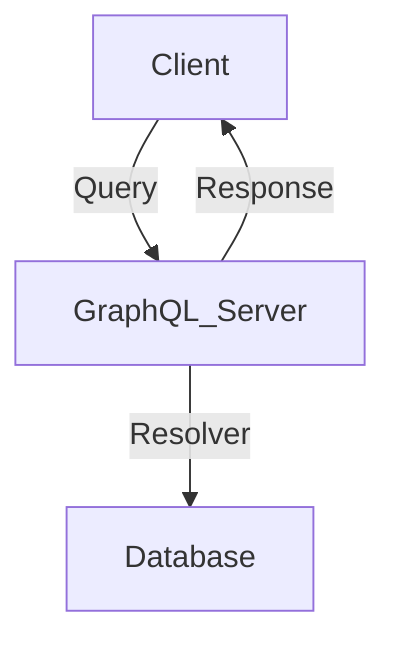

## 19.7 GraphQL APIs for Frontend Integration

In the modern web development landscape, efficient data fetching and seamless communication between frontend and backend systems are crucial. GraphQL, a query language for APIs, provides a robust solution to these challenges. In this section, we will explore how to integrate GraphQL APIs with frontend applications using PHP, focusing on the benefits, implementation strategies, and best practices.

### Understanding GraphQL

GraphQL is a query language developed by Facebook in 2012 and released as an open-source project in 2015. It provides a more flexible and efficient alternative to REST APIs by allowing clients to request exactly the data they need, no more and no less. This capability significantly reduces the problem of over-fetching and under-fetching data, which is common in traditional RESTful services.

#### Key Concepts of GraphQL

- **Schema:** Defines the structure of the data available through the API. It specifies the types, queries, and mutations that can be performed.
- **Queries:** Allow clients to request specific data from the server.
- **Mutations:** Enable clients to modify data on the server.
- **Resolvers:** Functions that handle the logic for fetching data for each field in a query or mutation.
- **Types:** Define the shape of the data, including scalar types (e.g., String, Int) and custom object types.

### Benefits of GraphQL for Frontend Integration

GraphQL offers several advantages that make it an excellent choice for frontend integration:

- **Precise Data Fetching:** Clients can specify exactly what data they need, reducing the amount of data transferred over the network.
- **Single Endpoint:** Unlike REST, which often requires multiple endpoints, GraphQL uses a single endpoint for all operations, simplifying API management.
- **Strongly Typed Schema:** The schema acts as a contract between the client and server, ensuring data consistency and enabling powerful developer tools.
- **Real-time Capabilities:** With subscriptions, GraphQL can support real-time data updates, enhancing the user experience.

### Implementing GraphQL in PHP

To implement GraphQL in PHP, we can use the **webonyx/graphql-php** library, a popular choice for building GraphQL servers in PHP. This library provides a flexible and extensible framework for defining GraphQL schemas and handling queries and mutations.

#### Setting Up a GraphQL Server in PHP

1. **Install the Library:**

   Use Composer to install the `webonyx/graphql-php` library:

   ```bash
   composer require webonyx/graphql-php
   ```

2. **Define the Schema:**

   Create a schema that defines the types, queries, and mutations. Here's a simple example:

   ```php
   <?php

   use GraphQL\Type\Definition\Type;
   use GraphQL\Type\Definition\ObjectType;
   use GraphQL\Type\Schema;

   $queryType = new ObjectType([
       'name' => 'Query',
       'fields' => [
           'hello' => [
               'type' => Type::string(),
               'resolve' => function() {
                   return 'Hello, world!';
               }
           ],
       ],
   ]);

   $schema = new Schema([
       'query' => $queryType,
   ]);
   ```

3. **Handle Requests:**

   Create a script to handle incoming GraphQL requests and execute them against the schema:

   ```php
   <?php

   require 'vendor/autoload.php';

   use GraphQL\GraphQL;
   use GraphQL\Type\Schema;
   use GraphQL\Error\FormattedError;

   // Assume $schema is defined as shown above

   $rawInput = file_get_contents('php://input');
   $input = json_decode($rawInput, true);
   $query = $input['query'];
   $variableValues = isset($input['variables']) ? $input['variables'] : null;

   try {
       $result = GraphQL::executeQuery($schema, $query, null, null, $variableValues);
       $output = $result->toArray();
   } catch (\Exception $e) {
       $output = [
           'errors' => [
               FormattedError::createFromException($e)
           ]
       ];
   }

   header('Content-Type: application/json');
   echo json_encode($output);
   ```

### Frontend Libraries for GraphQL

To consume GraphQL APIs on the frontend, developers can use libraries like **Apollo Client**, which provides a comprehensive set of tools for managing GraphQL data in JavaScript applications.

- **Apollo Client:** A popular choice for integrating GraphQL with frontend frameworks like React, Vue, and Angular. It offers features like caching, query batching, and real-time updates.

  - **Link:** [Apollo GraphQL](https://www.apollographql.com/)

### Use Cases for GraphQL APIs

GraphQL is particularly well-suited for scenarios where efficient data fetching is critical. Here are some common use cases:

- **Mobile Applications:** Minimize data transfer and improve performance by fetching only the necessary data.
- **Complex UIs:** Simplify data management in applications with complex user interfaces that require data from multiple sources.
- **Real-time Applications:** Use subscriptions to provide real-time updates to clients, such as chat applications or live dashboards.

### Best Practices for GraphQL Integration

1. **Design a Clear Schema:**

   A well-designed schema is crucial for a successful GraphQL implementation. Ensure that the schema is intuitive and reflects the needs of the client applications.

2. **Optimize Resolvers:**

   Resolvers should be efficient and handle data fetching in a way that minimizes database queries and network requests.

3. **Implement Caching:**

   Use caching strategies to reduce the load on the server and improve response times. Apollo Client provides built-in caching mechanisms that can be leveraged on the frontend.

4. **Handle Errors Gracefully:**

   GraphQL provides a structured way to handle errors. Ensure that your API returns meaningful error messages and status codes.

5. **Secure Your API:**

   Implement authentication and authorization mechanisms to protect your GraphQL API from unauthorized access.

### Visualizing GraphQL Architecture

To better understand the flow of data in a GraphQL application, let's visualize the architecture using a Mermaid.js diagram.



**Diagram Description:** This diagram illustrates the flow of a GraphQL query from the client to the server, where resolvers fetch data from the database, and the server returns the response to the client.

### Try It Yourself

To deepen your understanding of GraphQL integration, try modifying the example code to add new queries or mutations. Experiment with different types and resolvers to see how they affect the data returned to the client.

### Knowledge Check

- What are the main benefits of using GraphQL over REST APIs?
- How does the `webonyx/graphql-php` library help in implementing GraphQL in PHP?
- What are some common use cases for GraphQL APIs?

### Embrace the Journey

Remember, mastering GraphQL is a journey. As you continue to explore its capabilities, you'll discover new ways to optimize data fetching and enhance the user experience. Keep experimenting, stay curious, and enjoy the process!

## Quiz: GraphQL APIs for Frontend Integration



### What is a key benefit of using GraphQL over REST APIs?

- [x] Clients can request exactly the data they need.
- [ ] GraphQL uses multiple endpoints for different operations.
- [ ] GraphQL does not require a schema.
- [ ] GraphQL is only for real-time applications.

> **Explanation:** GraphQL allows clients to specify exactly what data they need, reducing over-fetching and under-fetching issues common in REST APIs.

### Which library is commonly used for implementing GraphQL in PHP?

- [x] webonyx/graphql-php
- [ ] Laravel
- [ ] Symfony
- [ ] ReactPHP

> **Explanation:** The `webonyx/graphql-php` library is a popular choice for building GraphQL servers in PHP.

### What is the role of a resolver in a GraphQL server?

- [x] It handles the logic for fetching data for each field in a query or mutation.
- [ ] It defines the structure of the data available through the API.
- [ ] It specifies the types, queries, and mutations.
- [ ] It manages client-side caching.

> **Explanation:** Resolvers are functions that handle the logic for fetching data for each field in a query or mutation.

### Which frontend library is commonly used with GraphQL?

- [x] Apollo Client
- [ ] jQuery
- [ ] Bootstrap
- [ ] Laravel Mix

> **Explanation:** Apollo Client is a popular library for integrating GraphQL with frontend frameworks like React, Vue, and Angular.

### What is a common use case for GraphQL APIs?

- [x] Efficient data fetching in mobile applications.
- [ ] Managing server-side sessions.
- [ ] Handling file uploads.
- [ ] Building static websites.

> **Explanation:** GraphQL is well-suited for scenarios where efficient data fetching is critical, such as mobile applications.

### What is a key feature of GraphQL schemas?

- [x] They provide a strongly typed contract between the client and server.
- [ ] They are optional in GraphQL implementations.
- [ ] They are used only for mutations.
- [ ] They define client-side caching strategies.

> **Explanation:** GraphQL schemas provide a strongly typed contract between the client and server, ensuring data consistency.

### How can you optimize resolvers in a GraphQL server?

- [x] By minimizing database queries and network requests.
- [ ] By using multiple endpoints.
- [ ] By avoiding the use of types.
- [ ] By handling errors on the client side.

> **Explanation:** Optimizing resolvers involves minimizing database queries and network requests to improve performance.

### What is a common strategy for securing GraphQL APIs?

- [x] Implementing authentication and authorization mechanisms.
- [ ] Using multiple endpoints for different operations.
- [ ] Avoiding the use of schemas.
- [ ] Caching all responses on the client side.

> **Explanation:** Implementing authentication and authorization mechanisms is crucial for securing GraphQL APIs.

### What is the purpose of caching in GraphQL?

- [x] To reduce the load on the server and improve response times.
- [ ] To store client-side data permanently.
- [ ] To avoid using schemas.
- [ ] To handle real-time updates.

> **Explanation:** Caching reduces the load on the server and improves response times by storing frequently accessed data.

### True or False: GraphQL can only be used for real-time applications.

- [ ] True
- [x] False

> **Explanation:** While GraphQL supports real-time updates through subscriptions, it is not limited to real-time applications and can be used for a wide range of scenarios.



By integrating GraphQL APIs with frontend applications using PHP, developers can create efficient, scalable, and maintainable systems that enhance the user experience. As you continue to explore GraphQL, remember to leverage its powerful features to optimize data fetching and streamline frontend-backend communication.
