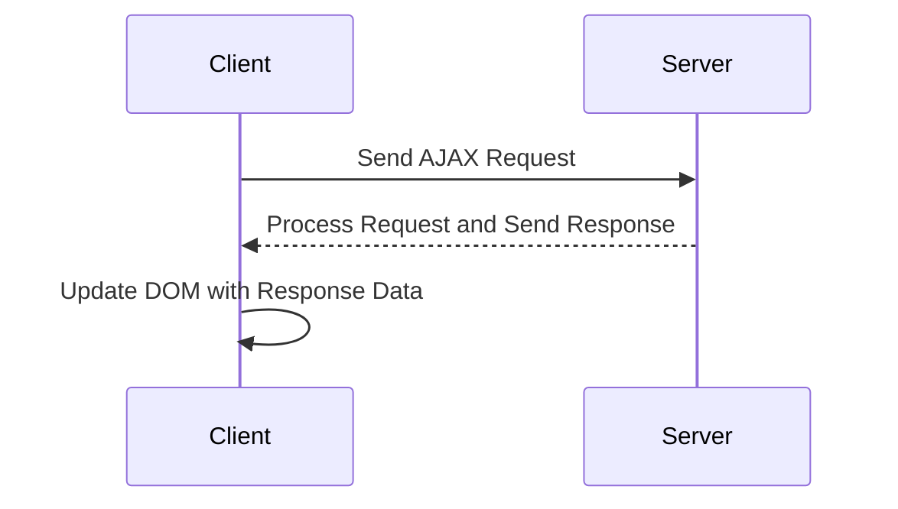

## 19.8 AJAX and Asynchronous Requests

In the modern web development landscape, creating dynamic and responsive applications is crucial. AJAX (Asynchronous JavaScript and XML) plays a pivotal role in achieving this by allowing web pages to update asynchronously by exchanging data with a web server behind the scenes. This section will guide you through the concepts, implementation, and best practices for using AJAX and asynchronous requests in PHP applications.

### Understanding AJAX and Asynchronous Requests

AJAX is a technique that enables web applications to send and retrieve data from a server asynchronously without interfering with the display and behavior of the existing page. This means that parts of a web page can be updated without reloading the entire page, resulting in a smoother and more interactive user experience.

#### Key Concepts

- **Asynchronous Communication**: AJAX allows for asynchronous communication between the client and server, meaning the client can continue to interact with the page while waiting for the server's response.
- **Data Formats**: While XML was initially used, JSON (JavaScript Object Notation) has become the preferred format due to its simplicity and ease of use with JavaScript.
- **JavaScript and the DOM**: AJAX relies heavily on JavaScript to manipulate the DOM (Document Object Model) and update the page content dynamically.

### Making AJAX Requests

To implement AJAX, we primarily use JavaScript. The `fetch` API is a modern and powerful way to make AJAX requests, replacing the older `XMLHttpRequest` object. Additionally, libraries like Axios provide a more user-friendly interface for making HTTP requests.

#### Using the Fetch API

The `fetch` API provides a simple and clean interface for making network requests. Here's a basic example of how to use it:

```javascript
// Making a GET request using fetch
fetch('https://example.com/api/data')
  .then(response => {
    if (!response.ok) {
      throw new Error('Network response was not ok');
    }
    return response.json();
  })
  .then(data => {
    console.log(data);
    // Update the DOM with the received data
  })
  .catch(error => {
    console.error('There was a problem with the fetch operation:', error);
  });
```

#### Using Axios

Axios is a promise-based HTTP client for the browser and Node.js. It provides a more concise syntax and additional features like request and response interceptors.

```javascript
// Making a GET request using Axios
axios.get('https://example.com/api/data')
  .then(response => {
    console.log(response.data);
    // Update the DOM with the received data
  })
  .catch(error => {
    console.error('There was an error fetching the data:', error);
  });
```

### Handling Responses

Once the server processes the request, it sends a response back to the client. This response can be in various formats, but JSON is the most common due to its compatibility with JavaScript.

#### Updating the Frontend

To update the frontend dynamically, you can manipulate the DOM using JavaScript. For example, you can insert new elements, modify existing ones, or remove elements based on the data received from the server.

```javascript
// Example of updating the DOM with fetched data
fetch('https://example.com/api/data')
  .then(response => response.json())
  .then(data => {
    const container = document.getElementById('data-container');
    container.innerHTML = ''; // Clear existing content
    data.forEach(item => {
      const div = document.createElement('div');
      div.textContent = item.name;
      container.appendChild(div);
    });
  });
```

### Server-Side Handling with PHP

On the server side, PHP scripts handle incoming AJAX requests, process the data, and return a response, typically in JSON format.

#### Processing Requests

Here's a simple example of a PHP script that processes a GET request and returns JSON data:

```php
<?php
header('Content-Type: application/json');

// Sample data to return
$data = [
    ['id' => 1, 'name' => 'Item 1'],
    ['id' => 2, 'name' => 'Item 2'],
    ['id' => 3, 'name' => 'Item 3']
];

// Encode the data as JSON and output it
echo json_encode($data);
?>
```

#### Handling POST Requests

To handle POST requests, you can access the data sent by the client using PHP's `$_POST` superglobal. Here's an example:

```php
<?php
header('Content-Type: application/json');

if ($_SERVER['REQUEST_METHOD'] === 'POST') {
    // Access POST data
    $name = $_POST['name'] ?? '';

    // Process the data (e.g., save to database)
    // ...

    // Return a response
    echo json_encode(['status' => 'success', 'message' => 'Data received']);
} else {
    echo json_encode(['status' => 'error', 'message' => 'Invalid request method']);
}
?>
```

### Security Considerations

When dealing with AJAX requests, it's essential to consider security aspects such as:

- **Cross-Site Scripting (XSS)**: Ensure that any data inserted into the DOM is properly sanitized to prevent XSS attacks.
- **Cross-Site Request Forgery (CSRF)**: Implement CSRF tokens to protect against unauthorized requests.
- **Data Validation**: Always validate and sanitize data on the server side to prevent SQL injection and other attacks.

### Visualizing AJAX Workflow

To better understand how AJAX works, let's visualize the interaction between the client and server using a sequence diagram.



### Try It Yourself

To get hands-on experience with AJAX, try modifying the code examples provided. For instance, change the URL to a different API endpoint, or modify the DOM manipulation logic to display data in a different format. Experiment with different HTTP methods (GET, POST, PUT, DELETE) and observe how the server and client handle these requests.

### Knowledge Check

- What is the primary purpose of AJAX in web development?
- How does the `fetch` API differ from `XMLHttpRequest`?
- Why is JSON preferred over XML for AJAX responses?
- What security measures should be taken when handling AJAX requests?

### Summary

AJAX and asynchronous requests are powerful tools for creating dynamic and responsive web applications. By understanding how to make AJAX requests, handle responses, and process data server-side with PHP, you can enhance the user experience and build more interactive applications. Remember to consider security best practices and experiment with different techniques to find the best solutions for your projects.

## Quiz: AJAX and Asynchronous Requests



### What is the primary purpose of AJAX in web development?

- [x] To update parts of a web page without reloading the entire page
- [ ] To improve server-side processing speed
- [ ] To enhance database performance
- [ ] To increase the size of web pages

> **Explanation:** AJAX allows web pages to update asynchronously by exchanging data with a web server behind the scenes, enabling parts of a page to be updated without a full reload.

### Which of the following is a modern way to make AJAX requests in JavaScript?

- [ ] XMLHttpRequest
- [x] fetch API
- [ ] jQuery AJAX
- [ ] WebSockets

> **Explanation:** The `fetch` API is a modern and powerful way to make AJAX requests, providing a cleaner and more concise syntax compared to `XMLHttpRequest`.

### Why is JSON preferred over XML for AJAX responses?

- [x] JSON is easier to parse with JavaScript
- [ ] JSON is more secure than XML
- [ ] JSON is faster than XML
- [ ] JSON is the only format supported by AJAX

> **Explanation:** JSON is preferred because it is lightweight and can be easily parsed and manipulated using JavaScript.

### What is a common security measure to protect against CSRF attacks in AJAX requests?

- [ ] Encrypting all AJAX requests
- [x] Implementing CSRF tokens
- [ ] Using HTTPS for all requests
- [ ] Validating JSON data

> **Explanation:** CSRF tokens are used to protect against unauthorized requests by ensuring that the request is coming from a legitimate source.

### How can you handle errors in a `fetch` API request?

- [x] Using the `.catch()` method
- [ ] Using a try-catch block
- [ ] Ignoring errors
- [ ] Using the `.finally()` method

> **Explanation:** The `.catch()` method is used to handle errors in a promise-based request like those made with the `fetch` API.

### What is the role of the `Content-Type` header in a PHP script handling AJAX requests?

- [x] To specify the format of the response data
- [ ] To authenticate the request
- [ ] To encrypt the response data
- [ ] To log the request

> **Explanation:** The `Content-Type` header specifies the format of the response data, such as `application/json`, so the client knows how to interpret it.

### Which of the following is NOT a benefit of using AJAX?

- [ ] Improved user experience
- [ ] Reduced server load
- [x] Increased page load time
- [ ] Asynchronous data retrieval

> **Explanation:** AJAX improves user experience by allowing parts of a page to update without a full reload, which can reduce server load and improve performance.

### What is a common use case for AJAX in web applications?

- [x] Submitting form data without reloading the page
- [ ] Rendering static HTML pages
- [ ] Compiling server-side code
- [ ] Encrypting user passwords

> **Explanation:** AJAX is commonly used to submit form data asynchronously, allowing the page to remain interactive while the data is processed.

### How can you ensure data integrity when receiving JSON data from an AJAX request?

- [x] Validate and sanitize the data server-side
- [ ] Trust all incoming data
- [ ] Only use GET requests
- [ ] Use XML instead of JSON

> **Explanation:** Always validate and sanitize data on the server side to ensure data integrity and prevent security vulnerabilities.

### True or False: AJAX requests can only be made using the GET method.

- [ ] True
- [x] False

> **Explanation:** AJAX requests can be made using various HTTP methods, including GET, POST, PUT, and DELETE, depending on the desired operation.



Remember, mastering AJAX and asynchronous requests is just the beginning. As you continue to explore these concepts, you'll be able to build more complex and interactive web applications. Keep experimenting, stay curious, and enjoy the journey!
