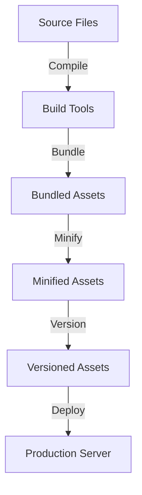

## 19.9 Asset Management and Build Tools

In modern web development, managing assets efficiently is crucial for optimizing performance and ensuring a seamless user experience. Asset management involves compiling, bundling, and optimizing resources such as CSS, JavaScript, and images. Build tools automate these processes, making it easier to maintain and deploy web applications. In this section, we will explore various asset management and build tools that can be integrated into PHP projects, focusing on tools like Webpack, Gulp, and Laravel Mix.

### Understanding Asset Management

Asset management refers to the process of organizing, compiling, and optimizing web assets to improve the performance and maintainability of a web application. This includes:

- **Bundling:** Combining multiple files into a single file to reduce HTTP requests.
- **Minification:** Removing unnecessary characters from code without changing its functionality to reduce file size.
- **Cache Busting:** Ensuring that users receive the latest version of assets by appending a unique identifier to file names.
- **Source Maps:** Providing a way to map minified code back to its original source code for debugging purposes.

### Compiling Assets with Build Tools

Build tools automate the process of compiling and optimizing assets. They can handle tasks such as transpiling modern JavaScript, compiling Sass or Less into CSS, and optimizing images. Let's explore some popular build tools used in PHP development.

#### Webpack

Webpack is a powerful module bundler that can handle various types of assets, including JavaScript, CSS, and images. It allows developers to define entry points, output configurations, and loaders to process different file types.

**Key Features of Webpack:**

- **Code Splitting:** Breaks code into smaller chunks that can be loaded on demand.
- **Tree Shaking:** Removes unused code from the final bundle.
- **Hot Module Replacement:** Updates modules in the browser without a full page reload.

**Example Webpack Configuration:**

```javascript
// webpack.config.js
const path = require('path');

module.exports = {
  entry: './src/index.js',
  output: {
    filename: 'bundle.js',
    path: path.resolve(__dirname, 'dist')
  },
  module: {
    rules: [
      {
        test: /\.css$/,
        use: ['style-loader', 'css-loader']
      },
      {
        test: /\.(png|jpg|gif)$/,
        use: ['file-loader']
      }
    ]
  }
};
```

In this configuration, Webpack is set up to bundle JavaScript and CSS files, as well as handle image files using loaders.

#### Gulp

Gulp is a task runner that uses a code-over-configuration approach to automate repetitive tasks. It is particularly useful for tasks like compiling Sass, minifying files, and live-reloading during development.

**Key Features of Gulp:**

- **Streams:** Efficiently handles file transformations using Node.js streams.
- **Plugins:** A vast ecosystem of plugins for various tasks.
- **Code-Driven:** Tasks are defined using JavaScript code, providing flexibility.

**Example Gulp Task:**

```javascript
// gulpfile.js
const gulp = require('gulp');
const sass = require('gulp-sass')(require('sass'));
const cleanCSS = require('gulp-clean-css');
const uglify = require('gulp-uglify');
const concat = require('gulp-concat');

gulp.task('styles', function() {
  return gulp.src('src/scss/**/*.scss')
    .pipe(sass().on('error', sass.logError))
    .pipe(cleanCSS())
    .pipe(gulp.dest('dist/css'));
});

gulp.task('scripts', function() {
  return gulp.src('src/js/**/*.js')
    .pipe(concat('all.js'))
    .pipe(uglify())
    .pipe(gulp.dest('dist/js'));
});

gulp.task('default', gulp.series('styles', 'scripts'));
```

This Gulp setup compiles Sass files into CSS, minifies them, concatenates JavaScript files, and minifies the result.

#### Laravel Mix

Laravel Mix is a wrapper around Webpack that simplifies the configuration process. It is designed to work seamlessly with Laravel, but can be used in any PHP project.

**Key Features of Laravel Mix:**

- **Simplified API:** Provides a clean, fluent API for defining build steps.
- **Preconfigured Webpack:** Comes with sensible defaults for most projects.
- **Versioning and Cache Busting:** Automatically handles cache busting for versioned files.

**Example Laravel Mix Configuration:**

```javascript
// webpack.mix.js
let mix = require('laravel-mix');

mix.js('src/app.js', 'dist')
   .sass('src/app.scss', 'dist')
   .version();
```

This configuration compiles JavaScript and Sass files, outputs them to the `dist` directory, and applies versioning for cache busting.

### Optimizing Assets for Production

When deploying a web application, it's important to optimize assets for production to ensure fast load times and efficient resource usage. Here are some common optimization techniques:

- **Minification:** Use tools like UglifyJS for JavaScript and clean-css for CSS to reduce file sizes.
- **Image Optimization:** Compress images using tools like ImageOptim or online services like TinyPNG.
- **Lazy Loading:** Load images and other resources only when they are needed to improve initial load times.
- **HTTP/2 and Server Push:** Take advantage of HTTP/2 features to improve asset delivery.

### Visualizing Asset Management Workflow

To better understand the asset management process, let's visualize a typical workflow using a Mermaid.js diagram.



**Description:** This diagram illustrates the flow of assets from source files through build tools, resulting in optimized, versioned assets ready for deployment.

### Integrating Asset Management in PHP Projects

Integrating asset management into PHP projects involves setting up build tools and configuring them to work with your existing codebase. Here are some steps to get started:

1. **Choose a Build Tool:** Decide whether to use Webpack, Gulp, Laravel Mix, or another tool based on your project's needs.
2. **Install Dependencies:** Use npm or Yarn to install the necessary packages for your chosen build tool.
3. **Configure Build Tool:** Set up configuration files (e.g., `webpack.config.js`, `gulpfile.js`) to define tasks and build steps.
4. **Integrate with PHP:** Use PHP to include versioned assets in your views, ensuring users receive the latest files.
5. **Automate Builds:** Set up scripts to automate the build process, especially for production deployments.

### Try It Yourself

To experiment with asset management, try modifying the provided code examples. For instance, add a new task to the Gulp setup to optimize images, or extend the Webpack configuration to handle additional file types like fonts.

### References and Further Reading

- [Webpack Documentation](https://webpack.js.org/)
- [Gulp.js Documentation](https://gulpjs.com/)
- [Laravel Mix Documentation](https://laravel.com/docs/mix)
- [MDN Web Docs on Minification](https://developer.mozilla.org/en-US/docs/Glossary/Minification)
- [TinyPNG Image Optimization](https://tinypng.com/)

### Knowledge Check

- What is the purpose of asset management in web development?
- How does Webpack's code splitting feature improve performance?
- What are the benefits of using Laravel Mix in a PHP project?

### Embrace the Journey

Remember, mastering asset management and build tools is an ongoing process. As you continue to explore and experiment, you'll discover new ways to optimize your web applications. Stay curious, keep learning, and enjoy the journey!

## Quiz: Asset Management and Build Tools



### What is the primary purpose of asset management in web development?

- [x] To optimize and organize web assets for improved performance
- [ ] To create new assets for web applications
- [ ] To manage user authentication
- [ ] To handle database migrations

> **Explanation:** Asset management focuses on optimizing and organizing web assets like CSS, JavaScript, and images to enhance performance and maintainability.

### Which tool is known for its code-over-configuration approach to automate tasks?

- [ ] Webpack
- [x] Gulp
- [ ] Laravel Mix
- [ ] Babel

> **Explanation:** Gulp uses a code-over-configuration approach, allowing developers to define tasks using JavaScript code.

### What feature of Webpack allows it to remove unused code from the final bundle?

- [ ] Hot Module Replacement
- [ ] Code Splitting
- [x] Tree Shaking
- [ ] Lazy Loading

> **Explanation:** Tree shaking is a feature of Webpack that removes unused code from the final bundle, reducing file size.

### Which Laravel tool simplifies Webpack configuration for PHP projects?

- [ ] Gulp
- [x] Laravel Mix
- [ ] Babel
- [ ] Grunt

> **Explanation:** Laravel Mix is a wrapper around Webpack that simplifies its configuration, making it easier to use in PHP projects.

### What is the benefit of using source maps in asset management?

- [x] They help map minified code back to the original source code for debugging
- [ ] They increase the file size of assets
- [ ] They improve the aesthetics of the code
- [ ] They enhance user authentication

> **Explanation:** Source maps provide a way to map minified code back to its original source code, aiding in debugging.

### Which of the following is a common optimization technique for images?

- [ ] Minification
- [x] Compression
- [ ] Transpilation
- [ ] Versioning

> **Explanation:** Compression is a common optimization technique for images, reducing their file size without losing quality.

### What is cache busting used for in asset management?

- [x] To ensure users receive the latest version of assets
- [ ] To increase the cache size
- [ ] To delete old assets
- [ ] To improve code readability

> **Explanation:** Cache busting appends a unique identifier to file names, ensuring users receive the latest version of assets.

### Which build tool uses a fluent API for defining build steps?

- [ ] Webpack
- [ ] Gulp
- [x] Laravel Mix
- [ ] Babel

> **Explanation:** Laravel Mix provides a clean, fluent API for defining build steps, simplifying the configuration process.

### What is the role of loaders in Webpack?

- [x] To process different file types during the build process
- [ ] To compile Sass into CSS
- [ ] To minify JavaScript files
- [ ] To handle database migrations

> **Explanation:** Loaders in Webpack are used to process different file types, such as CSS and images, during the build process.

### True or False: Asset management is only necessary for large web applications.

- [ ] True
- [x] False

> **Explanation:** Asset management is beneficial for web applications of all sizes, as it improves performance and maintainability.


