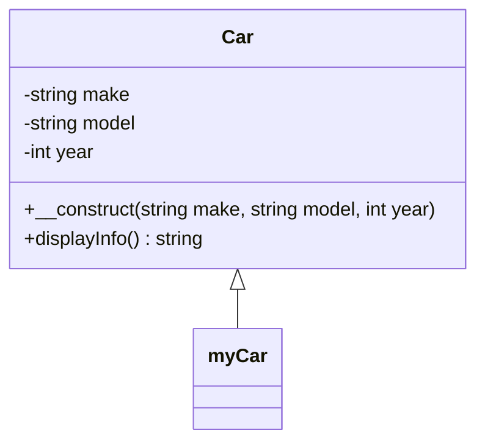

## 2.1 Classes and Objects in PHP

In the realm of PHP development, understanding classes and objects is fundamental to mastering object-oriented programming (OOP). This section will guide you through the essential concepts of classes and objects, their relationship, and how they form the backbone of modern PHP applications.

### Understanding Classes as Blueprints for Objects

In PHP, a class is a blueprint for creating objects. It defines a set of properties and methods that the objects created from the class will have. Think of a class as a template or a prototype that outlines the structure and behavior of the objects.

#### Defining a Class

To define a class in PHP, use the `class` keyword followed by the class name. Inside the class, you can define properties (variables) and methods (functions) that belong to the class.

```php
<?php

class Car {
    // Properties
    public $make;
    public $model;
    public $year;

    // Constructor
    public function __construct($make, $model, $year) {
        $this->make = $make;
        $this->model = $model;
        $this->year = $year;
    }

    // Method
    public function displayInfo() {
        return "Car: $this->make $this->model, Year: $this->year";
    }
}

?>
```

In this example, the `Car` class has three properties: `$make`, `$model`, and `$year`. It also includes a constructor method `__construct()` to initialize these properties and a method `displayInfo()` to return a string containing the car's information.

### Instantiating Objects in PHP

An object is an instance of a class. Once a class is defined, you can create objects from it. Each object can have its own values for the properties defined in the class.

#### Creating an Object

To create an object, use the `new` keyword followed by the class name.

```php
<?php

// Creating an object of the Car class
$myCar = new Car("Toyota", "Corolla", 2020);

// Accessing object properties and methods
echo $myCar->displayInfo(); // Outputs: Car: Toyota Corolla, Year: 2020

?>
```

Here, `$myCar` is an object of the `Car` class. We pass the make, model, and year to the constructor to initialize the object. We then call the `displayInfo()` method to display the car's information.

### The Relationship Between Classes and Objects

Classes and objects are closely related. A class serves as a blueprint, while objects are specific instances of that blueprint. Each object can have different values for its properties, but they share the same structure and behavior defined by the class.

#### Object-Oriented Principles

1. **Encapsulation**: Classes encapsulate data and behavior, providing a clear interface for interacting with objects.
2. **Abstraction**: Classes abstract complex functionality, allowing developers to work with higher-level concepts.
3. **Inheritance**: Classes can inherit properties and methods from other classes, promoting code reuse.
4. **Polymorphism**: Objects can take on many forms, allowing for flexible and dynamic code.

### Code Examples

Let's explore more examples to solidify our understanding of classes and objects in PHP.

#### Example: Defining and Using a Class

```php
<?php

class Book {
    public $title;
    public $author;
    public $price;

    public function __construct($title, $author, $price) {
        $this->title = $title;
        $this->author = $author;
        $this->price = $price;
    }

    public function getDetails() {
        return "Title: $this->title, Author: $this->author, Price: $$this->price";
    }
}

// Creating an object of the Book class
$book1 = new Book("1984", "George Orwell", 9.99);
echo $book1->getDetails(); // Outputs: Title: 1984, Author: George Orwell, Price: $9.99

?>
```

In this example, we define a `Book` class with properties for the title, author, and price. The `getDetails()` method returns a string with the book's details. We then create an object of the `Book` class and display its details.

#### Example: Using Inheritance

```php
<?php

class Vehicle {
    public $type;

    public function __construct($type) {
        $this->type = $type;
    }

    public function getType() {
        return "Vehicle Type: $this->type";
    }
}

class Car extends Vehicle {
    public $make;
    public $model;

    public function __construct($type, $make, $model) {
        parent::__construct($type);
        $this->make = $make;
        $this->model = $model;
    }

    public function getCarDetails() {
        return $this->getType() . ", Make: $this->make, Model: $this->model";
    }
}

// Creating an object of the Car class
$car = new Car("Sedan", "Honda", "Civic");
echo $car->getCarDetails(); // Outputs: Vehicle Type: Sedan, Make: Honda, Model: Civic

?>
```

In this example, the `Car` class inherits from the `Vehicle` class. The `Car` class adds additional properties and methods specific to cars. We use the `parent::__construct()` to call the parent class's constructor.

### Visualizing Classes and Objects

To better understand the relationship between classes and objects, let's visualize it using a class diagram.



This diagram represents the `Car` class with its properties and methods. The `myCar` object is an instance of the `Car` class.

### Key Takeaways

- **Classes** are blueprints for creating objects, defining properties and methods.
- **Objects** are instances of classes, each with its own values for the properties.
- **Encapsulation, abstraction, inheritance, and polymorphism** are core principles of OOP.
- **Inheritance** allows classes to inherit properties and methods from other classes, promoting code reuse.

### Try It Yourself

Experiment with the code examples provided. Try modifying the properties and methods, or create your own classes and objects to see how they work in practice.

### References and Links

- [PHP Manual: Classes and Objects](https://www.php.net/manual/en/language.oop5.php)
- [MDN Web Docs: Object-Oriented Programming](https://developer.mozilla.org/en-US/docs/Learn/JavaScript/Objects/Object-oriented_JS)
- [W3Schools: PHP OOP Classes and Objects](https://www.w3schools.com/php/php_oop_classes_objects.asp)

### Knowledge Check

1. What is a class in PHP?
2. How do you create an object from a class?
3. What is the purpose of a constructor in a class?
4. Explain the concept of inheritance in PHP.
5. How does encapsulation benefit object-oriented programming?

### Exercises

1. Define a `Person` class with properties for name, age, and gender. Create a method to display the person's details.
2. Create a `Student` class that inherits from the `Person` class. Add a property for the student's grade and a method to display the student's details.
3. Experiment with creating multiple objects from the `Car` class and modifying their properties.

### Embrace the Journey

Remember, this is just the beginning. As you progress, you'll build more complex and interactive PHP applications. Keep experimenting, stay curious, and enjoy the journey!

## Quiz: Classes and Objects in PHP



### What is a class in PHP?

- [x] A blueprint for creating objects
- [ ] An instance of an object
- [ ] A function in PHP
- [ ] A variable in PHP

> **Explanation:** A class is a blueprint for creating objects, defining their properties and methods.

### How do you create an object from a class in PHP?

- [x] Using the `new` keyword followed by the class name
- [ ] Using the `create` keyword followed by the class name
- [ ] Using the `object` keyword followed by the class name
- [ ] Using the `instantiate` keyword followed by the class name

> **Explanation:** You create an object from a class using the `new` keyword followed by the class name.

### What is the purpose of a constructor in a class?

- [x] To initialize the properties of an object
- [ ] To destroy an object
- [ ] To define the class name
- [ ] To create a new class

> **Explanation:** A constructor is used to initialize the properties of an object when it is created.

### What is inheritance in PHP?

- [x] A mechanism where a class can inherit properties and methods from another class
- [ ] A way to create multiple objects from a class
- [ ] A method to destroy an object
- [ ] A function to initialize an object

> **Explanation:** Inheritance allows a class to inherit properties and methods from another class, promoting code reuse.

### How does encapsulation benefit object-oriented programming?

- [x] It restricts access to certain components of an object
- [ ] It allows for multiple inheritance
- [ ] It enables polymorphism
- [ ] It provides a way to create objects

> **Explanation:** Encapsulation restricts access to certain components of an object, providing a clear interface for interaction.

### What is an object in PHP?

- [x] An instance of a class
- [ ] A blueprint for creating classes
- [ ] A function in PHP
- [ ] A variable in PHP

> **Explanation:** An object is an instance of a class, with its own values for the properties defined in the class.

### How do you access a property of an object in PHP?

- [x] Using the `->` operator
- [ ] Using the `.` operator
- [ ] Using the `:` operator
- [ ] Using the `=` operator

> **Explanation:** You access a property of an object using the `->` operator.

### What is polymorphism in PHP?

- [x] The ability of objects to take on many forms
- [ ] The ability to create multiple objects from a class
- [ ] The ability to destroy an object
- [ ] The ability to define a class

> **Explanation:** Polymorphism is the ability of objects to take on many forms, allowing for flexible and dynamic code.

### What is the `parent` keyword used for in PHP?

- [x] To call a parent class's constructor or method
- [ ] To create a new object
- [ ] To define a new class
- [ ] To destroy an object

> **Explanation:** The `parent` keyword is used to call a parent class's constructor or method in a child class.

### True or False: An object can have different values for its properties than other objects of the same class.

- [x] True
- [ ] False

> **Explanation:** True. Each object can have its own values for the properties defined in the class.




