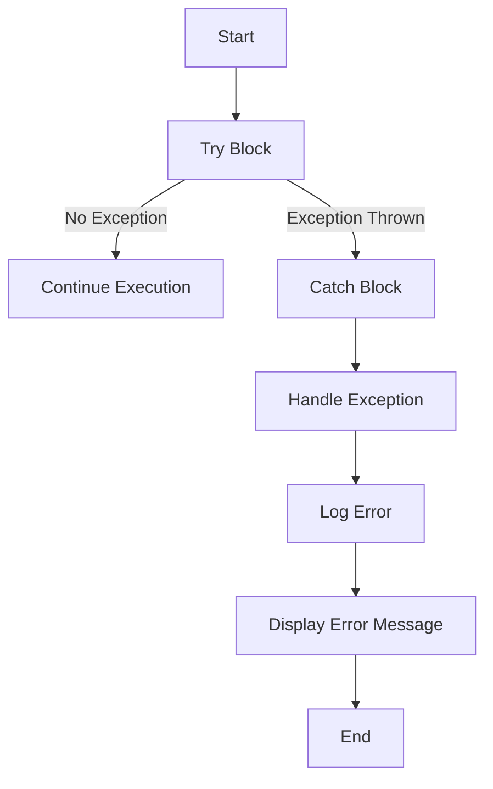

## 2.10 Error Handling and Exceptions

Error handling is a critical aspect of software development, ensuring that applications can gracefully handle unexpected situations and provide meaningful feedback to users. In PHP, error handling is achieved through a combination of error reporting, exception handling, and logging. This section will guide you through the essentials of error handling and exceptions in PHP, equipping you with the knowledge to write robust and maintainable code.

### Understanding Errors and Exceptions in PHP

Before diving into error handling techniques, it's essential to understand the difference between errors and exceptions in PHP:

- **Errors**: These are issues that occur during the execution of a script, such as syntax errors, runtime errors, or logical errors. PHP has built-in error handling mechanisms to manage these errors.
- **Exceptions**: These are objects that represent an error or unexpected behavior in a program. Exceptions provide a way to transfer control from one part of a program to another, allowing for more flexible error handling.

### Managing Errors Using Try-Catch Blocks

The `try-catch` block is a fundamental construct for handling exceptions in PHP. It allows you to "try" a block of code and "catch" any exceptions that occur, enabling you to handle them gracefully.

```php
<?php

function divide($numerator, $denominator) {
    if ($denominator == 0) {
        throw new Exception("Division by zero.");
    }
    return $numerator / $denominator;
}

try {
    echo divide(10, 0);
} catch (Exception $e) {
    echo "Caught exception: " . $e->getMessage();
}

?>
```

**Explanation**:
- **Try Block**: The code that might throw an exception is placed inside the `try` block.
- **Catch Block**: If an exception is thrown, the `catch` block is executed. The exception object is passed to the `catch` block, allowing you to access its properties and methods.

### Defining Custom Exception Classes

PHP allows you to define custom exception classes to handle specific error conditions more effectively. This is particularly useful for creating domain-specific exceptions that provide more context about the error.

```php
<?php

class DivisionByZeroException extends Exception {}

function divide($numerator, $denominator) {
    if ($denominator == 0) {
        throw new DivisionByZeroException("Cannot divide by zero.");
    }
    return $numerator / $denominator;
}

try {
    echo divide(10, 0);
} catch (DivisionByZeroException $e) {
    echo "Caught custom exception: " . $e->getMessage();
}

?>
```

**Explanation**:
- **Custom Exception Class**: By extending the base `Exception` class, you can create custom exceptions that encapsulate specific error conditions.
- **Handling Custom Exceptions**: You can catch custom exceptions separately from generic exceptions, allowing for more precise error handling.

### Best Practices for Error Handling in PHP Applications

1. **Use Exceptions for Exceptional Conditions**: Exceptions should be used for unexpected conditions, not for regular control flow. Reserve exceptions for situations where the program cannot proceed without intervention.

2. **Provide Meaningful Error Messages**: Ensure that error messages are clear and informative, providing enough context for debugging without exposing sensitive information.

3. **Log Errors for Debugging**: Use logging to record errors and exceptions, which can be invaluable for diagnosing issues in production environments. PHP's `error_log()` function or third-party libraries like Monolog can be used for this purpose.

4. **Avoid Suppressing Errors**: Avoid using the `@` operator to suppress errors, as it can make debugging difficult. Instead, handle errors explicitly using try-catch blocks or custom error handlers.

5. **Graceful Degradation**: Design your application to degrade gracefully in the event of an error, providing users with a fallback option or a friendly error message.

6. **Centralized Error Handling**: Implement a centralized error handling mechanism to manage errors consistently across your application. This can be achieved using a global exception handler or a middleware in frameworks.

7. **Use PHP's Error Handling Functions**: PHP provides several functions for error handling, such as `set_error_handler()`, `set_exception_handler()`, and `register_shutdown_function()`. These functions allow you to define custom error and exception handlers.

### Visualizing Error Handling Flow

To better understand the flow of error handling in PHP, let's visualize the process using a flowchart:



**Description**: This flowchart illustrates the typical flow of error handling in PHP using try-catch blocks. The process begins with the execution of the try block. If no exception is thrown, the program continues execution. If an exception is thrown, the catch block is executed, where the exception is handled, logged, and an error message is displayed.

### Advanced Error Handling Techniques

#### Using Finally Block

The `finally` block is an optional block that can be used after `try` and `catch` blocks. It is executed regardless of whether an exception was thrown or not, making it ideal for cleanup operations.

```php
<?php

function divide($numerator, $denominator) {
    if ($denominator == 0) {
        throw new Exception("Division by zero.");
    }
    return $numerator / $denominator;
}

try {
    echo divide(10, 2);
} catch (Exception $e) {
    echo "Caught exception: " . $e->getMessage();
} finally {
    echo "Finally block executed.";
}

?>
```

**Explanation**:
- **Finally Block**: The `finally` block is executed after the try and catch blocks, regardless of whether an exception was thrown. This is useful for releasing resources or performing cleanup tasks.

#### Nested Try-Catch Blocks

In complex applications, you may encounter situations where nested try-catch blocks are necessary. This allows for more granular error handling.

```php
<?php

function performOperation() {
    try {
        // Some operation that might throw an exception
        throw new Exception("Operation failed.");
    } catch (Exception $e) {
        echo "Caught exception in performOperation: " . $e->getMessage();
        throw $e; // Re-throw the exception
    }
}

try {
    performOperation();
} catch (Exception $e) {
    echo "Caught exception in main: " . $e->getMessage();
}

?>
```

**Explanation**:
- **Nested Try-Catch**: The inner try-catch block handles exceptions specific to the `performOperation` function, while the outer try-catch block handles exceptions at a higher level.

### Error Handling in PHP Frameworks

Modern PHP frameworks like Laravel and Symfony provide built-in error handling mechanisms that simplify the process of managing errors and exceptions. These frameworks often include features such as:

- **Centralized Error Handling**: Frameworks provide a centralized location for handling errors and exceptions, allowing for consistent error management across the application.
- **Custom Exception Classes**: Frameworks often include custom exception classes that provide more context about specific error conditions.
- **Error Logging**: Frameworks integrate with logging libraries to record errors and exceptions, making it easier to diagnose issues in production environments.

### PHP Error Handling Functions

PHP provides several built-in functions for managing errors and exceptions:

- **set_error_handler()**: This function allows you to define a custom error handler that will be called whenever an error occurs.

```php
<?php

function customErrorHandler($errno, $errstr, $errfile, $errline) {
    echo "Error [$errno]: $errstr in $errfile on line $errline";
}

set_error_handler("customErrorHandler");

// Trigger an error
echo $undefinedVariable;

?>
```

- **set_exception_handler()**: This function allows you to define a custom exception handler that will be called whenever an uncaught exception occurs.

```php
<?php

function customExceptionHandler($exception) {
    echo "Uncaught exception: " . $exception->getMessage();
}

set_exception_handler("customExceptionHandler");

// Throw an exception
throw new Exception("Something went wrong.");

?>
```

- **register_shutdown_function()**: This function allows you to register a callback function that will be executed when the script terminates. It is useful for handling fatal errors.

```php
<?php

function shutdownHandler() {
    $error = error_get_last();
    if ($error !== NULL) {
        echo "Fatal error: " . $error['message'];
    }
}

register_shutdown_function("shutdownHandler");

// Trigger a fatal error
nonExistentFunction();

?>
```

### Try It Yourself

To deepen your understanding of error handling and exceptions in PHP, try modifying the code examples provided in this section. Experiment with different scenarios, such as:

- Creating additional custom exception classes for different error conditions.
- Implementing a logging mechanism to record errors and exceptions.
- Using nested try-catch blocks to handle errors at different levels of your application.

### Knowledge Check

- What is the difference between errors and exceptions in PHP?
- How can you define a custom exception class in PHP?
- What is the purpose of the `finally` block in a try-catch statement?
- How can you log errors and exceptions in a PHP application?
- What are some best practices for error handling in PHP?

### Summary

In this section, we've explored the essentials of error handling and exceptions in PHP. By mastering these concepts, you can write more robust and maintainable code that gracefully handles unexpected situations. Remember to use exceptions for exceptional conditions, provide meaningful error messages, and log errors for debugging. As you continue your journey in PHP development, keep experimenting with different error handling techniques and strive to improve the resilience of your applications.

## Quiz: Error Handling and Exceptions



### What is the primary purpose of using exceptions in PHP?

- [x] To handle unexpected conditions and errors gracefully
- [ ] To improve code readability
- [ ] To enhance performance
- [ ] To simplify syntax

> **Explanation:** Exceptions are used to handle unexpected conditions and errors gracefully, allowing the program to continue running or terminate gracefully.

### Which block is executed regardless of whether an exception is thrown or not?

- [ ] try
- [ ] catch
- [x] finally
- [ ] throw

> **Explanation:** The `finally` block is executed regardless of whether an exception is thrown or not, making it ideal for cleanup operations.

### How can you define a custom exception class in PHP?

- [x] By extending the base `Exception` class
- [ ] By using the `implements` keyword
- [ ] By using the `abstract` keyword
- [ ] By using the `interface` keyword

> **Explanation:** Custom exception classes are defined by extending the base `Exception` class, allowing for more specific error handling.

### What function allows you to define a custom error handler in PHP?

- [ ] set_exception_handler()
- [x] set_error_handler()
- [ ] error_log()
- [ ] register_shutdown_function()

> **Explanation:** The `set_error_handler()` function allows you to define a custom error handler that will be called whenever an error occurs.

### What is a best practice for error handling in PHP applications?

- [x] Log errors for debugging
- [ ] Suppress errors using the `@` operator
- [ ] Use exceptions for regular control flow
- [ ] Avoid using try-catch blocks

> **Explanation:** Logging errors for debugging is a best practice, as it helps diagnose issues in production environments.

### What is the purpose of the `register_shutdown_function()` in PHP?

- [ ] To handle non-fatal errors
- [x] To execute a callback function when the script terminates
- [ ] To improve performance
- [ ] To define custom exception handlers

> **Explanation:** The `register_shutdown_function()` allows you to register a callback function that will be executed when the script terminates, useful for handling fatal errors.

### Which of the following is NOT a best practice for error handling in PHP?

- [ ] Use exceptions for exceptional conditions
- [ ] Provide meaningful error messages
- [ ] Log errors for debugging
- [x] Suppress errors using the `@` operator

> **Explanation:** Suppressing errors using the `@` operator is not a best practice, as it can make debugging difficult.

### What is the role of the `catch` block in a try-catch statement?

- [ ] To execute code that might throw an exception
- [x] To handle exceptions that are thrown
- [ ] To perform cleanup operations
- [ ] To log errors

> **Explanation:** The `catch` block is used to handle exceptions that are thrown, allowing the program to respond to errors gracefully.

### How can you handle multiple types of exceptions in a try-catch statement?

- [x] By using multiple catch blocks
- [ ] By using a single catch block
- [ ] By using the `finally` block
- [ ] By using the `throw` keyword

> **Explanation:** Multiple catch blocks can be used to handle different types of exceptions in a try-catch statement.

### True or False: The `finally` block is optional in a try-catch statement.

- [x] True
- [ ] False

> **Explanation:** The `finally` block is optional in a try-catch statement, but it is useful for performing cleanup operations.



Remember, mastering error handling and exceptions in PHP is a journey. Keep experimenting, stay curious, and enjoy the process of building more resilient and robust applications.
