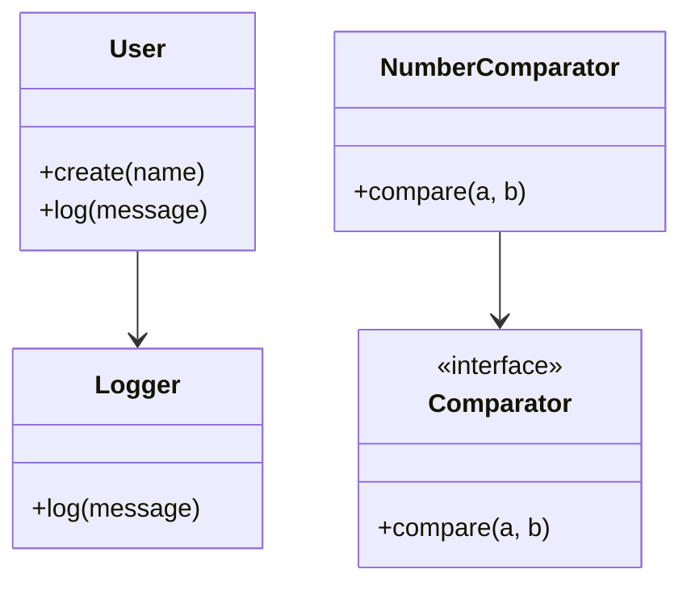

## 2.11 Combining OOP and Functional Programming Concepts

In the evolving landscape of software development, PHP has emerged as a versatile language that supports both Object-Oriented Programming (OOP) and Functional Programming (FP) paradigms. By combining these two approaches, developers can create more robust, maintainable, and efficient code. In this section, we will explore how to leverage PHP's support for functional programming while maintaining the structure and benefits of OOP.

### Introduction to Hybrid Programming in PHP

Hybrid programming refers to the practice of blending different programming paradigms to take advantage of their respective strengths. In PHP, this means combining the encapsulation and modularity of OOP with the expressiveness and conciseness of FP.

#### Why Combine OOP and FP?

- **Flexibility**: By using both paradigms, you can choose the best tool for the task at hand.
- **Code Reusability**: Functional programming encourages the use of pure functions, which are inherently reusable.
- **Maintainability**: OOP's structure helps organize code, while FP's immutability reduces side effects.
- **Performance**: FP can lead to more efficient code execution, especially with operations on collections.

### Leveraging PHP's Support for Functional Programming

PHP has gradually incorporated features that support functional programming, such as anonymous functions, closures, and higher-order functions. Let's delve into these features and see how they can be integrated with OOP.

#### Anonymous Functions and Closures

Anonymous functions, also known as closures, allow you to define functions without naming them. They are particularly useful for short-lived operations or when passing functions as arguments.

```php
<?php
// Example of an anonymous function
$greet = function($name) {
    return "Hello, $name!";
};

echo $greet("World"); // Outputs: Hello, World!
?>
```

Closures can capture variables from their surrounding scope, making them powerful tools for encapsulating behavior.

```php
<?php
$message = "Hello, ";

$greet = function($name) use ($message) {
    return $message . $name;
};

echo $greet("World"); // Outputs: Hello, World!
?>
```

#### Higher-Order Functions

Higher-order functions are functions that take other functions as arguments or return them as results. This concept is central to functional programming and can be used to create more abstract and flexible code.

```php
<?php
function applyOperation($operation, $a, $b) {
    return $operation($a, $b);
}

$sum = function($a, $b) {
    return $a + $b;
};

echo applyOperation($sum, 5, 3); // Outputs: 8
?>
```

### Writing Code that Blends OOP and Functional Paradigms

To effectively combine OOP and FP, it's important to understand how to structure your code to take advantage of both paradigms.

#### Encapsulation with Functional Interfaces

In OOP, encapsulation is achieved by bundling data and methods that operate on that data within a class. In a hybrid approach, you can use functional interfaces to encapsulate behavior.

```php
<?php
interface Comparator {
    public function compare($a, $b);
}

class NumberComparator implements Comparator {
    public function compare($a, $b) {
        return $a <=> $b;
    }
}

function sortArray(array $array, Comparator $comparator) {
    usort($array, [$comparator, 'compare']);
    return $array;
}

$numbers = [3, 1, 4, 1, 5, 9];
$comparator = new NumberComparator();
$sortedNumbers = sortArray($numbers, $comparator);

print_r($sortedNumbers); // Outputs: Array ( [0] => 1 [1] => 1 [2] => 3 [3] => 4 [4] => 5 [5] => 9 )
?>
```

#### Using Traits for Code Reusability

Traits in PHP allow you to reuse code across different classes. When combined with functional programming concepts, traits can help you create reusable and composable components.

```php
<?php
trait Logger {
    public function log($message) {
        echo "Log: $message\n";
    }
}

class User {
    use Logger;

    public function create($name) {
        $this->log("Creating user: $name");
    }
}

$user = new User();
$user->create("Alice"); // Outputs: Log: Creating user: Alice
?>
```

### Advantages of a Hybrid Programming Approach

Combining OOP and FP in PHP offers several advantages:

- **Improved Code Quality**: By using the strengths of both paradigms, you can write cleaner and more understandable code.
- **Enhanced Modularity**: OOP's encapsulation and FP's pure functions lead to highly modular code.
- **Greater Flexibility**: You can choose the best paradigm for each part of your application, leading to more efficient solutions.
- **Reduced Complexity**: FP's immutability and statelessness can simplify complex logic.

### Visualizing the Hybrid Approach

To better understand how OOP and FP can be combined, let's visualize the interaction between objects and functions in a typical PHP application.



In this diagram, we see how the `User` class uses the `Logger` trait to gain logging capabilities, while the `NumberComparator` class implements the `Comparator` interface to provide a specific comparison strategy.

### Code Examples and Exercises

Let's explore some code examples that demonstrate the hybrid approach in action.

#### Example: Functional Data Processing with OOP

Consider a scenario where you need to process a list of orders and calculate the total revenue. You can use FP to process the data and OOP to encapsulate the order logic.

```php
<?php
class Order {
    private $amount;

    public function __construct($amount) {
        $this->amount = $amount;
    }

    public function getAmount() {
        return $this->amount;
    }
}

$orders = [
    new Order(100),
    new Order(200),
    new Order(300),
];

$totalRevenue = array_reduce($orders, function($carry, $order) {
    return $carry + $order->getAmount();
}, 0);

echo "Total Revenue: $totalRevenue"; // Outputs: Total Revenue: 600
?>
```

#### Try It Yourself

Experiment with the code by adding more orders or changing the calculation logic. Try implementing a discount strategy using a functional approach.

### Knowledge Check

- **Question**: What are the benefits of using a hybrid programming approach in PHP?
- **Exercise**: Refactor the `Order` class to include a discount calculation and apply it using a functional approach.

### Conclusion

Combining OOP and FP in PHP allows you to harness the power of both paradigms, leading to more flexible, maintainable, and efficient code. As you continue to explore PHP's capabilities, remember that the key to successful software development lies in choosing the right tools and approaches for each task.

### References and Further Reading

- [PHP Manual: Anonymous Functions](https://www.php.net/manual/en/functions.anonymous.php)
- [PHP Manual: Traits](https://www.php.net/manual/en/language.oop5.traits.php)
- [Functional Programming in PHP](https://www.php.net/manual/en/language.functions.php)

## Quiz: Combining OOP and Functional Programming Concepts



### Which of the following is a benefit of combining OOP and FP in PHP?

- [x] Improved code quality
- [ ] Increased code complexity
- [ ] Reduced code reusability
- [ ] Decreased flexibility

> **Explanation:** Combining OOP and FP improves code quality by leveraging the strengths of both paradigms.

### What is a higher-order function?

- [x] A function that takes other functions as arguments or returns them as results
- [ ] A function that is defined inside a class
- [ ] A function that only operates on numbers
- [ ] A function that cannot be reused

> **Explanation:** Higher-order functions are central to functional programming and can take other functions as arguments or return them.

### How can traits be used in PHP?

- [x] To reuse code across different classes
- [ ] To define private methods
- [ ] To create anonymous functions
- [ ] To implement interfaces

> **Explanation:** Traits allow for code reuse across different classes, providing a way to share methods.

### What is the purpose of closures in PHP?

- [x] To capture variables from their surrounding scope
- [ ] To define global functions
- [ ] To create static methods
- [ ] To enforce encapsulation

> **Explanation:** Closures can capture variables from their surrounding scope, making them powerful for encapsulating behavior.

### Which of the following is a characteristic of functional programming?

- [x] Immutability
- [ ] Tight coupling
- [ ] Global state
- [ ] Large classes

> **Explanation:** Functional programming emphasizes immutability, reducing side effects and enhancing code reliability.

### What does the `use` keyword do in a closure?

- [x] It allows the closure to capture variables from the surrounding scope
- [ ] It imports classes from other namespaces
- [ ] It defines a new class
- [ ] It creates a new instance of a class

> **Explanation:** The `use` keyword in a closure allows it to capture variables from the surrounding scope.

### How does OOP help in organizing code?

- [x] By encapsulating data and methods within classes
- [ ] By using global variables
- [ ] By defining functions outside of classes
- [ ] By avoiding the use of interfaces

> **Explanation:** OOP organizes code by encapsulating data and methods within classes, promoting modularity.

### What is the role of interfaces in PHP?

- [x] To define a contract for classes to implement
- [ ] To store data
- [ ] To create anonymous functions
- [ ] To manage global state

> **Explanation:** Interfaces define a contract that classes must implement, ensuring consistency in method signatures.

### Which PHP feature allows for the creation of anonymous functions?

- [x] Closures
- [ ] Traits
- [ ] Interfaces
- [ ] Namespaces

> **Explanation:** Closures in PHP allow for the creation of anonymous functions, which can capture variables from their surrounding scope.

### True or False: Functional programming in PHP can lead to more efficient code execution.

- [x] True
- [ ] False

> **Explanation:** Functional programming can lead to more efficient code execution, especially with operations on collections.



Remember, this is just the beginning. As you progress, you'll build more complex and interactive PHP applications. Keep experimenting, stay curious, and enjoy the journey!
