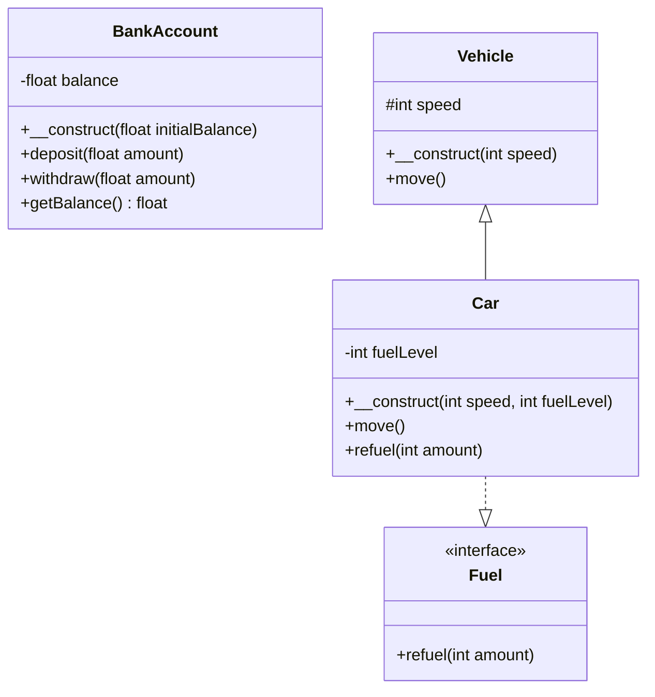

## 2.2 Encapsulation and Abstraction

In the realm of object-oriented programming (OOP), encapsulation and abstraction are two fundamental concepts that enable developers to build robust and maintainable applications. These principles help in managing complexity by hiding the intricate details of an object and exposing only what is necessary. In this section, we will delve into these concepts, explore their significance in PHP, and demonstrate how to implement them effectively.

### Understanding Encapsulation

Encapsulation is the process of bundling the data (attributes) and the methods (functions) that operate on the data into a single unit, known as a class. It restricts direct access to some of an object's components, which can prevent the accidental modification of data. This is achieved through access modifiers, which control the visibility of class members.

#### Key Benefits of Encapsulation

1. **Data Hiding**: Encapsulation allows you to hide the internal state of an object from the outside world. This means that the internal representation of an object can be changed without affecting the code that uses the object.

2. **Increased Security**: By restricting access to the internal state of an object, encapsulation helps in safeguarding the data from unauthorized access and modification.

3. **Improved Maintainability**: Encapsulation makes it easier to maintain and modify code. Changes to the internal implementation of a class do not affect other parts of the program that use the class.

4. **Enhanced Flexibility**: With encapsulation, you can change the internal workings of a class without affecting its external behavior, allowing for more flexible and adaptable code.

#### Implementing Encapsulation in PHP

In PHP, encapsulation is achieved using access modifiers: `public`, `private`, and `protected`. These modifiers determine the visibility of class properties and methods.

- **Public**: Members declared as public can be accessed from anywhere, both inside and outside the class.

- **Private**: Members declared as private can only be accessed within the class itself. They are not accessible from outside the class or by derived classes.

- **Protected**: Members declared as protected can be accessed within the class itself and by derived classes, but not from outside the class.

Let's look at an example to understand how encapsulation works in PHP:

```php
<?php

class BankAccount {
    private $balance;

    public function __construct($initialBalance) {
        $this->balance = $initialBalance;
    }

    public function deposit($amount) {
        if ($amount > 0) {
            $this->balance += $amount;
        }
    }

    public function withdraw($amount) {
        if ($amount > 0 && $amount <= $this->balance) {
            $this->balance -= $amount;
        }
    }

    public function getBalance() {
        return $this->balance;
    }
}

$account = new BankAccount(1000);
$account->deposit(500);
$account->withdraw(200);
echo $account->getBalance(); // Outputs: 1300

?>
```

In this example, the `BankAccount` class encapsulates the `balance` property, making it private. This ensures that the balance cannot be directly modified from outside the class. Instead, we provide public methods `deposit`, `withdraw`, and `getBalance` to interact with the balance safely.

### Exploring Abstraction

Abstraction is the concept of hiding the complex reality while exposing only the necessary parts. It allows you to focus on the essential characteristics of an object rather than the specific details of its implementation. In PHP, abstraction is typically achieved through abstract classes and interfaces.

#### Key Benefits of Abstraction

1. **Simplified Complexity**: Abstraction reduces complexity by allowing you to work with high-level concepts without worrying about the underlying details.

2. **Improved Code Reusability**: By defining common interfaces or abstract classes, you can create reusable code components that can be extended or implemented by different classes.

3. **Enhanced Flexibility**: Abstraction allows you to change the implementation details of a class without affecting its interface, providing greater flexibility in code design.

4. **Better Code Organization**: Abstraction helps in organizing code by separating the definition of operations from their implementation.

#### Implementing Abstraction in PHP

In PHP, abstraction can be implemented using abstract classes and interfaces.

- **Abstract Classes**: An abstract class is a class that cannot be instantiated on its own and is meant to be extended by other classes. It can contain abstract methods, which must be implemented by any subclass.

- **Interfaces**: An interface defines a contract that implementing classes must adhere to. It can only contain method signatures, and all methods must be public.

Let's explore an example of abstraction using an abstract class and an interface:

```php
<?php

abstract class Vehicle {
    protected $speed;

    public function __construct($speed) {
        $this->speed = $speed;
    }

    abstract public function move();
}

interface Fuel {
    public function refuel($amount);
}

class Car extends Vehicle implements Fuel {
    private $fuelLevel;

    public function __construct($speed, $fuelLevel) {
        parent::__construct($speed);
        $this->fuelLevel = $fuelLevel;
    }

    public function move() {
        echo "The car is moving at " . $this->speed . " km/h.\n";
    }

    public function refuel($amount) {
        $this->fuelLevel += $amount;
        echo "The car has been refueled. Fuel level: " . $this->fuelLevel . "\n";
    }
}

$car = new Car(120, 50);
$car->move();
$car->refuel(20);

?>
```

In this example, the `Vehicle` class is an abstract class with an abstract method `move`. The `Car` class extends `Vehicle` and implements the `Fuel` interface, providing concrete implementations for the `move` and `refuel` methods.

### Access Modifiers in PHP

Access modifiers play a crucial role in implementing encapsulation and abstraction in PHP. They determine the visibility and accessibility of class members, allowing you to control how data and methods are accessed and modified.

#### Public Access Modifier

The `public` access modifier allows class members to be accessed from anywhere, both inside and outside the class. This is useful for methods and properties that need to be accessible to other parts of the program.

```php
<?php

class User {
    public $name;

    public function __construct($name) {
        $this->name = $name;
    }

    public function greet() {
        echo "Hello, " . $this->name . "!\n";
    }
}

$user = new User("Alice");
echo $user->name; // Outputs: Alice
$user->greet(); // Outputs: Hello, Alice!

?>
```

In this example, the `name` property and the `greet` method are declared as public, allowing them to be accessed from outside the `User` class.

#### Private Access Modifier

The `private` access modifier restricts access to class members to within the class itself. This is useful for sensitive data or methods that should not be exposed to the outside world.

```php
<?php

class SecureData {
    private $data;

    public function __construct($data) {
        $this->data = $data;
    }

    private function processData() {
        return strtoupper($this->data);
    }

    public function getData() {
        return $this->processData();
    }
}

$secure = new SecureData("secret");
echo $secure->getData(); // Outputs: SECRET
// echo $secure->data; // Error: Cannot access private property
// echo $secure->processData(); // Error: Cannot access private method

?>
```

In this example, the `data` property and the `processData` method are private, ensuring that they cannot be accessed directly from outside the `SecureData` class.

#### Protected Access Modifier

The `protected` access modifier allows class members to be accessed within the class itself and by derived classes. This is useful for properties and methods that should be accessible to subclasses but not to the outside world.

```php
<?php

class Animal {
    protected $species;

    public function __construct($species) {
        $this->species = $species;
    }
}

class Dog extends Animal {
    public function bark() {
        echo "The " . $this->species . " barks.\n";
    }
}

$dog = new Dog("canine");
$dog->bark(); // Outputs: The canine barks.
// echo $dog->species; // Error: Cannot access protected property

?>
```

In this example, the `species` property is protected, allowing it to be accessed by the `Dog` class, which extends the `Animal` class, but not from outside the class hierarchy.

### Visualizing Encapsulation and Abstraction

To better understand the relationship between encapsulation and abstraction, let's visualize these concepts using a class diagram:



In this diagram, we can see how encapsulation is used to hide the `balance` property within the `BankAccount` class, while abstraction is demonstrated through the `Vehicle` abstract class and the `Fuel` interface.

### Try It Yourself

To deepen your understanding of encapsulation and abstraction, try modifying the code examples provided:

1. **Encapsulation Challenge**: Add a method to the `BankAccount` class that calculates interest on the balance. Ensure that the balance remains private and is only modified through the existing methods.

2. **Abstraction Challenge**: Create a new class `Bicycle` that extends the `Vehicle` class. Implement the `move` method to simulate the bicycle moving. Consider adding an interface for `Pedal` and implement it in the `Bicycle` class.

### Further Reading

For more information on encapsulation and abstraction in PHP, consider exploring the following resources:

- [PHP Manual: Classes and Objects](https://www.php.net/manual/en/language.oop5.php)
- [Object-Oriented Programming in PHP](https://www.w3schools.com/php/php_oop_what_is.asp)
- [Encapsulation in PHP](https://www.tutorialspoint.com/php/php_encapsulation.htm)

### Knowledge Check

Before moving on, let's summarize the key takeaways:

- **Encapsulation** is about bundling data and methods into a single unit and restricting access to the internal state of an object.
- **Abstraction** is about hiding complex details and exposing only the necessary parts of an object.
- **Access Modifiers** (`public`, `private`, `protected`) control the visibility of class members in PHP.

Remember, mastering encapsulation and abstraction is crucial for building maintainable and scalable PHP applications. Keep experimenting, stay curious, and enjoy the journey!

## Quiz: Encapsulation and Abstraction



### What is encapsulation in PHP?

- [x] Bundling data and methods into a single unit and restricting access to the internal state.
- [ ] Hiding the implementation details of a class.
- [ ] Allowing unrestricted access to class members.
- [ ] Defining a contract that implementing classes must adhere to.

> **Explanation:** Encapsulation involves bundling data and methods into a single unit and restricting access to the internal state of an object.

### Which access modifier allows class members to be accessed from anywhere?

- [x] Public
- [ ] Private
- [ ] Protected
- [ ] Internal

> **Explanation:** The `public` access modifier allows class members to be accessed from anywhere, both inside and outside the class.

### What is the purpose of abstraction in PHP?

- [x] Hiding complex details and exposing only the necessary parts of an object.
- [ ] Allowing direct access to the internal state of an object.
- [ ] Making all class members private.
- [ ] Defining a class that cannot be instantiated.

> **Explanation:** Abstraction is about hiding complex details and exposing only the necessary parts of an object, allowing you to focus on high-level concepts.

### Which of the following is true about private access modifiers?

- [x] They restrict access to class members to within the class itself.
- [ ] They allow access to class members from derived classes.
- [ ] They allow access to class members from anywhere.
- [ ] They are used to define abstract methods.

> **Explanation:** Private access modifiers restrict access to class members to within the class itself, ensuring that they cannot be accessed from outside the class.

### What is an abstract class in PHP?

- [x] A class that cannot be instantiated and is meant to be extended by other classes.
- [ ] A class that can be instantiated directly.
- [ ] A class that contains only private methods.
- [ ] A class that implements an interface.

> **Explanation:** An abstract class is a class that cannot be instantiated on its own and is meant to be extended by other classes.

### Which access modifier allows class members to be accessed by derived classes?

- [x] Protected
- [ ] Public
- [ ] Private
- [ ] Internal

> **Explanation:** The `protected` access modifier allows class members to be accessed within the class itself and by derived classes.

### What is the role of an interface in PHP?

- [x] Defining a contract that implementing classes must adhere to.
- [ ] Allowing direct access to class members.
- [ ] Hiding the internal state of an object.
- [ ] Making all class members public.

> **Explanation:** An interface defines a contract that implementing classes must adhere to, specifying method signatures without implementation.

### How does encapsulation improve maintainability?

- [x] By allowing changes to the internal implementation of a class without affecting other parts of the program.
- [ ] By exposing all class members to the outside world.
- [ ] By making all methods abstract.
- [ ] By defining a contract for implementing classes.

> **Explanation:** Encapsulation improves maintainability by allowing changes to the internal implementation of a class without affecting other parts of the program that use the class.

### What is the benefit of using access modifiers in PHP?

- [x] Controlling the visibility and accessibility of class members.
- [ ] Allowing unrestricted access to all class members.
- [ ] Making all methods abstract.
- [ ] Defining a contract for implementing classes.

> **Explanation:** Access modifiers control the visibility and accessibility of class members, allowing you to restrict access to sensitive data and methods.

### True or False: An abstract class can contain both abstract and concrete methods.

- [x] True
- [ ] False

> **Explanation:** True. An abstract class can contain both abstract methods, which must be implemented by subclasses, and concrete methods, which have an implementation.


