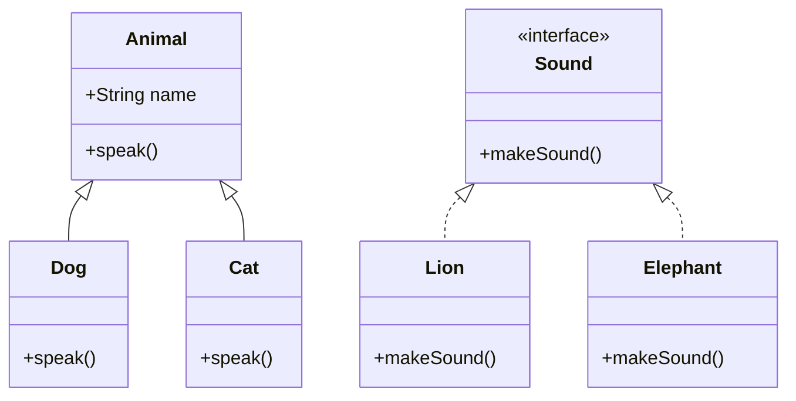

## 2.3 Inheritance and Polymorphism

In the realm of object-oriented programming (OOP), inheritance and polymorphism are two fundamental concepts that allow developers to create flexible, reusable, and maintainable code. In PHP, these concepts are pivotal for designing robust applications that can adapt to changing requirements. This section will delve into the intricacies of inheritance and polymorphism, providing you with a comprehensive understanding of how to leverage these principles in your PHP projects.

### Understanding Inheritance in PHP

Inheritance is a mechanism that allows a class to inherit properties and methods from another class. This promotes code reuse and establishes a natural hierarchy between classes. In PHP, inheritance is achieved using the `extends` keyword.

#### Basic Inheritance

Let's start with a simple example to illustrate basic inheritance:

```php
<?php

// Base class
class Animal {
    public $name;

    public function __construct($name) {
        $this->name = $name;
    }

    public function speak() {
        echo "The animal makes a sound.";
    }
}

// Derived class
class Dog extends Animal {
    public function speak() {
        echo "Woof! Woof!";
    }
}

$dog = new Dog("Buddy");
echo $dog->name; // Outputs: Buddy
$dog->speak();   // Outputs: Woof! Woof!

?>
```

In this example, the `Dog` class inherits from the `Animal` class. It overrides the `speak` method to provide a specific implementation for dogs.

#### Overriding Methods and Properties

When a derived class provides its own implementation of a method or property that exists in its parent class, it is known as overriding. This allows the derived class to modify or extend the behavior of the parent class.

```php
<?php

class Cat extends Animal {
    public function speak() {
        echo "Meow! Meow!";
    }
}

$cat = new Cat("Whiskers");
echo $cat->name; // Outputs: Whiskers
$cat->speak();   // Outputs: Meow! Meow!

?>
```

Here, the `Cat` class overrides the `speak` method to provide a cat-specific sound.

#### Access Control in Inheritance

PHP provides three levels of access control: `public`, `protected`, and `private`. These control the visibility of properties and methods in the context of inheritance.

- **Public**: Accessible from anywhere.
- **Protected**: Accessible within the class itself and by inheriting classes.
- **Private**: Accessible only within the class itself.

```php
<?php

class Bird extends Animal {
    protected $wingSpan;

    public function __construct($name, $wingSpan) {
        parent::__construct($name);
        $this->wingSpan = $wingSpan;
    }

    public function fly() {
        echo "{$this->name} is flying with a wingspan of {$this->wingSpan} meters.";
    }
}

$bird = new Bird("Eagle", 2.5);
$bird->fly(); // Outputs: Eagle is flying with a wingspan of 2.5 meters.

?>
```

In this example, the `wingSpan` property is protected, meaning it can be accessed by the `Bird` class and any class that extends `Bird`.

### Achieving Polymorphism in PHP

Polymorphism allows objects of different classes to be treated as objects of a common superclass. It is a key concept in OOP that enables flexibility and integration of different classes.

#### Method Overloading and Overriding

PHP does not support method overloading (having multiple methods with the same name but different parameters) directly. However, method overriding is a form of polymorphism where a subclass provides a specific implementation of a method that is already defined in its superclass.

#### Interfaces and Polymorphism

Interfaces in PHP define a contract that classes must adhere to. They are a powerful tool for achieving polymorphism.

```php
<?php

interface Sound {
    public function makeSound();
}

class Lion implements Sound {
    public function makeSound() {
        echo "Roar!";
    }
}

class Elephant implements Sound {
    public function makeSound() {
        echo "Trumpet!";
    }
}

function animalSound(Sound $animal) {
    $animal->makeSound();
}

$lion = new Lion();
$elephant = new Elephant();

animalSound($lion);      // Outputs: Roar!
animalSound($elephant);  // Outputs: Trumpet!

?>
```

In this example, both `Lion` and `Elephant` implement the `Sound` interface, allowing them to be used interchangeably in the `animalSound` function.

#### Abstract Classes and Polymorphism

Abstract classes provide a way to define common behavior that can be shared among subclasses. They can contain abstract methods that must be implemented by derived classes.

```php
<?php

abstract class Vehicle {
    abstract public function startEngine();

    public function stopEngine() {
        echo "Engine stopped.";
    }
}

class Car extends Vehicle {
    public function startEngine() {
        echo "Car engine started.";
    }
}

class Motorcycle extends Vehicle {
    public function startEngine() {
        echo "Motorcycle engine started.";
    }
}

$car = new Car();
$motorcycle = new Motorcycle();

$car->startEngine();      // Outputs: Car engine started.
$motorcycle->startEngine(); // Outputs: Motorcycle engine started.

?>
```

Here, `Car` and `Motorcycle` are required to implement the `startEngine` method defined in the `Vehicle` abstract class.

### Visualizing Inheritance and Polymorphism

To better understand the relationships between classes and interfaces, let's visualize these concepts using a class diagram.



This diagram illustrates how `Dog` and `Cat` inherit from `Animal`, and how `Lion` and `Elephant` implement the `Sound` interface.

### PHP Unique Features in Inheritance and Polymorphism

PHP offers several unique features that enhance inheritance and polymorphism:

- **Traits**: PHP allows the use of traits, which are a mechanism for code reuse in single inheritance languages like PHP. Traits can be used to include methods in a class, providing a way to share functionality between classes.

```php
<?php

trait Logger {
    public function log($message) {
        echo "Log: $message";
    }
}

class Application {
    use Logger;
}

$app = new Application();
$app->log("Application started."); // Outputs: Log: Application started.

?>
```

- **Late Static Binding**: This feature allows you to reference the called class in a context of static inheritance.

```php
<?php

class Base {
    public static function who() {
        echo __CLASS__;
    }

    public static function test() {
        static::who(); // Here comes Late Static Bindings
    }
}

class Child extends Base {
    public static function who() {
        echo __CLASS__;
    }
}

Child::test(); // Outputs: Child

?>
```

### Differences and Similarities with Other Languages

While PHP shares many OOP concepts with languages like Java and C++, there are differences:

- **No Method Overloading**: Unlike Java, PHP does not support method overloading.
- **Dynamic Typing**: PHP is dynamically typed, which affects how polymorphism is implemented compared to statically typed languages.
- **Traits**: PHP's trait system is unique and not found in languages like Java.

### Design Considerations

When using inheritance and polymorphism in PHP, consider the following:

- **Avoid Deep Inheritance Hierarchies**: Deep hierarchies can make code difficult to understand and maintain.
- **Use Interfaces for Flexibility**: Interfaces provide a flexible way to implement polymorphism without the constraints of inheritance.
- **Leverage Traits for Code Reuse**: Use traits to share functionality between classes without creating complex inheritance structures.

### Try It Yourself

Experiment with the code examples provided. Try creating your own classes and interfaces to see how inheritance and polymorphism can simplify your code design. Modify the examples to add new methods or properties, and observe how PHP handles these changes.

### Knowledge Check

- Explain how inheritance promotes code reuse.
- Describe how polymorphism enhances flexibility in code design.
- What are the differences between abstract classes and interfaces in PHP?

### Embrace the Journey

Remember, mastering inheritance and polymorphism is a journey. As you continue to explore these concepts, you'll find new ways to apply them in your projects. Keep experimenting, stay curious, and enjoy the process of learning and growing as a PHP developer.

## Quiz: Inheritance and Polymorphism



### What is inheritance in PHP?

- [x] A mechanism to create a new class using the properties and methods of an existing class.
- [ ] A way to define a contract that classes must adhere to.
- [ ] A method to encapsulate data within a class.
- [ ] A technique to manage dependencies in a class.

> **Explanation:** Inheritance allows a class to inherit properties and methods from another class, promoting code reuse and establishing a hierarchy.

### Which keyword is used to inherit a class in PHP?

- [x] extends
- [ ] implements
- [ ] inherit
- [ ] use

> **Explanation:** The `extends` keyword is used in PHP to indicate that a class is inheriting from another class.

### What is polymorphism in PHP?

- [x] The ability of different classes to be treated as instances of the same class through a common interface.
- [ ] A way to define multiple methods with the same name but different parameters.
- [ ] A technique to hide the implementation details of a class.
- [ ] A method to manage multiple inheritance in PHP.

> **Explanation:** Polymorphism allows objects of different classes to be treated as objects of a common superclass, enhancing flexibility.

### How can polymorphism be achieved in PHP?

- [x] Through interfaces and abstract classes.
- [ ] By using multiple inheritance.
- [ ] By overloading methods.
- [ ] By using global variables.

> **Explanation:** Polymorphism in PHP is achieved through interfaces and abstract classes, allowing different classes to implement the same interface or extend the same abstract class.

### What is the purpose of method overriding?

- [x] To provide a specific implementation of a method in a subclass that is already defined in its superclass.
- [ ] To define multiple methods with the same name but different parameters.
- [ ] To hide the implementation details of a method.
- [ ] To manage dependencies in a class.

> **Explanation:** Method overriding allows a subclass to provide a specific implementation of a method that is already defined in its superclass.

### What is the difference between an abstract class and an interface in PHP?

- [x] An abstract class can have implemented methods, while an interface cannot.
- [ ] An interface can have implemented methods, while an abstract class cannot.
- [ ] Both abstract classes and interfaces can have implemented methods.
- [ ] Neither abstract classes nor interfaces can have implemented methods.

> **Explanation:** Abstract classes can have both implemented and abstract methods, while interfaces can only have abstract methods.

### Which of the following is true about traits in PHP?

- [x] Traits allow code reuse in single inheritance languages like PHP.
- [ ] Traits are a form of multiple inheritance.
- [ ] Traits are used to define interfaces.
- [ ] Traits are used to manage dependencies.

> **Explanation:** Traits provide a mechanism for code reuse in PHP, allowing methods to be included in a class without using inheritance.

### What is late static binding in PHP?

- [x] A feature that allows you to reference the called class in a context of static inheritance.
- [ ] A method to delay the execution of a static method.
- [ ] A technique to manage dependencies in a class.
- [ ] A way to define multiple methods with the same name but different parameters.

> **Explanation:** Late static binding allows you to reference the called class in a context of static inheritance, providing more flexibility in class hierarchies.

### How does PHP handle method overloading?

- [x] PHP does not support method overloading directly.
- [ ] PHP supports method overloading through the `overload` keyword.
- [ ] PHP supports method overloading through interfaces.
- [ ] PHP supports method overloading through abstract classes.

> **Explanation:** PHP does not support method overloading directly, unlike some other programming languages.

### True or False: Inheritance can lead to tight coupling between classes.

- [x] True
- [ ] False

> **Explanation:** Inheritance can lead to tight coupling between classes, making it harder to modify or extend the code without affecting other parts of the application.


