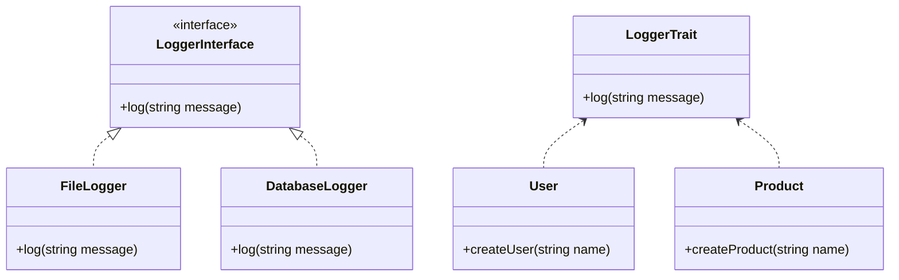

## 2.4 Interfaces and Traits

In the realm of object-oriented programming (OOP) in PHP, interfaces and traits play a pivotal role in designing robust and maintainable applications. They provide mechanisms to define contracts and share functionality across classes, enhancing code reusability and flexibility. In this section, we will delve into the intricacies of interfaces and traits, exploring their usage, differences, and how they contribute to modern PHP development.

### Understanding Interfaces in PHP

#### Defining Interfaces

An interface in PHP is a blueprint for classes. It defines a contract that any implementing class must adhere to, ensuring a consistent API across different implementations. Interfaces are particularly useful in scenarios where multiple classes need to implement the same set of methods but may have different internal logic.

```php
<?php

interface LoggerInterface {
    public function log(string $message): void;
}

class FileLogger implements LoggerInterface {
    public function log(string $message): void {
        // Log message to a file
        echo "Logging to a file: $message\n";
    }
}

class DatabaseLogger implements LoggerInterface {
    public function log(string $message): void {
        // Log message to a database
        echo "Logging to a database: $message\n";
    }
}

$fileLogger = new FileLogger();
$fileLogger->log("File log entry");

$databaseLogger = new DatabaseLogger();
$databaseLogger->log("Database log entry");
?>
```

In this example, `LoggerInterface` defines a single method `log()`. Both `FileLogger` and `DatabaseLogger` implement this interface, providing their own versions of the `log()` method. This ensures that any class implementing `LoggerInterface` will have a `log()` method, promoting consistency.

#### Key Characteristics of Interfaces

- **Method Declaration Only**: Interfaces can only declare methods, not implement them. This enforces a contract without dictating how it should be fulfilled.
- **Multiple Interfaces**: A class can implement multiple interfaces, allowing for flexible and modular designs.
- **No Properties**: Interfaces cannot contain properties. They are purely for defining method signatures.

#### Benefits of Using Interfaces

- **Decoupling**: Interfaces decouple the definition of methods from their implementation, allowing for interchangeable components.
- **Flexibility**: By implementing multiple interfaces, classes can exhibit polymorphic behavior, adapting to different contexts.
- **Testability**: Interfaces facilitate testing by allowing mock implementations to be easily swapped in during unit tests.

### Implementing Multiple Inheritance with Traits

#### Introduction to Traits

PHP does not support multiple inheritance directly, meaning a class cannot inherit from more than one parent class. However, traits provide a way to achieve similar functionality by allowing code reuse across classes without the constraints of single inheritance.

```php
<?php

trait LoggerTrait {
    public function log(string $message): void {
        echo "Logging: $message\n";
    }
}

class User {
    use LoggerTrait;

    public function createUser(string $name): void {
        $this->log("Creating user: $name");
    }
}

class Product {
    use LoggerTrait;

    public function createProduct(string $name): void {
        $this->log("Creating product: $name");
    }
}

$user = new User();
$user->createUser("Alice");

$product = new Product();
$product->createProduct("Laptop");
?>
```

In this example, `LoggerTrait` provides a `log()` method that can be used by any class that includes the trait. Both `User` and `Product` classes use `LoggerTrait`, allowing them to log messages without duplicating code.

#### Key Characteristics of Traits

- **Code Reuse**: Traits allow methods to be reused across multiple classes, reducing code duplication.
- **Conflict Resolution**: If two traits used in a class have methods with the same name, PHP provides mechanisms to resolve these conflicts.
- **Properties and Methods**: Traits can contain both properties and methods, unlike interfaces.

#### Benefits of Using Traits

- **Avoiding Code Duplication**: Traits enable sharing of common functionality across classes without duplicating code.
- **Enhanced Modularity**: Traits promote modular design by allowing specific functionalities to be encapsulated and reused.
- **Flexibility**: Traits can be combined in various ways, providing flexibility in how functionality is composed.

### Differences Between Interfaces, Abstract Classes, and Traits

Understanding the differences between interfaces, abstract classes, and traits is crucial for making informed design decisions in PHP.

#### Interfaces vs. Abstract Classes

- **Interfaces**: Define a contract with method signatures only. They do not provide any implementation.
- **Abstract Classes**: Can define both method signatures and implementations. They can also contain properties.

```php
<?php

abstract class AbstractLogger {
    abstract public function log(string $message): void;

    public function formatMessage(string $message): string {
        return strtoupper($message);
    }
}

class ConsoleLogger extends AbstractLogger {
    public function log(string $message): void {
        echo $this->formatMessage($message) . "\n";
    }
}

$logger = new ConsoleLogger();
$logger->log("Hello, World!");
?>
```

In this example, `AbstractLogger` provides a concrete method `formatMessage()` and an abstract method `log()`. `ConsoleLogger` must implement the `log()` method but can use `formatMessage()` as is.

#### Interfaces vs. Traits

- **Interfaces**: Define a set of methods that implementing classes must provide.
- **Traits**: Provide actual implementations that can be reused across classes.

#### Abstract Classes vs. Traits

- **Abstract Classes**: Can define a base class with both abstract and concrete methods. They are part of the class hierarchy.
- **Traits**: Are not part of the class hierarchy and are used solely for code reuse.

### Visualizing Interfaces and Traits

To better understand how interfaces and traits fit into the PHP object-oriented paradigm, let's visualize their relationships and interactions.



In this diagram, `LoggerInterface` is implemented by both `FileLogger` and `DatabaseLogger`, while `LoggerTrait` is used by both `User` and `Product`. This illustrates how interfaces define contracts and traits provide reusable functionality.

### Practical Applications and Considerations

#### When to Use Interfaces

- **Defining Contracts**: Use interfaces to define a set of methods that multiple classes must implement, ensuring consistency.
- **Polymorphism**: Interfaces enable polymorphic behavior, allowing objects to be treated as instances of their interface rather than their concrete class.

#### When to Use Traits

- **Code Reuse**: Use traits to share common functionality across classes without duplicating code.
- **Avoiding Inheritance Limitations**: Traits provide a way to include functionality in classes that cannot be achieved through inheritance alone.

#### Design Considerations

- **Avoid Overusing Traits**: While traits are powerful, overusing them can lead to complex and hard-to-maintain codebases. Use them judiciously.
- **Interface Segregation**: Follow the Interface Segregation Principle by creating small, focused interfaces rather than large, monolithic ones.

### Try It Yourself

Experiment with the following exercises to deepen your understanding of interfaces and traits:

1. **Create a Payment Interface**: Define an interface `PaymentInterface` with methods `processPayment()` and `refund()`. Implement this interface in classes `CreditCardPayment` and `PayPalPayment`.

2. **Implement a Logger Trait**: Create a trait `LoggerTrait` with a method `log()`. Use this trait in classes `Order` and `Invoice` to log messages when orders and invoices are created.

3. **Resolve Trait Conflicts**: Create two traits `TraitA` and `TraitB`, each with a method `greet()`. Use both traits in a class `Greeter` and resolve the conflict by aliasing one of the methods.

### References and Further Reading

- [PHP Manual: Interfaces](https://www.php.net/manual/en/language.oop5.interfaces.php)
- [PHP Manual: Traits](https://www.php.net/manual/en/language.oop5.traits.php)
- [Design Patterns: Elements of Reusable Object-Oriented Software](https://en.wikipedia.org/wiki/Design_Patterns)

### Knowledge Check

- **What is the primary purpose of an interface in PHP?**
- **How do traits differ from abstract classes?**
- **Can a class implement multiple interfaces?**
- **What are some benefits of using traits?**

### Embrace the Journey

Remember, mastering interfaces and traits is a significant step towards becoming a proficient PHP developer. As you continue to explore and experiment, you'll discover new ways to leverage these powerful tools in your projects. Keep learning, stay curious, and enjoy the journey!

## Quiz: Interfaces and Traits



### What is the primary purpose of an interface in PHP?

- [x] To define a contract for classes to implement
- [ ] To provide a default implementation for methods
- [ ] To allow multiple inheritance
- [ ] To store data

> **Explanation:** Interfaces define a contract that classes must adhere to by implementing the specified methods.

### How do traits differ from abstract classes?

- [x] Traits provide reusable code, while abstract classes can define both abstract and concrete methods
- [ ] Traits can have properties, while abstract classes cannot
- [ ] Traits are part of the class hierarchy, while abstract classes are not
- [ ] Traits enforce method implementation, while abstract classes do not

> **Explanation:** Traits provide reusable code that can be included in multiple classes, whereas abstract classes can define both abstract and concrete methods and are part of the class hierarchy.

### Can a class implement multiple interfaces in PHP?

- [x] Yes
- [ ] No

> **Explanation:** PHP allows a class to implement multiple interfaces, providing flexibility in design.

### What is a key benefit of using traits in PHP?

- [x] Code reuse across multiple classes
- [ ] Enforcing method implementation
- [ ] Defining a class hierarchy
- [ ] Storing data

> **Explanation:** Traits allow for code reuse across multiple classes without duplicating code.

### Which of the following is true about interfaces?

- [x] They can only declare methods, not implement them
- [ ] They can contain properties
- [ ] They can provide default method implementations
- [ ] They are part of the class hierarchy

> **Explanation:** Interfaces can only declare methods, not implement them, and they cannot contain properties.

### What happens if two traits used in a class have methods with the same name?

- [x] PHP provides mechanisms to resolve conflicts
- [ ] The class will not compile
- [ ] The last trait's method is used
- [ ] The first trait's method is used

> **Explanation:** PHP provides mechanisms, such as aliasing, to resolve conflicts when two traits have methods with the same name.

### Can traits contain properties?

- [x] Yes
- [ ] No

> **Explanation:** Traits can contain both methods and properties, unlike interfaces.

### What is a common use case for interfaces?

- [x] Defining a set of methods that multiple classes must implement
- [ ] Reusing code across multiple classes
- [ ] Storing shared data
- [ ] Creating a class hierarchy

> **Explanation:** Interfaces are commonly used to define a set of methods that multiple classes must implement, ensuring consistency.

### Which principle is closely related to the use of interfaces?

- [x] Interface Segregation Principle
- [ ] Single Responsibility Principle
- [ ] Open/Closed Principle
- [ ] Liskov Substitution Principle

> **Explanation:** The Interface Segregation Principle encourages creating small, focused interfaces rather than large, monolithic ones.

### True or False: Traits can be used to achieve multiple inheritance in PHP.

- [x] True
- [ ] False

> **Explanation:** Traits provide a way to achieve multiple inheritance-like functionality by allowing code reuse across classes.


