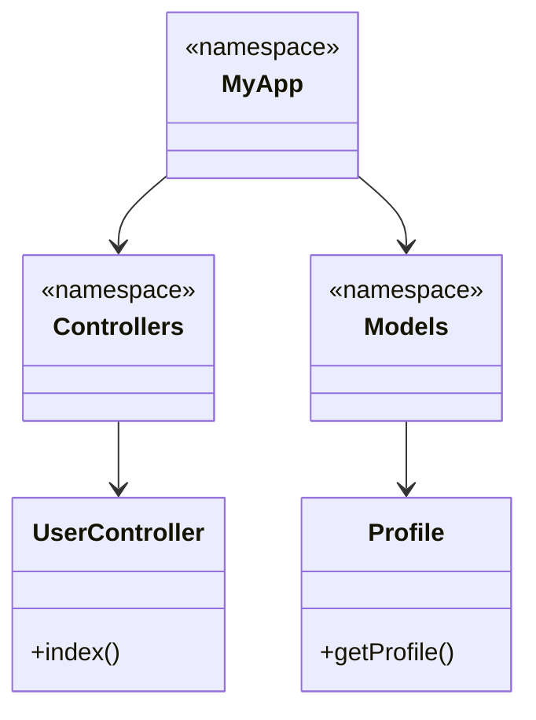

## 2.5 Namespaces and Autoloading

In the world of PHP development, organizing code efficiently is crucial for maintaining readability, scalability, and preventing conflicts. Namespaces and autoloading are two powerful features that help developers achieve these goals. In this section, we will delve into the concepts of namespaces and autoloading, explore their benefits, and demonstrate how to implement them effectively in your PHP projects.

### Understanding Namespaces in PHP

Namespaces in PHP provide a way to encapsulate items such as classes, interfaces, functions, and constants. They help avoid name collisions by grouping related code under a unique name. This is particularly useful in large projects or when integrating third-party libraries.

#### Why Use Namespaces?

1. **Avoid Name Collisions**: In large applications or when using multiple libraries, it's common to encounter classes or functions with the same name. Namespaces prevent these collisions by providing a unique context.

2. **Organize Code**: Namespaces help in logically organizing code into modules or packages, making it easier to manage and navigate.

3. **Enhance Readability**: By grouping related classes and functions, namespaces improve the readability and maintainability of code.

4. **Facilitate Autoloading**: Namespaces work seamlessly with autoloading mechanisms, allowing for efficient class loading.

#### Defining and Using Namespaces

To define a namespace, use the `namespace` keyword at the top of your PHP file. Here's a simple example:

```php
<?php
namespace MyApp\Controllers;

class UserController {
    public function index() {
        echo "User index page";
    }
}
```

To use a class from a namespace, you can either use the fully qualified name or import it using the `use` keyword:

```php
<?php
use MyApp\Controllers\UserController;

$userController = new UserController();
$userController->index();
```

#### Nested Namespaces

PHP supports nested namespaces, allowing for more granular organization. You can define nested namespaces using the backslash (`\`) separator:

```php
<?php
namespace MyApp\Models\User;

class Profile {
    public function getProfile() {
        return "User profile data";
    }
}
```

#### Aliasing Namespaces

You can alias namespaces to simplify their usage in your code. This is particularly useful when dealing with long or complex namespace paths:

```php
<?php
use MyApp\Models\User\Profile as UserProfile;

$profile = new UserProfile();
echo $profile->getProfile();
```

### Autoloading in PHP

Autoloading is a mechanism that automatically loads PHP classes when they are needed, eliminating the need for manual `require` or `include` statements. This not only simplifies code but also improves performance by loading classes only when necessary.

#### Benefits of Autoloading

1. **Efficiency**: Autoloading loads classes on demand, reducing the initial load time of your application.

2. **Simplicity**: It removes the need for manual inclusion of class files, making code cleaner and easier to maintain.

3. **Scalability**: As your application grows, autoloading handles the complexity of managing multiple class files.

#### Implementing Autoloading

PHP provides several ways to implement autoloading. The most common method is using the `spl_autoload_register` function, which allows you to register multiple autoload functions.

Here's a basic example of an autoloader:

```php
<?php
spl_autoload_register(function ($class) {
    $file = __DIR__ . '/' . str_replace('\\', '/', $class) . '.php';
    if (file_exists($file)) {
        require $file;
    }
});
```

This autoloader converts the namespace and class name into a file path and includes the file if it exists.

### PSR-4 Autoloading Standard

The PHP-FIG (PHP Framework Interop Group) introduced the PSR-4 standard to provide a standardized way of autoloading classes from file paths. PSR-4 maps the fully qualified class name to a file path, making it easier to manage and organize code.

#### Setting Up PSR-4 Autoloading

To use PSR-4 autoloading, you typically define an autoload section in your `composer.json` file. Here's an example:

```json
{
    "autoload": {
        "psr-4": {
            "MyApp\\": "src/"
        }
    }
}
```

This configuration maps the `MyApp` namespace to the `src/` directory. Composer will generate an autoloader based on this mapping.

#### Using Composer for Autoloading

Composer is a dependency manager for PHP that simplifies the process of managing libraries and autoloading. To set up autoloading with Composer:

1. **Install Composer**: Follow the instructions on the [Composer website](https://getcomposer.org/) to install Composer on your system.

2. **Create a `composer.json` File**: Define your project's dependencies and autoloading configuration.

3. **Run `composer install`**: This command installs the dependencies and generates the autoloader.

4. **Include the Autoloader**: Add the following line to your PHP script to include the Composer autoloader:

   ```php
   <?php
   require 'vendor/autoload.php';
   ```

### Visualizing Namespaces and Autoloading

To better understand how namespaces and autoloading work together, let's visualize the process using a class diagram:



In this diagram, `MyApp` is the root namespace, with `Controllers` and `Models` as sub-namespaces. `UserController` and `Profile` are classes within these namespaces.

### Try It Yourself

Experiment with namespaces and autoloading by creating a simple PHP project:

1. **Create a Directory Structure**: Organize your files into directories that match your namespace structure.

2. **Define Namespaces**: Use the `namespace` keyword to define namespaces in your PHP files.

3. **Set Up Autoloading**: Implement an autoloader using `spl_autoload_register` or configure PSR-4 autoloading with Composer.

4. **Test Your Setup**: Create instances of your classes and verify that they are loaded correctly.

### Knowledge Check

- Explain the purpose of namespaces in PHP.
- Describe how autoloading improves code efficiency.
- Implement a basic autoloader using `spl_autoload_register`.
- Set up PSR-4 autoloading using Composer.

### Conclusion

Namespaces and autoloading are essential tools for organizing and managing PHP code. By understanding and implementing these features, you can create scalable, maintainable, and efficient applications. Remember, this is just the beginning. As you progress, you'll build more complex and interactive applications. Keep experimenting, stay curious, and enjoy the journey!

## Quiz: Namespaces and Autoloading



### What is the primary purpose of namespaces in PHP?

- [x] To prevent name collisions
- [ ] To improve performance
- [ ] To simplify syntax
- [ ] To enhance security

> **Explanation:** Namespaces are used to prevent name collisions by providing a unique context for classes, functions, and constants.

### How do you define a namespace in a PHP file?

- [x] Using the `namespace` keyword
- [ ] Using the `use` keyword
- [ ] Using the `class` keyword
- [ ] Using the `include` keyword

> **Explanation:** The `namespace` keyword is used to define a namespace at the top of a PHP file.

### What is the benefit of using autoloading in PHP?

- [x] It loads classes on demand, reducing initial load time
- [ ] It increases the size of the application
- [ ] It requires manual inclusion of class files
- [ ] It decreases code readability

> **Explanation:** Autoloading loads classes on demand, which reduces the initial load time and simplifies code management.

### Which function is commonly used to register an autoloader in PHP?

- [x] `spl_autoload_register`
- [ ] `autoload_register`
- [ ] `register_autoload`
- [ ] `autoload_function`

> **Explanation:** The `spl_autoload_register` function is used to register an autoloader in PHP.

### What does PSR-4 stand for?

- [x] PHP Standard Recommendation 4
- [ ] PHP Script Requirement 4
- [ ] PHP Software Rule 4
- [ ] PHP System Regulation 4

> **Explanation:** PSR-4 stands for PHP Standard Recommendation 4, which is a standard for autoloading classes from file paths.

### How do you map a namespace to a directory using Composer?

- [x] By defining an autoload section in `composer.json`
- [ ] By using the `namespace` keyword
- [ ] By creating a `autoload.php` file
- [ ] By manually including each class file

> **Explanation:** You map a namespace to a directory by defining an autoload section in `composer.json`.

### What is the role of the `use` keyword in PHP?

- [x] To import a namespace or class
- [ ] To define a namespace
- [ ] To include a file
- [ ] To declare a variable

> **Explanation:** The `use` keyword is used to import a namespace or class into the current scope.

### Which of the following is a benefit of using Composer for autoloading?

- [x] It automates dependency management and autoloading
- [ ] It increases the complexity of the project
- [ ] It requires manual class loading
- [ ] It decreases code readability

> **Explanation:** Composer automates dependency management and autoloading, simplifying project setup and maintenance.

### Can namespaces be nested in PHP?

- [x] True
- [ ] False

> **Explanation:** Namespaces can be nested in PHP, allowing for more granular organization of code.

### What is the purpose of aliasing a namespace in PHP?

- [x] To simplify the usage of long or complex namespace paths
- [ ] To define a new namespace
- [ ] To include a file
- [ ] To declare a variable

> **Explanation:** Aliasing a namespace simplifies the usage of long or complex namespace paths by providing a shorter alias.




