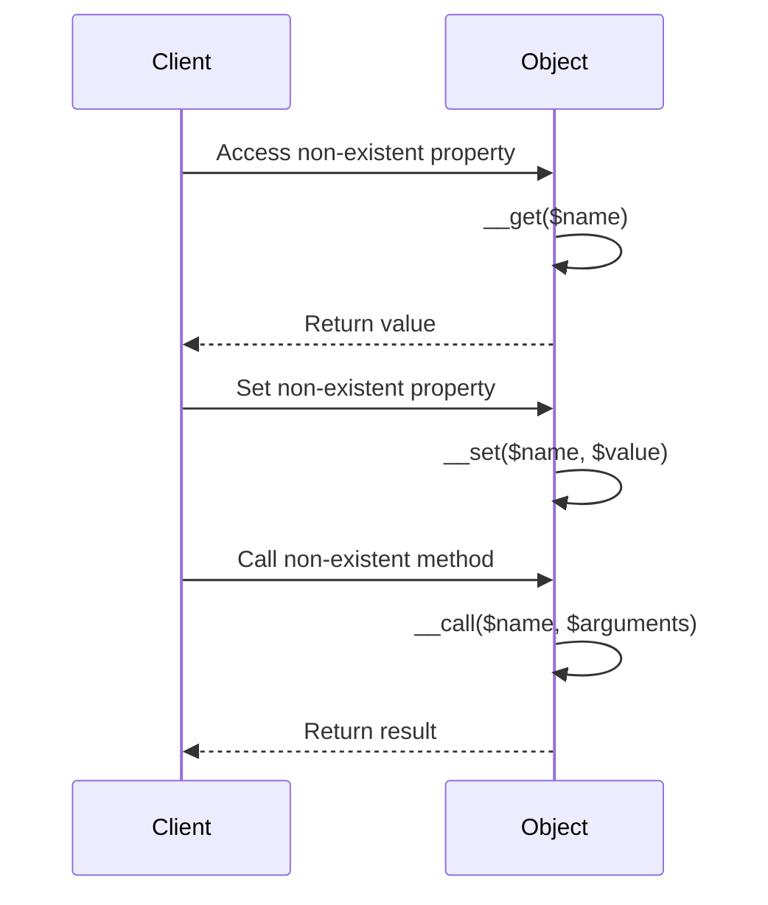

## 2.6 Magic Methods and Overloading

In PHP, magic methods and overloading provide developers with powerful tools to create dynamic and flexible applications. These features allow for the customization of object behavior in ways that are not possible with standard methods and properties. In this section, we will delve into the intricacies of magic methods and overloading, providing you with a comprehensive understanding of how to leverage these features effectively.

### Understanding Magic Methods

Magic methods in PHP are special methods that begin with a double underscore (`__`). They are automatically invoked in response to certain actions performed on an object. These methods allow you to define custom behaviors for object instantiation, property access, method calls, and more.

#### Common Magic Methods

1. **`__construct()`**: This is the constructor method, automatically called when a new object is created. It is used to initialize object properties.

   ```php
   class User {
       private $name;

       public function __construct($name) {
           $this->name = $name;
       }
   }

   $user = new User("Alice");
   ```

2. **`__destruct()`**: This method is called when an object is destroyed. It is useful for cleanup tasks, such as closing database connections.

   ```php
   class FileHandler {
       private $file;

       public function __construct($filename) {
           $this->file = fopen($filename, 'w');
       }

       public function __destruct() {
           fclose($this->file);
       }
   }
   ```

3. **`__get($name)`**: This method is invoked when accessing a non-existent or inaccessible property. It allows for dynamic property retrieval.

   ```php
   class DynamicProperties {
       private $data = [];

       public function __get($name) {
           return $this->data[$name] ?? null;
       }
   }

   $obj = new DynamicProperties();
   echo $obj->nonExistentProperty; // Outputs: null
   ```

4. **`__set($name, $value)`**: This method is called when setting a value to a non-existent or inaccessible property. It enables dynamic property assignment.

   ```php
   class DynamicProperties {
       private $data = [];

       public function __set($name, $value) {
           $this->data[$name] = $value;
       }
   }

   $obj = new DynamicProperties();
   $obj->newProperty = "Hello";
   ```

5. **`__call($name, $arguments)`**: This method is triggered when invoking inaccessible or non-existent methods. It allows for dynamic method calls.

   ```php
   class MethodHandler {
       public function __call($name, $arguments) {
           echo "Calling method '$name' with arguments: " . implode(', ', $arguments);
       }
   }

   $obj = new MethodHandler();
   $obj->nonExistentMethod('arg1', 'arg2');
   ```

6. **`__callStatic($name, $arguments)`**: Similar to `__call()`, but for static methods.

   ```php
   class StaticMethodHandler {
       public static function __callStatic($name, $arguments) {
           echo "Calling static method '$name' with arguments: " . implode(', ', $arguments);
       }
   }

   StaticMethodHandler::nonExistentStaticMethod('arg1', 'arg2');
   ```

7. **`__isset($name)`**: Invoked when using `isset()` or `empty()` on inaccessible properties.

   ```php
   class PropertyChecker {
       private $data = [];

       public function __isset($name) {
           return isset($this->data[$name]);
       }
   }

   $obj = new PropertyChecker();
   var_dump(isset($obj->someProperty)); // Outputs: bool(false)
   ```

8. **`__unset($name)`**: Called when `unset()` is used on inaccessible properties.

   ```php
   class PropertyRemover {
       private $data = [];

       public function __unset($name) {
           unset($this->data[$name]);
       }
   }

   $obj = new PropertyRemover();
   unset($obj->someProperty);
   ```

9. **`__toString()`**: Allows an object to be treated as a string. It is called when an object is used in a string context.

   ```php
   class User {
       private $name;

       public function __construct($name) {
           $this->name = $name;
       }

       public function __toString() {
           return $this->name;
       }
   }

   $user = new User("Alice");
   echo $user; // Outputs: Alice
   ```

10. **`__invoke()`**: This method is called when an object is used as a function.

    ```php
    class CallableClass {
        public function __invoke($x) {
            return $x * $x;
        }
    }

    $obj = new CallableClass();
    echo $obj(5); // Outputs: 25
    ```

11. **`__clone()`**: Invoked when an object is cloned using the `clone` keyword.

    ```php
    class Cloneable {
        public $property;

        public function __clone() {
            $this->property = clone $this->property;
        }
    }

    $original = new Cloneable();
    $copy = clone $original;
    ```

### Overloading in PHP

Overloading in PHP refers to the ability to dynamically create properties and methods. This is achieved through magic methods such as `__get()`, `__set()`, `__call()`, and `__callStatic()`. Overloading allows for flexible and dynamic object behavior, enabling developers to handle undefined properties and methods gracefully.

#### Property Overloading

Property overloading is implemented using the `__get()` and `__set()` magic methods. These methods allow you to define custom behavior for accessing and modifying properties that do not exist or are inaccessible.

**Example: Dynamic Property Storage**

```php
class DynamicStorage {
    private $data = [];

    public function __get($name) {
        return $this->data[$name] ?? null;
    }

    public function __set($name, $value) {
        $this->data[$name] = $value;
    }
}

$storage = new DynamicStorage();
$storage->name = "Alice";
echo $storage->name; // Outputs: Alice
```

#### Method Overloading

Method overloading is achieved using the `__call()` and `__callStatic()` magic methods. These methods allow you to define custom behavior for invoking methods that do not exist or are inaccessible.

**Example: Dynamic Method Handling**

```php
class DynamicMethods {
    public function __call($name, $arguments) {
        echo "Method '$name' called with arguments: " . implode(', ', $arguments);
    }
}

$methods = new DynamicMethods();
$methods->nonExistentMethod('arg1', 'arg2'); // Outputs: Method 'nonExistentMethod' called with arguments: arg1, arg2
```

### Best Practices for Using Magic Methods

While magic methods provide powerful capabilities, they should be used judiciously to avoid potential pitfalls. Here are some best practices to consider:

1. **Use Magic Methods Sparingly**: Overuse of magic methods can lead to code that is difficult to understand and maintain. Use them only when necessary.

2. **Document Your Code**: Clearly document the behavior of magic methods to ensure that other developers (and your future self) understand how they work.

3. **Avoid Performance Overhead**: Magic methods can introduce performance overhead due to additional method calls. Consider the performance implications before using them extensively.

4. **Ensure Consistency**: Maintain consistent behavior across magic methods to avoid unexpected results. For example, if you implement `__get()`, ensure that `__set()` behaves in a complementary manner.

5. **Handle Errors Gracefully**: Implement error handling within magic methods to manage unexpected situations, such as accessing undefined properties.

6. **Test Thoroughly**: Magic methods can introduce subtle bugs. Thoroughly test your code to ensure that magic methods behave as expected.

### Visualizing Magic Methods and Overloading

To better understand the flow of magic methods and overloading, let's visualize the process using a sequence diagram.



### Try It Yourself

Experiment with the code examples provided in this section. Try modifying the behavior of magic methods to see how they affect object interactions. For instance, you can:

- Add logging to the `__get()` and `__set()` methods to track property access and modification.
- Implement additional logic in the `__call()` method to handle specific method names differently.

### References and Further Reading

- [PHP Manual: Magic Methods](https://www.php.net/manual/en/language.oop5.magic.php)
- [PHP Manual: Overloading](https://www.php.net/manual/en/language.oop5.overloading.php)
- [MDN Web Docs: Object-Oriented Programming](https://developer.mozilla.org/en-US/docs/Learn/JavaScript/Objects/Object-oriented_JS)

### Knowledge Check

1. What is the purpose of the `__construct()` magic method?
2. How does the `__get()` method facilitate property overloading?
3. Describe a scenario where `__call()` would be useful.
4. What are some potential pitfalls of overusing magic methods?
5. How can you ensure consistent behavior across magic methods?

### Embrace the Journey

Remember, mastering magic methods and overloading is just one step in your PHP development journey. As you continue to explore and experiment, you'll discover new ways to create dynamic and flexible applications. Keep pushing the boundaries of what's possible, and enjoy the process of learning and growing as a developer!

## Quiz: Magic Methods and Overloading



### What is the primary purpose of the `__construct()` magic method in PHP?

- [x] To initialize object properties when a new object is created.
- [ ] To handle errors during object destruction.
- [ ] To overload methods dynamically.
- [ ] To convert an object to a string.

> **Explanation:** The `__construct()` method is used to initialize object properties when a new object is instantiated.

### Which magic method is used to handle calls to non-existent or inaccessible methods?

- [x] `__call()`
- [ ] `__get()`
- [ ] `__set()`
- [ ] `__invoke()`

> **Explanation:** The `__call()` method is triggered when a non-existent or inaccessible method is called on an object.

### How can you dynamically create properties in a PHP class?

- [x] By using the `__get()` and `__set()` magic methods.
- [ ] By defining all properties in the class constructor.
- [ ] By using the `__invoke()` method.
- [ ] By implementing interfaces.

> **Explanation:** The `__get()` and `__set()` magic methods allow for dynamic property creation and access.

### What is a potential downside of overusing magic methods?

- [x] They can make code difficult to understand and maintain.
- [ ] They improve performance significantly.
- [ ] They automatically handle all errors.
- [ ] They eliminate the need for constructors.

> **Explanation:** Overusing magic methods can lead to code that is hard to read and maintain due to their implicit behavior.

### Which magic method allows an object to be used as a function?

- [x] `__invoke()`
- [ ] `__call()`
- [ ] `__toString()`
- [ ] `__clone()`

> **Explanation:** The `__invoke()` method is called when an object is used as a function.

### What should you do to ensure magic methods are used effectively?

- [x] Document their behavior clearly.
- [ ] Avoid using them altogether.
- [ ] Use them to replace all standard methods.
- [ ] Implement them without testing.

> **Explanation:** Documenting the behavior of magic methods helps other developers understand how they work and ensures effective use.

### Which magic method is called when an object is cloned?

- [x] `__clone()`
- [ ] `__call()`
- [ ] `__set()`
- [ ] `__destruct()`

> **Explanation:** The `__clone()` method is invoked when an object is cloned using the `clone` keyword.

### How can you handle errors gracefully in magic methods?

- [x] Implement error handling within the methods.
- [ ] Ignore errors and let them propagate.
- [ ] Use magic methods to suppress all errors.
- [ ] Rely on external libraries for error handling.

> **Explanation:** Implementing error handling within magic methods ensures that unexpected situations are managed effectively.

### True or False: Magic methods can introduce performance overhead due to additional method calls.

- [x] True
- [ ] False

> **Explanation:** Magic methods can introduce performance overhead because they involve additional method calls and logic execution.

### What is the role of the `__toString()` magic method?

- [x] To allow an object to be treated as a string.
- [ ] To handle method overloading.
- [ ] To manage property access.
- [ ] To initialize object properties.

> **Explanation:** The `__toString()` method allows an object to be converted to a string when used in a string context.




