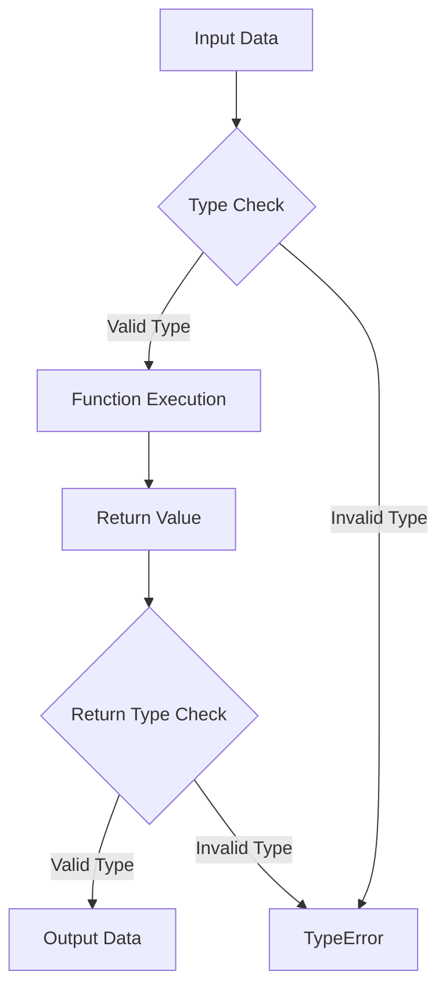

## 2.7 Type Declarations and Type Hinting

In the world of PHP development, ensuring that your code is robust, maintainable, and error-free is paramount. One of the key strategies to achieve this is through the use of type declarations and type hinting. This section will delve into the intricacies of these concepts, providing you with the knowledge to enforce data types effectively in your PHP applications.

### Introduction to Type Declarations and Type Hinting

Type declarations and type hinting are mechanisms in PHP that allow developers to specify the expected data types of function arguments and return values. This feature was introduced to improve code quality by reducing errors related to incorrect data types and enhancing code readability.

#### What Are Type Declarations?

Type declarations, also known as type hints, are a way to specify the expected data type of a function's parameters and return values. By declaring types, you can enforce stricter data handling, leading to fewer runtime errors and more predictable code behavior.

#### Why Use Type Declarations?

- **Error Prevention**: By specifying data types, you can catch type-related errors early in the development process.
- **Code Readability**: Type declarations make it clear what kind of data a function expects and returns, improving code readability.
- **Maintainability**: With explicit type information, maintaining and refactoring code becomes easier.
- **Performance**: While the performance impact is minimal, type declarations can lead to slightly faster code execution due to reduced type juggling.

### Scalar Type Declarations

PHP 7 introduced scalar type declarations, allowing developers to specify basic data types for function parameters and return values. These include:

- **int**: Integer values
- **float**: Floating-point numbers
- **string**: Textual data
- **bool**: Boolean values

#### Enforcing Scalar Types

To enforce scalar types, you can declare them in the function signature. Here's an example:

```php
function addNumbers(int $a, int $b): int {
    return $a + $b;
}

echo addNumbers(5, 10); // Outputs: 15
```

In this example, the `addNumbers` function expects two integer parameters and returns an integer. If you try to pass a non-integer value, PHP will throw a `TypeError`.

#### Strict Typing Mode

PHP allows you to enforce strict typing by declaring `declare(strict_types=1);` at the top of your PHP file. This ensures that only the specified types are accepted, and no type coercion occurs.

```php
declare(strict_types=1);

function multiply(float $a, float $b): float {
    return $a * $b;
}

echo multiply(2.5, 4.0); // Outputs: 10.0
```

With strict typing enabled, passing an integer to `multiply` would result in a `TypeError`.

### Return Type Declarations

Return type declarations specify the data type that a function will return. This feature enhances the predictability and reliability of your code.

#### Using Return Type Declarations

Here's how you can use return type declarations:

```php
function getGreeting(string $name): string {
    return "Hello, " . $name;
}

echo getGreeting("Alice"); // Outputs: Hello, Alice
```

In this example, the `getGreeting` function is expected to return a string. If it returns a different type, PHP will throw a `TypeError`.

### Benefits of Strict Typing in PHP Applications

Strict typing in PHP applications offers several advantages:

- **Improved Code Quality**: By enforcing data types, you reduce the likelihood of type-related bugs.
- **Enhanced Collaboration**: Clear type declarations make it easier for teams to understand and work with the codebase.
- **Better Tooling Support**: Many IDEs and static analysis tools leverage type information to provide better code insights and suggestions.
- **Future-Proofing**: As PHP evolves, strict typing ensures your code remains compatible with future versions.

### Advanced Type Declarations

PHP 7.1 and later versions introduced several advanced type declaration features, including nullable types, void return types, and iterable types.

#### Nullable Types

Nullable types allow a parameter or return value to be of a specified type or null. This is useful for optional parameters or when a function may not return a value.

```php
function findUser(int $id): ?User {
    // Logic to find a user by ID
    return $user ?? null;
}
```

In this example, the `findUser` function returns a `User` object or `null` if no user is found.

#### Void Return Type

The `void` return type indicates that a function does not return a value. This is useful for functions that perform actions without producing a result.

```php
function logMessage(string $message): void {
    echo $message;
}
```

The `logMessage` function outputs a message but does not return a value.

#### Iterable Type

The `iterable` type allows a parameter or return value to be an array or an object implementing the `Traversable` interface.

```php
function processItems(iterable $items): void {
    foreach ($items as $item) {
        // Process each item
    }
}
```

The `processItems` function can accept arrays or objects that can be iterated over.

### Type Declarations in Object-Oriented PHP

Type declarations are particularly useful in object-oriented PHP, where they can be used to enforce class and interface types.

#### Class Type Declarations

You can specify that a parameter or return value must be an instance of a specific class.

```php
class Car {
    // Car class implementation
}

function repairCar(Car $car): void {
    // Repair the car
}
```

The `repairCar` function requires a `Car` object as its parameter.

#### Interface Type Declarations

Interface type declarations ensure that a parameter or return value implements a specific interface.

```php
interface Drivable {
    public function drive(): void;
}

function testDrive(Drivable $vehicle): void {
    $vehicle->drive();
}
```

The `testDrive` function accepts any object that implements the `Drivable` interface.

### Type Hinting with Arrays and Callable

PHP also supports type hinting for arrays and callable types, allowing you to specify that a parameter should be an array or a callable function.

#### Array Type Hinting

```php
function sumArray(array $numbers): int {
    return array_sum($numbers);
}

echo sumArray([1, 2, 3, 4]); // Outputs: 10
```

The `sumArray` function expects an array of numbers.

#### Callable Type Hinting

```php
function executeCallback(callable $callback): void {
    $callback();
}

executeCallback(function() {
    echo "Callback executed!";
});
```

The `executeCallback` function accepts any callable function.

### Visualizing Type Declarations

To better understand how type declarations work, let's visualize the flow of data through a function with type declarations.



In this diagram, input data is checked against the specified parameter types. If the types are valid, the function executes and returns a value, which is then checked against the return type. Any type mismatches result in a `TypeError`.

### Try It Yourself

Experiment with type declarations and type hinting in your own PHP code. Try modifying the examples above to see how PHP handles different data types. For instance, enable strict typing and observe how it affects type coercion.

### References and Further Reading

- [PHP Manual: Type Declarations](https://www.php.net/manual/en/functions.arguments.php#functions.arguments.type-declaration)
- [PHP Manual: Return Type Declarations](https://www.php.net/manual/en/functions.returning-values.php#functions.returning-values.type-declaration)
- [PHP RFC: Scalar Type Declarations](https://wiki.php.net/rfc/scalar_type_hints_v5)
- [PHP RFC: Return Type Declarations](https://wiki.php.net/rfc/return_types)

### Knowledge Check

- What are the benefits of using type declarations in PHP?
- How do you enable strict typing in a PHP file?
- What is the difference between nullable types and void return types?
- How can type hinting improve code readability and maintainability?

### Embrace the Journey

Remember, mastering type declarations and type hinting is a journey. As you continue to explore these concepts, you'll find that your PHP code becomes more reliable and easier to maintain. Keep experimenting, stay curious, and enjoy the process of becoming a more proficient PHP developer!

## Quiz: Type Declarations and Type Hinting



### What is the primary purpose of type declarations in PHP?

- [x] To enforce data types for function parameters and return values
- [ ] To improve code aesthetics
- [ ] To enhance database interactions
- [ ] To manage session data

> **Explanation:** Type declarations are used to enforce specific data types for function parameters and return values, reducing errors and improving code reliability.

### How do you enable strict typing in a PHP file?

- [x] By adding `declare(strict_types=1);` at the top of the file
- [ ] By using a special PHP extension
- [ ] By configuring the PHP.ini file
- [ ] By using a specific IDE setting

> **Explanation:** Strict typing is enabled by adding `declare(strict_types=1);` at the beginning of a PHP file, ensuring strict type checks.

### Which of the following is a scalar type in PHP?

- [x] int
- [x] float
- [ ] array
- [ ] object

> **Explanation:** Scalar types in PHP include `int`, `float`, `string`, and `bool`, representing basic data types.

### What does a void return type indicate?

- [x] The function does not return a value
- [ ] The function returns an integer
- [ ] The function returns a string
- [ ] The function returns a boolean

> **Explanation:** A void return type indicates that a function does not return any value.

### Which type declaration allows a parameter to be an array or an object implementing Traversable?

- [x] iterable
- [ ] array
- [ ] object
- [ ] callable

> **Explanation:** The `iterable` type declaration allows a parameter to be an array or an object implementing the `Traversable` interface.

### What happens if a function with strict typing enabled receives an incorrect data type?

- [x] A TypeError is thrown
- [ ] The function executes with a warning
- [ ] The function automatically converts the type
- [ ] The function returns null

> **Explanation:** With strict typing enabled, passing an incorrect data type to a function results in a `TypeError`.

### How can type hinting improve collaboration in a team?

- [x] By making code more understandable and predictable
- [ ] By reducing the number of lines of code
- [ ] By increasing the execution speed
- [ ] By simplifying database queries

> **Explanation:** Type hinting improves collaboration by making code more understandable and predictable, facilitating teamwork.

### Which PHP version introduced scalar type declarations?

- [x] PHP 7
- [ ] PHP 5.6
- [ ] PHP 8
- [ ] PHP 5.4

> **Explanation:** Scalar type declarations were introduced in PHP 7, allowing developers to specify basic data types.

### What is the benefit of using nullable types?

- [x] They allow a parameter or return value to be a specified type or null
- [ ] They improve code execution speed
- [ ] They simplify database interactions
- [ ] They enhance session management

> **Explanation:** Nullable types allow a parameter or return value to be a specified type or null, providing flexibility in function design.

### True or False: Type hinting can be used with arrays and callable types in PHP.

- [x] True
- [ ] False

> **Explanation:** Type hinting can be used with arrays and callable types, allowing developers to specify these as expected parameter types.


