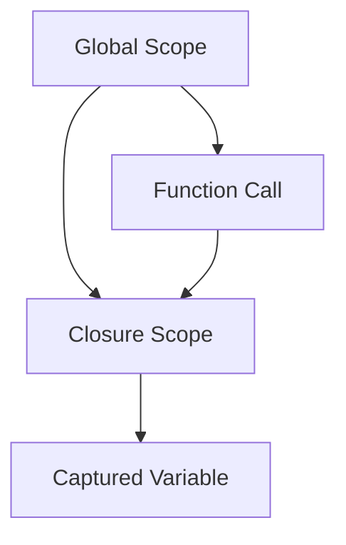

## 2.8 Anonymous Functions and Closures

In the world of PHP programming, anonymous functions and closures are powerful tools that allow developers to write more flexible and efficient code. These concepts are integral to modern PHP development, especially when dealing with callbacks and functional programming paradigms. In this section, we will delve deep into the intricacies of anonymous functions and closures, exploring their syntax, usage, and practical applications in PHP.

### Understanding Anonymous Functions

Anonymous functions, also known as lambda functions, are functions that have no specified name. They are often used as the value of a variable or as a parameter to another function. Anonymous functions are particularly useful for creating quick, one-off functions that are not intended to be reused elsewhere in your code.

#### Syntax of Anonymous Functions

In PHP, anonymous functions are created using the `function` keyword without a name. Here's a simple example:

```php
<?php
// Define an anonymous function and assign it to a variable
$sayHello = function($name) {
    return "Hello, $name!";
};

// Call the anonymous function
echo $sayHello("World"); // Outputs: Hello, World!
?>
```

In this example, we define an anonymous function that takes a single parameter `$name` and returns a greeting string. The function is assigned to the variable `$sayHello`, which can then be used to invoke the function.

#### Use Cases for Anonymous Functions

Anonymous functions are commonly used in scenarios where a quick, inline function is needed. Some typical use cases include:

- **Callbacks**: Passing functions as arguments to other functions, such as array manipulation functions like `array_map`, `array_filter`, and `usort`.
- **Event Handlers**: Defining event-driven code in frameworks or libraries.
- **Functional Programming**: Implementing functional programming techniques, such as higher-order functions.

### Exploring Closures

Closures are a special type of anonymous function that can capture variables from the surrounding scope. This feature allows closures to "remember" the environment in which they were created, making them extremely powerful for certain programming tasks.

#### Understanding Variable Scoping in Closures

A closure can access variables from its parent scope, even after the parent function has finished executing. This is achieved by using the `use` keyword to import variables into the closure's scope.

```php
<?php
$message = "Hello, World!";

// Define a closure that uses the $message variable
$greet = function() use ($message) {
    echo $message;
};

// Call the closure
$greet(); // Outputs: Hello, World!
?>
```

In this example, the closure `$greet` captures the `$message` variable from its surrounding scope. Even though `$message` is defined outside the closure, it is accessible within the closure due to the `use` keyword.

#### Practical Use Cases for Closures

Closures are particularly useful in scenarios where you need to maintain state or context across function calls. Some practical applications include:

- **Encapsulation**: Creating private variables and functions within a closure to encapsulate logic.
- **Memoization**: Caching the results of expensive function calls to improve performance.
- **Currying**: Transforming a function with multiple arguments into a sequence of functions with a single argument.

### Code Examples and Practical Applications

Let's explore some practical examples of how anonymous functions and closures can be used in PHP development.

#### Example 1: Using Anonymous Functions as Callbacks

Anonymous functions are often used as callbacks in PHP, allowing you to pass a function as an argument to another function. Here's an example using `array_map`:

```php
<?php
// Define an array of numbers
$numbers = [1, 2, 3, 4, 5];

// Use array_map with an anonymous function to square each number
$squaredNumbers = array_map(function($number) {
    return $number * $number;
}, $numbers);

print_r($squaredNumbers); // Outputs: Array ( [0] => 1 [1] => 4 [2] => 9 [3] => 16 [4] => 25 )
?>
```

In this example, we use an anonymous function to square each number in the `$numbers` array. The `array_map` function applies the anonymous function to each element of the array, returning a new array of squared numbers.

#### Example 2: Creating Closures with State

Closures can maintain state across multiple calls, making them ideal for scenarios where you need to preserve information between function executions. Here's an example of a closure that acts as a counter:

```php
<?php
// Define a closure that maintains a counter
$counter = function() {
    static $count = 0;
    return ++$count;
};

// Call the closure multiple times
echo $counter(); // Outputs: 1
echo $counter(); // Outputs: 2
echo $counter(); // Outputs: 3
?>
```

In this example, the closure `$counter` maintains a static variable `$count` that is incremented each time the closure is called. This allows the closure to "remember" the count across multiple invocations.

### Visualizing Closures and Variable Scoping

To better understand how closures capture variables from their surrounding scope, let's visualize the concept using a diagram.



In this diagram, the global scope contains a variable that is captured by the closure scope. The closure can access and modify the captured variable, even after the function call has completed.

### Advanced Concepts: Currying and Memoization

Closures can be used to implement advanced programming techniques such as currying and memoization.

#### Currying with Closures

Currying is a technique where a function with multiple arguments is transformed into a sequence of functions, each taking a single argument. Here's an example of currying using closures:

```php
<?php
// Define a curried function using closures
function curry($a) {
    return function($b) use ($a) {
        return function($c) use ($a, $b) {
            return $a + $b + $c;
        };
    };
}

// Create a curried function
$curriedFunction = curry(1)(2);

// Call the curried function with the final argument
echo $curriedFunction(3); // Outputs: 6
?>
```

In this example, the `curry` function returns a sequence of closures, each capturing the arguments passed to it. The final closure computes the sum of all captured arguments.

#### Memoization with Closures

Memoization is a technique used to cache the results of expensive function calls, improving performance by avoiding redundant calculations. Here's an example of memoization using closures:

```php
<?php
// Define a memoized function using closures
function memoize($func) {
    $cache = [];
    return function($arg) use ($func, &$cache) {
        if (!isset($cache[$arg])) {
            $cache[$arg] = $func($arg);
        }
        return $cache[$arg];
    };
}

// Define an expensive function
$expensiveFunction = function($n) {
    sleep(1); // Simulate a time-consuming operation
    return $n * $n;
};

// Create a memoized version of the expensive function
$memoizedFunction = memoize($expensiveFunction);

// Call the memoized function
echo $memoizedFunction(5); // Outputs: 25 (after a delay)
echo $memoizedFunction(5); // Outputs: 25 (immediately)
?>
```

In this example, the `memoize` function returns a closure that caches the results of the `expensiveFunction`. Subsequent calls with the same argument return the cached result, avoiding the delay.

### Try It Yourself: Experimenting with Anonymous Functions and Closures

Now that we've explored the concepts and examples, it's time to try it yourself! Here are some exercises to help you practice using anonymous functions and closures in PHP:

1. **Modify the Callback**: Change the anonymous function in the `array_map` example to cube each number instead of squaring it.
2. **Create a Stateful Closure**: Write a closure that maintains a list of strings and provides a method to add new strings to the list.
3. **Implement Currying**: Create a curried function that multiplies three numbers together, similar to the addition example provided.
4. **Enhance Memoization**: Extend the memoization example to handle functions with multiple arguments.

### Key Takeaways

- **Anonymous Functions**: Useful for creating quick, inline functions for callbacks and event handlers.
- **Closures**: Allow functions to capture and maintain state from their surrounding scope, enabling advanced programming techniques.
- **Practical Applications**: Include callbacks, encapsulation, currying, and memoization.
- **Experimentation**: Practice using anonymous functions and closures to enhance your PHP development skills.

### References and Further Reading

- [PHP Manual: Anonymous Functions](https://www.php.net/manual/en/functions.anonymous.php)
- [PHP Manual: Closures](https://www.php.net/manual/en/class.closure.php)
- [MDN Web Docs: Closures](https://developer.mozilla.org/en-US/docs/Web/JavaScript/Closures) (JavaScript perspective)

Remember, mastering anonymous functions and closures is just the beginning. As you continue to explore PHP, you'll discover even more powerful techniques and patterns to enhance your development skills. Keep experimenting, stay curious, and enjoy the journey!

## Quiz: Anonymous Functions and Closures



### What is an anonymous function in PHP?

- [x] A function without a specified name
- [ ] A function that is always global
- [ ] A function that cannot take parameters
- [ ] A function that is always static

> **Explanation:** An anonymous function is a function without a specified name, often used for quick, one-off tasks.

### How do you capture variables from the surrounding scope in a closure?

- [x] Using the `use` keyword
- [ ] Using the `global` keyword
- [ ] Using the `static` keyword
- [ ] Using the `var` keyword

> **Explanation:** The `use` keyword is used to capture variables from the surrounding scope in a closure.

### Which of the following is a common use case for anonymous functions?

- [x] Callbacks
- [ ] Database connections
- [ ] File handling
- [ ] Network requests

> **Explanation:** Anonymous functions are commonly used as callbacks in PHP.

### What is currying in the context of closures?

- [x] Transforming a function with multiple arguments into a sequence of functions with a single argument
- [ ] Caching the results of a function call
- [ ] Creating a function that captures variables from the global scope
- [ ] Defining a function without parameters

> **Explanation:** Currying involves transforming a function with multiple arguments into a sequence of functions with a single argument.

### What is memoization?

- [x] Caching the results of expensive function calls
- [ ] Creating a function that captures variables from the global scope
- [ ] Defining a function without parameters
- [ ] Transforming a function with multiple arguments into a sequence of functions with a single argument

> **Explanation:** Memoization is a technique used to cache the results of expensive function calls.

### Which keyword is used to define an anonymous function in PHP?

- [x] `function`
- [ ] `anonymous`
- [ ] `closure`
- [ ] `lambda`

> **Explanation:** The `function` keyword is used to define an anonymous function in PHP.

### What does the `use` keyword do in a closure?

- [x] Captures variables from the surrounding scope
- [ ] Declares a global variable
- [ ] Defines a static variable
- [ ] Creates a new function

> **Explanation:** The `use` keyword captures variables from the surrounding scope in a closure.

### Which of the following is NOT a use case for closures?

- [ ] Encapsulation
- [ ] Memoization
- [ ] Currying
- [x] File I/O operations

> **Explanation:** Closures are not typically used for file I/O operations.

### What is the output of the following code?
```php
<?php
$message = "Hello";
$closure = function() use ($message) {
    echo $message;
};
$message = "Goodbye";
$closure();
?>
```

- [x] Hello
- [ ] Goodbye
- [ ] Error
- [ ] Nothing

> **Explanation:** The closure captures the value of `$message` at the time it is defined, which is "Hello".

### True or False: Closures can only capture variables from the global scope.

- [ ] True
- [x] False

> **Explanation:** Closures can capture variables from any surrounding scope, not just the global scope.




