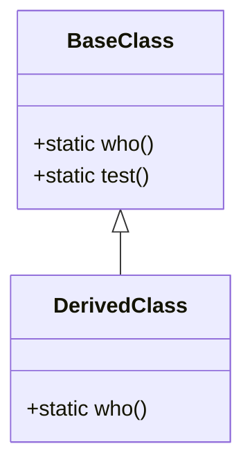

## 2.9 Late Static Binding

In the realm of Object-Oriented Programming (OOP) in PHP, understanding the nuances of static binding is crucial for developers aiming to write flexible and maintainable code. Late Static Binding (LSB) is a powerful feature introduced in PHP 5.3 that allows for more dynamic method resolution. This section will delve into the differences between the `self` and `static` keywords, demonstrate how to use late static binding for method overriding, and explore scenarios where late static binding is essential.

### Understanding Static Binding in PHP

Before diving into late static binding, it's important to grasp the concept of static binding itself. Static binding refers to the process of resolving methods and properties at compile time rather than at runtime. In PHP, this is typically done using the `self` keyword.

#### The `self` Keyword

The `self` keyword in PHP is used to access static properties and methods within the same class. It is resolved at compile time, meaning it does not consider the class hierarchy or inheritance when determining which method or property to access.

```php
class BaseClass {
    public static function who() {
        echo "BaseClass\n";
    }

    public static function test() {
        self::who();
    }
}

class DerivedClass extends BaseClass {
    public static function who() {
        echo "DerivedClass\n";
    }
}

DerivedClass::test(); // Outputs: BaseClass
```

In the example above, `self::who()` in the `BaseClass::test()` method refers to `BaseClass::who()`, not `DerivedClass::who()`, even though `DerivedClass` extends `BaseClass`.

### Introducing Late Static Binding

Late Static Binding addresses the limitation of the `self` keyword by allowing the method to be resolved based on the runtime class. This is achieved using the `static` keyword, which defers the method resolution to runtime, allowing for more flexible and dynamic behavior.

#### The `static` Keyword

The `static` keyword in PHP is used to access static properties and methods, but unlike `self`, it respects the class hierarchy and resolves the method or property based on the runtime class.

```php
class BaseClass {
    public static function who() {
        echo "BaseClass\n";
    }

    public static function test() {
        static::who();
    }
}

class DerivedClass extends BaseClass {
    public static function who() {
        echo "DerivedClass\n";
    }
}

DerivedClass::test(); // Outputs: DerivedClass
```

In this example, `static::who()` in the `BaseClass::test()` method refers to `DerivedClass::who()`, demonstrating the power of late static binding.

### Using Late Static Binding for Method Overriding

Late static binding is particularly useful for method overriding in class hierarchies. It allows derived classes to override methods and have those overridden methods called even when the call originates from the base class.

#### Example: Implementing a Factory Pattern

Consider a scenario where you have a base class implementing a factory method, and you want derived classes to provide their own implementations.

```php
class Product {
    public static function create() {
        return new static();
    }

    public function getType() {
        return "Generic Product";
    }
}

class SpecificProduct extends Product {
    public function getType() {
        return "Specific Product";
    }
}

$product = SpecificProduct::create();
echo $product->getType(); // Outputs: Specific Product
```

In this example, `SpecificProduct::create()` uses late static binding to instantiate `SpecificProduct` instead of `Product`, allowing the `getType()` method to return "Specific Product".

### Scenarios Where Late Static Binding is Essential

Late static binding is essential in scenarios where you need to maintain flexibility and extensibility in your code. Here are some common use cases:

1. **Factory Methods**: When implementing factory methods in a base class, late static binding allows derived classes to be instantiated correctly.

2. **Singleton Pattern**: In singleton implementations, late static binding ensures that the correct class instance is returned, even when the singleton method is called from a derived class.

3. **Active Record Pattern**: In ORM systems using the Active Record pattern, late static binding allows for dynamic method resolution, enabling derived classes to define their own database interactions.

4. **Fluent Interfaces**: When building fluent interfaces, late static binding ensures that method chaining returns the correct class instances.

### Visualizing Late Static Binding

To better understand late static binding, let's visualize the method resolution process using a class diagram.



In this diagram, `BaseClass` and `DerivedClass` both have a `who()` method. The `test()` method in `BaseClass` uses `static::who()`, which resolves to `DerivedClass::who()` when called from `DerivedClass`.

### Key Considerations

- **Performance**: While late static binding offers flexibility, it may introduce a slight performance overhead due to runtime method resolution. Consider this when designing performance-critical applications.

- **Readability**: Overusing late static binding can make code harder to read and understand. Use it judiciously and document your code to maintain clarity.

- **Compatibility**: Late static binding is available from PHP 5.3 onwards. Ensure your application environment supports it before using this feature.

### PHP Unique Features

PHP's implementation of late static binding is unique in its simplicity and ease of use. It allows developers to leverage the power of dynamic method resolution without complex syntax or constructs.

### Differences and Similarities

Late static binding is often confused with dynamic method calls using variable functions or callables. However, late static binding specifically addresses static method resolution in class hierarchies, while dynamic method calls can apply to any callable.

### Try It Yourself

Experiment with the code examples provided by modifying the class hierarchy or adding new methods. Observe how late static binding affects method resolution and behavior.

### References and Links

- [PHP Manual: Late Static Bindings](https://www.php.net/manual/en/language.oop5.late-static-bindings.php)
- [MDN Web Docs: Object-Oriented Programming](https://developer.mozilla.org/en-US/docs/Learn/JavaScript/Objects/Object-oriented_JS)

### Knowledge Check

- What is the primary difference between `self` and `static` keywords in PHP?
- How does late static binding enhance method overriding in class hierarchies?
- In what scenarios is late static binding particularly useful?

### Embrace the Journey

Remember, mastering late static binding is just one step in your PHP journey. As you continue to explore and experiment, you'll uncover more powerful techniques and patterns. Stay curious, keep learning, and enjoy the process!

## Quiz: Late Static Binding



### What is the primary purpose of late static binding in PHP?

- [x] To allow method resolution based on the runtime class
- [ ] To enable dynamic variable binding
- [ ] To improve performance of static methods
- [ ] To simplify class inheritance

> **Explanation:** Late static binding allows methods to be resolved based on the runtime class, providing more flexibility in class hierarchies.

### Which keyword is used for late static binding in PHP?

- [ ] self
- [x] static
- [ ] parent
- [ ] this

> **Explanation:** The `static` keyword is used for late static binding, allowing method resolution to occur at runtime.

### In the context of late static binding, what does the `static` keyword refer to?

- [x] The class that is being called at runtime
- [ ] The parent class
- [ ] The base class
- [ ] The current instance

> **Explanation:** The `static` keyword refers to the class that is being called at runtime, enabling dynamic method resolution.

### How does late static binding differ from using the `self` keyword?

- [x] Late static binding resolves methods at runtime, while `self` resolves at compile time
- [ ] Late static binding is faster than using `self`
- [ ] Late static binding is only available in PHP 7 and above
- [ ] Late static binding does not support inheritance

> **Explanation:** Late static binding resolves methods at runtime, allowing for more dynamic behavior compared to `self`, which resolves at compile time.

### Which of the following patterns can benefit from late static binding?

- [x] Factory Pattern
- [x] Singleton Pattern
- [ ] Observer Pattern
- [ ] Decorator Pattern

> **Explanation:** Both the Factory and Singleton patterns can benefit from late static binding due to their reliance on dynamic method resolution.

### What is a potential drawback of using late static binding?

- [x] It may introduce a slight performance overhead
- [ ] It is not supported in PHP 7
- [ ] It cannot be used with interfaces
- [ ] It makes code less readable

> **Explanation:** Late static binding may introduce a slight performance overhead due to runtime method resolution.

### Can late static binding be used with interfaces?

- [x] Yes
- [ ] No

> **Explanation:** Late static binding can be used with interfaces, as it pertains to method resolution in class hierarchies.

### What is the output of the following code?

```php
class A {
    public static function who() {
        echo "A\n";
    }

    public static function test() {
        static::who();
    }
}

class B extends A {
    public static function who() {
        echo "B\n";
    }
}

B::test();
```

- [ ] A
- [x] B
- [ ] AB
- [ ] BA

> **Explanation:** The output is "B" because `static::who()` resolves to `B::who()` due to late static binding.

### Late static binding is available from which PHP version?

- [x] PHP 5.3
- [ ] PHP 5.0
- [ ] PHP 7.0
- [ ] PHP 8.0

> **Explanation:** Late static binding was introduced in PHP 5.3.

### True or False: Late static binding can be used to resolve instance methods.

- [ ] True
- [x] False

> **Explanation:** Late static binding is specifically for resolving static methods, not instance methods.




