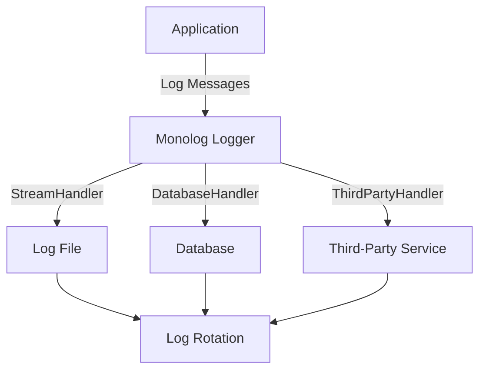

## 20.1 Logging Strategies in PHP

In the world of software development, logging is an essential practice that aids in debugging, auditing, and monitoring application behavior. It provides insights into the application's operations, helping developers identify issues and optimize performance. In PHP, effective logging strategies can significantly enhance the maintainability and reliability of your applications. In this section, we'll explore various logging strategies in PHP, focusing on the Monolog library, the PSR-3 Logger Interface, and best practices for implementing logging in your PHP projects.

### Importance of Logging

Logging serves multiple purposes in software development:

- **Debugging:** Logs provide detailed information about the application's execution flow, helping developers identify and fix bugs.
- **Auditing:** Logs can record user actions and system events, which is crucial for auditing and compliance purposes.
- **Monitoring:** Logs help monitor application performance and detect anomalies, enabling proactive maintenance and optimization.

### Monolog Library

Monolog is a feature-rich logging library for PHP that simplifies the process of logging messages to various handlers, such as files, databases, and third-party services. It supports a wide range of log handlers and processors, making it a versatile choice for PHP developers.

#### Key Features of Monolog

- **Multiple Handlers:** Monolog supports a variety of handlers, including StreamHandler, FirePHPHandler, and more, allowing you to log messages to different destinations.
- **Log Levels:** Monolog supports all standard log levels, such as DEBUG, INFO, WARNING, ERROR, etc., enabling you to categorize log messages based on their severity.
- **Processors:** Monolog allows you to add processors to enrich log messages with additional information, such as user IDs or request data.
- **Integration:** Monolog integrates seamlessly with popular PHP frameworks like Laravel and Symfony.

#### Installing Monolog

To use Monolog in your PHP project, you can install it via Composer:

```bash
composer require monolog/monolog
```

#### Basic Usage of Monolog

Here's a simple example of how to use Monolog to log messages to a file:

```php
<?php

use Monolog\Logger;
use Monolog\Handler\StreamHandler;

// Create a logger instance
$logger = new Logger('my_logger');

// Add a file handler
$logger->pushHandler(new StreamHandler(__DIR__.'/app.log', Logger::DEBUG));

// Log messages
$logger->info('This is an info message');
$logger->error('This is an error message');
```

In this example, we create a logger instance named `my_logger` and add a `StreamHandler` to log messages to a file named `app.log`. We then log messages with different severity levels.

### PSR-3 Logger Interface

The PSR-3 Logger Interface is a standardized logging interface defined by the PHP-FIG (PHP Framework Interoperability Group). It provides a common interface for logging libraries, ensuring consistency and interoperability across different PHP projects.

#### Key Components of PSR-3

- **LoggerInterface:** The core interface that defines methods for logging messages at various levels, such as `emergency()`, `alert()`, `critical()`, `error()`, `warning()`, `notice()`, `info()`, and `debug()`.
- **Log Levels:** PSR-3 defines standard log levels, allowing developers to categorize log messages based on their severity.

#### Implementing PSR-3 Logger Interface

Here's an example of how to implement a custom logger that adheres to the PSR-3 Logger Interface:

```php
<?php

use Psr\Log\LoggerInterface;
use Psr\Log\LogLevel;

class CustomLogger implements LoggerInterface
{
    public function emergency($message, array $context = [])
    {
        $this->log(LogLevel::EMERGENCY, $message, $context);
    }

    public function alert($message, array $context = [])
    {
        $this->log(LogLevel::ALERT, $message, $context);
    }

    public function critical($message, array $context = [])
    {
        $this->log(LogLevel::CRITICAL, $message, $context);
    }

    public function error($message, array $context = [])
    {
        $this->log(LogLevel::ERROR, $message, $context);
    }

    public function warning($message, array $context = [])
    {
        $this->log(LogLevel::WARNING, $message, $context);
    }

    public function notice($message, array $context = [])
    {
        $this->log(LogLevel::NOTICE, $message, $context);
    }

    public function info($message, array $context = [])
    {
        $this->log(LogLevel::INFO, $message, $context);
    }

    public function debug($message, array $context = [])
    {
        $this->log(LogLevel::DEBUG, $message, $context);
    }

    public function log($level, $message, array $context = [])
    {
        // Implement the logging logic here
        echo sprintf("[%s] %s\n", strtoupper($level), $message);
    }
}
```

In this example, we define a `CustomLogger` class that implements the `LoggerInterface`. Each method corresponds to a log level, and the `log()` method handles the actual logging logic.

### Log Levels

Log levels are an essential aspect of logging, allowing developers to categorize log messages based on their severity. The following are the standard log levels defined by PSR-3:

- **Emergency:** System is unusable.
- **Alert:** Action must be taken immediately.
- **Critical:** Critical conditions.
- **Error:** Error conditions.
- **Warning:** Warning conditions.
- **Notice:** Normal but significant condition.
- **Info:** Informational messages.
- **Debug:** Debug-level messages.

### Best Practices for Logging in PHP

To implement effective logging in your PHP applications, consider the following best practices:

1. **Use a Standardized Logging Library:** Utilize a standardized logging library like Monolog to ensure consistency and ease of integration with other tools and frameworks.

2. **Categorize Logs by Severity:** Use log levels to categorize messages based on their severity, making it easier to filter and analyze logs.

3. **Enrich Logs with Contextual Information:** Include contextual information, such as user IDs or request data, to provide more insights into the application's behavior.

4. **Log to Multiple Destinations:** Consider logging messages to multiple destinations, such as files, databases, and third-party services, to ensure redundancy and accessibility.

5. **Implement Log Rotation:** Use log rotation to manage log file sizes and prevent disk space issues.

6. **Secure Sensitive Information:** Avoid logging sensitive information, such as passwords or personal data, to protect user privacy and comply with data protection regulations.

7. **Monitor and Analyze Logs:** Regularly monitor and analyze logs to identify issues, optimize performance, and ensure the application's reliability.

### Visualizing Logging Architecture

To better understand how logging fits into the overall architecture of a PHP application, let's visualize a typical logging setup using a flowchart.



**Description:** This flowchart illustrates a typical logging architecture in a PHP application. The application sends log messages to the Monolog logger, which then routes them to various handlers, such as a log file, database, or third-party service. Log rotation is implemented to manage log file sizes.

### Try It Yourself

To deepen your understanding of logging strategies in PHP, try modifying the code examples provided in this section. Experiment with different log levels, handlers, and processors to see how they affect the logging output. Consider integrating Monolog into a small PHP project and observe how it enhances your ability to debug and monitor the application.

### References and Further Reading

- [Monolog GitHub Repository](https://github.com/Seldaek/monolog)
- [PSR-3: Logger Interface](https://www.php-fig.org/psr/psr-3/)
- [PHP-FIG: PHP Framework Interoperability Group](https://www.php-fig.org/)

### Knowledge Check

- What are the benefits of using a standardized logging library like Monolog?
- How can log levels help in categorizing log messages?
- Why is it important to enrich logs with contextual information?
- What are some best practices for logging in PHP?

### Embrace the Journey

Remember, logging is a powerful tool that can significantly enhance your ability to develop, maintain, and optimize PHP applications. As you continue to explore and implement logging strategies, you'll gain valuable insights into your application's behavior and performance. Keep experimenting, stay curious, and enjoy the journey!

## Quiz: Logging Strategies in PHP



### What is the primary purpose of logging in PHP applications?

- [x] Debugging, auditing, and monitoring application behavior
- [ ] Enhancing user interface design
- [ ] Improving database performance
- [ ] Managing server configurations

> **Explanation:** Logging is primarily used for debugging, auditing, and monitoring application behavior, providing insights into the application's operations.

### Which library is commonly used for logging in PHP?

- [x] Monolog
- [ ] Laravel
- [ ] Symfony
- [ ] PHPUnit

> **Explanation:** Monolog is a feature-rich logging library commonly used in PHP applications.

### What does PSR-3 provide for logging in PHP?

- [x] A standardized logging interface
- [ ] A database management system
- [ ] A user authentication framework
- [ ] A file storage solution

> **Explanation:** PSR-3 provides a standardized logging interface, ensuring consistency and interoperability across PHP projects.

### Which of the following is NOT a standard log level defined by PSR-3?

- [x] Fatal
- [ ] Emergency
- [ ] Warning
- [ ] Debug

> **Explanation:** "Fatal" is not a standard log level defined by PSR-3. The standard log levels include Emergency, Alert, Critical, Error, Warning, Notice, Info, and Debug.

### What is a key feature of Monolog?

- [x] Supports multiple handlers for logging to different destinations
- [ ] Provides a built-in database management system
- [ ] Offers a user interface for log analysis
- [ ] Includes a web server for hosting applications

> **Explanation:** Monolog supports multiple handlers, allowing developers to log messages to different destinations such as files, databases, and third-party services.

### Why is it important to implement log rotation?

- [x] To manage log file sizes and prevent disk space issues
- [ ] To enhance the visual design of logs
- [ ] To improve application security
- [ ] To increase database performance

> **Explanation:** Log rotation helps manage log file sizes and prevents disk space issues by archiving old log files.

### What should be avoided when logging sensitive information?

- [x] Logging passwords or personal data
- [ ] Logging error messages
- [ ] Logging user actions
- [ ] Logging system events

> **Explanation:** Sensitive information, such as passwords or personal data, should be avoided in logs to protect user privacy and comply with data protection regulations.

### How can logs be enriched with contextual information?

- [x] By including user IDs or request data
- [ ] By adding graphical elements
- [ ] By compressing log files
- [ ] By encrypting log messages

> **Explanation:** Logs can be enriched with contextual information, such as user IDs or request data, to provide more insights into the application's behavior.

### What is the benefit of logging to multiple destinations?

- [x] Ensures redundancy and accessibility of logs
- [ ] Increases application speed
- [ ] Enhances user interface design
- [ ] Reduces server load

> **Explanation:** Logging to multiple destinations ensures redundancy and accessibility, making it easier to access and analyze logs.

### True or False: Monolog can only log messages to files.

- [ ] True
- [x] False

> **Explanation:** False. Monolog can log messages to various destinations, including files, databases, and third-party services, through its multiple handlers.




