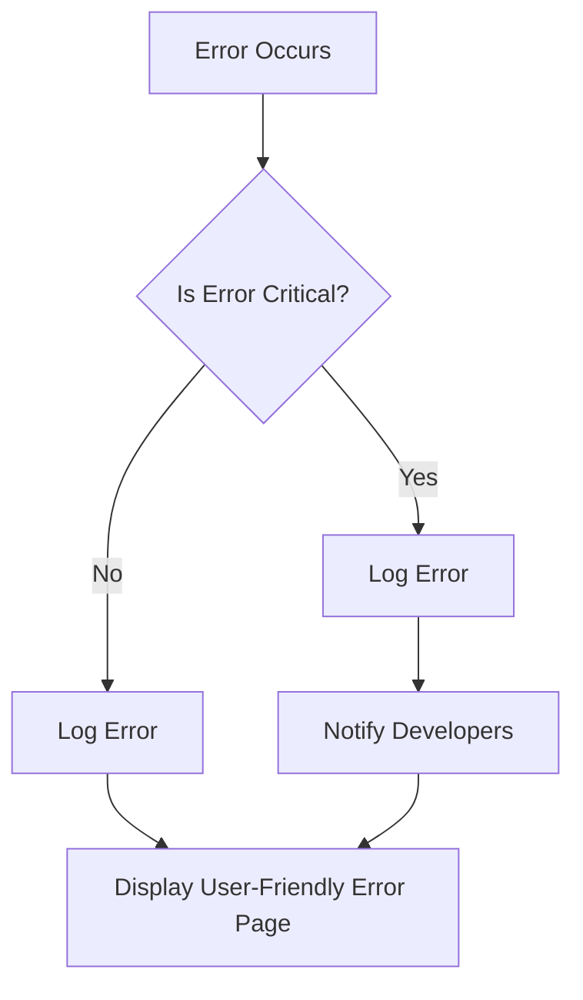

## 20.10 Handling and Reporting Errors in Production

In the world of PHP development, handling and reporting errors effectively in a production environment is crucial for maintaining application stability and ensuring a seamless user experience. This section will guide you through the best practices, configurations, and tools necessary to manage errors in production efficiently.

### Understanding Error Handling in PHP

Before diving into production-specific strategies, let's briefly revisit how PHP handles errors. PHP provides several mechanisms for error handling, including error reporting levels, custom error handlers, and exception handling. Understanding these concepts is essential for configuring error handling in production.

#### Error Reporting Levels

PHP allows you to define the types of errors that should be reported using the `error_reporting()` function or the `error_reporting` directive in the `php.ini` file. Common error levels include:

- **E_ERROR**: Fatal run-time errors.
- **E_WARNING**: Run-time warnings (non-fatal errors).
- **E_NOTICE**: Run-time notices (minor issues).
- **E_ALL**: All errors and warnings.

In a production environment, it's crucial to suppress detailed error messages to prevent sensitive information from being exposed to users.

```php
// Suppress detailed error messages in production
error_reporting(E_ERROR | E_WARNING | E_PARSE);
ini_set('display_errors', 0);
```

### Configuring Error Handling for Production

#### Suppressing Detailed Errors

In production, you should suppress detailed error messages and instead log them for developers to review. This prevents sensitive information from being exposed to end-users and ensures a professional user experience.

```php
// Configure error reporting for production
ini_set('display_errors', '0');
ini_set('log_errors', '1');
ini_set('error_log', '/path/to/error.log');
```

#### User-Friendly Error Pages

When errors occur, it's important to provide users with friendly error pages rather than exposing raw error messages. Custom error pages for common HTTP errors like 404 (Not Found) and 500 (Internal Server Error) can enhance user experience.

```php
// Example of a custom error page for HTTP 500 errors
header("HTTP/1.1 500 Internal Server Error");
include('500.html');
exit();
```

### Leveraging Error Reporting Services

To streamline error tracking and reporting, consider integrating third-party error reporting services. These tools provide real-time error monitoring, alerting, and detailed error reports.

#### Sentry

[Sentry](https://sentry.io/) is a popular error tracking tool that provides real-time error monitoring and alerting. It captures errors and exceptions, aggregates them, and provides insights into their frequency and impact.

```php
// Example of integrating Sentry with PHP
\Sentry\init(['dsn' => 'https://examplePublicKey@o0.ingest.sentry.io/0']);

try {
    // Your code here
} catch (Exception $e) {
    \Sentry\captureException($e);
}
```

#### Bugsnag

[Bugsnag](https://www.bugsnag.com/) is another robust error monitoring tool that provides automatic error detection, alerting, and detailed error reports. It supports various platforms, including PHP.

```php
// Example of integrating Bugsnag with PHP
$bugsnag = Bugsnag\Client::make('your-api-key');
Bugsnag\Handler::register($bugsnag);

try {
    // Your code here
} catch (Exception $e) {
    $bugsnag->notifyException($e);
}
```

### Best Practices for Error Handling in Production

#### Secure Error Logging

Ensure that error logs are stored securely and accessible only to authorized personnel. Use file permissions and access controls to protect log files.

#### Alerting Developers

Set up alerts for critical errors to notify developers promptly. This can be achieved through email notifications, Slack integrations, or other communication channels.

#### Regular Log Review

Regularly review error logs to identify recurring issues and address them proactively. This helps in maintaining application stability and improving user experience.

### Visualizing Error Handling Workflow

To better understand the error handling workflow in production, let's visualize the process using a flowchart.



**Diagram Description:** This flowchart illustrates the error handling workflow in production. When an error occurs, it is logged, and developers are notified if it's critical. A user-friendly error page is displayed to the user.

### Try It Yourself

To deepen your understanding, try modifying the code examples provided. Experiment with different error reporting levels, custom error pages, and integrate an error reporting service of your choice.

### Knowledge Check

- What is the purpose of suppressing detailed error messages in production?
- How can you create a custom error page for HTTP 500 errors?
- What are the benefits of using error reporting services like Sentry or Bugsnag?

### Embrace the Journey

Remember, mastering error handling in production is an ongoing process. As you gain experience, you'll develop more sophisticated strategies for managing errors and ensuring application stability. Keep experimenting, stay curious, and enjoy the journey!

## Quiz: Handling and Reporting Errors in Production



### What is the primary reason for suppressing detailed error messages in production?

- [x] To prevent sensitive information from being exposed to users
- [ ] To improve application performance
- [ ] To reduce server load
- [ ] To simplify code maintenance

> **Explanation:** Suppressing detailed error messages in production prevents sensitive information from being exposed to users, enhancing security and user experience.

### Which PHP function is used to set error reporting levels?

- [x] error_reporting()
- [ ] ini_set()
- [ ] set_error_handler()
- [ ] trigger_error()

> **Explanation:** The `error_reporting()` function is used to set the error reporting level in PHP.

### What is the purpose of a custom error page?

- [x] To provide a user-friendly message when an error occurs
- [ ] To display detailed error information to developers
- [ ] To log errors to a file
- [ ] To improve application performance

> **Explanation:** Custom error pages provide a user-friendly message when an error occurs, enhancing the user experience.

### Which of the following is a popular error tracking tool for PHP?

- [x] Sentry
- [ ] GitHub
- [ ] Jenkins
- [ ] Docker

> **Explanation:** Sentry is a popular error tracking tool that provides real-time error monitoring and alerting for PHP applications.

### What is a key benefit of using error reporting services?

- [x] Real-time error monitoring and alerting
- [ ] Improved application performance
- [ ] Reduced server load
- [ ] Simplified code maintenance

> **Explanation:** Error reporting services provide real-time error monitoring and alerting, helping developers address issues promptly.

### How can you ensure error logs are stored securely?

- [x] Use file permissions and access controls
- [ ] Store logs in a public directory
- [ ] Disable error logging
- [ ] Use plain text files

> **Explanation:** Using file permissions and access controls ensures that error logs are stored securely and accessible only to authorized personnel.

### What should you do when a critical error occurs in production?

- [x] Log the error and notify developers
- [ ] Display detailed error information to users
- [ ] Ignore the error
- [ ] Restart the server

> **Explanation:** When a critical error occurs, it should be logged, and developers should be notified to address the issue promptly.

### Which PHP directive is used to configure error logging?

- [x] log_errors
- [ ] display_errors
- [ ] error_reporting
- [ ] memory_limit

> **Explanation:** The `log_errors` directive is used to configure error logging in PHP.

### What is the purpose of regularly reviewing error logs?

- [x] To identify recurring issues and address them proactively
- [ ] To improve application performance
- [ ] To reduce server load
- [ ] To simplify code maintenance

> **Explanation:** Regularly reviewing error logs helps identify recurring issues and address them proactively, maintaining application stability.

### True or False: Error reporting services can automatically detect and report errors in PHP applications.

- [x] True
- [ ] False

> **Explanation:** Error reporting services like Sentry and Bugsnag can automatically detect and report errors in PHP applications, providing valuable insights for developers.



By following these best practices and leveraging the right tools, you can effectively handle and report errors in production, ensuring a stable and reliable PHP application.
