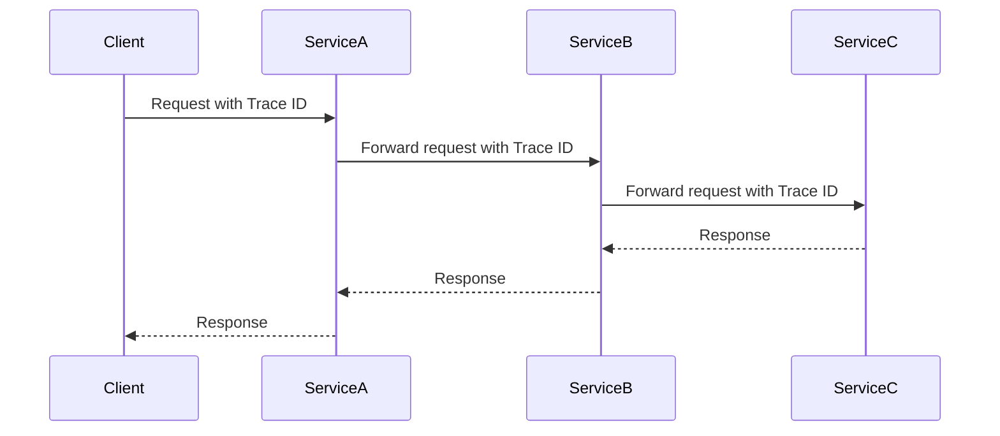

## 20.11 Distributed Tracing

In the realm of modern software architecture, distributed systems and microservices have become the norm. While they offer scalability and flexibility, they also introduce complexity in monitoring and debugging. Distributed tracing emerges as a powerful solution to these challenges, providing insights into the flow of requests across services. In this section, we will delve into the need for distributed tracing, its implementation in PHP, the tools available, and the benefits it brings to your applications.

### Understanding the Need for Distributed Tracing

Distributed tracing is essential for monitoring requests that span multiple services in a microservices architecture. As applications grow in complexity, understanding the flow of requests and diagnosing issues becomes increasingly difficult. Distributed tracing helps by:

- **Providing End-to-End Visibility:** It allows developers to see the entire journey of a request, from the initial entry point to the final response, across all services involved.
- **Diagnosing Latency Issues:** By breaking down the request path, distributed tracing helps identify bottlenecks and latency issues within the system.
- **Understanding Request Flows:** It offers a clear picture of how requests are processed, which services are involved, and how they interact with each other.

### Implementing Distributed Tracing in PHP

Implementing distributed tracing involves several key steps, including generating unique identifiers for requests, propagating these identifiers across services, and collecting trace data. Let's explore these steps in detail.

#### Generating Unique Identifiers

To track a request across multiple services, each request must have a unique identifier, often referred to as a trace ID. This ID is generated at the entry point of the request and is propagated through all services involved in processing the request.

```php
<?php

function generateTraceId() {
    return bin2hex(random_bytes(16)); // Generates a 32-character hexadecimal string
}

$traceId = generateTraceId();
echo "Trace ID: $traceId";
```

#### Propagating Identifiers

Once a trace ID is generated, it must be passed along with the request as it moves through different services. This is typically done using HTTP headers.

```php
<?php

function propagateTraceId($traceId, $url) {
    $options = [
        'http' => [
            'header' => "X-Trace-Id: $traceId\r\n"
        ]
    ];
    $context = stream_context_create($options);
    return file_get_contents($url, false, $context);
}

$traceId = generateTraceId();
$response = propagateTraceId($traceId, 'http://example.com/service');
```

#### Collecting Trace Data

Each service involved in processing a request should log trace data, including the trace ID, service name, operation name, and timestamps. This data is then sent to a centralized tracing system for analysis.

```php
<?php

function logTraceData($traceId, $serviceName, $operationName) {
    $timestamp = microtime(true);
    $logEntry = [
        'trace_id' => $traceId,
        'service' => $serviceName,
        'operation' => $operationName,
        'timestamp' => $timestamp
    ];
    // Send $logEntry to a tracing system like Zipkin or Jaeger
}

logTraceData($traceId, 'UserService', 'getUserDetails');
```

### Tools for Distributed Tracing

Several tools are available to facilitate distributed tracing, each with its own features and integrations. Here, we will discuss some popular options.

#### Zipkin

[Zipkin](https://zipkin.io/) is an open-source distributed tracing system that helps gather timing data needed to troubleshoot latency problems in microservice architectures. It provides a web-based UI for visualizing traces and supports various backends for storing trace data.

- **Integration with PHP:** Zipkin offers libraries and extensions for PHP to simplify trace data collection and propagation.
- **Visualization:** The Zipkin UI allows developers to view traces, identify bottlenecks, and analyze request flows.

#### Jaeger

Jaeger is another open-source tracing system developed by Uber Technologies. It is designed for monitoring and troubleshooting microservices-based distributed systems.

- **Features:** Jaeger supports distributed context propagation, distributed transaction monitoring, root cause analysis, and service dependency analysis.
- **PHP Support:** Jaeger provides client libraries for PHP, enabling easy integration with existing applications.

#### OpenTelemetry

OpenTelemetry is a vendor-neutral open-source project that provides APIs and instrumentation for distributed tracing and metrics. It aims to standardize the collection of telemetry data across different platforms and languages.

- **PHP SDK:** OpenTelemetry offers a PHP SDK for instrumenting applications and collecting trace data.
- **Interoperability:** It supports exporting trace data to various backends, including Zipkin and Jaeger.

### Benefits of Distributed Tracing

Implementing distributed tracing in your PHP applications offers several benefits:

- **Improved Observability:** Gain insights into the performance and behavior of your microservices, making it easier to identify and resolve issues.
- **Faster Debugging:** Quickly pinpoint the source of latency or errors by analyzing trace data.
- **Enhanced Performance:** Optimize service interactions and resource usage by understanding request flows and dependencies.
- **Better User Experience:** Reduce downtime and improve response times by proactively monitoring and addressing performance issues.

### Visualizing Distributed Tracing

To better understand how distributed tracing works, let's visualize the flow of a request through a microservices architecture using a sequence diagram.



**Diagram Description:** This sequence diagram illustrates a request originating from a client and passing through three services (ServiceA, ServiceB, and ServiceC). The trace ID is propagated with the request, allowing each service to log trace data and contribute to the overall trace.

### Try It Yourself

To deepen your understanding of distributed tracing, try modifying the code examples provided:

- **Experiment with Different Trace ID Formats:** Change the trace ID generation logic to use different formats or lengths.
- **Implement a Simple Tracing System:** Create a basic tracing system that logs trace data to a file or database.
- **Integrate with a Tracing Tool:** Set up Zipkin or Jaeger and integrate it with your PHP application to visualize traces.

### Knowledge Check

Before moving on, let's reinforce what we've learned:

- **What is the primary purpose of distributed tracing?**
- **How do you generate and propagate trace IDs in PHP?**
- **Name two popular tools for distributed tracing.**
- **What are the benefits of implementing distributed tracing in a microservices architecture?**

### Conclusion

Distributed tracing is a vital tool for monitoring and optimizing microservices-based applications. By providing end-to-end visibility into request flows, it enables developers to diagnose issues, improve performance, and enhance user experiences. As you continue your journey in PHP development, consider integrating distributed tracing into your applications to unlock these benefits.

## Quiz: Distributed Tracing



### What is the primary purpose of distributed tracing?

- [x] To monitor requests across microservices
- [ ] To generate unique identifiers for requests
- [ ] To store trace data in a database
- [ ] To replace traditional logging systems

> **Explanation:** Distributed tracing is primarily used to monitor requests across microservices, providing visibility into the flow of requests and helping diagnose issues.

### Which of the following is a tool used for distributed tracing?

- [x] Zipkin
- [ ] PHPUnit
- [ ] Composer
- [ ] Laravel

> **Explanation:** Zipkin is a popular tool for distributed tracing, providing features for collecting and visualizing trace data.

### How is a trace ID typically propagated across services?

- [x] Using HTTP headers
- [ ] Through URL parameters
- [ ] Via cookies
- [ ] By modifying the request body

> **Explanation:** Trace IDs are typically propagated across services using HTTP headers, ensuring they are included in each request.

### What is a key benefit of distributed tracing?

- [x] Diagnosing latency issues
- [ ] Reducing code complexity
- [ ] Enhancing database performance
- [ ] Simplifying user authentication

> **Explanation:** Distributed tracing helps diagnose latency issues by providing insights into the flow and timing of requests across services.

### Which open-source project aims to standardize telemetry data collection?

- [x] OpenTelemetry
- [ ] PHPUnit
- [ ] Symfony
- [ ] Docker

> **Explanation:** OpenTelemetry is an open-source project that aims to standardize the collection of telemetry data, including distributed tracing and metrics.

### What does a sequence diagram in distributed tracing illustrate?

- [x] The flow of a request through services
- [ ] The structure of a database schema
- [ ] The layout of a user interface
- [ ] The configuration of a server

> **Explanation:** A sequence diagram in distributed tracing illustrates the flow of a request through different services, showing how trace IDs are propagated.

### Which PHP function can be used to generate a random trace ID?

- [x] `random_bytes()`
- [ ] `md5()`
- [ ] `hash()`
- [ ] `uniqid()`

> **Explanation:** The `random_bytes()` function can be used to generate a random trace ID, providing a secure and unique identifier.

### What is a common format for trace IDs?

- [x] Hexadecimal string
- [ ] Base64 encoded string
- [ ] JSON object
- [ ] XML document

> **Explanation:** Trace IDs are commonly formatted as hexadecimal strings, which are easy to generate and propagate.

### Which tool provides a web-based UI for visualizing traces?

- [x] Zipkin
- [ ] PHPUnit
- [ ] Composer
- [ ] Laravel

> **Explanation:** Zipkin provides a web-based UI for visualizing traces, helping developers analyze request flows and identify issues.

### True or False: Distributed tracing can replace traditional logging systems.

- [ ] True
- [x] False

> **Explanation:** False. Distributed tracing complements traditional logging systems by providing additional insights into request flows and service interactions.



Remember, distributed tracing is just one piece of the observability puzzle. As you continue to build and maintain complex systems, keep exploring new tools and techniques to enhance your application's performance and reliability.
