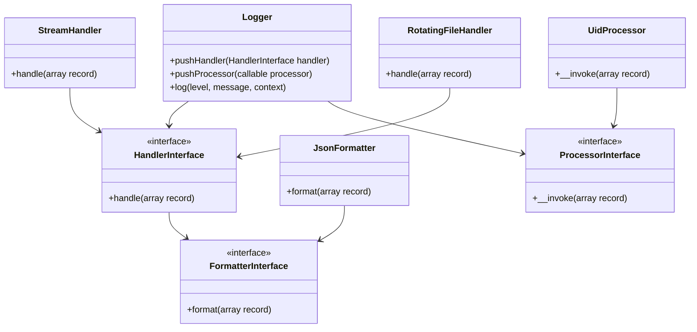

## 20.2 Using Monolog and PSR-3 Logger Interface

In the world of PHP development, efficient logging is crucial for monitoring application behavior, diagnosing issues, and ensuring smooth operation. Monolog, a popular logging library, combined with the PSR-3 Logger Interface, provides a robust solution for logging in PHP applications. In this section, we will explore how to integrate Monolog with PSR-3, configure various handlers, and leverage the benefits of a standardized logging interface.

### Introduction to Monolog and PSR-3

Monolog is a comprehensive logging library for PHP that allows developers to send logs to various destinations, such as files, databases, and remote services. It supports multiple handlers, formatters, and processors, making it highly flexible and extensible.

PSR-3, the PHP Standard Recommendation for logging, defines a common interface for logging libraries. By adhering to this standard, developers can easily switch between different logging implementations without changing their application code.

### Integrating Monolog

#### Step 1: Install Monolog via Composer

To get started with Monolog, you need to install it using Composer, the dependency manager for PHP. Run the following command in your project's root directory:

```bash
composer require monolog/monolog
```

This command will add Monolog to your project's dependencies and create an autoload file for easy inclusion in your PHP scripts.

#### Step 2: Basic Configuration

Once Monolog is installed, you can create a logger instance and configure it with handlers. Here's a simple example of setting up a logger that writes logs to a file:

```php
<?php

require 'vendor/autoload.php';

use Monolog\Logger;
use Monolog\Handler\StreamHandler;

// Create a logger instance
$logger = new Logger('my_logger');

// Add a handler to write logs to a file
$logger->pushHandler(new StreamHandler(__DIR__.'/app.log', Logger::DEBUG));

// Log some messages
$logger->info('This is an informational message.');
$logger->warning('This is a warning message.');
$logger->error('This is an error message.');
```

In this example, we create a `Logger` instance named `my_logger` and add a `StreamHandler` to write logs to `app.log`. The `Logger::DEBUG` level ensures that all log levels (debug and above) are recorded.

#### Step 3: Configuring Handlers

Monolog supports various handlers for different logging needs. Here are some commonly used handlers:

- **StreamHandler**: Writes logs to a file or any stream resource.
- **RotatingFileHandler**: Rotates log files based on size or date.
- **FirePHPHandler**: Sends logs to the FirePHP extension for debugging.
- **BrowserConsoleHandler**: Outputs logs to the browser's console.

Let's configure a `RotatingFileHandler` to manage log files efficiently:

```php
<?php

use Monolog\Handler\RotatingFileHandler;

// Add a rotating file handler
$logger->pushHandler(new RotatingFileHandler(__DIR__.'/app.log', 7, Logger::INFO));

// Log a message
$logger->info('This log will be rotated daily.');
```

In this setup, the `RotatingFileHandler` creates a new log file each day and retains the last 7 log files.

### Implementing PSR-3

#### Understanding the PSR-3 Logger Interface

PSR-3 defines a standard interface for logging libraries, allowing developers to switch between different implementations without modifying their code. The interface includes methods for logging messages at various levels, such as `emergency`, `alert`, `critical`, `error`, `warning`, `notice`, `info`, and `debug`.

Here's a basic example of using the PSR-3 interface with Monolog:

```php
<?php

use Psr\Log\LoggerInterface;

function logMessage(LoggerInterface $logger, $message)
{
    $logger->info($message);
}

// Use the Monolog logger
logMessage($logger, 'Logging with PSR-3 interface.');
```

In this example, the `logMessage` function accepts any logger that implements the `LoggerInterface`, making it interchangeable with other PSR-3 compliant loggers.

#### Benefits of Using PSR-3

- **Interchangeability**: Easily switch between different logging libraries without changing application code.
- **Standardization**: Consistent logging interface across different projects and libraries.
- **Flexibility**: Integrate with various logging backends and services.

### Advanced Monolog Features

#### Using Formatters and Processors

Monolog allows you to customize log messages using formatters and processors. Formatters define the structure of log messages, while processors add additional information to logs.

Here's an example of using a formatter to customize log output:

```php
<?php

use Monolog\Formatter\JsonFormatter;

// Set a JSON formatter for the handler
$handler = new StreamHandler(__DIR__.'/app.json', Logger::DEBUG);
$handler->setFormatter(new JsonFormatter());

$logger->pushHandler($handler);

// Log a message
$logger->info('This log is in JSON format.');
```

In this example, we use the `JsonFormatter` to output logs in JSON format, making them easier to parse and analyze.

#### Leveraging Processors

Processors can add contextual information to log messages, such as user IDs or request data. Here's how to use a processor to add a unique identifier to each log entry:

```php
<?php

use Monolog\Processor\UidProcessor;

// Add a UID processor
$logger->pushProcessor(new UidProcessor());

// Log a message
$logger->info('This log has a unique identifier.');
```

The `UidProcessor` adds a unique identifier to each log entry, which can be useful for tracking specific requests or sessions.

### Visualizing Monolog's Architecture

To better understand how Monolog works, let's visualize its architecture using a Mermaid.js class diagram:



This diagram illustrates the relationships between the `Logger`, handlers, formatters, and processors in Monolog.

### Try It Yourself

Now that we've covered the basics of Monolog and PSR-3, it's time to experiment with the code. Try modifying the examples to:

- Change the log level to `Logger::WARNING` and observe the output.
- Add a custom processor that appends the current timestamp to each log message.
- Use a different formatter, such as `LineFormatter`, to customize the log output format.

### References and Further Reading

- [Monolog Documentation](https://github.com/Seldaek/monolog)
- [PSR-3: Logger Interface](https://www.php-fig.org/psr/psr-3/)
- [Composer: Dependency Manager for PHP](https://getcomposer.org/)

### Knowledge Check

- What is the primary purpose of Monolog in PHP applications?
- How does PSR-3 enhance the flexibility of logging implementations?
- What are the benefits of using formatters and processors in Monolog?

### Conclusion

In this section, we've explored the integration of Monolog and the PSR-3 Logger Interface in PHP. By leveraging these tools, you can create a flexible and standardized logging system for your applications. Remember, logging is an essential part of application development and maintenance, helping you monitor performance, diagnose issues, and ensure reliability.

## Quiz: Using Monolog and PSR-3 Logger Interface



### What is the primary purpose of Monolog in PHP applications?

- [x] To provide a flexible and extensible logging system
- [ ] To manage database connections
- [ ] To handle user authentication
- [ ] To optimize application performance

> **Explanation:** Monolog is a logging library that provides a flexible and extensible system for logging messages in PHP applications.

### How does PSR-3 enhance the flexibility of logging implementations?

- [x] By defining a common interface for logging libraries
- [ ] By providing a built-in logging database
- [ ] By enforcing strict logging formats
- [ ] By integrating with all PHP frameworks

> **Explanation:** PSR-3 defines a common interface for logging libraries, allowing developers to switch between different implementations without changing their application code.

### Which Monolog handler would you use to write logs to a file?

- [x] StreamHandler
- [ ] FirePHPHandler
- [ ] BrowserConsoleHandler
- [ ] NullHandler

> **Explanation:** The `StreamHandler` is used to write logs to a file or any stream resource.

### What is the role of a formatter in Monolog?

- [x] To define the structure of log messages
- [ ] To handle log rotation
- [ ] To send logs to remote services
- [ ] To manage user sessions

> **Explanation:** A formatter in Monolog defines the structure of log messages, allowing customization of the log output format.

### Which of the following is a benefit of using processors in Monolog?

- [x] Adding contextual information to log messages
- [ ] Rotating log files based on size
- [ ] Sending logs to the browser console
- [ ] Encrypting log messages

> **Explanation:** Processors in Monolog add contextual information to log messages, such as user IDs or request data.

### What command is used to install Monolog via Composer?

- [x] composer require monolog/monolog
- [ ] composer install monolog
- [ ] composer add monolog
- [ ] composer update monolog

> **Explanation:** The command `composer require monolog/monolog` is used to install Monolog via Composer.

### How can you customize the output format of log messages in Monolog?

- [x] By using a formatter
- [ ] By using a handler
- [ ] By using a processor
- [ ] By using a logger

> **Explanation:** You can customize the output format of log messages in Monolog by using a formatter.

### What is the purpose of the PSR-3 Logger Interface?

- [x] To provide a standard interface for logging libraries
- [ ] To manage database transactions
- [ ] To handle user authentication
- [ ] To optimize application performance

> **Explanation:** The PSR-3 Logger Interface provides a standard interface for logging libraries, ensuring consistency and interchangeability.

### Which Monolog handler rotates log files based on size or date?

- [x] RotatingFileHandler
- [ ] StreamHandler
- [ ] FirePHPHandler
- [ ] NullHandler

> **Explanation:** The `RotatingFileHandler` rotates log files based on size or date, managing log file storage efficiently.

### True or False: Monolog can only write logs to files.

- [ ] True
- [x] False

> **Explanation:** False. Monolog can write logs to various destinations, including files, databases, and remote services, using different handlers.



Remember, this is just the beginning. As you progress, you'll build more complex and interactive logging systems. Keep experimenting, stay curious, and enjoy the journey!
