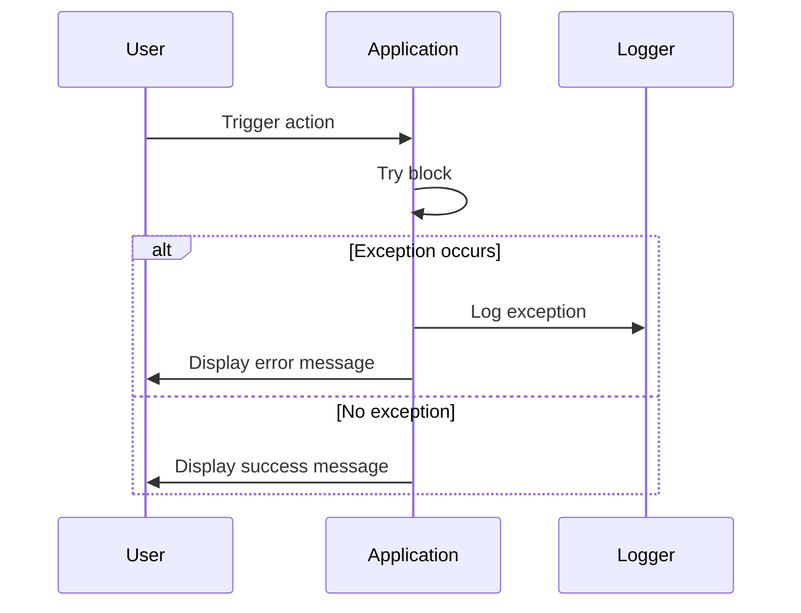

## 20.3 Exception Handling and Error Logging

In the world of PHP development, managing errors and exceptions effectively is crucial for building robust and maintainable applications. This section delves into the intricacies of exception handling and error logging, providing you with the tools and knowledge to handle unexpected situations gracefully.

### Introduction to Error Handling in PHP

Error handling in PHP is a fundamental aspect of building reliable applications. PHP provides several mechanisms to manage errors, ranging from simple error reporting to advanced exception handling. Understanding these mechanisms is essential for any PHP developer aiming to create resilient applications.

#### Setting Error Reporting Levels

PHP allows developers to control which errors are reported and how they are handled. This is done using the `error_reporting()` function, which sets the error reporting level. The error reporting level determines which types of errors are displayed or logged.

```php
<?php
// Set error reporting to report all errors except notices
error_reporting(E_ALL & ~E_NOTICE);
?>
```

In the example above, all errors except notices are reported. This is useful in a production environment where you want to be informed of critical issues without being overwhelmed by minor notices.

#### Using Custom Error Handlers

PHP provides the `set_error_handler()` function to define custom error handling logic. This function allows you to specify a callback function that will be executed whenever an error occurs.

```php
<?php
function customErrorHandler($errno, $errstr, $errfile, $errline) {
    echo "Error [$errno]: $errstr in $errfile on line $errline\n";
    // Log the error or take other actions
}

// Set the custom error handler
set_error_handler("customErrorHandler");

// Trigger an error
echo $undefinedVariable;
?>
```

In this example, a custom error handler is defined to display error details. This approach provides flexibility in how errors are managed, allowing you to log them, display user-friendly messages, or even send notifications.

### Exception Handling Best Practices

Exceptions in PHP provide a structured way to handle errors that occur during the execution of a program. By using exceptions, you can separate error handling logic from regular code, making your applications more maintainable and robust.

#### Using Try-Catch Blocks

The `try-catch` construct is the cornerstone of exception handling in PHP. It allows you to catch exceptions and handle them gracefully without terminating the script.

```php
<?php
try {
    // Code that may throw an exception
    if (!file_exists("example.txt")) {
        throw new Exception("File not found.");
    }
} catch (Exception $e) {
    echo "Caught exception: " . $e->getMessage();
}
?>
```

In this example, an exception is thrown if a file does not exist. The `catch` block captures the exception and displays an error message. This approach ensures that the application can continue running even if an error occurs.

#### Logging Unexpected Exceptions

While `try-catch` blocks are effective for handling expected exceptions, it's equally important to log unexpected exceptions. Logging provides a record of errors that can be used for debugging and improving the application.

```php
<?php
function logException(Exception $e) {
    error_log($e->getMessage(), 3, "errors.log");
}

try {
    // Code that may throw an exception
    throw new Exception("Unexpected error occurred.");
} catch (Exception $e) {
    logException($e);
    echo "An error occurred. Please try again later.";
}
?>
```

In this example, unexpected exceptions are logged to a file named `errors.log`. This practice is crucial for identifying and resolving issues that may not be immediately apparent.

### Understanding PHP Error Levels

PHP categorizes errors into different levels, each representing a specific type of issue. Understanding these levels helps in configuring error reporting and handling errors appropriately.

#### Common Error Levels

- **E_ERROR**: Fatal runtime errors that halt script execution.
- **E_WARNING**: Non-fatal runtime errors that do not stop script execution.
- **E_NOTICE**: Minor issues that may indicate a potential problem.
- **E_DEPRECATED**: Warnings about deprecated code that may be removed in future PHP versions.

```php
<?php
// Example of triggering different error levels
trigger_error("This is a notice.", E_NOTICE);
trigger_error("This is a warning.", E_WARNING);
trigger_error("This is a fatal error.", E_USER_ERROR);
?>
```

In this example, different error levels are triggered using the `trigger_error()` function. Understanding these levels allows you to tailor your error handling strategy to the specific needs of your application.

### Advanced Exception Handling Techniques

As you become more proficient in PHP, you'll encounter scenarios that require advanced exception handling techniques. These techniques provide greater control over error management and enhance the robustness of your applications.

#### Custom Exception Classes

Creating custom exception classes allows you to define specific error types and handle them accordingly. This approach is particularly useful in large applications with complex error handling requirements.

```php
<?php
class FileNotFoundException extends Exception {}

try {
    // Code that may throw a custom exception
    if (!file_exists("example.txt")) {
        throw new FileNotFoundException("File not found.");
    }
} catch (FileNotFoundException $e) {
    echo "Custom exception caught: " . $e->getMessage();
}
?>
```

In this example, a custom exception class `FileNotFoundException` is defined. This allows for more precise error handling and improves code readability.

#### Exception Chaining

Exception chaining is a technique where one exception is used to provide additional context for another exception. This is useful for debugging and understanding the root cause of an error.

```php
<?php
try {
    try {
        // Code that may throw an exception
        throw new Exception("Inner exception.");
    } catch (Exception $e) {
        throw new Exception("Outer exception.", 0, $e);
    }
} catch (Exception $e) {
    echo "Exception: " . $e->getMessage() . "\n";
    echo "Previous: " . $e->getPrevious()->getMessage();
}
?>
```

In this example, an outer exception is thrown with an inner exception as its previous exception. This provides a clear trace of the error's origin and context.

### Implementing Error Logging

Error logging is a critical component of any error handling strategy. It involves recording errors and exceptions to a persistent storage medium, such as a file or a database, for later analysis.

#### Using the Error Log

PHP's built-in `error_log()` function is a simple yet powerful tool for logging errors. It allows you to write error messages to a specified file or send them to a remote logging server.

```php
<?php
// Log an error message to a file
error_log("This is an error message.", 3, "errors.log");
?>
```

In this example, an error message is logged to a file named `errors.log`. This approach is straightforward and effective for small to medium-sized applications.

#### Integrating with Logging Libraries

For larger applications, integrating with a logging library such as Monolog provides advanced logging capabilities. Monolog supports various logging handlers, including files, databases, and remote servers.

```php
<?php
require 'vendor/autoload.php';

use Monolog\Logger;
use Monolog\Handler\StreamHandler;

// Create a logger instance
$log = new Logger('name');
$log->pushHandler(new StreamHandler('path/to/your.log', Logger::WARNING));

// Add records to the log
$log->warning('This is a warning.');
$log->error('This is an error.');
?>
```

In this example, Monolog is used to log warning and error messages to a specified file. This approach provides flexibility and scalability, making it suitable for enterprise-level applications.

### Visualizing Error Handling Flow

To better understand the flow of error handling in PHP, let's visualize the process using a sequence diagram.



This diagram illustrates the typical flow of error handling in a PHP application. When an action is triggered, the application attempts to execute the code within a `try` block. If an exception occurs, it is logged, and an error message is displayed to the user. Otherwise, a success message is shown.

### Best Practices for Exception Handling and Error Logging

To ensure effective error management in your PHP applications, consider the following best practices:

- **Use Specific Exceptions**: Define custom exception classes for specific error types to improve code clarity and error handling precision.
- **Log All Errors**: Ensure that all errors and exceptions are logged for future analysis and debugging.
- **Avoid Suppressing Errors**: Do not use the `@` operator to suppress errors, as it can hide critical issues.
- **Use a Centralized Logging System**: For large applications, use a centralized logging system to aggregate and analyze logs from multiple sources.
- **Regularly Review Logs**: Periodically review error logs to identify and address recurring issues.

### Try It Yourself

To reinforce your understanding of exception handling and error logging, try modifying the code examples provided. Experiment with different error levels, custom exception classes, and logging strategies. This hands-on approach will deepen your knowledge and prepare you for real-world scenarios.

### Conclusion

Mastering exception handling and error logging in PHP is essential for building robust and maintainable applications. By understanding error levels, using `try-catch` blocks, and implementing effective logging strategies, you can ensure that your applications handle errors gracefully and provide valuable insights for debugging and improvement.

Remember, this is just the beginning. As you progress, you'll encounter more complex error handling scenarios. Keep experimenting, stay curious, and enjoy the journey!

## Quiz: Exception Handling and Error Logging



### What function is used to set custom error handlers in PHP?

- [x] `set_error_handler()`
- [ ] `error_reporting()`
- [ ] `trigger_error()`
- [ ] `log_error()`

> **Explanation:** `set_error_handler()` is used to define a custom error handling function in PHP.

### Which error level represents fatal runtime errors that halt script execution?

- [x] `E_ERROR`
- [ ] `E_WARNING`
- [ ] `E_NOTICE`
- [ ] `E_DEPRECATED`

> **Explanation:** `E_ERROR` represents fatal runtime errors that stop the script execution immediately.

### What is the purpose of using try-catch blocks in PHP?

- [x] To handle exceptions gracefully
- [ ] To suppress errors
- [ ] To log errors
- [ ] To trigger errors

> **Explanation:** Try-catch blocks are used to catch and handle exceptions without terminating the script.

### Which function is used to log error messages to a file in PHP?

- [x] `error_log()`
- [ ] `log_error()`
- [ ] `write_log()`
- [ ] `file_put_contents()`

> **Explanation:** `error_log()` is used to log error messages to a specified file or remote server.

### What is the benefit of using custom exception classes?

- [x] Improved code clarity
- [x] Specific error handling
- [ ] Suppressing errors
- [ ] Faster execution

> **Explanation:** Custom exception classes allow for more precise error handling and improve code readability.

### Which library is commonly used for advanced logging in PHP?

- [x] Monolog
- [ ] Log4j
- [ ] Psr\Log
- [ ] LoggerPHP

> **Explanation:** Monolog is a popular logging library in PHP that provides advanced logging capabilities.

### What should you avoid when handling errors in PHP?

- [x] Suppressing errors with `@`
- [ ] Logging errors
- [ ] Using try-catch blocks
- [ ] Reviewing error logs

> **Explanation:** Suppressing errors with the `@` operator can hide critical issues and should be avoided.

### What is exception chaining used for?

- [x] Providing additional context for exceptions
- [ ] Suppressing exceptions
- [ ] Logging exceptions
- [ ] Triggering exceptions

> **Explanation:** Exception chaining is used to provide additional context and trace the origin of an error.

### Which error level indicates deprecated code?

- [x] `E_DEPRECATED`
- [ ] `E_NOTICE`
- [ ] `E_WARNING`
- [ ] `E_ERROR`

> **Explanation:** `E_DEPRECATED` indicates that a feature is deprecated and may be removed in future PHP versions.

### True or False: Logging unexpected exceptions is unnecessary if you use try-catch blocks.

- [ ] True
- [x] False

> **Explanation:** Logging unexpected exceptions is crucial for identifying and resolving issues that may not be immediately apparent, even when using try-catch blocks.


