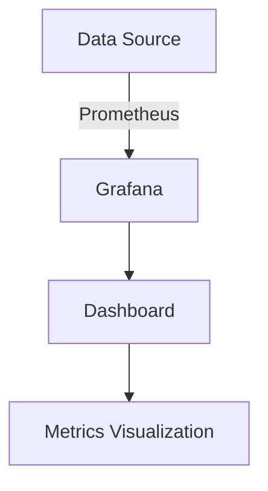

## 20.4 Monitoring Application Health

In the ever-evolving landscape of software development, ensuring the health of your PHP applications is paramount. Monitoring application health involves a combination of strategies, tools, and best practices that allow developers to maintain robust, high-performing, and reliable applications. In this section, we will delve into the various aspects of monitoring application health, including health checks, tools, and metrics collection.

### Introduction to Application Health Monitoring

Monitoring application health is a proactive approach to maintaining the stability and performance of your software. It involves continuously assessing various aspects of your application to ensure it is functioning as expected. This process helps in identifying potential issues before they escalate into critical problems, thereby minimizing downtime and improving user experience.

#### Key Concepts

- **Health Checks:** Automated processes that verify the operational status of an application.
- **Metrics Collection:** Gathering data on various performance indicators such as response time, error rates, and resource utilization.
- **Monitoring Tools:** Software solutions that facilitate the tracking and analysis of application health metrics.

### Health Checks

Health checks are an integral part of monitoring application health. They are automated scripts or endpoints that periodically verify the status of different components of your application. Health checks can be categorized into several types:

#### Types of Health Checks

1. **HTTP Health Checks:** These checks involve sending HTTP requests to specific endpoints to verify the application's availability and response time. They are commonly used for web applications.

2. **Database Health Checks:** These checks ensure that the database is accessible and performing optimally. They may involve running simple queries to verify connectivity and response time.

3. **Service Health Checks:** These checks verify the status of various services or microservices within your application. They ensure that each service is operational and communicating effectively with others.

4. **Resource Health Checks:** These checks monitor the utilization of system resources such as CPU, memory, and disk space to ensure they are within acceptable limits.

#### Implementing Health Checks in PHP

To implement health checks in PHP, you can create a dedicated endpoint that performs various checks and returns a status report. Here's a simple example:

```php
<?php
// health_check.php

header('Content-Type: application/json');

$status = [
    'database' => checkDatabaseConnection(),
    'services' => checkServices(),
    'resources' => checkResources(),
];

echo json_encode($status);

function checkDatabaseConnection() {
    // Simulate a database connection check
    try {
        $pdo = new PDO('mysql:host=localhost;dbname=test', 'user', 'password');
        return ['status' => 'ok'];
    } catch (PDOException $e) {
        return ['status' => 'error', 'message' => $e->getMessage()];
    }
}

function checkServices() {
    // Simulate a service check
    return ['status' => 'ok'];
}

function checkResources() {
    // Simulate a resource check
    $cpuUsage = sys_getloadavg();
    return ['status' => 'ok', 'cpu' => $cpuUsage[0]];
}
?>
```

### Tools for Monitoring Application Health

There are numerous tools available for monitoring the health of PHP applications. These tools provide comprehensive solutions for tracking performance metrics, setting up alerts, and visualizing data.

#### PHP Server Monitor

[PHP Server Monitor](https://www.phpservermonitor.org/) is a popular tool for monitoring the availability and response time of your servers and websites. It allows you to set up HTTP and TCP checks, receive notifications via email or SMS, and view detailed logs and graphs.

#### New Relic

New Relic is a powerful application performance monitoring (APM) tool that provides real-time insights into your application's performance. It offers features such as transaction tracing, error analysis, and infrastructure monitoring.

#### Nagios

Nagios is an open-source monitoring system that provides comprehensive monitoring of applications, systems, and networks. It allows you to set up custom checks, receive alerts, and generate reports.

#### Grafana and Prometheus

Grafana and Prometheus are often used together to create a robust monitoring solution. Prometheus collects and stores metrics, while Grafana provides a flexible platform for visualizing and analyzing the data.

### Metrics Collection

Metrics collection is a critical component of monitoring application health. By gathering and analyzing various performance indicators, you can gain valuable insights into your application's behavior and identify areas for improvement.

#### Key Metrics to Monitor

1. **Response Time:** The time taken for the application to respond to requests. Monitoring response time helps in identifying performance bottlenecks.

2. **Error Rates:** The frequency of errors occurring in the application. High error rates may indicate underlying issues that need to be addressed.

3. **Resource Utilization:** The usage of system resources such as CPU, memory, and disk space. Monitoring resource utilization helps in optimizing resource allocation and preventing overloading.

4. **Throughput:** The number of requests processed by the application over a given period. Monitoring throughput helps in assessing the application's capacity and scalability.

#### Implementing Metrics Collection in PHP

To collect metrics in PHP, you can use libraries such as Prometheus PHP Client or StatsD. Here's an example of using Prometheus PHP Client to collect and expose metrics:

```php
<?php
require 'vendor/autoload.php';

use Prometheus\CollectorRegistry;
use Prometheus\RenderTextFormat;
use Prometheus\Storage\InMemory;

$registry = new CollectorRegistry(new InMemory());
$counter = $registry->getOrRegisterCounter('app', 'requests_total', 'Total number of requests', ['method', 'endpoint']);

$counter->inc(['GET', '/home']);

$renderer = new RenderTextFormat();
$result = $renderer->render($registry->getMetricFamilySamples());

header('Content-Type: ' . RenderTextFormat::MIME_TYPE);
echo $result;
?>
```

### Visualizing Application Health

Visualizing application health metrics is crucial for understanding the overall performance and identifying trends. Tools like Grafana provide interactive dashboards that allow you to visualize metrics in real-time.

#### Creating Dashboards with Grafana

Grafana allows you to create custom dashboards by connecting to various data sources such as Prometheus, InfluxDB, and Elasticsearch. You can create panels to display metrics in different formats, such as graphs, tables, and heatmaps.



### Best Practices for Monitoring Application Health

1. **Automate Health Checks:** Set up automated health checks to run at regular intervals and alert you to any issues.

2. **Use Multiple Tools:** Combine different monitoring tools to get a comprehensive view of your application's health.

3. **Set Up Alerts:** Configure alerts to notify you of critical issues, such as high error rates or resource exhaustion.

4. **Regularly Review Metrics:** Regularly review and analyze metrics to identify trends and areas for improvement.

5. **Test Monitoring Setup:** Periodically test your monitoring setup to ensure it is functioning correctly and providing accurate data.

### Knowledge Check

- Explain the importance of monitoring application health.
- Describe the different types of health checks and their purposes.
- Demonstrate how to implement a simple health check in PHP.
- Identify key metrics to monitor for application health.
- Discuss the benefits of using tools like PHP Server Monitor and Grafana.

### Embrace the Journey

Remember, monitoring application health is an ongoing process that requires continuous attention and improvement. As you implement these strategies and tools, you'll gain a deeper understanding of your application's behavior and be better equipped to maintain its health. Keep experimenting, stay curious, and enjoy the journey!

## Quiz: Monitoring Application Health



### What is the primary purpose of health checks in application monitoring?

- [x] To verify the operational status of an application
- [ ] To optimize database queries
- [ ] To enhance user interface design
- [ ] To manage user authentication

> **Explanation:** Health checks are automated processes that verify the operational status of an application, ensuring it is functioning as expected.

### Which tool is commonly used for monitoring the availability and response time of servers and websites?

- [ ] Nagios
- [x] PHP Server Monitor
- [ ] Grafana
- [ ] New Relic

> **Explanation:** PHP Server Monitor is a popular tool for monitoring the availability and response time of servers and websites.

### What type of health check involves sending HTTP requests to specific endpoints?

- [x] HTTP Health Checks
- [ ] Database Health Checks
- [ ] Service Health Checks
- [ ] Resource Health Checks

> **Explanation:** HTTP Health Checks involve sending HTTP requests to specific endpoints to verify the application's availability and response time.

### Which metric is crucial for identifying performance bottlenecks in an application?

- [ ] Error Rates
- [x] Response Time
- [ ] Throughput
- [ ] Resource Utilization

> **Explanation:** Monitoring response time helps in identifying performance bottlenecks in an application.

### What is the role of Grafana in application health monitoring?

- [ ] Collecting metrics
- [x] Visualizing metrics
- [ ] Sending alerts
- [ ] Managing databases

> **Explanation:** Grafana is used for visualizing metrics, providing interactive dashboards to understand application performance.

### Which of the following is a best practice for monitoring application health?

- [x] Automate Health Checks
- [ ] Use a single monitoring tool
- [ ] Ignore error rates
- [ ] Avoid setting up alerts

> **Explanation:** Automating health checks is a best practice for ensuring continuous monitoring of application health.

### What is the benefit of setting up alerts in application monitoring?

- [ ] To improve user interface design
- [ ] To enhance database performance
- [x] To notify of critical issues
- [ ] To manage user sessions

> **Explanation:** Setting up alerts helps notify you of critical issues, such as high error rates or resource exhaustion.

### Which tool provides real-time insights into application performance?

- [ ] PHP Server Monitor
- [ ] Nagios
- [x] New Relic
- [ ] Prometheus

> **Explanation:** New Relic provides real-time insights into application performance, offering features like transaction tracing and error analysis.

### What is the purpose of metrics collection in application monitoring?

- [ ] To design user interfaces
- [x] To gather data on performance indicators
- [ ] To manage user authentication
- [ ] To optimize database queries

> **Explanation:** Metrics collection involves gathering data on various performance indicators to gain insights into an application's behavior.

### True or False: Monitoring application health is a one-time setup process.

- [ ] True
- [x] False

> **Explanation:** Monitoring application health is an ongoing process that requires continuous attention and improvement.


