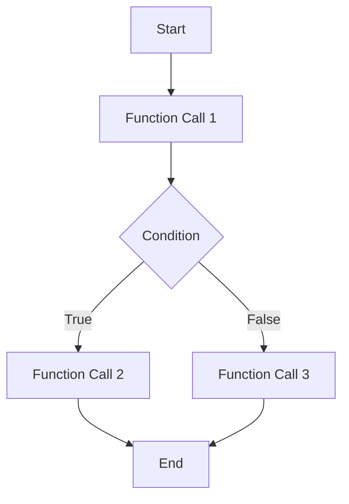

## 20.5 Profiling and Performance Monitoring

In the world of PHP development, ensuring that your applications run efficiently is crucial for providing a seamless user experience and maintaining server performance. Profiling and performance monitoring are essential practices that help developers identify bottlenecks, optimize code, and ensure that applications are running at their best. In this section, we will delve into the tools and techniques available for profiling and performance monitoring in PHP, focusing on popular tools like Xdebug and Blackfire.io.

### Introduction to Profiling and Performance Monitoring

Profiling is the process of measuring the performance of your code to identify areas that are consuming excessive resources or taking too long to execute. Performance monitoring, on the other hand, involves continuously tracking the performance of your application in a production environment to ensure it meets the desired performance criteria.

#### Why Profiling and Monitoring Matter

- **Improved User Experience:** Faster applications lead to better user satisfaction and engagement.
- **Resource Efficiency:** Optimizing code reduces server load and can lead to cost savings.
- **Scalability:** Identifying bottlenecks early helps in scaling applications effectively.
- **Reliability:** Continuous monitoring ensures that performance issues are detected and resolved promptly.

### Profiling Tools for PHP

Several tools are available for profiling PHP applications, each with its own strengths and use cases. Here, we will focus on two of the most popular tools: Xdebug and Blackfire.io.

#### Xdebug

[Xdebug](https://xdebug.org/) is a powerful PHP extension that provides debugging and profiling capabilities. It is widely used by developers for its comprehensive feature set.

##### Key Features of Xdebug

- **Function Tracing:** Records every function call, including arguments, return values, and execution time.
- **Profiling:** Generates cachegrind files that can be analyzed with tools like KCachegrind or QCachegrind.
- **Debugging:** Provides stack traces and variable inspection for debugging purposes.

##### Setting Up Xdebug

To use Xdebug for profiling, you need to install it as a PHP extension. Follow these steps to set it up:

1. **Install Xdebug:**
   - Use PECL to install Xdebug: `pecl install xdebug`
   - Alternatively, download the appropriate binary from the [Xdebug website](https://xdebug.org/download).

2. **Configure PHP to Use Xdebug:**
   - Add the following lines to your `php.ini` file:
     ```ini
     zend_extension=xdebug.so
     xdebug.profiler_enable=1
     xdebug.profiler_output_dir=/path/to/profiler/output
     ```

3. **Restart Your Web Server:**
   - Restart Apache or PHP-FPM to apply the changes.

##### Analyzing Xdebug Output

Xdebug generates cachegrind files that can be analyzed using visualization tools. These files contain detailed information about function calls and execution times.

- **Using KCachegrind or QCachegrind:**
  - Open the cachegrind file in KCachegrind or QCachegrind to visualize the call graph and identify bottlenecks.

```php
<?php
// Example function to demonstrate profiling
function calculateFactorial($number) {
    if ($number <= 1) {
        return 1;
    }
    return $number * calculateFactorial($number - 1);
}

echo calculateFactorial(5);
?>
```

**Try It Yourself:** Modify the code to calculate the factorial of a larger number and observe the impact on performance using Xdebug.

#### Blackfire.io

[Blackfire.io](https://blackfire.io/) is a comprehensive performance management solution for PHP applications. It provides profiling, monitoring, and testing capabilities.

##### Key Features of Blackfire.io

- **Automated Profiling:** Profiles your application automatically and provides insights into performance bottlenecks.
- **Performance Recommendations:** Offers actionable recommendations for optimizing your code.
- **Continuous Monitoring:** Tracks performance over time and alerts you to regressions.

##### Setting Up Blackfire.io

1. **Sign Up for Blackfire.io:**
   - Create an account on the [Blackfire.io website](https://blackfire.io/).

2. **Install Blackfire Agent and CLI:**
   - Follow the installation instructions provided by Blackfire for your operating system.

3. **Configure Your Application:**
   - Add the Blackfire probe to your PHP configuration.

4. **Profile Your Application:**
   - Use the Blackfire CLI to profile your application: `blackfire run php script.php`

##### Analyzing Blackfire Output

Blackfire provides a web interface where you can view detailed profiling reports. These reports highlight slow functions, database queries, and other performance issues.

**Try It Yourself:** Use Blackfire to profile a complex PHP application and explore the recommendations provided for optimization.

### Analyzing Performance

Profiling tools provide valuable data, but interpreting this data is key to improving performance. Here are some common areas to focus on:

#### Identifying Slow Functions

- **Execution Time:** Look for functions with high execution times and consider optimizing them.
- **Call Frequency:** Functions that are called frequently can have a significant impact on performance.

#### Database Query Optimization

- **Slow Queries:** Identify slow database queries and optimize them using indexes or query restructuring.
- **Query Caching:** Implement caching strategies to reduce database load.

#### Memory Usage

- **Memory Leaks:** Detect and fix memory leaks that can degrade performance over time.
- **Efficient Data Structures:** Use data structures that minimize memory usage.

### Optimizing Code

Once you've identified performance bottlenecks, it's time to optimize your code. Here are some strategies to consider:

#### Code Refactoring

- **Simplify Logic:** Refactor complex logic into simpler, more efficient code.
- **Remove Redundancies:** Eliminate redundant code and optimize loops.

#### Caching Strategies

- **Opcode Caching:** Use opcode caching solutions like OPcache to improve performance.
- **Data Caching:** Cache frequently accessed data to reduce database queries.

#### Asynchronous Processing

- **Background Jobs:** Offload time-consuming tasks to background jobs using tools like RabbitMQ or Gearman.
- **Non-Blocking I/O:** Use non-blocking I/O for tasks like file uploads or network requests.

### Visualizing Performance Data

Visualizing performance data can help you understand complex interactions and identify bottlenecks more easily. Use tools like KCachegrind or Blackfire's web interface to create visual representations of your profiling data.



**Diagram Description:** This flowchart represents the execution flow of a simple PHP script with conditional logic.

### References and Further Reading

- [Xdebug Documentation](https://xdebug.org/docs)
- [Blackfire.io Documentation](https://blackfire.io/docs)
- [PHP Performance Tips](https://www.php.net/manual/en/faq.performance.php)

### Knowledge Check

- What is the primary purpose of profiling in PHP?
- How can you identify slow functions in your code?
- What are some common strategies for optimizing PHP code?

### Embrace the Journey

Remember, profiling and performance monitoring are ongoing processes. As your application evolves, continue to profile and optimize your code to ensure it remains efficient and responsive. Keep experimenting, stay curious, and enjoy the journey of making your PHP applications the best they can be!

## Quiz: Profiling and Performance Monitoring



### What is the primary purpose of profiling in PHP?

- [x] To identify performance bottlenecks
- [ ] To debug syntax errors
- [ ] To enhance security
- [ ] To manage database connections

> **Explanation:** Profiling is used to identify areas in the code that are consuming excessive resources or taking too long to execute.

### Which tool is commonly used for profiling PHP applications?

- [x] Xdebug
- [ ] PHPUnit
- [ ] Composer
- [ ] PHPMD

> **Explanation:** Xdebug is a popular tool for profiling and debugging PHP applications.

### What does Blackfire.io provide for PHP applications?

- [x] Automated profiling and performance recommendations
- [ ] Syntax highlighting
- [ ] Code formatting
- [ ] Database management

> **Explanation:** Blackfire.io offers automated profiling, performance recommendations, and continuous monitoring for PHP applications.

### How can you optimize slow database queries?

- [x] By using indexes and query restructuring
- [ ] By adding more comments
- [ ] By increasing server RAM
- [ ] By using global variables

> **Explanation:** Optimizing database queries often involves using indexes and restructuring queries for better performance.

### What is a common strategy for reducing server load?

- [x] Implementing caching strategies
- [ ] Increasing code complexity
- [ ] Using more global variables
- [ ] Disabling error reporting

> **Explanation:** Caching strategies help reduce server load by storing frequently accessed data.

### What is the benefit of using opcode caching?

- [x] It improves performance by caching compiled PHP code
- [ ] It enhances security by encrypting code
- [ ] It simplifies code syntax
- [ ] It manages database connections

> **Explanation:** Opcode caching improves performance by storing compiled PHP code, reducing the need for recompilation.

### How can asynchronous processing improve performance?

- [x] By offloading tasks to background jobs
- [ ] By increasing code complexity
- [ ] By using more global variables
- [ ] By disabling error reporting

> **Explanation:** Asynchronous processing improves performance by offloading time-consuming tasks to background jobs.

### What is a common tool for visualizing Xdebug profiling data?

- [x] KCachegrind
- [ ] PHPUnit
- [ ] Composer
- [ ] PHPMD

> **Explanation:** KCachegrind is a tool used to visualize Xdebug profiling data.

### What is the role of memory usage analysis in performance optimization?

- [x] To detect and fix memory leaks
- [ ] To increase server RAM
- [ ] To add more comments
- [ ] To use global variables

> **Explanation:** Analyzing memory usage helps detect and fix memory leaks, which can degrade performance over time.

### Profiling and performance monitoring are ongoing processes.

- [x] True
- [ ] False

> **Explanation:** Profiling and performance monitoring should be continuous to ensure applications remain efficient and responsive.


