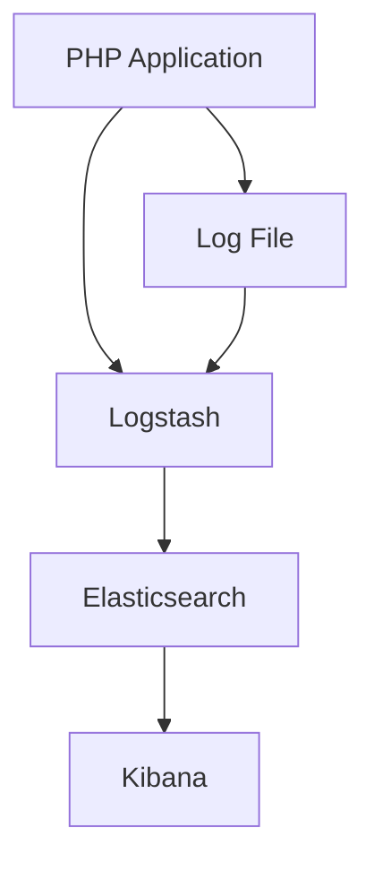

## 20.7 Centralized Logging with ELK Stack

Centralized logging is a critical component of modern application development, providing insights into application performance, user behavior, and system health. The ELK Stack, comprising Elasticsearch, Logstash, and Kibana, is a powerful suite of tools that enables developers to aggregate, process, and visualize logs from PHP applications efficiently. In this section, we will explore how to set up and utilize the ELK Stack for centralized logging in PHP, enhancing your ability to monitor and troubleshoot applications.

### ELK Stack Components

The ELK Stack is a collection of three open-source projects—Elasticsearch, Logstash, and Kibana—that work together to provide a comprehensive logging solution.

#### Elasticsearch

**Elasticsearch** is a distributed search and analytics engine designed for scalability and real-time data retrieval. It stores and indexes log data, allowing for fast and efficient querying. Elasticsearch is built on top of Apache Lucene and provides a RESTful interface for interacting with the data.

- **Key Features:**
  - Distributed and scalable architecture.
  - Real-time search and analytics capabilities.
  - RESTful API for easy integration.

#### Logstash

**Logstash** is a data processing pipeline that ingests, transforms, and sends data to Elasticsearch. It supports a wide range of input sources, filters, and output destinations, making it highly flexible for various logging needs.

- **Key Features:**
  - Supports multiple input and output plugins.
  - Provides powerful filtering and transformation capabilities.
  - Handles structured and unstructured data.

#### Kibana

**Kibana** is a visualization tool that enables users to explore and interact with data stored in Elasticsearch. It provides a web-based interface for creating dashboards, visualizations, and reports, making it easy to gain insights from log data.

- **Key Features:**
  - Intuitive interface for creating visualizations and dashboards.
  - Real-time data exploration and analysis.
  - Integration with Elasticsearch for seamless data access.

### Log Shipping

Log shipping is the process of sending log data from PHP applications to Logstash for processing and storage in Elasticsearch. This involves configuring your PHP application to output logs in a format that Logstash can ingest.

#### Configuring PHP for Log Shipping

To ship logs from a PHP application to Logstash, you need to configure your application to output logs in a structured format, such as JSON. This can be achieved using popular logging libraries like Monolog.

```php
<?php

use Monolog\Logger;
use Monolog\Handler\StreamHandler;
use Monolog\Formatter\JsonFormatter;

// Create a logger instance
$logger = new Logger('my_app');

// Create a stream handler
$streamHandler = new StreamHandler('/path/to/logfile.log', Logger::DEBUG);

// Set the formatter to JSON
$streamHandler->setFormatter(new JsonFormatter());

// Add the handler to the logger
$logger->pushHandler($streamHandler);

// Log a message
$logger->info('User logged in', ['user_id' => 123, 'username' => 'johndoe']);

?>
```

In this example, we use Monolog to create a logger that outputs logs in JSON format. The logs are written to a file, which can then be read by Logstash.

#### Configuring Logstash

Logstash needs to be configured to read logs from the specified source and send them to Elasticsearch. A basic Logstash configuration file might look like this:

```plaintext
input {
  file {
    path => "/path/to/logfile.log"
    start_position => "beginning"
    sincedb_path => "/dev/null"
  }
}

filter {
  json {
    source => "message"
  }
}

output {
  elasticsearch {
    hosts => ["http://localhost:9200"]
    index => "php-logs-%{+YYYY.MM.dd}"
  }
  stdout { codec => rubydebug }
}
```

- **Input Section:** Specifies the log file to read from.
- **Filter Section:** Parses the JSON log data.
- **Output Section:** Sends the parsed data to Elasticsearch and prints it to the console for debugging.

### Benefits of Centralized Logging with ELK Stack

Centralized logging with the ELK Stack offers numerous benefits for PHP developers and system administrators:

#### Aggregated Log Management

By centralizing logs from multiple sources, the ELK Stack simplifies log management and provides a unified view of application and system activity. This makes it easier to monitor and troubleshoot issues across distributed environments.

#### Powerful Search Capabilities

Elasticsearch's robust search capabilities enable developers to quickly query and analyze log data. This is particularly useful for identifying patterns, detecting anomalies, and diagnosing issues in real-time.

#### Enhanced Data Visualization

Kibana's visualization tools allow users to create custom dashboards and reports, providing valuable insights into application performance and user behavior. This facilitates data-driven decision-making and proactive system management.

#### Scalability and Flexibility

The ELK Stack is designed to scale horizontally, accommodating growing data volumes and increasing numbers of log sources. Its flexible architecture supports a wide range of input formats and data processing requirements.

### Visualizing the ELK Stack Architecture

To better understand how the ELK Stack components interact, let's visualize the architecture using a Mermaid.js diagram:



**Diagram Description:** This diagram illustrates the flow of log data from a PHP application to the ELK Stack. Logs are written to a file by the PHP application, which are then ingested by Logstash. Logstash processes and sends the data to Elasticsearch, where it is stored and indexed. Kibana accesses Elasticsearch to visualize and analyze the log data.

### Setting Up the ELK Stack

Setting up the ELK Stack involves installing and configuring each component. Here is a step-by-step guide to get you started:

#### Step 1: Install Elasticsearch

1. Download and install Elasticsearch from the [official website](https://www.elastic.co/downloads/elasticsearch).
2. Start the Elasticsearch service using the command:
   ```bash
   sudo systemctl start elasticsearch
   ```
3. Verify that Elasticsearch is running by accessing `http://localhost:9200` in your web browser.

#### Step 2: Install Logstash

1. Download and install Logstash from the [official website](https://www.elastic.co/downloads/logstash).
2. Create a configuration file (e.g., `logstash.conf`) with the input, filter, and output sections as described earlier.
3. Start Logstash with the configuration file:
   ```bash
   sudo bin/logstash -f /path/to/logstash.conf
   ```

#### Step 3: Install Kibana

1. Download and install Kibana from the [official website](https://www.elastic.co/downloads/kibana).
2. Start the Kibana service using the command:
   ```bash
   sudo systemctl start kibana
   ```
3. Access Kibana by navigating to `http://localhost:5601` in your web browser.

#### Step 4: Configure PHP Application

1. Install Monolog or another logging library in your PHP application.
2. Configure the logger to output logs in JSON format to a file.
3. Ensure the log file path matches the Logstash input configuration.

### Try It Yourself

Now that you have a basic understanding of the ELK Stack and how to set it up, try experimenting with the configuration:

- **Modify the Logstash Configuration:** Add additional filters to parse and enrich log data.
- **Create Custom Kibana Dashboards:** Use Kibana to create visualizations that provide insights into specific aspects of your application.
- **Integrate Additional Data Sources:** Configure Logstash to ingest logs from other applications or systems.

### Knowledge Check

Before we wrap up, let's reinforce what we've learned with a few questions:

1. What are the main components of the ELK Stack?
2. How does Logstash process log data?
3. What are the benefits of using Elasticsearch for log management?
4. How can Kibana be used to visualize log data?
5. What steps are involved in setting up the ELK Stack?

### Conclusion

Centralized logging with the ELK Stack is a powerful approach to managing and analyzing log data from PHP applications. By leveraging Elasticsearch, Logstash, and Kibana, developers can gain valuable insights into application performance, user behavior, and system health. As you continue to explore and experiment with the ELK Stack, you'll discover new ways to enhance your logging and monitoring capabilities.

Remember, this is just the beginning. As you progress, you'll build more complex and interactive logging solutions. Keep experimenting, stay curious, and enjoy the journey!

## Quiz: Centralized Logging with ELK Stack



### What are the main components of the ELK Stack?

- [x] Elasticsearch, Logstash, Kibana
- [ ] Elastic, Log, Kibana
- [ ] Elastic, Logstash, Kinesis
- [ ] Elasticsearch, Log, Kibana

> **Explanation:** The ELK Stack consists of Elasticsearch, Logstash, and Kibana.

### What is the primary role of Logstash in the ELK Stack?

- [x] Data processing pipeline
- [ ] Data storage
- [ ] Data visualization
- [ ] Data backup

> **Explanation:** Logstash acts as a data processing pipeline, ingesting, transforming, and sending data to Elasticsearch.

### How does Elasticsearch enhance log management?

- [x] Provides powerful search capabilities
- [ ] Offers data visualization
- [ ] Acts as a data processing pipeline
- [ ] Manages server configurations

> **Explanation:** Elasticsearch enhances log management by providing powerful search and analytics capabilities.

### What is Kibana used for in the ELK Stack?

- [x] Data visualization
- [ ] Data storage
- [ ] Data processing
- [ ] Data backup

> **Explanation:** Kibana is used for data visualization, allowing users to create dashboards and reports.

### Which PHP library is commonly used for logging in JSON format?

- [x] Monolog
- [ ] Log4PHP
- [ ] PHPLogger
- [ ] LogPHP

> **Explanation:** Monolog is a popular PHP library used for logging, and it supports JSON formatting.

### What is the benefit of centralized logging?

- [x] Aggregated log management
- [ ] Increased server load
- [ ] Reduced data security
- [ ] Limited data access

> **Explanation:** Centralized logging provides aggregated log management, simplifying monitoring and troubleshooting.

### How can Kibana dashboards be customized?

- [x] By creating visualizations and reports
- [ ] By modifying Elasticsearch configurations
- [ ] By changing Logstash input sources
- [ ] By adjusting PHP application settings

> **Explanation:** Kibana dashboards can be customized by creating visualizations and reports based on log data.

### What is the purpose of the filter section in a Logstash configuration?

- [x] To parse and transform log data
- [ ] To store log data
- [ ] To visualize log data
- [ ] To backup log data

> **Explanation:** The filter section in a Logstash configuration is used to parse and transform log data.

### What command is used to start the Elasticsearch service?

- [x] `sudo systemctl start elasticsearch`
- [ ] `sudo systemctl start logstash`
- [ ] `sudo systemctl start kibana`
- [ ] `sudo systemctl start php`

> **Explanation:** The command `sudo systemctl start elasticsearch` is used to start the Elasticsearch service.

### True or False: The ELK Stack can only be used with PHP applications.

- [ ] True
- [x] False

> **Explanation:** False. The ELK Stack can be used with various applications and systems, not just PHP.


