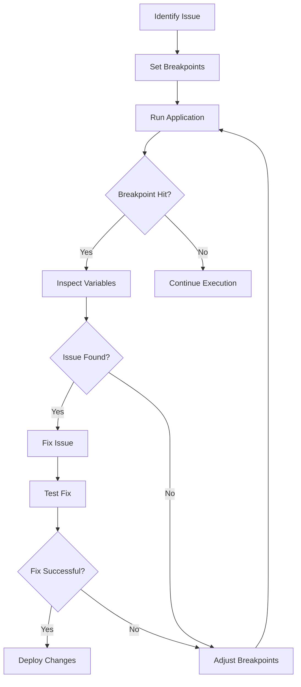

## 20.8 Debugging Techniques and Tools

Debugging is an essential skill for any developer, and mastering it can significantly enhance the quality and reliability of your PHP applications. In this section, we will explore various debugging techniques and tools that can help you identify and fix issues in your PHP code efficiently. We'll cover popular tools like Xdebug and PHP Debug Bar, discuss IDE support, and share best practices for effective debugging.

### Understanding Debugging in PHP

Before diving into specific tools and techniques, let's establish a clear understanding of what debugging entails in the context of PHP development. Debugging is the process of identifying, analyzing, and resolving errors or bugs in your code. It involves examining the flow of execution, inspecting variable states, and understanding the logic to pinpoint where things go wrong.

#### The Importance of Debugging

Debugging is crucial for several reasons:

- **Error Resolution:** It helps you identify and fix errors that could lead to application crashes or incorrect behavior.
- **Code Quality:** By debugging, you can ensure that your code meets quality standards and functions as intended.
- **Performance Optimization:** Debugging can reveal performance bottlenecks, allowing you to optimize your code for better efficiency.
- **Learning and Improvement:** The process of debugging often leads to a deeper understanding of your code and programming concepts.

### Debugging Tools

Let's explore some of the most popular debugging tools available for PHP developers.

#### Xdebug

Xdebug is a powerful PHP extension that provides a range of debugging features, including step-through debugging, stack traces, and profiling. It integrates seamlessly with many IDEs, making it a favorite among PHP developers.

**Key Features of Xdebug:**

- **Step-Through Debugging:** Allows you to pause execution at specific points (breakpoints) and step through your code line by line.
- **Stack Traces:** Provides detailed information about the call stack, helping you trace the sequence of function calls leading to an error.
- **Variable Inspection:** Lets you examine the values of variables at different points in your code.
- **Profiling:** Offers insights into the performance of your code, identifying slow functions and bottlenecks.

**Setting Up Xdebug:**

To use Xdebug, you need to install it as a PHP extension. Here's a basic setup guide:

1. **Install Xdebug:** Use a package manager like `pecl` or download the appropriate version from the [Xdebug website](https://xdebug.org/).

2. **Configure PHP:** Add the following lines to your `php.ini` file:

   ```ini
   zend_extension=xdebug.so
   xdebug.remote_enable=1
   xdebug.remote_autostart=1
   ```

3. **Restart Your Server:** Restart your web server or PHP service to apply the changes.

4. **Configure Your IDE:** Set up your IDE to connect to Xdebug. Most modern IDEs like PHPStorm and Visual Studio Code have built-in support for Xdebug.

**Using Xdebug:**

Once set up, you can start a debugging session by setting breakpoints in your code. When the execution reaches a breakpoint, it will pause, allowing you to inspect variables, evaluate expressions, and step through your code.

#### PHP Debug Bar

PHP Debug Bar is a lightweight and easy-to-use debugging tool that provides a visual interface for inspecting your application's performance and data flow. It integrates with your application and displays debugging information in a toolbar.

**Key Features of PHP Debug Bar:**

- **Request and Response Data:** Displays detailed information about HTTP requests and responses.
- **Database Queries:** Shows executed database queries and their execution time.
- **Memory Usage:** Provides insights into memory consumption during execution.
- **Custom Data Collectors:** Allows you to add custom data collectors to display specific information.

**Integrating PHP Debug Bar:**

To integrate PHP Debug Bar into your application, follow these steps:

1. **Install via Composer:** Add PHP Debug Bar to your project using Composer:

   ```bash
   composer require maximebf/debugbar
   ```

2. **Initialize the Debug Bar:** In your application, initialize the Debug Bar and attach it to your response:

   ```php
   use DebugBar\StandardDebugBar;

   $debugbar = new StandardDebugBar();
   $debugbarRenderer = $debugbar->getJavascriptRenderer();

   // Attach to your response
   echo $debugbarRenderer->renderHead();
   echo $debugbarRenderer->render();
   ```

3. **View the Debug Bar:** Once integrated, the Debug Bar will appear in your application's UI, providing real-time debugging information.

### IDE Support for Debugging

Modern Integrated Development Environments (IDEs) offer robust support for debugging PHP applications. Let's explore how IDEs like PHPStorm and Visual Studio Code can enhance your debugging experience.

#### PHPStorm

PHPStorm is a popular IDE for PHP development, known for its powerful debugging capabilities. It integrates seamlessly with Xdebug, providing a rich set of features for efficient debugging.

**Key Features of PHPStorm Debugging:**

- **Breakpoints and Watches:** Set breakpoints to pause execution and watches to monitor variable values.
- **Expression Evaluation:** Evaluate expressions and modify variable values during debugging.
- **Call Stack Navigation:** Navigate through the call stack to understand the flow of execution.
- **Conditional Breakpoints:** Set conditions for breakpoints to trigger only when specific criteria are met.

**Setting Up PHPStorm with Xdebug:**

1. **Configure PHPStorm:** Go to `Preferences > Languages & Frameworks > PHP > Debug` and configure the Xdebug settings.

2. **Start a Debugging Session:** Use the "Start Listening for PHP Debug Connections" option to begin a debugging session.

3. **Set Breakpoints:** Click on the gutter next to the line numbers to set breakpoints in your code.

4. **Run Your Application:** Execute your application, and PHPStorm will pause execution at the breakpoints, allowing you to inspect and debug.

#### Visual Studio Code

Visual Studio Code (VS Code) is a lightweight and versatile code editor with excellent support for PHP debugging through extensions.

**Key Features of VS Code Debugging:**

- **Debugging Extensions:** Use extensions like "PHP Debug" to enable Xdebug support.
- **Variable Inspection:** Inspect variables and evaluate expressions during debugging.
- **Call Stack and Breakpoints:** Navigate the call stack and set breakpoints to control execution flow.
- **Integrated Terminal:** Use the integrated terminal for running commands and scripts.

**Setting Up VS Code with Xdebug:**

1. **Install PHP Debug Extension:** Search for "PHP Debug" in the Extensions Marketplace and install it.

2. **Configure Launch Settings:** Add a configuration in `launch.json` to connect to Xdebug:

   ```json
   {
     "version": "0.2.0",
     "configurations": [
       {
         "name": "Listen for Xdebug",
         "type": "php",
         "request": "launch",
         "port": 9000
       }
     ]
   }
   ```

3. **Start Debugging:** Set breakpoints and start a debugging session by selecting "Listen for Xdebug" from the Run and Debug panel.

### Best Practices for Debugging

Effective debugging requires more than just tools; it involves adopting best practices that streamline the process and improve outcomes.

#### Use Breakpoints and Watches

Breakpoints are a fundamental tool in debugging. They allow you to pause execution at specific points and examine the state of your application. Use breakpoints strategically to isolate problematic code sections.

**Watches** are another valuable feature, enabling you to monitor the values of specific variables throughout execution. Set watches on variables that are critical to your application's logic to track their changes.

#### Examine Variable States

Understanding the state of variables at different points in your code is crucial for identifying issues. Use your debugging tools to inspect variable values and ensure they match your expectations.

#### Log Messages

Logging is an essential complement to debugging. Use logging to record important events and variable states, providing a historical record that can aid in diagnosing issues. Tools like Monolog can help you implement robust logging in your PHP applications.

#### Simplify and Isolate

When faced with complex issues, simplify and isolate the problem. Break down your code into smaller, manageable parts and test each part individually. This approach makes it easier to identify the root cause of an issue.

#### Collaborate and Review

Debugging can be a collaborative effort. Involve team members in the process, as fresh perspectives can often lead to breakthroughs. Code reviews are also valuable for identifying potential issues before they become problems.

### Visualizing Debugging Workflows

To better understand the debugging process, let's visualize a typical debugging workflow using a flowchart.



**Description:** This flowchart illustrates a typical debugging workflow, starting with identifying the issue, setting breakpoints, running the application, and inspecting variables when a breakpoint is hit. If the issue is found, it is fixed and tested. If not, breakpoints are adjusted, and the process repeats.

### Try It Yourself

To reinforce your understanding of debugging techniques, try experimenting with the following exercises:

1. **Set Up Xdebug:** Install and configure Xdebug in your development environment. Practice setting breakpoints and stepping through your code.

2. **Use PHP Debug Bar:** Integrate PHP Debug Bar into a sample application and explore the information it provides.

3. **Debug with PHPStorm or VS Code:** Choose an IDE and set up a debugging session. Experiment with breakpoints, watches, and variable inspection.

4. **Log Messages:** Implement logging in a PHP application using Monolog. Log important events and variable states to aid in debugging.

### References and Links

- [Xdebug Official Website](https://xdebug.org/)
- [PHP Debug Bar](http://phpdebugbar.com/)
- [PHPStorm Debugging Guide](https://www.jetbrains.com/help/phpstorm/debugging-with-phpstorm.html)
- [Visual Studio Code PHP Debug Extension](https://marketplace.visualstudio.com/items?itemName=felixfbecker.php-debug)
- [Monolog Documentation](https://github.com/Seldaek/monolog)

### Knowledge Check

To test your understanding of debugging techniques and tools, consider the following questions:

1. What is the primary purpose of using breakpoints in debugging?
2. How does Xdebug enhance the debugging process in PHP?
3. What are some best practices for effective debugging?
4. How can logging complement the debugging process?
5. What role do IDEs play in debugging PHP applications?

### Embrace the Journey

Remember, debugging is a skill that improves with practice and experience. As you become more proficient, you'll find that debugging becomes an integral part of your development process, helping you build robust and reliable PHP applications. Keep experimenting, stay curious, and enjoy the journey!

## Quiz: Debugging Techniques and Tools



### What is the primary purpose of using breakpoints in debugging?

- [x] To pause execution at specific points and inspect the state of the application.
- [ ] To automatically fix errors in the code.
- [ ] To compile the code into machine language.
- [ ] To optimize the performance of the application.

> **Explanation:** Breakpoints allow developers to pause execution and inspect the state of the application, which is crucial for identifying and resolving issues.

### How does Xdebug enhance the debugging process in PHP?

- [x] By providing step-through debugging and stack traces.
- [ ] By automatically correcting syntax errors.
- [ ] By compiling PHP code into binary.
- [ ] By optimizing database queries.

> **Explanation:** Xdebug offers features like step-through debugging and stack traces, which are essential for understanding the flow of execution and identifying errors.

### What are some best practices for effective debugging?

- [x] Use breakpoints and watches, examine variable states, and log messages.
- [ ] Write more code to cover up errors.
- [ ] Avoid using any debugging tools.
- [ ] Only debug after deployment.

> **Explanation:** Effective debugging involves using breakpoints, examining variable states, and logging messages to identify and resolve issues efficiently.

### How can logging complement the debugging process?

- [x] By providing a historical record of events and variable states.
- [ ] By automatically fixing bugs.
- [ ] By slowing down the application.
- [ ] By removing all errors from the code.

> **Explanation:** Logging provides a historical record that can help diagnose issues by showing what happened leading up to an error.

### What role do IDEs play in debugging PHP applications?

- [x] They provide tools for setting breakpoints, inspecting variables, and navigating the call stack.
- [ ] They automatically fix all bugs in the code.
- [ ] They compile the code into machine language.
- [ ] They replace the need for any debugging tools.

> **Explanation:** IDEs offer tools that facilitate debugging, such as setting breakpoints, inspecting variables, and navigating the call stack.

### Which tool provides a visual interface for inspecting application performance and data flow?

- [x] PHP Debug Bar
- [ ] Xdebug
- [ ] PHPStorm
- [ ] Visual Studio Code

> **Explanation:** PHP Debug Bar provides a visual interface for inspecting application performance and data flow.

### What is a key feature of PHPStorm's debugging capabilities?

- [x] Conditional breakpoints
- [ ] Automatic code correction
- [ ] Code compilation
- [ ] Database optimization

> **Explanation:** PHPStorm offers conditional breakpoints, allowing developers to set conditions for breakpoints to trigger only when specific criteria are met.

### How can you start a debugging session in Visual Studio Code?

- [x] By selecting "Listen for Xdebug" from the Run and Debug panel.
- [ ] By compiling the code into binary.
- [ ] By writing additional code.
- [ ] By deploying the application.

> **Explanation:** In Visual Studio Code, you can start a debugging session by selecting "Listen for Xdebug" from the Run and Debug panel.

### What is the benefit of using watches in debugging?

- [x] To monitor the values of specific variables throughout execution.
- [ ] To automatically fix errors.
- [ ] To compile the code into machine language.
- [ ] To optimize the application's performance.

> **Explanation:** Watches allow developers to monitor the values of specific variables throughout execution, helping to identify issues.

### True or False: Debugging is only necessary after an application is deployed.

- [ ] True
- [x] False

> **Explanation:** Debugging is an ongoing process that should occur throughout development, not just after deployment.


