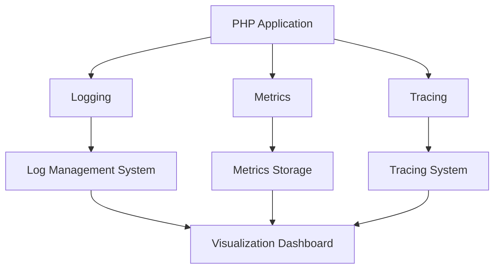

## 20.9 Observability in PHP Applications

In today's fast-paced software development environment, ensuring that applications are running smoothly and efficiently is paramount. Observability is a key concept that allows developers to understand the internal states of a system from its external outputs. This section will delve into the concept of observability in PHP applications, focusing on tracing, metrics, and logging integration to enhance monitoring and debugging capabilities.

### Understanding Observability

Observability is the ability to infer the internal states of a system based on the knowledge of its external outputs. In the context of PHP applications, observability involves collecting and analyzing data from logs, metrics, and traces to gain insights into application performance, detect anomalies, and troubleshoot issues.

#### Key Components of Observability

1. **Logging**: Capturing detailed information about application events. Logs provide a chronological record of events that have occurred within the application, which can be invaluable for debugging and auditing.

2. **Metrics**: Quantitative measures that provide insights into the performance and health of an application. Metrics can include response times, error rates, and resource utilization.

3. **Tracing**: Tracking the flow of requests through an application, often across multiple services. Tracing helps identify bottlenecks and understand the interactions between different components of a system.

### Implementing Observability in PHP

To achieve observability in PHP applications, developers can leverage various tools and techniques. Let's explore some of the most effective methods for implementing observability in PHP.

#### Logging in PHP

Logging is the foundation of observability. It involves recording information about application events, which can be used for debugging, monitoring, and auditing purposes.

##### Implementing Logging with Monolog

Monolog is a popular logging library for PHP that provides a flexible and powerful logging system. It supports various log handlers, allowing logs to be sent to files, databases, email, and more.

```php
<?php

use Monolog\Logger;
use Monolog\Handler\StreamHandler;

// Create a logger instance
$logger = new Logger('my_app');

// Add a file handler
$logger->pushHandler(new StreamHandler(__DIR__ . '/app.log', Logger::DEBUG));

// Log some messages
$logger->info('This is an informational message');
$logger->error('This is an error message');

?>
```

In this example, we create a logger instance and add a file handler to write logs to `app.log`. We then log informational and error messages.

##### Best Practices for Logging

- **Log Levels**: Use appropriate log levels (e.g., DEBUG, INFO, WARNING, ERROR) to categorize log messages.
- **Structured Logging**: Use structured logging formats (e.g., JSON) to facilitate log parsing and analysis.
- **Log Rotation**: Implement log rotation to manage log file sizes and prevent disk space exhaustion.

#### Metrics in PHP

Metrics provide quantitative insights into application performance and health. They can be used to monitor response times, error rates, and resource utilization.

##### Using Prometheus for Metrics Collection

Prometheus is a popular open-source monitoring and alerting toolkit that can be used to collect and analyze metrics from PHP applications.

```php
<?php

use Prometheus\CollectorRegistry;
use Prometheus\Storage\InMemory;
use Prometheus\RenderTextFormat;

// Create a collector registry
$registry = new CollectorRegistry(new InMemory());

// Create a counter metric
$counter = $registry->getOrRegisterCounter('my_app', 'requests_total', 'Total number of requests');

// Increment the counter
$counter->inc();

// Render metrics in Prometheus text format
$renderer = new RenderTextFormat();
echo $renderer->render($registry->getMetricFamilySamples());

?>
```

In this example, we create a counter metric to track the total number of requests. We then render the metrics in Prometheus text format.

##### Best Practices for Metrics

- **Granularity**: Collect metrics at an appropriate level of granularity to balance detail and performance.
- **Labels**: Use labels to add contextual information to metrics (e.g., request path, status code).
- **Alerting**: Set up alerts based on metric thresholds to detect and respond to issues proactively.

#### Tracing in PHP

Tracing involves tracking the flow of requests through an application, often across multiple services. It helps identify bottlenecks and understand the interactions between different components.

##### Implementing Tracing with OpenTelemetry

OpenTelemetry is an open-source observability framework that provides tools for collecting and exporting traces and metrics.

```php
<?php

use OpenTelemetry\Sdk\Trace\TracerProvider;
use OpenTelemetry\Sdk\Trace\SpanProcessor\SimpleSpanProcessor;
use OpenTelemetry\Sdk\Trace\Exporter\ConsoleSpanExporter;

// Create a tracer provider
$tracerProvider = new TracerProvider();

// Create a span processor and exporter
$spanProcessor = new SimpleSpanProcessor(new ConsoleSpanExporter());
$tracerProvider->addSpanProcessor($spanProcessor);

// Create a tracer
$tracer = $tracerProvider->getTracer('my_app');

// Start a span
$span = $tracer->startSpan('my_operation');

// Do some work...

// End the span
$span->end();

?>
```

In this example, we create a tracer provider and a span processor with a console exporter. We then start and end a span to trace an operation.

##### Best Practices for Tracing

- **Span Naming**: Use descriptive names for spans to make traces easier to understand.
- **Context Propagation**: Ensure context is propagated across service boundaries to maintain trace continuity.
- **Sampling**: Use sampling to reduce the overhead of tracing in high-traffic applications.

### Integrating Logs, Metrics, and Traces

For comprehensive observability, it's essential to integrate logs, metrics, and traces. This integration allows developers to correlate data from different sources and gain deeper insights into application behavior.

#### Using Jaeger for Distributed Tracing

Jaeger is an open-source distributed tracing system that can be used to monitor and troubleshoot complex microservices architectures.

- **Installation**: Set up Jaeger by following the [official documentation](https://www.jaegertracing.io/docs/).
- **Integration**: Use the Jaeger client library to instrument your PHP application for tracing.

#### Combining Observability Data

By combining logs, metrics, and traces, developers can create a comprehensive observability strategy. This approach enables:

- **Root Cause Analysis**: Quickly identify the root cause of issues by correlating data from different sources.
- **Performance Optimization**: Identify performance bottlenecks and optimize application performance.
- **Proactive Monitoring**: Detect anomalies and respond to issues before they impact users.

### Visualizing Observability Data

Visualizing observability data is crucial for understanding application behavior and identifying issues. Tools like Grafana can be used to create dashboards that display logs, metrics, and traces.



In this diagram, we see how a PHP application generates logs, metrics, and traces, which are then sent to respective systems for storage and visualization.

### Conclusion

Observability is a critical aspect of modern PHP application development. By implementing logging, metrics, and tracing, developers can gain valuable insights into application performance, detect anomalies, and troubleshoot issues effectively. Remember, observability is an ongoing process that requires continuous improvement and adaptation to changing application needs.

### Try It Yourself

Experiment with the code examples provided in this section. Try modifying the logging levels, adding new metrics, or creating additional spans for tracing. Observe how these changes impact the observability of your PHP application.

### Further Reading

- [OpenTelemetry PHP](https://github.com/open-telemetry/opentelemetry-php)
- [Jaeger Tracing](https://www.jaegertracing.io/)
- [Prometheus](https://prometheus.io/)
- [Grafana](https://grafana.com/)

## Quiz: Observability in PHP Applications



### What is the primary goal of observability in PHP applications?

- [x] To understand internal states from external outputs
- [ ] To improve application aesthetics
- [ ] To increase application size
- [ ] To reduce code complexity

> **Explanation:** Observability aims to infer the internal states of a system based on its external outputs.

### Which of the following is NOT a key component of observability?

- [ ] Logging
- [ ] Metrics
- [ ] Tracing
- [x] Compilation

> **Explanation:** Compilation is not related to observability; it is a process of converting source code into executable code.

### What is the purpose of tracing in observability?

- [x] To track the flow of requests through an application
- [ ] To enhance the visual design of an application
- [ ] To compile code faster
- [ ] To encrypt data

> **Explanation:** Tracing involves tracking the flow of requests through an application to identify bottlenecks and understand interactions.

### Which PHP library is commonly used for logging?

- [x] Monolog
- [ ] Symfony
- [ ] Laravel
- [ ] PHPUnit

> **Explanation:** Monolog is a popular logging library for PHP.

### What is the role of Prometheus in observability?

- [x] To collect and analyze metrics
- [ ] To compile PHP code
- [ ] To manage databases
- [ ] To design user interfaces

> **Explanation:** Prometheus is used for collecting and analyzing metrics in observability.

### Which tool is used for distributed tracing in PHP applications?

- [x] Jaeger
- [ ] Composer
- [ ] PHPUnit
- [ ] Laravel

> **Explanation:** Jaeger is an open-source distributed tracing system used for monitoring and troubleshooting.

### What is the benefit of integrating logs, metrics, and traces?

- [x] Comprehensive insights into application behavior
- [ ] Faster code compilation
- [ ] Improved user interface design
- [ ] Reduced application size

> **Explanation:** Integrating logs, metrics, and traces provides comprehensive insights into application behavior.

### What is the purpose of using labels in metrics?

- [x] To add contextual information
- [ ] To encrypt data
- [ ] To compile code
- [ ] To design user interfaces

> **Explanation:** Labels add contextual information to metrics, making them more informative.

### Which visualization tool is commonly used with observability data?

- [x] Grafana
- [ ] Laravel
- [ ] Symfony
- [ ] PHPUnit

> **Explanation:** Grafana is commonly used to create dashboards for visualizing observability data.

### Observability is a one-time setup process.

- [ ] True
- [x] False

> **Explanation:** Observability is an ongoing process that requires continuous improvement and adaptation.


