## 21.1 Importance of Internationalization (i18n)

In today's interconnected world, software applications are expected to cater to a global audience. This expectation necessitates the need for internationalization (i18n), a process that ensures software can be easily adapted to various languages and regions without requiring significant engineering changes. In this section, we will delve into the importance of internationalization in PHP development, explore its benefits, challenges, and provide guidance on best practices for implementing i18n in your PHP applications.

### Understanding Internationalization

Internationalization, often abbreviated as i18n (where 18 represents the number of letters between 'i' and 'n'), is the process of designing and developing software applications in a way that they can be easily localized for different languages and regions. This involves separating the core functionality of the application from locale-specific elements such as text, date formats, and currency symbols.

#### Key Concepts of Internationalization

- **Separation of Content and Code:** Ensure that all user-facing text is stored separately from the codebase, often in resource files. This allows for easy translation and adaptation without altering the core code.
- **Locale Awareness:** Design your application to be aware of the user's locale, which includes language, region, and cultural preferences. This awareness enables the application to present content in a way that is familiar and comfortable to the user.
- **Character Encoding:** Use Unicode (UTF-8) as the standard character encoding to support a wide range of characters and symbols from different languages.

### Benefits of Internationalization

Internationalization offers several advantages that can significantly enhance the reach and usability of your PHP applications:

1. **Expanding User Base:** By supporting multiple languages and regions, your application can cater to a broader audience, increasing its potential user base and market reach.

2. **Enhanced User Experience:** Providing content in users' native languages improves their interaction with the application, making it more intuitive and user-friendly.

3. **Increased Accessibility and Inclusivity:** Internationalization ensures that your application is accessible to users from diverse cultural backgrounds, promoting inclusivity and equal access to information.

4. **Compliance with Global Standards:** Many regions have specific legal and regulatory requirements for software applications. Internationalization helps ensure compliance with these standards, avoiding potential legal issues.

### Challenges of Internationalization

While internationalization offers numerous benefits, it also presents several challenges that developers must address:

1. **Managing Multiple Languages and Character Encodings:** Supporting multiple languages requires careful management of translations and character encodings to ensure accurate and consistent content display.

2. **Formatting Dates, Numbers, and Currencies:** Different regions have varying conventions for formatting dates, numbers, and currencies. Your application must be able to adapt to these differences seamlessly.

3. **Handling Text Direction and Cultural Nuances:** Languages such as Arabic and Hebrew are written from right to left, requiring special handling in the user interface. Additionally, cultural nuances and idiomatic expressions must be considered to avoid misinterpretation.

4. **Resource Management:** Maintaining and updating resource files for multiple languages can be resource-intensive and requires a robust system for version control and quality assurance.

### Implementing Internationalization in PHP

To effectively implement internationalization in your PHP applications, follow these best practices:

#### 1. Use PHP's Built-in Internationalization Functions

PHP provides several built-in functions and extensions to facilitate internationalization, such as the `Intl` extension. This extension offers a range of tools for formatting dates, numbers, and currencies according to locale, as well as for handling text direction and collation.

```php
// Example of using the Intl extension to format a date
$locale = 'fr_FR';
$date = new DateTime('2024-11-23');
$formatter = new IntlDateFormatter($locale, IntlDateFormatter::LONG, IntlDateFormatter::NONE);
echo $formatter->format($date); // Outputs: 23 novembre 2024
```

#### 2. Externalize User-Facing Text

Store all user-facing text in external resource files, such as JSON or XML, to facilitate easy translation and adaptation. This approach allows translators to work on the content without needing to access the codebase.

```json
// Example of a JSON resource file for English
{
    "greeting": "Hello, welcome to our application!",
    "farewell": "Goodbye, see you soon!"
}
```

```json
// Example of a JSON resource file for French
{
    "greeting": "Bonjour, bienvenue dans notre application!",
    "farewell": "Au revoir, à bientôt!"
}
```

#### 3. Implement Locale Detection

Detect the user's locale automatically based on their browser settings or allow them to select their preferred language and region. This can be achieved using PHP's `Locale` class or by reading the `Accept-Language` HTTP header.

```php
// Example of detecting the user's locale from the HTTP header
$locale = Locale::acceptFromHttp($_SERVER['HTTP_ACCEPT_LANGUAGE']);
```

#### 4. Use Unicode (UTF-8) Encoding

Ensure that your application uses UTF-8 encoding for all text processing and storage. This encoding supports a wide range of characters and symbols, making it suitable for international applications.

```php
// Example of setting UTF-8 encoding in PHP
header('Content-Type: text/html; charset=utf-8');
```

#### 5. Test with Multiple Locales

Thoroughly test your application with different locales to ensure that all elements are displayed correctly and that the user experience is consistent across languages. Use automated testing tools to streamline this process.

### Visualizing Internationalization in PHP

To better understand the process of internationalization in PHP, let's visualize the workflow using a Mermaid.js diagram.

```mermaid
graph TD;
    A[Start] --> B[Detect User Locale];
    B --> C{Is Locale Supported?};
    C -->|Yes| D[Load Locale-Specific Resources];
    C -->|No| E[Fallback to Default Locale];
    D --> F[Render Content];
    E --> F;
    F --> G[Display to User];
    G --> H[End];
```



**Diagram Description:** This flowchart illustrates the process of internationalizing a PHP application. It begins with detecting the user's locale, checking if it is supported, loading the appropriate resources, and rendering the content for display.

### References and Further Reading

- [MDN Web Docs: Internationalization](https://developer.mozilla.org/en-US/docs/Web/Internationalization)
- [PHP Manual: Internationalization Functions](https://www.php.net/manual/en/book.intl.php)
- [W3C: Internationalization Best Practices](https://www.w3.org/International/)

### Knowledge Check

To reinforce your understanding of internationalization in PHP, consider the following questions:

1. What is the primary goal of internationalization in software development?
2. How does internationalization differ from localization?
3. Why is UTF-8 encoding important for international applications?
4. What are some challenges associated with managing multiple languages in an application?
5. How can you detect a user's locale in a PHP application?

### Embrace the Journey

Remember, internationalization is a crucial step in making your PHP applications accessible and user-friendly for a global audience. As you continue to develop your skills, keep experimenting with different locales, stay curious about cultural nuances, and enjoy the journey of creating inclusive software!

## Quiz: Importance of Internationalization (i18n)



### What is the primary goal of internationalization in software development?

- [x] To design software that can be easily adapted to various languages and regions
- [ ] To translate software into multiple languages
- [ ] To improve software performance
- [ ] To enhance software security

> **Explanation:** Internationalization focuses on designing software that can be easily adapted to different languages and regions without requiring significant engineering changes.

### How does internationalization differ from localization?

- [x] Internationalization is the process of designing software for adaptability, while localization is the process of adapting software for specific regions
- [ ] Internationalization involves translating text, while localization involves coding
- [ ] Internationalization is about security, while localization is about performance
- [ ] Internationalization is a subset of localization

> **Explanation:** Internationalization involves designing software for adaptability, whereas localization involves adapting the software for specific languages and regions.

### Why is UTF-8 encoding important for international applications?

- [x] It supports a wide range of characters and symbols from different languages
- [ ] It improves application performance
- [ ] It enhances application security
- [ ] It reduces application size

> **Explanation:** UTF-8 encoding supports a wide range of characters and symbols, making it suitable for international applications.

### What are some challenges associated with managing multiple languages in an application?

- [x] Managing translations and character encodings
- [x] Formatting dates, numbers, and currencies
- [ ] Improving application performance
- [ ] Enhancing application security

> **Explanation:** Managing translations, character encodings, and formatting conventions are key challenges in supporting multiple languages.

### How can you detect a user's locale in a PHP application?

- [x] By reading the `Accept-Language` HTTP header
- [ ] By analyzing the user's IP address
- [ ] By checking the user's browser history
- [ ] By using a third-party API

> **Explanation:** The `Accept-Language` HTTP header provides information about the user's preferred languages, which can be used to detect their locale.

### Which PHP extension is commonly used for internationalization tasks?

- [x] Intl
- [ ] PDO
- [ ] GD
- [ ] cURL

> **Explanation:** The Intl extension provides tools for formatting dates, numbers, and currencies according to locale, as well as for handling text direction and collation.

### What is a key benefit of internationalization?

- [x] Expanding the application's user base
- [ ] Improving application security
- [ ] Reducing application size
- [ ] Enhancing application performance

> **Explanation:** Internationalization allows applications to cater to a broader audience by supporting multiple languages and regions.

### What is the purpose of externalizing user-facing text in resource files?

- [x] To facilitate easy translation and adaptation
- [ ] To improve application performance
- [ ] To enhance application security
- [ ] To reduce application size

> **Explanation:** Externalizing user-facing text in resource files allows for easy translation and adaptation without altering the core code.

### What is a common challenge when handling text direction in international applications?

- [x] Supporting right-to-left languages like Arabic and Hebrew
- [ ] Translating text into multiple languages
- [ ] Improving application performance
- [ ] Enhancing application security

> **Explanation:** Supporting right-to-left languages requires special handling in the user interface to ensure correct text direction.

### True or False: Internationalization and localization are the same process.

- [ ] True
- [x] False

> **Explanation:** Internationalization and localization are distinct processes. Internationalization involves designing software for adaptability, while localization involves adapting the software for specific languages and regions.


