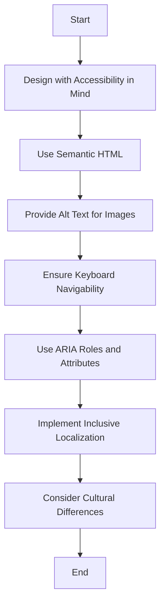

## 21.10 Accessibility and Inclusive Design

In today's digital age, ensuring that web applications are accessible to everyone, including people with disabilities, is not just a legal requirement but a moral imperative. Accessibility and inclusive design are crucial components of modern web development, and PHP developers play a significant role in implementing these principles. This section will guide you through the essential concepts, standards, and practices for creating accessible and inclusive PHP applications.

### Designing for Accessibility

Accessibility in web development refers to the practice of making websites and applications usable by people of all abilities and disabilities. This includes individuals with visual, auditory, motor, and cognitive impairments. Designing for accessibility ensures that everyone can perceive, understand, navigate, and interact with the web.

#### Key Principles of Accessibility

1. **Perceivable**: Information and user interface components must be presentable to users in ways they can perceive. This includes providing text alternatives for non-text content and ensuring that content is adaptable and distinguishable.

2. **Operable**: User interface components and navigation must be operable. This means making all functionality available from a keyboard and providing users enough time to read and use content.

3. **Understandable**: Information and the operation of the user interface must be understandable. This involves making text readable and predictable and helping users avoid and correct mistakes.

4. **Robust**: Content must be robust enough to be interpreted reliably by a wide variety of user agents, including assistive technologies. This requires maximizing compatibility with current and future user tools.

### Web Content Accessibility Guidelines (WCAG)

The Web Content Accessibility Guidelines (WCAG) are a set of recommendations for making web content more accessible. They are developed by the World Wide Web Consortium (W3C) and are widely recognized as the standard for web accessibility.

- **WCAG 2.1**: The latest version of WCAG includes guidelines that address mobile accessibility, people with low vision, and people with cognitive and learning disabilities. It is organized around four principles: Perceivable, Operable, Understandable, and Robust (POUR).

- **Compliance Levels**: WCAG defines three levels of conformance:
  - **Level A**: The minimum level of accessibility.
  - **Level AA**: Deals with the biggest and most common barriers for disabled users.
  - **Level AAA**: The highest and most complex level of web accessibility.

For more detailed information on WCAG, visit the [W3C WCAG](https://www.w3.org/WAI/standards-guidelines/wcag/) page.

### Implementing Accessible Features

Implementing accessible features in your PHP applications involves using semantic HTML, providing alternative text for images, ensuring keyboard navigability, and more. Let's explore these in detail.

#### Use Semantic HTML Elements

Semantic HTML elements provide meaning to the web content, making it easier for assistive technologies to interpret and navigate. For example, use `<header>`, `<nav>`, `<main>`, `<article>`, and `<footer>` to define the structure of your web pages.

```php
<!DOCTYPE html>
<html lang="en">
<head>
    <meta charset="UTF-8">
    <title>Accessible Web Page</title>
</head>
<body>
    <header>
        <h1>Welcome to Our Accessible Website</h1>
    </header>
    <nav>
        <ul>
            <li><a href="#home">Home</a></li>
            <li><a href="#about">About</a></li>
            <li><a href="#contact">Contact</a></li>
        </ul>
    </nav>
    <main>
        <article>
            <h2>About Our Company</h2>
            <p>We are committed to providing accessible web solutions for everyone.</p>
        </article>
    </main>
    <footer>
        <p>&copy; 2024 Our Company</p>
    </footer>
</body>
</html>
```

#### Provide Alt Text for Images

Alternative text (alt text) is a textual substitute for images, which is crucial for users who rely on screen readers. It describes the content and function of the image.

```php

```

#### Ensure Keyboard Navigability

All interactive elements on a web page should be accessible via keyboard. This includes links, buttons, forms, and more. Use the `tabindex` attribute to control the tab order of elements.

```php
<button tabindex="0">Submit</button>
```

#### Use ARIA Roles and Attributes

Accessible Rich Internet Applications (ARIA) roles and attributes enhance the accessibility of web content by providing additional information to assistive technologies.

```php
<div role="navigation" aria-label="Main Navigation">
    <ul>
        <li><a href="#home">Home</a></li>
        <li><a href="#about">About</a></li>
        <li><a href="#services">Services</a></li>
    </ul>
</div>
```

### Inclusive Localization

Inclusive localization involves designing applications that consider all users, including those using assistive technologies. This includes providing language options in an accessible manner and ensuring that localized content is accessible.

#### Provide Language Options

Offer language options that are easy to find and use. Use language attributes to specify the language of the content.

```php
<p lang="es">Bienvenido a nuestro sitio web accesible.</p>
```

#### Consider Cultural Differences

When localizing content, consider cultural differences that may affect the interpretation and usability of your application. This includes date formats, currency symbols, and color meanings.

### Visualizing Accessibility and Inclusive Design

To better understand the relationship between different accessibility features and their implementation, let's visualize the process using a flowchart.



### Knowledge Check

- **Question**: What are the four principles of accessibility according to WCAG?
  - **Answer**: Perceivable, Operable, Understandable, Robust.

- **Question**: Why is alt text important for images?
  - **Answer**: It provides a textual substitute for images, which is crucial for users who rely on screen readers.

### Try It Yourself

Experiment with the code examples provided by modifying the HTML structure to include additional semantic elements, or by adding more ARIA roles and attributes. Test your changes using a screen reader to experience how your modifications affect accessibility.

### References and Links

- [W3C WCAG](https://www.w3.org/WAI/standards-guidelines/wcag/)
- [MDN Web Docs on Accessibility](https://developer.mozilla.org/en-US/docs/Web/Accessibility)
- [WebAIM: Web Accessibility In Mind](https://webaim.org/)

### Embrace the Journey

Remember, accessibility is an ongoing journey. As you continue to develop your PHP applications, keep accessibility and inclusive design at the forefront of your mind. By doing so, you'll create applications that are not only compliant with standards but also usable by everyone. Keep experimenting, stay curious, and enjoy the journey!

## Quiz: Accessibility and Inclusive Design



### What are the four principles of accessibility according to WCAG?

- [x] Perceivable, Operable, Understandable, Robust
- [ ] Accessible, Usable, Understandable, Compatible
- [ ] Visible, Navigable, Understandable, Compatible
- [ ] Perceivable, Navigable, Usable, Robust

> **Explanation:** The four principles of accessibility according to WCAG are Perceivable, Operable, Understandable, and Robust.

### Why is alt text important for images?

- [x] It provides a textual substitute for images, which is crucial for users who rely on screen readers.
- [ ] It improves the visual appearance of images.
- [ ] It reduces the loading time of images.
- [ ] It enhances the color contrast of images.

> **Explanation:** Alt text provides a textual substitute for images, which is crucial for users who rely on screen readers to understand the content.

### What is the purpose of using semantic HTML elements?

- [x] To provide meaning to the web content, making it easier for assistive technologies to interpret and navigate.
- [ ] To improve the visual design of the webpage.
- [ ] To increase the loading speed of the webpage.
- [ ] To enhance the color scheme of the webpage.

> **Explanation:** Semantic HTML elements provide meaning to the web content, making it easier for assistive technologies to interpret and navigate.

### How can you ensure keyboard navigability in web applications?

- [x] By making all interactive elements accessible via keyboard and using the `tabindex` attribute to control the tab order.
- [ ] By using only mouse-based interactions.
- [ ] By disabling keyboard shortcuts.
- [ ] By using complex JavaScript animations.

> **Explanation:** Ensuring keyboard navigability involves making all interactive elements accessible via keyboard and using the `tabindex` attribute to control the tab order.

### What role do ARIA attributes play in web accessibility?

- [x] They enhance the accessibility of web content by providing additional information to assistive technologies.
- [ ] They improve the visual design of the webpage.
- [ ] They increase the loading speed of the webpage.
- [ ] They enhance the color scheme of the webpage.

> **Explanation:** ARIA attributes enhance the accessibility of web content by providing additional information to assistive technologies.

### What is inclusive localization?

- [x] Designing applications that consider all users, including those using assistive technologies, and providing language options in an accessible manner.
- [ ] Designing applications with a focus on a single language.
- [ ] Designing applications with a focus on visual aesthetics.
- [ ] Designing applications with a focus on performance optimization.

> **Explanation:** Inclusive localization involves designing applications that consider all users, including those using assistive technologies, and providing language options in an accessible manner.

### How can cultural differences affect the localization of content?

- [x] They can affect the interpretation and usability of the application, including date formats, currency symbols, and color meanings.
- [ ] They only affect the visual design of the application.
- [ ] They only affect the performance of the application.
- [ ] They only affect the loading speed of the application.

> **Explanation:** Cultural differences can affect the interpretation and usability of the application, including date formats, currency symbols, and color meanings.

### What is the significance of the `lang` attribute in HTML?

- [x] It specifies the language of the content, which is important for screen readers and search engines.
- [ ] It improves the visual design of the webpage.
- [ ] It increases the loading speed of the webpage.
- [ ] It enhances the color scheme of the webpage.

> **Explanation:** The `lang` attribute specifies the language of the content, which is important for screen readers and search engines.

### What is the purpose of the `tabindex` attribute?

- [x] To control the tab order of elements, ensuring keyboard navigability.
- [ ] To improve the visual design of the webpage.
- [ ] To increase the loading speed of the webpage.
- [ ] To enhance the color scheme of the webpage.

> **Explanation:** The `tabindex` attribute is used to control the tab order of elements, ensuring keyboard navigability.

### True or False: Accessibility is only about making web content available to people with disabilities.

- [x] True
- [ ] False

> **Explanation:** Accessibility is about making web content available to everyone, including people with disabilities, ensuring that all users can perceive, understand, navigate, and interact with the web.


