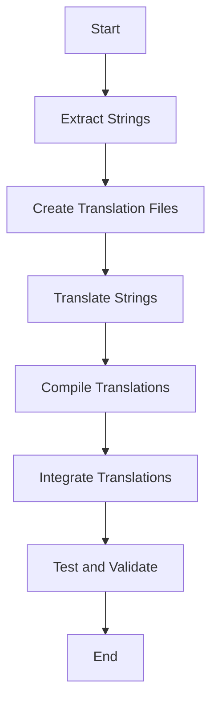

## 21.2 Localization (l10n) Techniques in PHP

Localization (l10n) is a crucial aspect of software development that involves adapting an application to meet the language and cultural requirements of a specific target market. In PHP, localization is achieved by translating text and adjusting cultural elements such as date formats, currency symbols, and more. This section will guide you through the essential techniques and tools available in PHP for effective localization.

### Defining Localization

Localization is the process of adapting an internationalized application for a specific region or language. This involves translating text, adjusting cultural elements, and ensuring that the application behaves correctly in different locales. The goal is to make the application feel native to users in different regions.

#### Key Concepts

- **Translation:** Converting text from one language to another.
- **Locale:** A set of parameters that defines the user's language, country, and any special variant preferences.
- **Cultural Elements:** Non-textual elements such as date formats, currency symbols, and measurement units that vary by locale.

### Implementing Localization

To implement localization in PHP, you need to externalize strings and content from your code and use translation files. This allows you to manage translations separately and makes it easier to update or add new languages.

#### Externalizing Strings

Externalizing strings involves moving all user-facing text out of your code and into separate files. This can be done using translation functions or arrays.

- **Translation Functions:** Use functions like `gettext()` to retrieve translated strings.
- **PHP Arrays:** Store translations in associative arrays, where keys represent the original text and values represent the translated text.

#### Using Gettext for Localization

Gettext is a popular tool for managing translations in PHP. It allows you to define translations in `.po` files, which are compiled into binary `.mo` files for use in your application.

```php
// Example of using gettext in PHP
// Set the locale
setlocale(LC_ALL, 'fr_FR');

// Specify the location of translation files
bindtextdomain("messages", "./locale");

// Choose the domain
textdomain("messages");

// Translate a string
echo gettext("Hello, World!");
```

In this example, the `gettext()` function retrieves the French translation of "Hello, World!" from the specified translation files.

#### Using PHP Arrays for Localization

If you prefer not to use Gettext, you can manage translations using PHP arrays. This approach is simpler but less scalable for large applications.

```php
// Example of using PHP arrays for localization
$translations = [
    'en' => [
        'greeting' => 'Hello, World!',
    ],
    'fr' => [
        'greeting' => 'Bonjour, le monde!',
    ],
];

// Function to get translation
function translate($key, $locale = 'en') {
    global $translations;
    return $translations[$locale][$key] ?? $key;
}

// Usage
echo translate('greeting', 'fr');
```

### Localization Libraries and Extensions

PHP offers several libraries and extensions to facilitate localization. Two of the most commonly used are the Gettext extension and the Intl extension.

#### PHP Gettext Extension

The Gettext extension provides native support for translation using `.po` and `.mo` files. It is widely used for its efficiency and ease of integration with translation tools.

- **Installation:** Ensure the Gettext extension is enabled in your PHP installation.
- **Usage:** Use functions like `gettext()`, `ngettext()`, and `dgettext()` to retrieve translations.

For more information, refer to the [PHP Gettext Manual](https://www.php.net/manual/en/book.gettext.php).

#### Intl Extension (Internationalization)

The Intl extension provides a comprehensive set of tools for locale-aware formatting and operations. It supports various internationalization tasks, including number formatting, date and time formatting, and message formatting.

- **Locale-Aware Formatting:** Use `NumberFormatter` and `DateFormatter` classes to format numbers and dates according to the locale.
- **Message Formatting:** Use `MessageFormatter` to create locale-aware messages with placeholders.

```php
// Example of using Intl extension for number formatting
$numberFormatter = new NumberFormatter('fr_FR', NumberFormatter::CURRENCY);
echo $numberFormatter->formatCurrency(1234.56, 'EUR'); // Outputs: 1 234,56 €

// Example of using Intl extension for date formatting
$dateFormatter = new IntlDateFormatter('fr_FR', IntlDateFormatter::LONG, IntlDateFormatter::NONE);
echo $dateFormatter->format(new DateTime()); // Outputs: 23 novembre 2024
```

For more information, refer to the [PHP Intl Extension](https://www.php.net/manual/en/book.intl.php).

### Best Practices for Localization

To ensure effective localization, follow these best practices:

- **Use Placeholders:** Use placeholders in strings for dynamic content to avoid hardcoding values.
- **Consistent Keys:** Keep translation keys consistent and descriptive to make them easy to manage.
- **Avoid HTML in Strings:** Avoid embedding HTML tags or formatting in translatable strings to prevent translation errors.
- **Test Translations:** Regularly test translations to ensure accuracy and completeness.
- **Collaborate with Translators:** Work closely with professional translators to ensure cultural nuances are captured.

### Visualizing Localization Workflow

To better understand the localization workflow, let's visualize the process using a flowchart.



**Description:** This flowchart illustrates the localization workflow, starting from extracting strings from the code to testing and validating translations.

### Try It Yourself

Experiment with the code examples provided in this section. Try adding a new language or modifying existing translations. Use the Intl extension to format dates and numbers in different locales. Remember, practice is key to mastering localization techniques.

### Knowledge Check

- What is the purpose of localization in software development?
- How does the Gettext extension facilitate localization in PHP?
- What are some best practices for managing translation keys?

### Embrace the Journey

Localization is an ongoing process that requires attention to detail and cultural sensitivity. As you continue to develop your PHP applications, remember that localization is not just about translating text—it's about creating an experience that resonates with users from diverse backgrounds. Keep experimenting, stay curious, and enjoy the journey!

## Quiz: Localization (l10n) Techniques in PHP



### What is the primary goal of localization in PHP applications?

- [x] To adapt an application to meet the language and cultural requirements of a specific target market.
- [ ] To improve the performance of the application.
- [ ] To enhance the security of the application.
- [ ] To reduce the size of the application.

> **Explanation:** Localization aims to make applications feel native to users in different regions by adapting language and cultural elements.

### Which PHP extension is commonly used for managing translations with `.po` and `.mo` files?

- [x] Gettext
- [ ] Intl
- [ ] PDO
- [ ] GD

> **Explanation:** The Gettext extension is used for managing translations with `.po` and `.mo` files.

### What is a locale in the context of localization?

- [x] A set of parameters that defines the user's language, country, and any special variant preferences.
- [ ] A type of database connection.
- [ ] A function for formatting strings.
- [ ] A method for encrypting data.

> **Explanation:** A locale defines the user's language, country, and variant preferences, which are used for localization.

### Which PHP function is used to retrieve translated strings when using Gettext?

- [x] gettext()
- [ ] translate()
- [ ] format()
- [ ] localize()

> **Explanation:** The `gettext()` function is used to retrieve translated strings in PHP applications using Gettext.

### What is the purpose of using placeholders in translatable strings?

- [x] To avoid hardcoding values and allow dynamic content.
- [ ] To increase the size of the translation files.
- [ ] To make the application run faster.
- [ ] To encrypt the translations.

> **Explanation:** Placeholders are used to avoid hardcoding values and allow dynamic content in translations.

### Which PHP extension provides locale-aware formatting and operations?

- [ ] Gettext
- [x] Intl
- [ ] PDO
- [ ] GD

> **Explanation:** The Intl extension provides locale-aware formatting and operations in PHP.

### What is a best practice for managing translation keys?

- [x] Keep them consistent and descriptive.
- [ ] Use random strings for keys.
- [ ] Embed HTML tags in keys.
- [ ] Change them frequently.

> **Explanation:** Keeping translation keys consistent and descriptive helps in managing translations effectively.

### What is the role of the `NumberFormatter` class in the Intl extension?

- [x] To format numbers according to the locale.
- [ ] To translate text strings.
- [ ] To manage database connections.
- [ ] To encrypt data.

> **Explanation:** The `NumberFormatter` class is used to format numbers according to the locale in PHP.

### Why is it important to avoid embedding HTML tags in translatable strings?

- [x] To prevent translation errors and ensure clean translations.
- [ ] To increase the size of the translation files.
- [ ] To make the application run faster.
- [ ] To encrypt the translations.

> **Explanation:** Avoiding HTML tags in translatable strings prevents translation errors and ensures clean translations.

### True or False: Localization is only about translating text in an application.

- [ ] True
- [x] False

> **Explanation:** Localization involves translating text and adapting cultural elements such as date formats and currency symbols.


