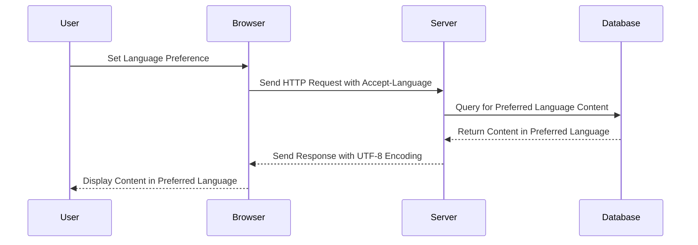

## 21.3 Handling Multiple Languages and Character Encodings

In today's globalized world, software applications often need to support multiple languages and character encodings to cater to diverse user bases. This section will guide you through the essential concepts and techniques for handling multiple languages and character encodings in PHP, ensuring your applications are inclusive and accessible to users worldwide.

### Understanding Character Encoding

Character encoding is a system that pairs each character in a set with a specific code. UTF-8 is the most widely used encoding system, supporting a vast range of characters from different languages. It is crucial to ensure that all parts of your application, including databases, HTML pages, and PHP scripts, consistently use UTF-8 encoding to avoid data corruption and display issues.

#### Why UTF-8?

- **Wide Range of Characters**: UTF-8 can represent any character in the Unicode standard, making it suitable for multilingual applications.
- **Backward Compatibility**: UTF-8 is compatible with ASCII, which means it can handle legacy data without issues.
- **Efficiency**: UTF-8 uses variable-length encoding, which is space-efficient for texts primarily in English or other Latin-based languages.

#### Setting UTF-8 in PHP

To ensure your PHP application uses UTF-8 encoding, follow these steps:

1. **Set the Default Charset**: Configure your PHP environment to use UTF-8 by default.

   ```php
   ini_set('default_charset', 'UTF-8');
   ```

2. **Set the Content-Type Header**: Ensure your HTTP responses specify UTF-8 encoding.

   ```php
   header('Content-Type: text/html; charset=UTF-8');
   ```

3. **Database Configuration**: When using databases like MySQL, set the character set to `utf8mb4` to support a wide range of characters, including emojis.

   ```sql
   SET NAMES 'utf8mb4';
   ```

### Multibyte String Functions

PHP's `mbstring` extension provides functions for handling multibyte characters, which are essential for processing text in languages that use characters beyond the basic ASCII set.

#### Key Functions

- **`mb_strlen`**: Get the length of a string in characters, not bytes.

  ```php
  $length = mb_strlen($string, 'UTF-8');
  ```

- **`mb_substr`**: Extract a substring from a multibyte string.

  ```php
  $substring = mb_substr($string, 0, 10, 'UTF-8');
  ```

- **`mb_convert_encoding`**: Convert a string to a different encoding.

  ```php
  $converted = mb_convert_encoding($string, 'UTF-8', 'ISO-8859-1');
  ```

For more information, refer to the [PHP Multibyte String Functions](https://www.php.net/manual/en/book.mbstring.php).

### Language Detection

Detecting the user's preferred language is a critical step in providing a personalized experience. PHP can detect language preferences through the `HTTP_ACCEPT_LANGUAGE` header sent by the user's browser.

#### Implementing Language Detection

1. **Read the Header**: Access the `HTTP_ACCEPT_LANGUAGE` header to get the user's language preferences.

   ```php
   $languages = $_SERVER['HTTP_ACCEPT_LANGUAGE'];
   ```

2. **Parse the Header**: Extract the preferred language from the header.

   ```php
   function getPreferredLanguage($availableLanguages, $httpAcceptLanguage) {
       $langs = explode(',', $httpAcceptLanguage);
       foreach ($langs as $lang) {
           $lang = substr($lang, 0, 2);
           if (in_array($lang, $availableLanguages)) {
               return $lang;
           }
       }
       return $availableLanguages[0]; // Default language
   }

   $preferredLanguage = getPreferredLanguage(['en', 'es', 'fr'], $languages);
   ```

3. **Allow Manual Selection**: Provide users with an option to manually select their preferred language, overriding the automatic detection.

### Storing Multilingual Data

When dealing with multilingual data, it's essential to use a database that supports UTF-8 encoding. MySQL with the `utf8mb4` charset is a popular choice for storing multilingual data.

#### Best Practices for Multilingual Data Storage

- **Use `utf8mb4` Charset**: Ensure your database tables and columns use the `utf8mb4` charset to support a wide range of characters.

  ```sql
  CREATE TABLE translations (
      id INT AUTO_INCREMENT PRIMARY KEY,
      language_code VARCHAR(5) NOT NULL,
      text VARCHAR(255) CHARACTER SET utf8mb4 NOT NULL
  );
  ```

- **Normalize Data**: Store translations in a separate table with a language code to easily manage and query multilingual content.

- **Index Language Columns**: Index columns that store language codes to optimize query performance.

### Visualizing Language Handling Workflow

To better understand the workflow of handling multiple languages and character encodings, let's visualize the process using a sequence diagram.



### Knowledge Check

- **Question**: Why is UTF-8 preferred for multilingual applications?
- **Question**: How can you detect a user's language preference in PHP?
- **Question**: What is the purpose of the `mbstring` extension in PHP?

### Try It Yourself

Experiment with the code examples provided in this section. Try modifying the language detection function to support more languages or implement a simple multilingual application that displays content based on user preferences.

### Summary

Handling multiple languages and character encodings in PHP is crucial for creating inclusive and accessible applications. By using UTF-8 encoding, leveraging multibyte string functions, detecting user language preferences, and storing multilingual data effectively, you can ensure your application meets the needs of a global audience.

### Further Reading

- [PHP Manual: Multibyte String Functions](https://www.php.net/manual/en/book.mbstring.php)
- [W3C: Character Model for the World Wide Web](https://www.w3.org/TR/charmod/)
- [MDN Web Docs: HTTP Accept-Language Header](https://developer.mozilla.org/en-US/docs/Web/HTTP/Headers/Accept-Language)

## Quiz: Handling Multiple Languages and Character Encodings



### Why is UTF-8 preferred for multilingual applications?

- [x] It supports a wide range of characters.
- [ ] It is the fastest encoding.
- [ ] It is the oldest encoding.
- [ ] It is only used for English.

> **Explanation:** UTF-8 can represent any character in the Unicode standard, making it suitable for multilingual applications.

### How can you detect a user's language preference in PHP?

- [x] By reading the `HTTP_ACCEPT_LANGUAGE` header.
- [ ] By checking the user's IP address.
- [ ] By analyzing the user's browser history.
- [ ] By using cookies.

> **Explanation:** The `HTTP_ACCEPT_LANGUAGE` header sent by the user's browser indicates their language preferences.

### What is the purpose of the `mbstring` extension in PHP?

- [x] To handle multibyte characters properly.
- [ ] To speed up PHP execution.
- [ ] To manage database connections.
- [ ] To enhance security.

> **Explanation:** The `mbstring` extension provides functions for handling multibyte characters, essential for processing text in languages beyond the basic ASCII set.

### Which charset should be used in MySQL for multilingual data?

- [x] `utf8mb4`
- [ ] `latin1`
- [ ] `ascii`
- [ ] `utf16`

> **Explanation:** `utf8mb4` supports a wide range of characters, including emojis, making it suitable for multilingual data.

### What function can you use to get the length of a multibyte string?

- [x] `mb_strlen`
- [ ] `strlen`
- [ ] `mb_substr`
- [ ] `substr`

> **Explanation:** `mb_strlen` returns the length of a string in characters, not bytes, which is crucial for multibyte strings.

### How can you convert a string to UTF-8 encoding in PHP?

- [x] `mb_convert_encoding`
- [ ] `iconv`
- [ ] `utf8_encode`
- [ ] `strtoupper`

> **Explanation:** `mb_convert_encoding` is used to convert a string to a different encoding, such as UTF-8.

### What is the default charset setting in PHP for UTF-8?

- [x] `default_charset`
- [ ] `default_encoding`
- [ ] `charset`
- [ ] `encoding`

> **Explanation:** The `default_charset` directive in PHP's configuration specifies the default character set, which can be set to UTF-8.

### Which HTTP header is used to specify the content type and charset?

- [x] `Content-Type`
- [ ] `Accept-Language`
- [ ] `User-Agent`
- [ ] `Authorization`

> **Explanation:** The `Content-Type` header specifies the media type and character set of the HTTP response.

### What is the benefit of using `utf8mb4` over `utf8` in MySQL?

- [x] It supports a wider range of characters, including emojis.
- [ ] It is faster.
- [ ] It uses less storage space.
- [ ] It is more secure.

> **Explanation:** `utf8mb4` supports a wider range of characters, including emojis, compared to `utf8`.

### True or False: UTF-8 is compatible with ASCII.

- [x] True
- [ ] False

> **Explanation:** UTF-8 is backward compatible with ASCII, meaning it can handle legacy data without issues.



Remember, this is just the beginning. As you progress, you'll build more complex and interactive applications that cater to a global audience. Keep experimenting, stay curious, and enjoy the journey!
