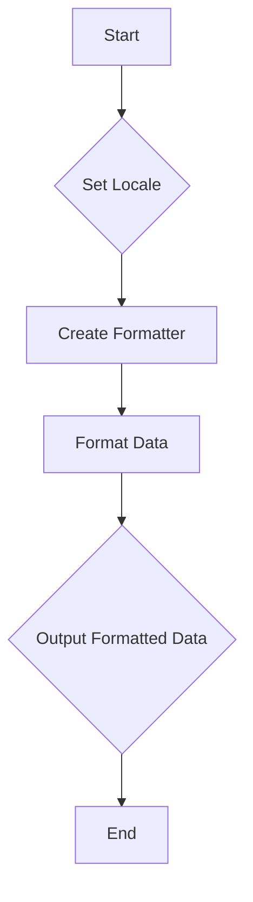

## 21.4 Formatting Dates, Numbers, and Currencies

In today's globalized world, creating applications that cater to a diverse audience is crucial. Formatting dates, numbers, and currencies according to local conventions is a key aspect of internationalization (i18n) and localization (l10n). PHP provides robust tools to handle these tasks efficiently. In this section, we'll explore how to format dates, numbers, and currencies in PHP using locale-aware techniques, ensuring your applications are user-friendly and culturally appropriate.

### Locale-Aware Formatting

Locale-aware formatting is essential for presenting data in a way that is familiar and understandable to users from different regions. PHP's `IntlDateFormatter` and `NumberFormatter` classes, part of the Internationalization extension (Intl), are powerful tools for achieving this.

#### Formatting Dates and Times

The `IntlDateFormatter` class allows you to format dates and times according to locale-specific rules. This class is part of the PHP Internationalization extension, which provides a comprehensive set of tools for handling locale-sensitive operations.

**Example: Formatting Dates with `IntlDateFormatter`**

```php
<?php
// Set the locale to French (France)
$locale = 'fr_FR';

// Create a new IntlDateFormatter instance
$dateFormatter = new IntlDateFormatter(
    $locale,
    IntlDateFormatter::LONG,
    IntlDateFormatter::NONE
);

// Format the current date
echo $dateFormatter->format(new DateTime()); // Outputs: 23 novembre 2024
?>
```

In this example, we set the locale to French (France) and format the current date using the `IntlDateFormatter` class. The `IntlDateFormatter::LONG` constant specifies that we want a long date format.

**Link:** [IntlDateFormatter](https://www.php.net/manual/en/class.intldateformatter.php)

#### Formatting Numbers and Currencies

The `NumberFormatter` class is used to format numbers and currencies according to locale-specific rules. This class provides a flexible way to handle different number formats, including decimal, currency, percent, and more.

**Example: Formatting Currencies with `NumberFormatter`**

```php
<?php
// Set the locale to Japanese (Japan)
$locale = 'ja_JP';

// Create a new NumberFormatter instance for currency
$currencyFormatter = new NumberFormatter($locale, NumberFormatter::CURRENCY);

// Format a currency value
echo $currencyFormatter->formatCurrency(123456.78, 'JPY'); // Outputs: ￥123,457
?>
```

In this example, we set the locale to Japanese (Japan) and format a currency value using the `NumberFormatter` class. The `NumberFormatter::CURRENCY` constant specifies that we want to format the number as a currency.

**Link:** [NumberFormatter](https://www.php.net/manual/en/class.numberformatter.php)

### Time Zones

Handling different time zones is another critical aspect of internationalization. PHP's `DateTime` and `DateTimeZone` classes provide a robust way to manage time zones.

**Example: Handling Time Zones with `DateTime` and `DateTimeZone`**

```php
<?php
// Create a new DateTime object for the current time
$date = new DateTime('now', new DateTimeZone('America/New_York'));

// Output the date and time in the specified time zone
echo $date->format('Y-m-d H:i:s'); // Outputs: 2024-11-23 12:34:56

// Change the time zone to Tokyo
$date->setTimezone(new DateTimeZone('Asia/Tokyo'));

// Output the date and time in the new time zone
echo $date->format('Y-m-d H:i:s'); // Outputs: 2024-11-24 02:34:56
?>
```

In this example, we create a `DateTime` object for the current time in the New York time zone and then change the time zone to Tokyo. The `DateTimeZone` class allows us to specify the desired time zone.

### Best Practices

When formatting dates, numbers, and currencies, it's important to follow best practices to ensure your applications are user-friendly and culturally appropriate.

- **Avoid Hard-Coded Formats:** Rely on locale data instead of hard-coding date, number, and currency formats. This ensures your application can adapt to different locales without requiring code changes.

- **Support User Preferences:** Allow users to specify their preferred formats for dates, numbers, and currencies. This can enhance the user experience by providing a more personalized interface.

- **Test with Multiple Locales:** Test your application with multiple locales to ensure it behaves correctly in different cultural contexts. This can help identify potential issues with formatting and localization.

### Visualizing Locale-Aware Formatting

To better understand how locale-aware formatting works, let's visualize the process using a flowchart.



This flowchart illustrates the steps involved in locale-aware formatting: setting the locale, creating a formatter, formatting the data, and outputting the formatted data.

### Try It Yourself

Experiment with the code examples provided in this section. Try changing the locale to see how it affects the formatting of dates, numbers, and currencies. You can also explore different formatting styles and options available in the `IntlDateFormatter` and `NumberFormatter` classes.

### Knowledge Check

- Explain the purpose of the `IntlDateFormatter` and `NumberFormatter` classes.
- Demonstrate how to format a date in a specific locale using `IntlDateFormatter`.
- Provide an example of formatting a currency value using `NumberFormatter`.
- Describe how to handle different time zones using PHP's `DateTime` and `DateTimeZone` classes.

### Embrace the Journey

Remember, mastering date, number, and currency formatting is just one aspect of creating internationalized applications. As you continue to explore PHP's internationalization and localization capabilities, you'll discover new ways to enhance your applications and reach a global audience. Keep experimenting, stay curious, and enjoy the journey!

## Quiz: Formatting Dates, Numbers, and Currencies



### What is the primary purpose of the `IntlDateFormatter` class in PHP?

- [x] To format dates and times according to locale-specific rules
- [ ] To convert dates to timestamps
- [ ] To parse date strings into `DateTime` objects
- [ ] To handle time zone conversions

> **Explanation:** The `IntlDateFormatter` class is used to format dates and times according to locale-specific rules, making it a key tool for internationalization.

### Which PHP class is used for formatting numbers and currencies?

- [x] NumberFormatter
- [ ] IntlDateFormatter
- [ ] DateTime
- [ ] DateTimeZone

> **Explanation:** The `NumberFormatter` class is specifically designed for formatting numbers and currencies according to locale-specific rules.

### How can you change the time zone of a `DateTime` object in PHP?

- [x] By using the `setTimezone` method with a `DateTimeZone` object
- [ ] By creating a new `DateTime` object with the desired time zone
- [ ] By modifying the `timezone` property directly
- [ ] By using the `IntlDateFormatter` class

> **Explanation:** The `setTimezone` method of the `DateTime` class allows you to change the time zone of an existing `DateTime` object.

### What is a best practice when formatting dates, numbers, and currencies in PHP?

- [x] Avoid hard-coded formats and rely on locale data
- [ ] Use hard-coded formats for consistency
- [ ] Ignore user preferences for formats
- [ ] Test with a single locale only

> **Explanation:** Avoiding hard-coded formats and relying on locale data ensures that your application can adapt to different locales without requiring code changes.

### Which method of the `NumberFormatter` class is used to format currency values?

- [x] formatCurrency
- [ ] formatNumber
- [ ] formatDecimal
- [ ] formatPercent

> **Explanation:** The `formatCurrency` method of the `NumberFormatter` class is used to format currency values according to locale-specific rules.

### What is the output of the following code snippet if the locale is set to 'en_US'?

```php
$formatter = new NumberFormatter('en_US', NumberFormatter::CURRENCY);
echo $formatter->formatCurrency(1000, 'USD');
```

- [x] $1,000.00
- [ ] 1000 USD
- [ ] 1,000.00 USD
- [ ] $1000

> **Explanation:** In the 'en_US' locale, the `NumberFormatter::CURRENCY` format outputs currency values with a dollar sign and two decimal places, separated by a comma.

### Which PHP class is used to handle time zones?

- [x] DateTimeZone
- [ ] IntlDateFormatter
- [ ] NumberFormatter
- [ ] DateTime

> **Explanation:** The `DateTimeZone` class is used to handle time zones in PHP, allowing you to specify and manipulate time zones for `DateTime` objects.

### What is the result of formatting a date with `IntlDateFormatter` using the `IntlDateFormatter::LONG` format in the 'fr_FR' locale?

- [x] 23 novembre 2024
- [ ] 11/23/2024
- [ ] November 23, 2024
- [ ] 2024-11-23

> **Explanation:** In the 'fr_FR' locale, the `IntlDateFormatter::LONG` format outputs dates in the format "23 novembre 2024".

### Which of the following is a benefit of using locale-aware formatting?

- [x] It ensures data is presented in a way that is familiar to users from different regions
- [ ] It simplifies code by using hard-coded formats
- [ ] It eliminates the need for user preferences
- [ ] It reduces the need for testing

> **Explanation:** Locale-aware formatting ensures that data is presented in a way that is familiar and understandable to users from different regions, enhancing the user experience.

### True or False: The `IntlDateFormatter` and `NumberFormatter` classes are part of the PHP Internationalization extension.

- [x] True
- [ ] False

> **Explanation:** Both the `IntlDateFormatter` and `NumberFormatter` classes are part of the PHP Internationalization extension, which provides tools for handling locale-sensitive operations.


