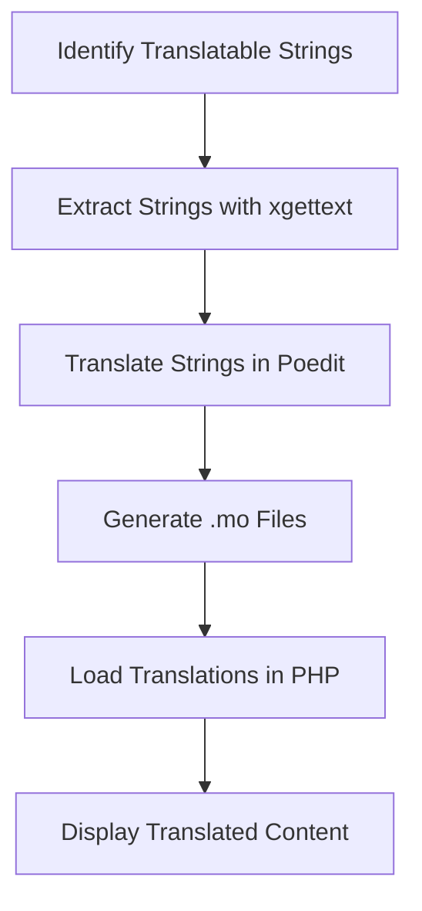

## 21.5 Translation Files and Resources

In today's globalized world, developing applications that cater to a diverse audience is crucial. Internationalization (i18n) and localization (l10n) are essential processes that enable software to adapt to different languages and cultural contexts. In this section, we will delve into the intricacies of translation files and resources in PHP, providing you with the knowledge to effectively manage internationalization and localization for your applications.

### Understanding Translation Files

Translation files are the backbone of any internationalized application. They store the translations of text strings used in your application, allowing you to present content in multiple languages without altering the core codebase.

#### Message Catalogs

Message catalogs are structured files that contain translations. They can be stored in various formats, each with its own advantages and use cases:

- **.po and .mo Files:** These are standard formats used by the GNU gettext system. `.po` files are human-readable and editable, while `.mo` files are binary and optimized for performance.
- **JSON Files:** JSON is a lightweight data-interchange format that is easy to read and write. It is widely used in web applications for storing translations.
- **PHP Arrays:** Translations can also be stored in PHP arrays, which are easy to integrate into PHP applications.
  
#### Organizing Translations

Proper organization of translation files is crucial for maintainability and scalability. Here are some best practices:

- **Group Translations by Language and Context:** Create separate files for each language, and further organize them by context or module. This makes it easier to manage and update translations.
- **Use Consistent Keys:** Use descriptive and consistent keys for mapping original strings to translations. This ensures clarity and reduces the risk of errors.

### Tools for Managing Translations

Managing translations can be a daunting task, especially for large applications. Fortunately, there are several tools available to streamline the process:

#### Poedit

Poedit is a popular editor for `.po` files. It provides a user-friendly interface for editing translations and supports features like translation memory and fuzzy matching.

- **Link:** [Poedit Translation Editor](https://poedit.net/)

#### Loco Translate

Loco Translate is an online service and WordPress plugin that simplifies the management of translations. It offers features like collaborative editing and automatic translation suggestions.

- **Link:** [Loco Translate](https://localise.biz/)

### Automating Translation Extraction

Manually extracting translatable strings from your code can be time-consuming and error-prone. Automation tools can help streamline this process:

- **gettext:** A widely used tool for extracting translatable strings from source code. It supports various programming languages, including PHP.
- **xgettext:** Part of the GNU gettext package, xgettext scans your codebase and generates `.po` files with extracted strings.

### Implementing Translation Files in PHP

Let's explore how to implement translation files in a PHP application. We'll use a simple example to demonstrate the process.

#### Step 1: Define Translatable Strings

First, identify the strings in your application that need translation. Wrap these strings in a function call to mark them as translatable. For example:

```php
echo _("Welcome to our website!");
```

#### Step 2: Extract Translatable Strings

Use a tool like xgettext to extract translatable strings from your codebase and generate a `.po` file:

```bash
xgettext -o messages.po *.php
```

#### Step 3: Translate Strings

Open the generated `.po` file in a translation editor like Poedit and provide translations for each string. Save the file to generate a corresponding `.mo` file.

#### Step 4: Load Translations in PHP

Use the gettext extension in PHP to load and use translations. Here's an example:

```php
// Set the locale
$locale = 'fr_FR';
putenv("LC_ALL=$locale");
setlocale(LC_ALL, $locale);

// Specify the location of translation files
bindtextdomain("messages", "./locale");
textdomain("messages");

// Output a translated string
echo _("Welcome to our website!");
```

### Visualizing the Translation Process

To better understand the translation process, let's visualize it using a flowchart:



### Best Practices for Translation Files

- **Keep Translations Up-to-Date:** Regularly update translation files to reflect changes in the source language.
- **Use Consistent Terminology:** Ensure that translations use consistent terminology across different languages.
- **Test Translations Thoroughly:** Test your application in different languages to ensure that translations are displayed correctly and contextually appropriate.

### PHP Unique Features for Internationalization

PHP offers several unique features that facilitate internationalization:

- **gettext Extension:** Provides a robust framework for managing translations.
- **Locale Functions:** PHP includes functions for setting and retrieving locale information, which is essential for formatting dates, numbers, and currencies.

### Differences and Similarities with Other Languages

While the concepts of internationalization and localization are similar across programming languages, PHP's integration with the gettext system provides a distinct advantage in terms of performance and ease of use.

### Try It Yourself

Experiment with the code examples provided in this section. Try adding new translatable strings, generating `.po` and `.mo` files, and displaying translations in different languages. This hands-on practice will reinforce your understanding of translation files and resources in PHP.

### Knowledge Check

- **What are the different formats for storing translation files?**
- **How can you automate the extraction of translatable strings in PHP?**
- **What tools can you use to manage translations effectively?**

### Embrace the Journey

Remember, mastering internationalization and localization is a journey. As you continue to develop applications for a global audience, you'll encounter new challenges and opportunities. Stay curious, keep experimenting, and enjoy the process of creating inclusive and accessible software.

## Quiz: Translation Files and Resources



### What is the primary purpose of translation files in PHP?

- [x] To store translations of text strings for different languages
- [ ] To compile PHP code into binary format
- [ ] To manage database connections
- [ ] To optimize PHP performance

> **Explanation:** Translation files store translations of text strings, enabling applications to present content in multiple languages.

### Which file format is commonly used with the GNU gettext system for translations?

- [x] .po and .mo files
- [ ] .xml files
- [ ] .ini files
- [ ] .csv files

> **Explanation:** The .po and .mo file formats are standard for the GNU gettext system, with .po files being human-readable and .mo files being binary.

### What is the role of xgettext in the translation process?

- [x] To extract translatable strings from source code
- [ ] To compile PHP scripts
- [ ] To manage database transactions
- [ ] To optimize PHP performance

> **Explanation:** xgettext is used to extract translatable strings from source code, generating .po files for translation.

### Which tool is a popular editor for .po files?

- [x] Poedit
- [ ] Visual Studio Code
- [ ] Sublime Text
- [ ] Atom

> **Explanation:** Poedit is a widely used editor for .po files, offering features like translation memory and fuzzy matching.

### What is the advantage of using JSON files for translations?

- [x] They are lightweight and easy to read
- [ ] They are binary and optimized for performance
- [ ] They support complex data structures
- [ ] They are compatible with all programming languages

> **Explanation:** JSON files are lightweight and easy to read, making them a popular choice for storing translations in web applications.

### How can you load translations in a PHP application?

- [x] By using the gettext extension
- [ ] By using the PDO extension
- [ ] By using the cURL extension
- [ ] By using the GD extension

> **Explanation:** The gettext extension in PHP is used to load and manage translations.

### What is a best practice for organizing translation files?

- [x] Group translations by language and context
- [ ] Store all translations in a single file
- [ ] Use random keys for mapping strings
- [ ] Avoid using translation files

> **Explanation:** Grouping translations by language and context improves maintainability and scalability.

### Which PHP function is used to set the locale for translations?

- [x] setlocale()
- [ ] setlanguage()
- [ ] settranslation()
- [ ] setregion()

> **Explanation:** The setlocale() function is used to set the locale for translations in PHP.

### What is the benefit of using consistent keys in translation files?

- [x] It ensures clarity and reduces errors
- [ ] It increases file size
- [ ] It complicates the translation process
- [ ] It makes translations less readable

> **Explanation:** Using consistent keys ensures clarity and reduces the risk of errors in translation files.

### True or False: gettext is a tool used for managing database connections in PHP.

- [ ] True
- [x] False

> **Explanation:** False. gettext is a tool used for managing translations in PHP, not database connections.



By mastering translation files and resources, you can create PHP applications that are accessible and appealing to users worldwide. Keep exploring and applying these concepts to enhance your software's reach and impact.
