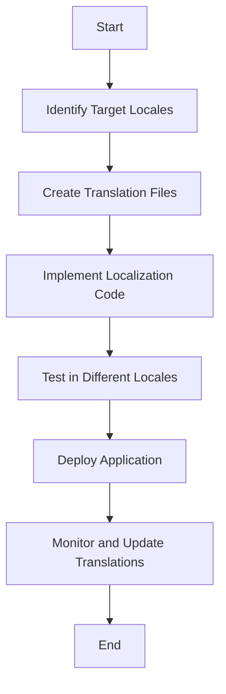

## 21.6 Implementing Localization in Frameworks

As the world becomes increasingly interconnected, the need for software applications to support multiple languages and regions has never been more critical. Localization (l10n) is the process of adapting software for different languages, regions, and cultures. In this section, we will explore how to implement localization in popular PHP frameworks such as Laravel, Symfony, and CakePHP. We will also discuss best practices and provide code examples to help you get started.

### Understanding Localization in PHP Frameworks

Localization involves more than just translating text. It encompasses formatting dates, numbers, and currencies, handling different character encodings, and managing locale-specific content. PHP frameworks offer built-in tools and libraries to facilitate localization, making it easier for developers to create applications that cater to a global audience.

### Laravel Localization

Laravel is a popular PHP framework known for its elegant syntax and powerful features. It provides robust support for localization through its built-in localization features.

#### Language Files

Laravel stores language files in the `resources/lang/` directory. Each language has its own subdirectory containing translation files. These files can be in PHP, JSON, or other formats, and they store key-value pairs for translations.

```php
// resources/lang/en/messages.php
return [
    'welcome' => 'Welcome to our application!',
    'goodbye' => 'Goodbye and see you soon!',
];
```

#### Retrieving Translations

Laravel provides several helper functions for retrieving translations. The `__()` function is commonly used to fetch translation strings.

```php
echo __('messages.welcome'); // Outputs: Welcome to our application!
```

#### Pluralization

Laravel supports pluralization, allowing you to define different translations based on the count.

```php
// resources/lang/en/messages.php
return [
    'apples' => 'There is one apple|There are many apples',
];

// Usage
echo trans_choice('messages.apples', 1); // Outputs: There is one apple
echo trans_choice('messages.apples', 5); // Outputs: There are many apples
```

#### Localization Middleware

Laravel includes middleware to set the application's locale based on user preferences or other criteria. You can define middleware to automatically set the locale for each request.

```php
namespace App\Http\Middleware;

use Closure;
use Illuminate\Support\Facades\App;

class SetLocale
{
    public function handle($request, Closure $next)
    {
        $locale = $request->get('locale', 'en');
        App::setLocale($locale);

        return $next($request);
    }
}
```

#### Further Reading

For more information on Laravel localization, refer to the [Laravel Localization Documentation](https://laravel.com/docs/localization).

### Symfony Translation Component

Symfony is another powerful PHP framework that offers extensive support for localization through its Translation component.

#### Translation Files

Symfony supports various formats for translation files, including XLIFF, YAML, and PHP. These files are stored in the `translations/` directory.

```yaml
# translations/messages.en.yaml
welcome: 'Welcome to our application!'
goodbye: 'Goodbye and see you soon!'
```

#### Using the Translator Service

Symfony provides a `Translator` service to handle translations. You can inject this service into your controllers or services to retrieve translations.

```php
use Symfony\Contracts\Translation\TranslatorInterface;

class WelcomeController
{
    private $translator;

    public function __construct(TranslatorInterface $translator)
    {
        $this->translator = $translator;
    }

    public function index()
    {
        $message = $this->translator->trans('welcome');
        echo $message; // Outputs: Welcome to our application!
    }
}
```

#### Pluralization and Parameters

Symfony supports pluralization and parameterized translations, allowing you to create dynamic translation strings.

```yaml
# translations/messages.en.yaml
apples: '{0} There are no apples|{1} There is one apple|]1,Inf] There are %count% apples'

// Usage
$message = $translator->trans('apples', ['%count%' => 5]);
echo $message; // Outputs: There are 5 apples
```

#### Locale Management

Symfony allows you to manage locales through configuration or programmatically. You can set the default locale in the configuration file or change it dynamically in your application.

```yaml
# config/packages/translation.yaml
framework:
    default_locale: 'en'
```

#### Further Reading

For more information on Symfony localization, refer to the [Symfony Translation Documentation](https://symfony.com/doc/current/translation.html).

### CakePHP Internationalization

CakePHP is a PHP framework that provides tools for internationalization and localization, making it easy to create multilingual applications.

#### Message Translation

CakePHP uses the `__()` function for message translation. Translation files are stored in the `resources/locales/` directory.

```php
// resources/locales/en_US/default.po
msgid "welcome"
msgstr "Welcome to our application!"

// Usage
echo __('welcome'); // Outputs: Welcome to our application!
```

#### Locale Management

CakePHP allows you to manage locales through configuration or programmatically. You can set the default locale in the configuration file or change it dynamically in your application.

```php
// config/app.php
'App' => [
    'defaultLocale' => 'en_US',
],
```

#### Pluralization

CakePHP supports pluralization, allowing you to define different translations based on the count.

```php
// resources/locales/en_US/default.po
msgid "apples"
msgid_plural "apples"
msgstr[0] "There is one apple"
msgstr[1] "There are %d apples"

// Usage
echo __n('apple', 'apples', 5); // Outputs: There are 5 apples
```

#### Further Reading

For more information on CakePHP localization, refer to the [CakePHP Internationalization Documentation](https://book.cakephp.org/4/en/core-libraries/internationalization-and-localization.html).

### Best Practices for Localization in PHP Frameworks

Implementing localization effectively requires adherence to best practices. Here are some tips to ensure your application is well-localized:

- **Use Framework-Specific Features:** Leverage the built-in localization features provided by your framework to streamline the localization process.
- **Organize Translation Files:** Follow community standards for file structures and naming conventions to keep your translation files organized and maintainable.
- **Test Localization Thoroughly:** Test your application in different locales to ensure translations are accurate and the user experience is consistent across languages.
- **Consider Cultural Differences:** Be mindful of cultural differences when localizing content, such as date formats, currency symbols, and idiomatic expressions.
- **Automate Translation Updates:** Use tools and services to automate the process of updating and managing translations, reducing the risk of errors and inconsistencies.

### Visualizing Localization Workflow

To better understand the localization workflow in PHP frameworks, let's visualize the process using a Mermaid.js flowchart.



**Description:** This flowchart illustrates the typical workflow for implementing localization in a PHP application. It begins with identifying target locales, creating translation files, implementing localization code, testing in different locales, deploying the application, and monitoring and updating translations as needed.

### Try It Yourself

To deepen your understanding of localization in PHP frameworks, try modifying the code examples provided in this section. Experiment with adding new languages, creating custom translation files, and testing different localization scenarios.

### Knowledge Check

- What are the key differences between localization and internationalization?
- How does Laravel handle pluralization in translation strings?
- What is the purpose of the `Translator` service in Symfony?
- How can you set the default locale in CakePHP?

### Embrace the Journey

Localization is a crucial aspect of modern software development, enabling applications to reach a global audience. By leveraging the localization features provided by PHP frameworks, you can create applications that are not only functional but also culturally relevant. Remember, this is just the beginning. As you continue to explore localization, you'll discover new techniques and tools to enhance your applications further. Keep experimenting, stay curious, and enjoy the journey!

## Quiz: Implementing Localization in Frameworks



### What is the primary purpose of localization in software development?

- [x] Adapting software for different languages and regions
- [ ] Improving software performance
- [ ] Enhancing user interface design
- [ ] Increasing software security

> **Explanation:** Localization involves adapting software for different languages, regions, and cultures, ensuring it is accessible and relevant to a global audience.

### Which PHP framework stores language files in the `resources/lang/` directory?

- [x] Laravel
- [ ] Symfony
- [ ] CakePHP
- [ ] CodeIgniter

> **Explanation:** Laravel stores language files in the `resources/lang/` directory, where each language has its own subdirectory containing translation files.

### How does Symfony handle translations?

- [x] Using the `Translator` service
- [ ] Through middleware
- [ ] By storing translations in JSON files
- [ ] Using environment variables

> **Explanation:** Symfony uses the `Translator` service to handle translations, allowing developers to retrieve translation strings programmatically.

### What function does CakePHP use for message translation?

- [x] `__()`
- [ ] `trans()`
- [ ] `translate()`
- [ ] `localize()`

> **Explanation:** CakePHP uses the `__()` function for message translation, retrieving the appropriate translation string based on the current locale.

### Which of the following is a best practice for localization?

- [x] Organize translation files using community standards
- [ ] Hardcode translations in the application code
- [ ] Use global variables for translations
- [ ] Avoid testing in different locales

> **Explanation:** Organizing translation files using community standards helps keep them maintainable and consistent, which is a best practice for localization.

### What is the benefit of using pluralization in translations?

- [x] It allows for different translations based on count
- [ ] It improves application performance
- [ ] It simplifies the translation process
- [ ] It enhances security

> **Explanation:** Pluralization allows developers to define different translations based on the count, ensuring that the correct grammatical form is used.

### How can you set the default locale in Symfony?

- [x] Through the configuration file
- [ ] By modifying the `.env` file
- [ ] Using a command-line argument
- [ ] Through a database setting

> **Explanation:** In Symfony, the default locale can be set through the configuration file, typically in `config/packages/translation.yaml`.

### What is the role of localization middleware in Laravel?

- [x] To set the application's locale based on user preferences
- [ ] To manage database connections
- [ ] To handle user authentication
- [ ] To optimize application performance

> **Explanation:** Localization middleware in Laravel is used to set the application's locale based on user preferences or other criteria, ensuring the correct translations are used.

### Which format is NOT supported by Symfony for translation files?

- [x] XML
- [ ] XLIFF
- [ ] YAML
- [ ] PHP

> **Explanation:** Symfony supports XLIFF, YAML, and PHP formats for translation files, but not XML.

### True or False: Localization only involves translating text in an application.

- [ ] True
- [x] False

> **Explanation:** Localization involves more than just translating text; it also includes formatting dates, numbers, currencies, and managing locale-specific content.


