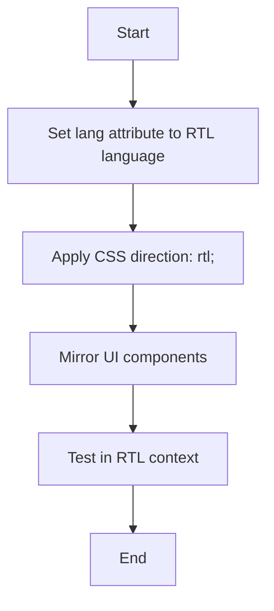

## 21.7 Right-to-Left (RTL) Language Support

In today's globalized world, creating applications that cater to diverse audiences is crucial. This includes supporting languages that are read from right to left (RTL), such as Arabic, Hebrew, and Persian. Implementing RTL support in PHP applications involves understanding the unique requirements of these languages and adapting your application's design and functionality accordingly.

### Understanding RTL Languages

RTL languages are those that are read and written from right to left. This orientation affects not only the text but also the overall layout and design of web applications. Here are some key considerations when working with RTL languages:

- **Text Direction:** The primary difference is the direction in which text is read and written. This affects how text is aligned and how it interacts with other elements on the page.
- **UI Components:** User interface components must be mirrored to align with the RTL orientation. This includes navigation menus, buttons, and other interactive elements.
- **Cultural Context:** Beyond technical considerations, understanding the cultural context of RTL languages is important for creating a user-friendly experience.

### Implementing RTL Support

Implementing RTL support in your PHP application involves several steps, from adjusting CSS properties to testing the application in an RTL context. Let's explore these steps in detail.

#### CSS Properties for RTL Support

CSS plays a crucial role in adapting your application's layout for RTL languages. Two key CSS properties are used to achieve this:

- **`direction: rtl;`**: This property sets the text direction to right-to-left. It should be applied to the root element of your application or specific containers that need RTL support.

- **`unicode-bidi: bidi-override;`**: This property ensures that the text direction is consistently applied, overriding any conflicting styles. It is often used in conjunction with the `direction` property.

Here's an example of how to apply these properties in your CSS:

```css
/* Apply RTL direction to the entire document */
body {
  direction: rtl;
  unicode-bidi: bidi-override;
}

/* Example of mirroring a navigation menu */
.navbar {
  text-align: right;
}
```

#### Mirroring UI Components

Mirroring UI components is essential to ensure that the user interface aligns with the RTL orientation. This involves reversing the layout of elements such as navigation bars, buttons, and icons.

For example, a typical left-aligned navigation menu should be right-aligned in an RTL context. Similarly, icons that indicate direction (e.g., arrows) should be mirrored to point in the opposite direction.

#### Framework Assistance

Many CSS frameworks offer built-in support for RTL languages, making it easier to implement RTL support in your application. Bootstrap, for example, provides an RTL version that automatically adjusts the layout and components for RTL languages.

- **Bootstrap RTL**: Bootstrap's RTL version includes mirrored components and adjusted styles to accommodate RTL languages. You can find more information and download the RTL version from the [Bootstrap RTL](https://rtlbootstrap.net/) website.

#### Testing RTL Layouts

Testing your application in an RTL context is crucial to ensure that the layout and functionality work as expected. This involves:

- **Visual Testing**: Check the visual appearance of your application in an RTL context. Ensure that all text, images, and UI components are correctly aligned and displayed.

- **Functional Testing**: Test the functionality of interactive elements, such as forms and navigation menus, to ensure they work seamlessly in an RTL context.

- **Cross-Browser Testing**: Test your application in different browsers to ensure consistent behavior across platforms.

### Code Examples

Let's look at a simple PHP application that supports RTL languages. We'll create a basic web page with a navigation menu and some text content.

```php
<!DOCTYPE html>
<html lang="ar">
<head>
    <meta charset="UTF-8">
    <meta name="viewport" content="width=device-width, initial-scale=1.0">
    <title>RTL Language Support Example</title>
    <link rel="stylesheet" href="styles.css">
</head>
<body>
    <header class="navbar">
        <nav>
            <ul>
                <li><a href="#">الرئيسية</a></li>
                <li><a href="#">حول</a></li>
                <li><a href="#">اتصل بنا</a></li>
            </ul>
        </nav>
    </header>
    <main>
        <h1>مرحبا بكم في موقعنا</h1>
        <p>هذا مثال على دعم اللغة من اليمين إلى اليسار باستخدام PHP و CSS.</p>
    </main>
</body>
</html>
```

In this example, we set the `lang` attribute to `ar` (Arabic) to indicate the language of the document. The CSS file (`styles.css`) includes the necessary styles for RTL support.

### Visualizing RTL Layouts

To better understand how RTL layouts work, let's visualize the process using a flowchart. This diagram illustrates the steps involved in implementing RTL support in a PHP application.



### Knowledge Check

To reinforce your understanding of RTL language support, consider the following questions:

- What are the key CSS properties used for RTL support?
- How do you mirror UI components for RTL languages?
- Why is testing important in an RTL context?

### Try It Yourself

Experiment with the code example provided by modifying the text content and adding additional UI components. Try changing the language to Hebrew or Persian and observe how the layout adapts.

### References and Links

For further reading on RTL language support and internationalization, consider the following resources:

- [MDN Web Docs: CSS Writing Modes](https://developer.mozilla.org/en-US/docs/Web/CSS/writing-mode)
- [W3Schools: CSS Text Direction](https://www.w3schools.com/cssref/pr_text_direction.asp)

### Embrace the Journey

Remember, implementing RTL support is just one aspect of creating a truly internationalized application. As you continue to explore internationalization and localization, you'll gain a deeper understanding of how to create applications that cater to diverse audiences. Keep experimenting, stay curious, and enjoy the journey!

## Quiz: Right-to-Left (RTL) Language Support



### What is the primary CSS property used to set text direction for RTL languages?

- [x] direction: rtl;
- [ ] text-align: right;
- [ ] unicode-bidi: rtl;
- [ ] writing-mode: rtl;

> **Explanation:** The `direction: rtl;` property is used to set the text direction to right-to-left.

### Which CSS property is used in conjunction with `direction` to ensure consistent text direction?

- [x] unicode-bidi: bidi-override;
- [ ] text-align: right;
- [ ] writing-mode: rtl;
- [ ] float: right;

> **Explanation:** The `unicode-bidi: bidi-override;` property is used to ensure consistent text direction, overriding any conflicting styles.

### What is the purpose of mirroring UI components in RTL support?

- [x] To align the user interface with the RTL orientation
- [ ] To change the language of the text
- [ ] To improve performance
- [ ] To enhance security

> **Explanation:** Mirroring UI components ensures that the user interface aligns with the RTL orientation, providing a seamless experience for users of RTL languages.

### Which CSS framework provides built-in RTL support?

- [x] Bootstrap
- [ ] Foundation
- [ ] Bulma
- [ ] Tailwind CSS

> **Explanation:** Bootstrap provides built-in RTL support, making it easier to implement RTL layouts in your application.

### Why is testing important in an RTL context?

- [x] To ensure layout and functionality work as expected
- [ ] To improve security
- [ ] To reduce loading times
- [ ] To increase SEO ranking

> **Explanation:** Testing in an RTL context ensures that the layout and functionality of the application work as expected for users of RTL languages.

### What is the `lang` attribute used for in HTML?

- [x] To specify the language of the document
- [ ] To set the text direction
- [ ] To apply CSS styles
- [ ] To define the character encoding

> **Explanation:** The `lang` attribute is used to specify the language of the document, which is important for accessibility and search engines.

### Which of the following languages is an RTL language?

- [x] Arabic
- [ ] English
- [ ] Spanish
- [ ] Chinese

> **Explanation:** Arabic is an example of an RTL language, which is read and written from right to left.

### What does RTL stand for?

- [x] Right-to-Left
- [ ] Read-the-Language
- [ ] Right-to-Left Text
- [ ] Reverse Text Layout

> **Explanation:** RTL stands for Right-to-Left, referring to the direction in which certain languages are read and written.

### Which property is NOT typically used for RTL support?

- [x] float: right;
- [ ] direction: rtl;
- [ ] unicode-bidi: bidi-override;
- [ ] text-align: right;

> **Explanation:** While `float: right;` can be used for layout adjustments, it is not specifically related to RTL support.

### True or False: RTL support only affects text direction.

- [ ] True
- [x] False

> **Explanation:** RTL support affects not only text direction but also the overall layout and design of the application, including UI components and navigation.


