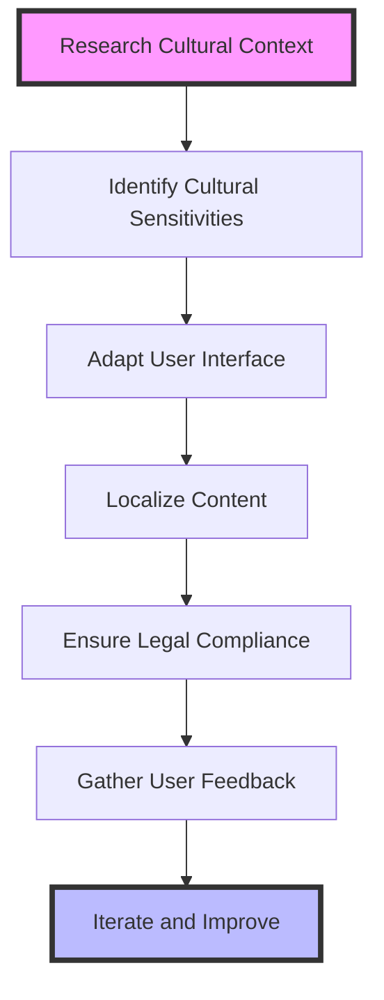

## 21.8 Cultural Considerations in Software Design

In today's globalized world, software applications are used by diverse audiences across different cultures and regions. As developers, it is crucial to design software that is culturally sensitive and adaptable to various local contexts. This section explores the key aspects of cultural considerations in software design, including cultural sensitivity, local customs and regulations, user interface adaptations, and content adaptation.

### Cultural Sensitivity

Cultural sensitivity in software design involves understanding and respecting the cultural differences of users. This includes being mindful of symbols, colors, and content that may have different meanings in different cultures.

#### Symbols and Icons

Symbols and icons are powerful tools in user interfaces, but they can have varied interpretations across cultures. For example, a thumbs-up icon may be positive in some cultures but offensive in others. When designing software, consider the following:

- **Research Symbol Meanings:** Investigate the cultural significance of symbols and icons in the target regions.
- **Use Universal Symbols:** Opt for symbols that are widely recognized and accepted globally.
- **Provide Alternatives:** Allow users to customize or choose alternative icons if possible.

#### Colors

Colors can evoke different emotions and meanings in different cultures. For instance, white is associated with purity in Western cultures but may represent mourning in some Asian cultures. Consider these guidelines:

- **Understand Color Psychology:** Study the cultural associations of colors in your target markets.
- **Test Color Schemes:** Conduct user testing with diverse groups to ensure color schemes are appropriate.
- **Offer Customization:** Allow users to adjust color settings to their preferences.

#### Content

Content should be culturally appropriate and sensitive to the values and beliefs of the target audience. This includes text, images, and multimedia content. Here are some tips:

- **Avoid Stereotypes:** Steer clear of cultural stereotypes and clichés in your content.
- **Use Inclusive Language:** Employ language that is inclusive and respectful of all cultures.
- **Consult Cultural Experts:** Work with cultural consultants or native speakers to review content for cultural appropriateness.

### Local Customs and Regulations

Adhering to local customs and regulations is essential for software to be accepted and legally compliant in different regions.

#### Legal Compliance

Different countries have varying laws and regulations regarding software usage, data protection, and privacy. To ensure compliance:

- **Research Local Laws:** Familiarize yourself with the legal requirements in each target market.
- **Implement Data Protection Measures:** Ensure your software complies with data protection laws such as GDPR in Europe.
- **Provide Legal Disclaimers:** Include necessary legal disclaimers and terms of service in the local language.

#### Cultural Norms

Understanding and respecting cultural norms can enhance user acceptance and satisfaction. Consider the following:

- **Adapt to Social Norms:** Design software that aligns with the social norms and etiquette of the target culture.
- **Respect Religious Practices:** Be mindful of religious practices and holidays that may affect software usage.
- **Incorporate Local Traditions:** Where appropriate, incorporate local traditions and customs into the software experience.

### User Interface Adaptations

Adapting the user interface (UI) to suit different cultural contexts can improve usability and user satisfaction.

#### Language and Text

Language is a critical component of the user interface. To accommodate different languages:

- **Support Multiple Languages:** Provide language options for users to choose from.
- **Use Localization Tools:** Utilize localization tools and libraries to manage translations efficiently.
- **Consider Text Direction:** Support right-to-left (RTL) languages such as Arabic and Hebrew.

#### Layout and Design

The layout and design of the UI should be flexible to accommodate cultural preferences:

- **Responsive Design:** Ensure the UI is responsive and adapts to different screen sizes and orientations.
- **Cultural Imagery:** Use images and graphics that are culturally relevant and resonate with the target audience.
- **Flexible Navigation:** Design navigation structures that align with cultural preferences for information hierarchy.

#### Interaction Patterns

Interaction patterns may vary across cultures. Consider the following:

- **Gesture Recognition:** Support gestures and interactions that are familiar to users in different regions.
- **Feedback Mechanisms:** Provide feedback mechanisms that align with cultural expectations for user interaction.
- **Accessibility Considerations:** Ensure the UI is accessible to users with disabilities, considering cultural differences in accessibility needs.

### Content Adaptation

Content adaptation involves modifying content to suit local contexts, not just translating text.

#### Translation and Localization

Translation is more than converting text from one language to another. It involves:

- **Cultural Context:** Ensure translations consider cultural context and nuances.
- **Consistent Terminology:** Use consistent terminology across different languages.
- **Quality Assurance:** Conduct thorough quality assurance to ensure translations are accurate and culturally appropriate.

#### Multimedia Content

Multimedia content such as videos and images should be adapted to local cultures:

- **Localized Media:** Use localized media that reflects the cultural context of the target audience.
- **Subtitles and Captions:** Provide subtitles and captions in the local language for videos.
- **Cultural Relevance:** Ensure multimedia content is culturally relevant and sensitive.

#### User-Centric Content

Design content with the user in mind:

- **User Feedback:** Gather user feedback to understand cultural preferences and expectations.
- **Personalization:** Offer personalized content that resonates with individual users based on their cultural background.
- **Continuous Improvement:** Continuously improve content based on user feedback and cultural trends.

### Visualizing Cultural Considerations

To better understand the impact of cultural considerations in software design, let's visualize the process using a flowchart.

**Description:** This flowchart illustrates the process of incorporating cultural considerations into software design, starting with researching the cultural context and ending with iterating and improving based on user feedback.

### Try It Yourself

To deepen your understanding of cultural considerations in software design, try the following exercises:

1. **Research a Culture:** Choose a culture different from your own and research its symbols, colors, and cultural norms. How would you adapt a software application for this culture?

2. **Localize a UI:** Take a simple user interface and localize it for a different language and culture. Consider text direction, color schemes, and imagery.

3. **Gather Feedback:** Create a survey to gather feedback from users in different cultures about their preferences and expectations for software design.

### References and Further Reading

- [W3C Internationalization](https://www.w3.org/International/)
- [MDN Web Docs: Internationalization](https://developer.mozilla.org/en-US/docs/Web/Internationalization)
- [Globalization and Localization Association (GALA)](https://www.gala-global.org/)

### Knowledge Check

- What are some common cultural sensitivities to consider in software design?
- How can you ensure legal compliance when designing software for different regions?
- What are some ways to adapt the user interface for different cultural contexts?

### Embrace the Journey

Remember, designing software for a global audience is an ongoing journey. As you continue to learn and adapt, you'll create more inclusive and culturally sensitive applications. Stay curious, seek feedback, and enjoy the process of connecting with users worldwide.

## Quiz: Cultural Considerations in Software Design



### Which of the following is a key aspect of cultural sensitivity in software design?

- [x] Understanding the cultural significance of symbols and icons
- [ ] Using the same color scheme for all regions
- [ ] Ignoring cultural differences in content
- [ ] Focusing solely on technical features

> **Explanation:** Understanding the cultural significance of symbols and icons is crucial for cultural sensitivity in software design.

### How can you ensure legal compliance when designing software for different regions?

- [x] Research local laws and regulations
- [ ] Use a one-size-fits-all approach
- [ ] Ignore regional differences
- [ ] Focus only on user interface design

> **Explanation:** Researching local laws and regulations ensures that software complies with legal requirements in different regions.

### What is an important consideration when adapting user interfaces for different cultures?

- [x] Supporting multiple languages and text directions
- [ ] Using the same layout for all cultures
- [ ] Ignoring cultural preferences
- [ ] Focusing only on color schemes

> **Explanation:** Supporting multiple languages and text directions is important for adapting user interfaces to different cultures.

### Why is content adaptation important in software design?

- [x] To modify content to suit local contexts
- [ ] To translate text without considering cultural context
- [ ] To use the same content for all regions
- [ ] To focus only on technical accuracy

> **Explanation:** Content adaptation involves modifying content to suit local contexts, not just translating text.

### Which of the following is a benefit of gathering user feedback from different cultures?

- [x] Understanding cultural preferences and expectations
- [ ] Ignoring user feedback
- [ ] Using a one-size-fits-all approach
- [ ] Focusing only on technical features

> **Explanation:** Gathering user feedback helps understand cultural preferences and expectations, leading to better software design.

### What is a common pitfall when designing software for a global audience?

- [x] Ignoring cultural differences
- [ ] Adapting content for local contexts
- [ ] Supporting multiple languages
- [ ] Considering cultural sensitivities

> **Explanation:** Ignoring cultural differences is a common pitfall that can lead to user dissatisfaction.

### How can multimedia content be adapted for local cultures?

- [x] Using localized media and providing subtitles
- [ ] Using the same media for all regions
- [ ] Ignoring cultural relevance
- [ ] Focusing only on technical quality

> **Explanation:** Adapting multimedia content involves using localized media and providing subtitles in the local language.

### What is an effective way to incorporate cultural considerations into software design?

- [x] Consulting cultural experts and native speakers
- [ ] Ignoring cultural differences
- [ ] Using a one-size-fits-all approach
- [ ] Focusing only on technical features

> **Explanation:** Consulting cultural experts and native speakers ensures that software design is culturally appropriate.

### Why is it important to consider accessibility in different cultures?

- [x] To ensure the UI is accessible to users with disabilities
- [ ] To ignore accessibility needs
- [ ] To use the same accessibility features for all cultures
- [ ] To focus only on technical features

> **Explanation:** Considering accessibility ensures that the UI is accessible to users with disabilities, taking into account cultural differences.

### True or False: Cultural considerations in software design are only important for large companies.

- [ ] True
- [x] False

> **Explanation:** Cultural considerations are important for all companies, regardless of size, to ensure software is inclusive and user-friendly.


