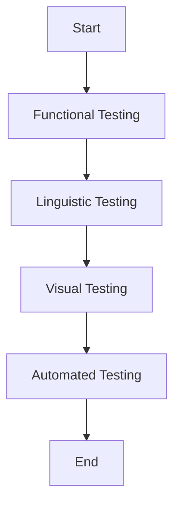

## 21.9 Testing Internationalized Applications

In today's globalized world, ensuring that your PHP applications can cater to a diverse audience is crucial. Internationalization (i18n) and localization (l10n) are key processes that allow applications to adapt to different languages and regional settings. However, testing these internationalized applications presents unique challenges. In this section, we will delve into the various aspects of testing internationalized applications, including functional, linguistic, visual, and automated testing.

### Introduction to Internationalization Testing

Internationalization testing ensures that an application can function correctly in any locale. This involves verifying that the application can handle different languages, character sets, and cultural conventions without breaking functionality. Let's explore the different types of testing involved in this process.

### Functional Testing

Functional testing for internationalized applications involves verifying that all features work correctly across different locales. This type of testing ensures that the core functionality of the application remains intact, regardless of the language or region.

#### Key Areas to Focus On:

- **Date and Time Formats:** Ensure that date and time are displayed according to the locale's conventions.
- **Currency and Number Formats:** Verify that currency symbols and number formats are appropriate for the locale.
- **Sorting and Collation:** Check that sorting algorithms respect locale-specific rules.
- **Input and Output Handling:** Ensure that the application can handle input and output in different languages and character sets.

#### Code Example: Handling Date Formats

```php
<?php
// Set the locale to French
setlocale(LC_TIME, 'fr_FR.UTF-8');

// Format the date according to the locale
echo strftime("%A %e %B %Y", strtotime('2024-11-23'));
// Output: samedi 23 novembre 2024
?>
```

### Linguistic Testing

Linguistic testing focuses on ensuring that translations are accurate and contextually appropriate. This involves verifying that the language used in the application is correct and makes sense in the given context.

#### Key Areas to Focus On:

- **Translation Accuracy:** Ensure that translations are correct and convey the intended meaning.
- **Contextual Appropriateness:** Verify that translations fit the context in which they are used.
- **Consistency:** Ensure that terminology is consistent throughout the application.

#### Code Example: Using Translation Files

```php
<?php
// Load translations from a file
$translations = parse_ini_file('translations_fr.ini');

// Get the translated string for a given key
echo $translations['welcome_message'];
// Output: Bienvenue sur notre site
?>
```

### Visual Testing

Visual testing involves checking for text overflow, alignment issues, and UI discrepancies that may arise due to different language lengths and character sets.

#### Key Areas to Focus On:

- **Text Overflow:** Ensure that text does not overflow or get cut off in UI elements.
- **Alignment Issues:** Verify that text alignment is consistent across different languages.
- **UI Discrepancies:** Check for any visual issues that may arise due to language changes.

#### Code Example: Dynamic UI Adjustments

```php
<?php
// Example of adjusting UI based on language
$language = 'fr';
$buttonText = ($language == 'fr') ? 'Soumettre' : 'Submit';

// Adjust button width based on text length
$buttonWidth = strlen($buttonText) * 10;
echo "<button style='width: {$buttonWidth}px;'>{$buttonText}</button>";
?>
```

### Automated Testing

Automated testing involves using tools to simulate various locales and automate locale-specific tests. This can significantly reduce the time and effort required for testing internationalized applications.

#### Tools and Techniques:

- **Selenium:** Use Selenium to automate browser-based testing for different locales.
- **PHPUnit:** Integrate locale-specific tests into your PHPUnit test suite.
- **Localization Testing Tools:** Use specialized tools like Lingoport or Globalyzer for automated linguistic testing.

#### Code Example: PHPUnit Locale Test

```php
<?php
use PHPUnit\Framework\TestCase;

class LocaleTest extends TestCase
{
    public function testDateFormat()
    {
        setlocale(LC_TIME, 'fr_FR.UTF-8');
        $formattedDate = strftime("%A %e %B %Y", strtotime('2024-11-23'));
        $this->assertEquals('samedi 23 novembre 2024', $formattedDate);
    }
}
?>
```

### Visualizing the Testing Process

To better understand the testing process for internationalized applications, let's visualize the workflow using a flowchart.



**Figure 1:** Workflow for Testing Internationalized Applications

### Best Practices for Testing Internationalized Applications

1. **Plan Early:** Incorporate internationalization testing into your development process from the start.
2. **Use Real Data:** Test with real-world data to uncover potential issues.
3. **Automate Where Possible:** Use automation to streamline repetitive testing tasks.
4. **Engage Native Speakers:** Involve native speakers in linguistic testing to ensure accuracy.
5. **Test Across Devices:** Ensure that your application works correctly on different devices and screen sizes.

### Try It Yourself

Experiment with the code examples provided in this section. Try changing the locale settings and observe how the application behaves. Modify the UI adjustments to see how different languages affect the layout.

### Knowledge Check

- Explain the importance of functional testing in internationalized applications.
- Describe the role of linguistic testing in ensuring translation accuracy.
- Discuss the challenges of visual testing in internationalized applications.
- Identify tools that can be used for automated testing of internationalized applications.

### Conclusion

Testing internationalized applications is a complex but essential process to ensure that your PHP application can cater to a global audience. By focusing on functional, linguistic, visual, and automated testing, you can ensure that your application provides a seamless experience across different locales. Remember, this is just the beginning. As you progress, you'll build more robust and inclusive applications. Keep experimenting, stay curious, and enjoy the journey!

## Quiz: Testing Internationalized Applications



### What is the primary focus of functional testing in internationalized applications?

- [x] Verifying that all features work correctly across different locales.
- [ ] Ensuring translations are accurate.
- [ ] Checking for text overflow and alignment issues.
- [ ] Automating locale-specific tests.

> **Explanation:** Functional testing ensures that the application's core functionality remains intact across different locales.

### What does linguistic testing primarily ensure?

- [ ] Features work correctly across locales.
- [x] Translations are accurate and contextually appropriate.
- [ ] Text does not overflow in UI elements.
- [ ] Tests are automated for different locales.

> **Explanation:** Linguistic testing focuses on the accuracy and contextual appropriateness of translations.

### Which of the following is a key area of focus in visual testing?

- [ ] Translation accuracy
- [ ] Automating tests
- [x] Text overflow and alignment issues
- [ ] Functional correctness

> **Explanation:** Visual testing checks for text overflow, alignment issues, and UI discrepancies.

### Which tool can be used for automating browser-based testing for different locales?

- [x] Selenium
- [ ] PHPUnit
- [ ] Lingoport
- [ ] Globalyzer

> **Explanation:** Selenium is commonly used for automating browser-based testing.

### What is a best practice for linguistic testing?

- [ ] Use automated tools exclusively.
- [x] Engage native speakers for accuracy.
- [ ] Focus only on functional aspects.
- [ ] Ignore context when testing translations.

> **Explanation:** Engaging native speakers ensures translation accuracy and contextual appropriateness.

### What is the role of PHPUnit in internationalization testing?

- [ ] Automating browser-based tests
- [x] Integrating locale-specific tests into the test suite
- [ ] Checking for UI discrepancies
- [ ] Ensuring translation accuracy

> **Explanation:** PHPUnit can be used to integrate locale-specific tests into your test suite.

### What should be considered when testing date formats in internationalized applications?

- [ ] Only the language
- [x] Locale-specific conventions
- [ ] UI alignment
- [ ] Translation consistency

> **Explanation:** Date formats should be tested according to locale-specific conventions.

### Which of the following is a challenge in visual testing?

- [ ] Translation accuracy
- [ ] Automating tests
- [x] Text overflow and alignment issues
- [ ] Functional correctness

> **Explanation:** Visual testing involves checking for text overflow and alignment issues.

### What is a key benefit of automated testing in internationalized applications?

- [ ] Ensures translation accuracy
- [x] Reduces time and effort required for testing
- [ ] Checks for UI discrepancies
- [ ] Verifies functional correctness

> **Explanation:** Automated testing reduces the time and effort required for testing internationalized applications.

### True or False: Visual testing only involves checking for text overflow.

- [ ] True
- [x] False

> **Explanation:** Visual testing also involves checking for alignment issues and UI discrepancies.


