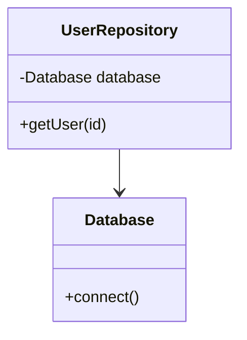

## 22.1 Recognizing Common PHP Anti-Patterns

In the realm of software development, anti-patterns are like the weeds in a garden. They may initially seem harmless or even beneficial, but over time, they can choke the life out of your codebase. Recognizing these anti-patterns is crucial for maintaining clean, efficient, and scalable PHP applications. In this section, we will delve into some of the most common PHP anti-patterns, understand their implications, and explore strategies to avoid them.

### Understanding Anti-Patterns

Anti-patterns are recurring solutions to common problems that are ineffective and counterproductive. They often arise from a lack of understanding of the problem domain, poor design decisions, or the misuse of design patterns. While they may provide a quick fix, they typically lead to more significant issues down the line, such as increased complexity, reduced maintainability, and poor performance.

### Importance of Awareness

Being aware of anti-patterns is the first step towards avoiding them. By recognizing these detrimental practices, developers can steer clear of common pitfalls, improve code quality, and ensure that their applications are robust and maintainable. Awareness also fosters a culture of continuous improvement and encourages developers to adopt best practices.

### Examples of Common PHP Anti-Patterns

Let's explore some of the most prevalent anti-patterns in PHP development, along with examples and strategies to mitigate them.

#### 1. Overuse of Global Variables

**Concept:** Global variables are accessible from anywhere in the code, which can lead to unintended side effects and make the code difficult to debug and maintain.

**Impact:** Overusing global variables can result in tight coupling between components, making it challenging to isolate and test individual parts of the application. It also increases the risk of variable name collisions and unintended modifications.

**Example:**

```php
<?php
// Global variable
$globalConfig = [];

// Function that modifies the global variable
function setConfig($key, $value) {
    global $globalConfig;
    $globalConfig[$key] = $value;
}

// Function that retrieves the global variable
function getConfig($key) {
    global $globalConfig;
    return $globalConfig[$key] ?? null;
}

// Usage
setConfig('site_name', 'My Website');
echo getConfig('site_name'); // Outputs: My Website
?>
```

**Solution:** Use dependency injection or encapsulate the configuration in a class to manage state more effectively.

```php
<?php
class Config {
    private $settings = [];

    public function set($key, $value) {
        $this->settings[$key] = $value;
    }

    public function get($key) {
        return $this->settings[$key] ?? null;
    }
}

// Usage
$config = new Config();
$config->set('site_name', 'My Website');
echo $config->get('site_name'); // Outputs: My Website
?>
```

#### 2. Tight Coupling

**Concept:** Tight coupling occurs when components are highly dependent on each other, making it difficult to change one component without affecting others.

**Impact:** It reduces flexibility and reusability, making the code harder to maintain and extend.

**Example:**

```php
<?php
class Database {
    public function connect() {
        // Database connection logic
    }
}

class UserRepository {
    private $database;

    public function __construct() {
        $this->database = new Database();
    }

    public function getUser($id) {
        $this->database->connect();
        // Fetch user logic
    }
}
?>
```

**Solution:** Use interfaces and dependency injection to decouple components.

```php
<?php
interface DatabaseInterface {
    public function connect();
}

class Database implements DatabaseInterface {
    public function connect() {
        // Database connection logic
    }
}

class UserRepository {
    private $database;

    public function __construct(DatabaseInterface $database) {
        $this->database = $database;
    }

    public function getUser($id) {
        $this->database->connect();
        // Fetch user logic
    }
}

// Usage
$database = new Database();
$userRepository = new UserRepository($database);
?>
```

#### 3. Excessive Complexity

**Concept:** Complexity arises when code is unnecessarily complicated, making it difficult to understand and maintain.

**Impact:** It increases the likelihood of bugs and makes the codebase harder to work with.

**Example:**

```php
<?php
function calculate($a, $b, $operation) {
    if ($operation == 'add') {
        return $a + $b;
    } elseif ($operation == 'subtract') {
        return $a - $b;
    } elseif ($operation == 'multiply') {
        return $a * $b;
    } elseif ($operation == 'divide') {
        if ($b != 0) {
            return $a / $b;
        } else {
            return 'Division by zero error';
        }
    } else {
        return 'Invalid operation';
    }
}
?>
```

**Solution:** Simplify the code by breaking it into smaller, more manageable functions or using design patterns like Strategy.

```php
<?php
interface Operation {
    public function execute($a, $b);
}

class AddOperation implements Operation {
    public function execute($a, $b) {
        return $a + $b;
    }
}

class SubtractOperation implements Operation {
    public function execute($a, $b) {
        return $a - $b;
    }
}

// Usage
function calculate(Operation $operation, $a, $b) {
    return $operation->execute($a, $b);
}

echo calculate(new AddOperation(), 5, 3); // Outputs: 8
?>
```

#### 4. God Object

**Concept:** A God Object is a class that knows too much or does too much, violating the Single Responsibility Principle.

**Impact:** It leads to a monolithic design that is difficult to understand, test, and maintain.

**Example:**

```php
<?php
class Application {
    public function handleRequest() {
        // Handle request logic
    }

    public function renderView() {
        // Render view logic
    }

    public function connectDatabase() {
        // Connect to database logic
    }
}
?>
```

**Solution:** Break down the God Object into smaller, more focused classes.

```php
<?php
class RequestHandler {
    public function handle() {
        // Handle request logic
    }
}

class ViewRenderer {
    public function render() {
        // Render view logic
    }
}

class DatabaseConnector {
    public function connect() {
        // Connect to database logic
    }
}
?>
```

#### 5. Spaghetti Code

**Concept:** Spaghetti code is a tangled mess of code with no clear structure, making it difficult to follow and maintain.

**Impact:** It increases the risk of errors and makes the codebase challenging to work with.

**Example:**

```php
<?php
function processOrder($order) {
    if ($order['status'] == 'new') {
        // Process new order
    } else if ($order['status'] == 'pending') {
        // Process pending order
    } else if ($order['status'] == 'completed') {
        // Process completed order
    }
    // More conditions and logic
}
?>
```

**Solution:** Use structured programming techniques and design patterns to organize the code.

```php
<?php
class OrderProcessor {
    public function process($order) {
        switch ($order['status']) {
            case 'new':
                $this->processNewOrder($order);
                break;
            case 'pending':
                $this->processPendingOrder($order);
                break;
            case 'completed':
                $this->processCompletedOrder($order);
                break;
        }
    }

    private function processNewOrder($order) {
        // Process new order logic
    }

    private function processPendingOrder($order) {
        // Process pending order logic
    }

    private function processCompletedOrder($order) {
        // Process completed order logic
    }
}
?>
```

#### 6. Magic Numbers and Strings

**Concept:** Magic numbers and strings are hard-coded values with no explanation, making the code difficult to understand and maintain.

**Impact:** They obscure the meaning of the code and make it harder to change values consistently.

**Example:**

```php
<?php
function calculateDiscount($price) {
    return $price * 0.1; // 10% discount
}
?>
```

**Solution:** Use constants or configuration files to define these values.

```php
<?php
define('DISCOUNT_RATE', 0.1);

function calculateDiscount($price) {
    return $price * DISCOUNT_RATE;
}
?>
```

#### 7. Copy-Paste Programming

**Concept:** Copy-paste programming involves duplicating code instead of reusing it, leading to code duplication and inconsistency.

**Impact:** It increases maintenance overhead and the risk of introducing bugs when changes are made.

**Example:**

```php
<?php
function calculateArea($width, $height) {
    return $width * $height;
}

function calculateVolume($width, $height, $depth) {
    return $width * $height * $depth;
}
?>
```

**Solution:** Refactor the code to eliminate duplication and promote reuse.

```php
<?php
function calculateArea($width, $height) {
    return $width * $height;
}

function calculateVolume($width, $height, $depth) {
    return calculateArea($width, $height) * $depth;
}
?>
```

#### 8. Premature Optimization

**Concept:** Premature optimization is the practice of trying to make code more efficient before it's necessary, often at the expense of readability and maintainability.

**Impact:** It can lead to complex, hard-to-understand code that may not even provide significant performance benefits.

**Example:**

```php
<?php
function findMax($array) {
    $max = $array[0];
    for ($i = 1; $i < count($array); $i++) {
        if ($array[$i] > $max) {
            $max = $array[$i];
        }
    }
    return $max;
}
?>
```

**Solution:** Focus on writing clear, maintainable code first, and optimize only when necessary.

```php
<?php
function findMax($array) {
    return max($array);
}
?>
```

#### 9. Not Using Version Control

**Concept:** Failing to use version control systems (VCS) like Git can lead to a lack of history, collaboration issues, and difficulty in managing changes.

**Impact:** It increases the risk of losing work, makes collaboration difficult, and complicates the process of tracking changes and resolving conflicts.

**Solution:** Adopt a version control system and integrate it into your development workflow.

#### 10. Reinventing the Wheel

**Concept:** Reinventing the wheel involves creating custom solutions for problems that have already been solved by existing libraries or frameworks.

**Impact:** It leads to wasted effort, increased maintenance, and potentially inferior solutions compared to established libraries.

**Solution:** Leverage existing libraries and frameworks whenever possible, and focus on solving unique problems.

### Visualizing Anti-Patterns

To better understand the impact of anti-patterns, let's visualize the concept of tight coupling using a class diagram.



**Diagram Description:** This class diagram illustrates tight coupling between the `UserRepository` and `Database` classes. The `UserRepository` directly depends on the `Database` class, making it difficult to change the database implementation without affecting the repository.

### Try It Yourself

Experiment with the provided code examples by modifying them to see how changes affect the code's behavior. For instance, try refactoring the `calculate` function to use the Strategy pattern or replace global variables with dependency injection.

### References and Links

- [PHP: The Right Way](https://phptherightway.com/)
- [Refactoring Guru: Anti-Patterns](https://refactoring.guru/antipatterns)
- [Martin Fowler: Refactoring](https://martinfowler.com/books/refactoring.html)

### Knowledge Check

- What are anti-patterns, and why are they detrimental to software development?
- How can global variables lead to tight coupling?
- What are some strategies to avoid excessive complexity in code?

### Embrace the Journey

Remember, recognizing and avoiding anti-patterns is an ongoing journey. As you continue to develop your skills, you'll become more adept at identifying and mitigating these detrimental practices. Keep experimenting, stay curious, and enjoy the journey!

## Quiz: Recognizing Common PHP Anti-Patterns



### What is an anti-pattern?

- [x] A recurring solution to a common problem that is ineffective and counterproductive
- [ ] A design pattern that is widely used and effective
- [ ] A pattern that solves all software design issues
- [ ] A pattern that is specific to PHP

> **Explanation:** An anti-pattern is a recurring solution to a common problem that is ineffective and counterproductive.

### Why is overusing global variables considered an anti-pattern?

- [x] It leads to tight coupling and makes the code difficult to maintain
- [ ] It improves code readability and maintainability
- [ ] It enhances the performance of the application
- [ ] It simplifies the code structure

> **Explanation:** Overusing global variables leads to tight coupling and makes the code difficult to maintain.

### What is the impact of tight coupling in code?

- [x] It reduces flexibility and reusability
- [ ] It improves code readability
- [ ] It enhances performance
- [ ] It simplifies testing

> **Explanation:** Tight coupling reduces flexibility and reusability, making the code harder to maintain and extend.

### How can excessive complexity in code be mitigated?

- [x] By breaking the code into smaller, more manageable functions
- [ ] By adding more comments to the code
- [ ] By using more global variables
- [ ] By avoiding the use of design patterns

> **Explanation:** Excessive complexity can be mitigated by breaking the code into smaller, more manageable functions.

### What is a God Object?

- [x] A class that knows too much or does too much
- [ ] A class that is well-structured and maintainable
- [ ] A class that follows the Single Responsibility Principle
- [ ] A class that is specific to PHP

> **Explanation:** A God Object is a class that knows too much or does too much, violating the Single Responsibility Principle.

### What is the impact of spaghetti code?

- [x] It increases the risk of errors and makes the codebase challenging to work with
- [ ] It improves code readability and maintainability
- [ ] It enhances the performance of the application
- [ ] It simplifies the code structure

> **Explanation:** Spaghetti code increases the risk of errors and makes the codebase challenging to work with.

### How can magic numbers and strings be avoided?

- [x] By using constants or configuration files
- [ ] By using more global variables
- [ ] By adding more comments to the code
- [ ] By avoiding the use of design patterns

> **Explanation:** Magic numbers and strings can be avoided by using constants or configuration files.

### What is the impact of copy-paste programming?

- [x] It increases maintenance overhead and the risk of introducing bugs
- [ ] It improves code readability and maintainability
- [ ] It enhances the performance of the application
- [ ] It simplifies the code structure

> **Explanation:** Copy-paste programming increases maintenance overhead and the risk of introducing bugs.

### What is premature optimization?

- [x] The practice of trying to make code more efficient before it's necessary
- [ ] The practice of optimizing code after it is fully developed
- [ ] The practice of avoiding optimization altogether
- [ ] The practice of using design patterns to improve performance

> **Explanation:** Premature optimization is the practice of trying to make code more efficient before it's necessary, often at the expense of readability and maintainability.

### True or False: Not using version control is an anti-pattern.

- [x] True
- [ ] False

> **Explanation:** Not using version control is an anti-pattern as it increases the risk of losing work, makes collaboration difficult, and complicates the process of tracking changes and resolving conflicts.


