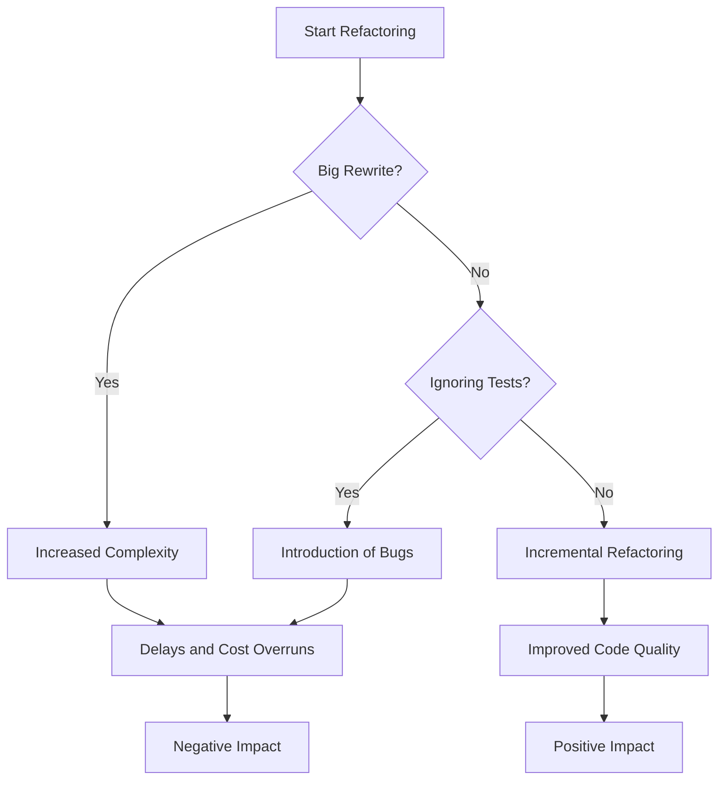

## 22.10 Refactoring Anti-Patterns

Refactoring is a critical aspect of software development, aimed at improving the structure and readability of code without altering its external behavior. However, the process is fraught with potential pitfalls known as anti-patterns. In this section, we'll delve into common refactoring anti-patterns in PHP, such as the Big Rewrite and ignoring tests, and provide best practices to ensure effective and safe refactoring.

### Understanding Refactoring Anti-Patterns

Refactoring anti-patterns are practices that developers might inadvertently adopt, which can lead to negative consequences such as increased complexity, introduction of bugs, or wasted effort. Recognizing these anti-patterns is the first step towards avoiding them and ensuring that refactoring efforts lead to cleaner, more maintainable code.

### Big Rewrite (Second-System Syndrome)

#### Concept

The Big Rewrite, often referred to as Second-System Syndrome, is the temptation to completely rewrite an existing system from scratch. This anti-pattern arises from the belief that starting over will lead to a cleaner, more efficient system. However, it often results in significant delays, increased costs, and the introduction of new bugs.

#### Why It Happens

- **Frustration with Legacy Code:** Developers may find existing codebases difficult to work with due to poor documentation, lack of tests, or convoluted logic.
- **Desire for Perfection:** The allure of creating a "perfect" system can lead developers to believe that a fresh start is the best approach.
- **Underestimating Complexity:** Developers may underestimate the complexity and effort required to replicate existing functionality.

#### Consequences

- **Delays and Cost Overruns:** Rewriting a system from scratch is time-consuming and resource-intensive.
- **Loss of Valuable Features:** Important features and bug fixes from the original system may be overlooked or lost.
- **Introduction of New Bugs:** New code is prone to new bugs, which may not be immediately apparent.

#### Best Practices

- **Incremental Refactoring:** Focus on refactoring small parts of the system incrementally. This approach allows for continuous improvement without the risks associated with a complete rewrite.
- **Prioritize Critical Areas:** Identify and refactor the most problematic areas of the codebase first.
- **Leverage Existing Tests:** Use existing tests to ensure that refactoring does not break current functionality.

### Ignoring Tests During Refactoring

#### Concept

Ignoring tests during refactoring is a dangerous anti-pattern where developers modify code without running or updating tests. This practice can lead to the introduction of new bugs and regression issues.

#### Why It Happens

- **Time Constraints:** Developers may skip testing due to tight deadlines or perceived time savings.
- **Lack of Test Coverage:** Inadequate test coverage can make it difficult to identify which tests need to be updated.
- **Overconfidence:** Developers may believe that their changes are minor and do not require testing.

#### Consequences

- **Introduction of Bugs:** Without tests, it's easy to introduce bugs that go unnoticed until they cause significant issues.
- **Regression Issues:** Changes may inadvertently break existing functionality, leading to regression issues.
- **Increased Maintenance Costs:** Debugging and fixing issues post-refactoring can be costly and time-consuming.

#### Best Practices

- **Maintain Comprehensive Test Coverage:** Ensure that your codebase has comprehensive test coverage before refactoring.
- **Run Tests Continuously:** Use automated testing tools to run tests continuously during the refactoring process.
- **Update Tests as Needed:** Modify existing tests or write new ones to cover changes made during refactoring.

### Code Examples

Let's explore some code examples to illustrate these concepts.

#### Example: Incremental Refactoring

Consider a legacy PHP function that calculates the total price of items in a cart, including tax and discounts:

```php
function calculateTotalPrice($items, $taxRate, $discount) {
    $total = 0;
    foreach ($items as $item) {
        $total += $item['price'] * $item['quantity'];
    }
    $total += $total * $taxRate;
    $total -= $discount;
    return $total;
}
```

This function can be refactored incrementally to improve readability and maintainability:

```php
function calculateItemTotal($item) {
    return $item['price'] * $item['quantity'];
}

function applyTax($total, $taxRate) {
    return $total + ($total * $taxRate);
}

function applyDiscount($total, $discount) {
    return $total - $discount;
}

function calculateTotalPrice($items, $taxRate, $discount) {
    $total = array_reduce($items, function($carry, $item) {
        return $carry + calculateItemTotal($item);
    }, 0);

    $total = applyTax($total, $taxRate);
    $total = applyDiscount($total, $discount);

    return $total;
}
```

**Key Points:**

- **Modular Functions:** Break down the function into smaller, reusable functions.
- **Improved Readability:** Each function has a clear purpose, making the code easier to understand and maintain.

#### Example: Testing During Refactoring

Suppose we have a test case for the original `calculateTotalPrice` function:

```php
class PriceCalculatorTest extends PHPUnit\Framework\TestCase {
    public function testCalculateTotalPrice() {
        $items = [
            ['price' => 10, 'quantity' => 2],
            ['price' => 5, 'quantity' => 3]
        ];
        $taxRate = 0.1;
        $discount = 5;
        $expectedTotal = 31.5;

        $this->assertEquals($expectedTotal, calculateTotalPrice($items, $taxRate, $discount));
    }
}
```

After refactoring, we should ensure that the test still passes:

```bash
$ phpunit PriceCalculatorTest
```

**Key Points:**

- **Run Tests Continuously:** Ensure that tests are run continuously to catch any issues introduced during refactoring.
- **Update Tests as Needed:** If the refactoring changes the function's behavior, update the tests accordingly.

### Visualizing Refactoring Anti-Patterns

To better understand the impact of refactoring anti-patterns, let's visualize the process using a flowchart.



**Description:** This flowchart illustrates the decision-making process during refactoring. Choosing a Big Rewrite or ignoring tests can lead to negative impacts, while incremental refactoring with continuous testing results in positive outcomes.

### References and Links

- [Martin Fowler's Refactoring](https://martinfowler.com/books/refactoring.html)
- [PHPUnit Documentation](https://phpunit.de/documentation.html)
- [Refactoring Guru: Code Smells](https://refactoring.guru/refactoring/smells)

### Knowledge Check

- **Question:** What is the Big Rewrite anti-pattern, and why is it considered risky?
- **Exercise:** Refactor a small piece of legacy code in your project, ensuring that all tests pass before and after the refactoring.

### Embrace the Journey

Refactoring is an ongoing journey towards cleaner, more maintainable code. By avoiding anti-patterns like the Big Rewrite and ignoring tests, we can ensure that our refactoring efforts lead to positive outcomes. Remember, this is just the beginning. As you continue to refactor and improve your code, you'll build more robust and efficient systems. Keep experimenting, stay curious, and enjoy the journey!

## Quiz: Refactoring Anti-Patterns



### What is the Big Rewrite anti-pattern?

- [x] Attempting to rewrite an entire system from scratch.
- [ ] Incrementally improving code.
- [ ] Writing tests for existing code.
- [ ] Refactoring small parts of the codebase.

> **Explanation:** The Big Rewrite involves rewriting an entire system from scratch, which can lead to delays and increased costs.

### Why is ignoring tests during refactoring dangerous?

- [x] It can introduce new bugs.
- [ ] It speeds up the refactoring process.
- [ ] It ensures code quality.
- [ ] It reduces complexity.

> **Explanation:** Ignoring tests can introduce new bugs and regression issues, as changes may break existing functionality.

### What is a best practice for refactoring?

- [x] Refactor incrementally with continuous testing.
- [ ] Rewrite the entire system.
- [ ] Ignore existing tests.
- [ ] Avoid modular functions.

> **Explanation:** Incremental refactoring with continuous testing ensures that changes do not break existing functionality.

### What is a consequence of the Big Rewrite?

- [x] Loss of valuable features.
- [ ] Improved code quality.
- [ ] Faster development.
- [ ] Reduced complexity.

> **Explanation:** The Big Rewrite can lead to the loss of important features and increased complexity.

### How can we ensure that refactoring does not break functionality?

- [x] Use automated tests.
- [ ] Ignore tests.
- [ ] Rewrite the codebase.
- [ ] Avoid modular functions.

> **Explanation:** Automated tests help ensure that refactoring does not break existing functionality.

### What is a key benefit of incremental refactoring?

- [x] Continuous improvement.
- [ ] Increased complexity.
- [ ] Introduction of new bugs.
- [ ] Loss of features.

> **Explanation:** Incremental refactoring allows for continuous improvement without the risks associated with a complete rewrite.

### What should be prioritized during refactoring?

- [x] Critical areas of the codebase.
- [ ] Non-critical areas.
- [ ] Ignoring tests.
- [ ] Rewriting the system.

> **Explanation:** Prioritizing critical areas ensures that the most problematic parts of the codebase are improved first.

### What is a common reason for ignoring tests during refactoring?

- [x] Time constraints.
- [ ] Improved code quality.
- [ ] Faster development.
- [ ] Reduced complexity.

> **Explanation:** Developers may skip testing due to tight deadlines or perceived time savings.

### What is the role of tests in refactoring?

- [x] Ensure existing functionality remains intact.
- [ ] Increase complexity.
- [ ] Introduce new bugs.
- [ ] Speed up development.

> **Explanation:** Tests ensure that refactoring does not break existing functionality and help catch new bugs.

### True or False: The Big Rewrite is always the best approach to refactoring.

- [ ] True
- [x] False

> **Explanation:** The Big Rewrite is risky and often leads to delays and increased costs. Incremental refactoring is generally a better approach.


