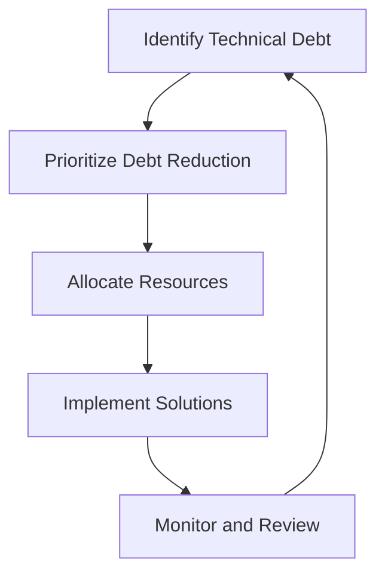

## 22.11 Avoiding Technical Debt

In the realm of software development, technical debt is a metaphor that describes the long-term consequences of taking shortcuts in code and design. While it can provide short-term benefits, such as faster delivery, it often leads to increased complexity and maintenance challenges in the future. In this section, we will explore the concept of technical debt, its impact on PHP projects, and strategies to manage and avoid it effectively.

### Understanding Technical Debt

Technical debt refers to the implied cost of additional rework caused by choosing an easy solution now instead of using a better approach that would take longer. This concept is akin to financial debt, where you incur interest over time, making it more expensive to pay off later.

#### Key Characteristics of Technical Debt

- **Shortcuts in Code**: Quick fixes or hacks that solve immediate problems but compromise code quality.
- **Lack of Documentation**: Insufficient or outdated documentation that makes understanding and maintaining code difficult.
- **Poor Design Decisions**: Architectural choices that limit scalability and flexibility.
- **Inadequate Testing**: Insufficient testing coverage that increases the risk of bugs and regressions.

### Impact of Technical Debt

The accumulation of technical debt can have significant negative effects on a project:

- **Increased Maintenance Costs**: As debt grows, more time and resources are required to maintain and extend the codebase.
- **Reduced Agility**: High technical debt can slow down development, making it harder to implement new features or fix bugs.
- **Decreased Code Quality**: Over time, technical debt can lead to a codebase that is difficult to understand, modify, and test.
- **Lower Team Morale**: Developers may become frustrated with the complexity and fragility of the code, leading to decreased productivity and job satisfaction.

### Strategies to Avoid Technical Debt

Avoiding technical debt requires a proactive approach to software development. Here are some strategies to help manage and reduce technical debt in PHP projects:

#### 1. Code Reviews and Refactoring

- **Conduct Regular Code Reviews**: Encourage peer reviews to catch potential issues early and ensure adherence to coding standards.
- **Refactor Continuously**: Allocate time for refactoring to improve code structure and readability without changing its functionality.

#### 2. Implement Coding Standards

- **Adopt a Coding Standard**: Use established coding standards, such as PSR-12, to maintain consistency across the codebase.
- **Automate Code Quality Checks**: Use tools like PHP_CodeSniffer to enforce coding standards automatically.

#### 3. Balance Short-Term and Long-Term Goals

- **Prioritize Technical Debt Reduction**: Include technical debt reduction in the project backlog and prioritize it alongside new features.
- **Evaluate Trade-offs**: Consider the long-term impact of shortcuts and make informed decisions about when to incur technical debt.

#### 4. Invest in Testing

- **Increase Test Coverage**: Write unit tests, integration tests, and end-to-end tests to ensure code reliability and facilitate refactoring.
- **Automate Testing**: Use continuous integration tools to run tests automatically and catch regressions early.

#### 5. Improve Documentation

- **Maintain Up-to-Date Documentation**: Ensure that code is well-documented, including comments, README files, and API documentation.
- **Use Tools for Documentation**: Leverage tools like PHPDocumentor to generate and maintain documentation.

#### 6. Foster a Culture of Quality

- **Encourage Best Practices**: Promote a culture where quality is valued and developers are encouraged to write clean, maintainable code.
- **Provide Training and Resources**: Offer training sessions and resources to help developers improve their skills and stay updated with best practices.

### Code Example: Refactoring to Reduce Technical Debt

Let's look at a simple example of refactoring a PHP class to reduce technical debt. Consider the following class with some technical debt:

```php
<?php

class OrderProcessor {
    public function process($order) {
        // Check if the order is valid
        if (!$order->isValid()) {
            throw new Exception("Invalid order");
        }

        // Calculate total price
        $total = 0;
        foreach ($order->items as $item) {
            $total += $item->price * $item->quantity;
        }

        // Apply discount
        if ($order->customer->isLoyal()) {
            $total *= 0.9; // 10% discount
        }

        // Save order to database
        $this->saveOrder($order, $total);
    }

    private function saveOrder($order, $total) {
        // Database logic here
    }
}
```

This class has several issues that contribute to technical debt, such as hardcoded discount logic and lack of separation of concerns. Let's refactor it:

```php
<?php

class OrderProcessor {
    private $discountService;
    private $orderRepository;

    public function __construct(DiscountService $discountService, OrderRepository $orderRepository) {
        $this->discountService = $discountService;
        $this->orderRepository = $orderRepository;
    }

    public function process(Order $order) {
        if (!$order->isValid()) {
            throw new InvalidArgumentException("Invalid order");
        }

        $total = $this->calculateTotal($order);
        $total = $this->discountService->applyDiscount($order, $total);

        $this->orderRepository->save($order, $total);
    }

    private function calculateTotal(Order $order): float {
        $total = 0;
        foreach ($order->items as $item) {
            $total += $item->price * $item->quantity;
        }
        return $total;
    }
}
```

In this refactored version, we have:

- **Separated Concerns**: The discount logic is moved to a `DiscountService`, and database operations are handled by an `OrderRepository`.
- **Improved Testability**: The class is now easier to test because dependencies are injected, allowing for mocking in tests.
- **Enhanced Readability**: The code is more readable and maintainable, reducing technical debt.

### Visualizing Technical Debt Management

To better understand how to manage technical debt, let's visualize the process using a flowchart:



**Description**: This flowchart illustrates a continuous process of identifying, prioritizing, and addressing technical debt, followed by monitoring and reviewing the outcomes.

### References and Further Reading

- [Martin Fowler on Technical Debt](https://martinfowler.com/bliki/TechnicalDebt.html)
- [PHP-FIG: PSR-12 Coding Style Guide](https://www.php-fig.org/psr/psr-12/)
- [PHPDocumentor](https://www.phpdoc.org/)

### Knowledge Check

- **What is technical debt, and how does it impact software development?**
- **List three strategies to manage technical debt in PHP projects.**
- **Explain the importance of code reviews in reducing technical debt.**

### Embrace the Journey

Remember, managing technical debt is an ongoing process. By adopting best practices and fostering a culture of quality, we can create robust and maintainable PHP applications. Keep experimenting, stay curious, and enjoy the journey of continuous improvement!

## Quiz: Avoiding Technical Debt



### What is technical debt?

- [x] The cost of cutting corners in code and design for quick gains
- [ ] The financial cost of software development
- [ ] The cost of hardware upgrades
- [ ] The time spent on debugging

> **Explanation:** Technical debt refers to the long-term cost of taking shortcuts in code and design, which can lead to increased maintenance and complexity.

### Which of the following is a strategy to avoid technical debt?

- [x] Conduct regular code reviews
- [ ] Ignore coding standards
- [ ] Avoid testing
- [ ] Focus only on new features

> **Explanation:** Regular code reviews help catch potential issues early and ensure adherence to coding standards, reducing technical debt.

### What is the impact of high technical debt on a project?

- [x] Increased maintenance costs
- [ ] Faster development
- [ ] Improved code quality
- [ ] Higher team morale

> **Explanation:** High technical debt leads to increased maintenance costs, reduced agility, and decreased code quality.

### How can refactoring help manage technical debt?

- [x] By improving code structure and readability
- [ ] By adding more features
- [ ] By increasing code complexity
- [ ] By removing documentation

> **Explanation:** Refactoring improves code structure and readability, making it easier to maintain and reducing technical debt.

### What role does documentation play in managing technical debt?

- [x] It helps maintain up-to-date information about the code
- [ ] It increases code complexity
- [ ] It is unnecessary for small projects
- [ ] It should be avoided to save time

> **Explanation:** Up-to-date documentation helps developers understand and maintain the code, reducing technical debt.

### Why is it important to balance short-term and long-term goals in software development?

- [x] To ensure sustainable code quality
- [ ] To focus only on immediate needs
- [ ] To avoid planning for the future
- [ ] To reduce development time

> **Explanation:** Balancing short-term and long-term goals ensures sustainable code quality and reduces technical debt.

### What is the benefit of using automated testing in PHP projects?

- [x] It helps catch regressions early
- [ ] It increases manual testing efforts
- [ ] It slows down development
- [ ] It is only useful for large projects

> **Explanation:** Automated testing helps catch regressions early, ensuring code reliability and facilitating refactoring.

### How can a culture of quality help reduce technical debt?

- [x] By encouraging best practices and clean code
- [ ] By focusing only on deadlines
- [ ] By ignoring code reviews
- [ ] By avoiding documentation

> **Explanation:** A culture of quality encourages best practices and clean code, reducing technical debt.

### What is the purpose of using tools like PHP_CodeSniffer?

- [x] To enforce coding standards automatically
- [ ] To increase code complexity
- [ ] To avoid testing
- [ ] To focus only on new features

> **Explanation:** Tools like PHP_CodeSniffer help enforce coding standards automatically, maintaining consistency and reducing technical debt.

### True or False: Technical debt is only a concern for large projects.

- [ ] True
- [x] False

> **Explanation:** Technical debt can affect projects of any size, impacting maintainability and development speed.


