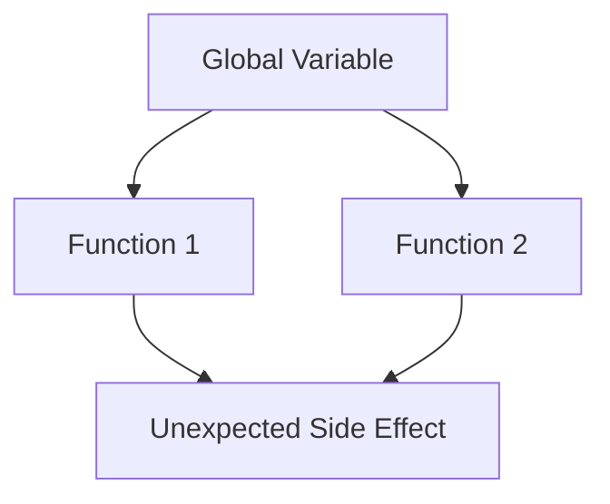

## 22.2 Overuse of Global Variables

In the world of PHP development, global variables are often seen as a convenient way to share data across different parts of an application. However, their overuse can lead to a myriad of issues that make code difficult to maintain, debug, and scale. In this section, we will delve into the problems associated with global variables, explore alternatives, and provide best practices to help you write cleaner and more maintainable PHP code.

### Understanding Global Variables

Global variables are variables that are declared outside of any function or class and are accessible from any part of the script. In PHP, you can declare a global variable simply by defining it outside of any function or class:

```php
<?php
$globalVar = "I am a global variable";

function printGlobalVar() {
    global $globalVar;
    echo $globalVar;
}

printGlobalVar(); // Outputs: I am a global variable
?>
```

In the example above, `$globalVar` is a global variable that is accessible within the `printGlobalVar` function using the `global` keyword.

### Issues with Global Variables

While global variables can be useful in certain scenarios, their overuse can lead to several issues:

#### 1. Hard to Maintain and Debug

Global variables can make your codebase difficult to maintain and debug. Since they can be accessed and modified from anywhere in the code, tracking down where a global variable is being changed can be challenging. This can lead to bugs that are hard to reproduce and fix.

#### 2. Unpredictable Side Effects

Global variables can cause unpredictable side effects due to shared state. If multiple parts of your application are modifying the same global variable, it can lead to unexpected behavior. This is especially problematic in larger applications where the flow of data is complex.

#### 3. Tight Coupling

Using global variables can lead to tight coupling between different parts of your application. This means that changes in one part of the code can have unintended consequences in another part, making the code less modular and harder to refactor.

#### 4. Namespace Pollution

Global variables can lead to namespace pollution, where variable names clash with each other. This can cause conflicts and errors, especially in larger projects where multiple developers are working on the same codebase.

### Alternatives to Global Variables

To avoid the pitfalls associated with global variables, consider using the following alternatives:

#### 1. Dependency Injection

Dependency injection is a design pattern that allows you to pass dependencies (such as variables or objects) into a class or function. This makes your code more modular and easier to test.

```php
<?php
class Logger {
    private $logFile;

    public function __construct($logFile) {
        $this->logFile = $logFile;
    }

    public function log($message) {
        file_put_contents($this->logFile, $message . PHP_EOL, FILE_APPEND);
    }
}

$logger = new Logger('app.log');
$logger->log('This is a log message.');
?>
```

In this example, the `Logger` class receives its dependency (`$logFile`) through its constructor, eliminating the need for a global variable.

#### 2. Encapsulation

Encapsulation involves wrapping data and behavior into a single unit, such as a class or function. This helps to limit the scope of variables and reduces the risk of unintended side effects.

```php
<?php
class Counter {
    private $count = 0;

    public function increment() {
        $this->count++;
    }

    public function getCount() {
        return $this->count;
    }
}

$counter = new Counter();
$counter->increment();
echo $counter->getCount(); // Outputs: 1
?>
```

Here, the `Counter` class encapsulates the `$count` variable, ensuring that it can only be modified through the class's methods.

#### 3. Use of Constants

If you have values that do not change, consider using constants instead of global variables. Constants are immutable and provide a safe way to store fixed values.

```php
<?php
define('PI', 3.14159);

function calculateCircumference($radius) {
    return 2 * PI * $radius;
}

echo calculateCircumference(5); // Outputs: 31.4159
?>
```

### Best Practices for Managing Global Variables

To minimize the negative impact of global variables, follow these best practices:

#### 1. Limit the Scope of Variables

Whenever possible, limit the scope of variables to the smallest possible context. This reduces the risk of unintended side effects and makes your code easier to understand.

#### 2. Avoid Using the `global` Keyword

Avoid using the `global` keyword to access global variables within functions. Instead, consider passing variables as parameters or using dependency injection.

#### 3. Use Namespaces

Namespaces can help prevent name collisions and organize your code. By grouping related classes and functions under a namespace, you can avoid conflicts with global variables.

```php
<?php
namespace MyApp;

class User {
    // Class implementation
}

function getUser() {
    // Function implementation
}
?>
```

#### 4. Refactor Legacy Code

If you are working with legacy code that heavily relies on global variables, consider refactoring it to use more modern design patterns. This can improve the maintainability and scalability of your application.

### Visualizing the Impact of Global Variables

To better understand the impact of global variables, let's visualize how they can affect the flow of data in an application using a Mermaid.js diagram.



In this diagram, we see that a global variable is accessed by two different functions, leading to an unexpected side effect. This illustrates how global variables can introduce complexity and unpredictability into your code.

### Try It Yourself: Refactoring Global Variables

To reinforce your understanding, try refactoring the following code to eliminate the use of global variables:

```php
<?php
$globalCounter = 0;

function incrementCounter() {
    global $globalCounter;
    $globalCounter++;
}

incrementCounter();
echo $globalCounter; // Outputs: 1
?>
```

**Challenge:** Refactor the code to use a class or function that encapsulates the counter logic, eliminating the need for a global variable.

### References and Further Reading

- [PHP Manual: Variables](https://www.php.net/manual/en/language.variables.php)
- [Dependency Injection in PHP](https://www.php.net/manual/en/language.oop5.decon.php)
- [Namespaces in PHP](https://www.php.net/manual/en/language.namespaces.php)

### Knowledge Check

- What are the main issues associated with the overuse of global variables?
- How can dependency injection help reduce the reliance on global variables?
- What are some best practices for managing global variables in PHP?

### Embrace the Journey

Remember, avoiding the overuse of global variables is just one step towards writing cleaner and more maintainable PHP code. As you continue your journey, keep exploring new design patterns and best practices to enhance your skills. Stay curious, keep experimenting, and enjoy the process of becoming a better developer!

## Quiz: Overuse of Global Variables



### What is a major issue with overusing global variables in PHP?

- [x] They make code hard to maintain and debug.
- [ ] They improve code performance.
- [ ] They simplify code structure.
- [ ] They enhance code readability.

> **Explanation:** Overusing global variables can lead to code that is difficult to maintain and debug due to their widespread accessibility and potential for unintended side effects.


### Which design pattern can help reduce the reliance on global variables?

- [x] Dependency Injection
- [ ] Singleton
- [ ] Factory Method
- [ ] Observer

> **Explanation:** Dependency Injection allows you to pass dependencies into classes or functions, reducing the need for global variables.


### What is a common alternative to using global variables for storing constant values?

- [x] Constants
- [ ] Local variables
- [ ] Arrays
- [ ] Objects

> **Explanation:** Constants are a safe alternative for storing fixed values as they are immutable and do not change.


### How can encapsulation help manage global variables?

- [x] By wrapping data and behavior into a single unit, limiting variable scope.
- [ ] By making variables accessible globally.
- [ ] By increasing the number of global variables.
- [ ] By using the `global` keyword.

> **Explanation:** Encapsulation helps manage global variables by limiting their scope and reducing the risk of unintended side effects.


### What is a disadvantage of using the `global` keyword in functions?

- [x] It can lead to tight coupling and unpredictable side effects.
- [ ] It improves code readability.
- [ ] It enhances code performance.
- [ ] It simplifies variable access.

> **Explanation:** Using the `global` keyword can lead to tight coupling and unpredictable side effects, making code harder to maintain.


### What is a benefit of using namespaces in PHP?

- [x] They help prevent name collisions and organize code.
- [ ] They increase the number of global variables.
- [ ] They make variables accessible globally.
- [ ] They simplify code structure.

> **Explanation:** Namespaces help prevent name collisions and organize code, reducing the risk of conflicts with global variables.


### Why should you limit the scope of variables in PHP?

- [x] To reduce the risk of unintended side effects and improve code maintainability.
- [ ] To increase the number of global variables.
- [ ] To make variables accessible globally.
- [ ] To simplify code structure.

> **Explanation:** Limiting the scope of variables reduces the risk of unintended side effects and improves code maintainability.


### What is a common issue with namespace pollution?

- [x] Variable names clash with each other, causing conflicts.
- [ ] It improves code readability.
- [ ] It enhances code performance.
- [ ] It simplifies variable access.

> **Explanation:** Namespace pollution can cause variable names to clash, leading to conflicts and errors.


### How can refactoring help with legacy code that uses global variables?

- [x] By improving maintainability and scalability through modern design patterns.
- [ ] By increasing the number of global variables.
- [ ] By making variables accessible globally.
- [ ] By simplifying code structure.

> **Explanation:** Refactoring legacy code to use modern design patterns can improve maintainability and scalability, reducing reliance on global variables.


### True or False: Using global variables can lead to unpredictable side effects in your code.

- [x] True
- [ ] False

> **Explanation:** True. Global variables can cause unpredictable side effects due to shared state and widespread accessibility.


