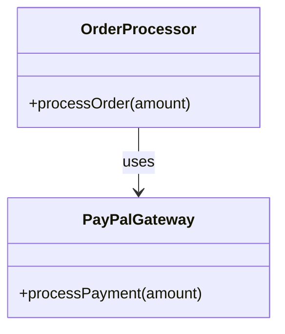
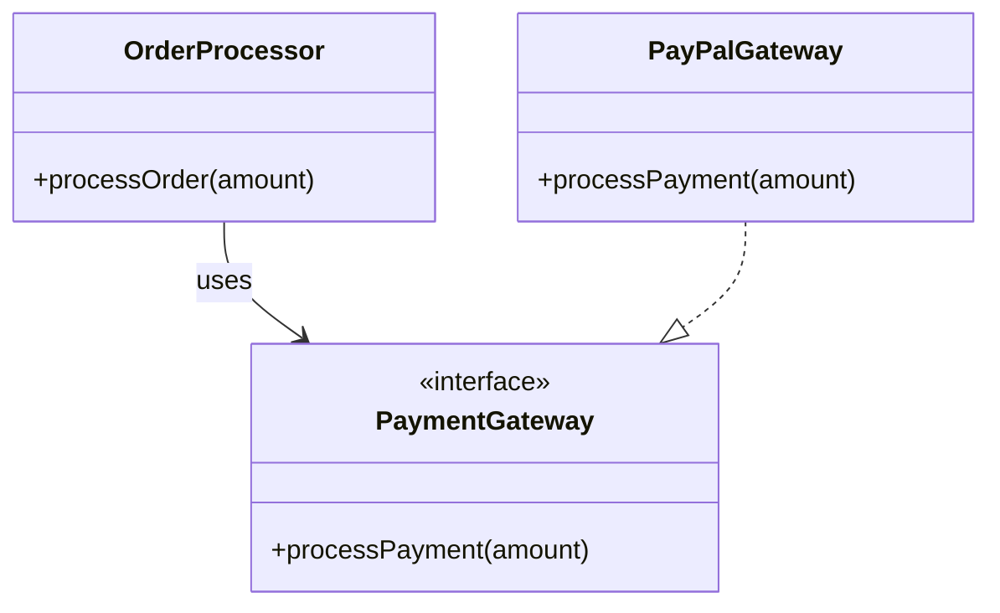
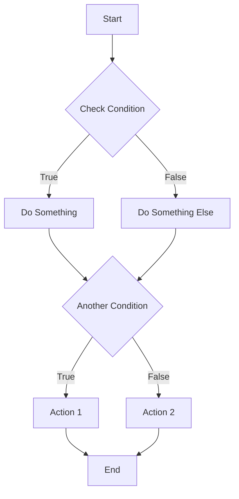

## 22.3 Tight Coupling and Spaghetti Code

In the world of software development, maintaining a clean and efficient codebase is crucial for long-term success. Two common anti-patterns that can hinder this goal are tight coupling and spaghetti code. These issues can lead to a codebase that is difficult to maintain, scale, and understand. In this section, we will explore these anti-patterns in detail, understand their implications, and learn how to refactor and improve our PHP code to avoid them.

### Understanding Tight Coupling

**Tight coupling** occurs when components in a software system are highly dependent on one another. This means that changes in one component often necessitate changes in another, leading to a fragile codebase that is difficult to modify and extend. Tight coupling can manifest in various ways, such as:

- **Direct dependencies**: When one class directly instantiates another, it creates a dependency that can be hard to break.
- **Shared global state**: Using global variables or singletons can lead to components being tightly coupled to a shared state.
- **Hard-coded logic**: Embedding specific logic within classes makes it difficult to reuse or replace those classes.

#### Consequences of Tight Coupling

The primary consequence of tight coupling is reduced flexibility. When components are tightly coupled, it becomes challenging to:

- **Modify or extend functionality**: Any change in one component can have a ripple effect, requiring changes in dependent components.
- **Test components in isolation**: Tightly coupled components are difficult to test independently, leading to complex and brittle test suites.
- **Reuse components**: Reusing tightly coupled components in different contexts is often impractical, leading to code duplication.

### Understanding Spaghetti Code

**Spaghetti code** refers to a codebase with a complex and tangled control flow, making it difficult to follow and understand. This often results from a lack of structure and organization in the code. Characteristics of spaghetti code include:

- **Long methods or functions**: Methods that do too much and have many responsibilities.
- **Deeply nested loops and conditionals**: Excessive nesting makes it hard to follow the logic.
- **Lack of modularity**: Code that is not broken down into reusable and independent modules.

#### Consequences of Spaghetti Code

Spaghetti code can lead to several issues, including:

- **Difficult maintenance**: Understanding and modifying the code becomes a time-consuming and error-prone task.
- **Poor scalability**: Adding new features or scaling the application becomes challenging due to the lack of structure.
- **Increased likelihood of bugs**: The complex and unstructured nature of spaghetti code makes it prone to errors.

### Solutions to Tight Coupling and Spaghetti Code

To overcome these anti-patterns, we can apply several strategies and best practices:

#### Decoupling Components

1. **Use Interfaces and Abstractions**: Define interfaces for components to interact with each other. This allows for flexibility in swapping out implementations without affecting dependent components.

   ```php
   interface PaymentGateway {
       public function processPayment(float $amount): bool;
   }

   class PayPalGateway implements PaymentGateway {
       public function processPayment(float $amount): bool {
           // PayPal payment processing logic
           return true;
       }
   }

   class OrderProcessor {
       private $paymentGateway;

       public function __construct(PaymentGateway $paymentGateway) {
           $this->paymentGateway = $paymentGateway;
       }

       public function processOrder(float $amount) {
           return $this->paymentGateway->processPayment($amount);
       }
   }
   ```

2. **Apply Dependency Injection**: Instead of instantiating dependencies within a class, inject them through constructors or setters. This reduces direct dependencies and enhances testability.

   ```php
   class ReportGenerator {
       private $dataSource;

       public function __construct(DataSource $dataSource) {
           $this->dataSource = $dataSource;
       }

       public function generate() {
           // Generate report using the data source
       }
   }
   ```

3. **Favor Composition Over Inheritance**: Use composition to build complex functionality by combining simple, independent objects rather than relying on inheritance, which can lead to tight coupling.

   ```php
   class Engine {
       public function start() {
           // Engine starting logic
       }
   }

   class Car {
       private $engine;

       public function __construct(Engine $engine) {
           $this->engine = $engine;
       }

       public function start() {
           $this->engine->start();
       }
   }
   ```

#### Refactoring Spaghetti Code

1. **Break Down Large Methods**: Refactor large methods into smaller, more focused methods that each handle a specific responsibility.

   ```php
   class OrderService {
       public function processOrder($order) {
           $this->validateOrder($order);
           $this->calculateTotal($order);
           $this->processPayment($order);
       }

       private function validateOrder($order) {
           // Validation logic
       }

       private function calculateTotal($order) {
           // Total calculation logic
       }

       private function processPayment($order) {
           // Payment processing logic
       }
   }
   ```

2. **Use Design Patterns**: Implement design patterns such as the Strategy, Observer, or Command patterns to organize code and reduce complexity.

   ```php
   // Strategy Pattern Example
   interface SortingStrategy {
       public function sort(array $data): array;
   }

   class QuickSort implements SortingStrategy {
       public function sort(array $data): array {
           // Quick sort logic
           return $data;
       }
   }

   class Sorter {
       private $strategy;

       public function __construct(SortingStrategy $strategy) {
           $this->strategy = $strategy;
       }

       public function sort(array $data): array {
           return $this->strategy->sort($data);
       }
   }
   ```

3. **Modularize Code**: Break down the code into modules or classes that encapsulate specific functionality. This enhances readability and maintainability.

   ```php
   class UserModule {
       public function createUser($userData) {
           // User creation logic
       }

       public function deleteUser($userId) {
           // User deletion logic
       }
   }

   class ProductModule {
       public function addProduct($productData) {
           // Product addition logic
       }

       public function removeProduct($productId) {
           // Product removal logic
       }
   }
   ```

### Visualizing Tight Coupling and Spaghetti Code

To better understand the impact of tight coupling and spaghetti code, let's visualize these concepts using diagrams.

#### Tight Coupling Example



In this diagram, `OrderProcessor` is tightly coupled to `PayPalGateway`, making it difficult to switch to a different payment gateway.

#### Decoupled Example



Here, `OrderProcessor` depends on the `PaymentGateway` interface, allowing for flexibility in choosing different implementations.

#### Spaghetti Code Example



This flowchart represents a tangled and complex control flow typical of spaghetti code.

### Knowledge Check

Let's reinforce our understanding with a few questions:

- What is tight coupling, and why is it problematic?
- How can interfaces help reduce tight coupling?
- What are some characteristics of spaghetti code?
- How can design patterns help refactor spaghetti code?

### Try It Yourself

Experiment with the provided code examples by:

- Modifying the `OrderProcessor` to use a different payment gateway.
- Refactoring a large method in your codebase into smaller methods.
- Implementing a design pattern to organize a complex piece of code.

### References and Further Reading

- [PHP: The Right Way](https://phptherightway.com/)
- [Design Patterns in PHP](https://designpatternsphp.readthedocs.io/en/latest/)
- [Refactoring Guru: Design Patterns](https://refactoring.guru/design-patterns)

### Embrace the Journey

Remember, refactoring and improving your codebase is an ongoing journey. By understanding and addressing tight coupling and spaghetti code, you are taking significant steps toward creating a more maintainable and scalable PHP application. Keep experimenting, stay curious, and enjoy the process of continuous improvement!

## Quiz: Tight Coupling and Spaghetti Code



### What is tight coupling in software development?

- [x] When components are highly dependent on one another
- [ ] When components are loosely connected
- [ ] When components have no dependencies
- [ ] When components are independent

> **Explanation:** Tight coupling occurs when components are highly dependent on one another, making changes difficult.

### Which of the following is a consequence of tight coupling?

- [x] Reduced flexibility
- [ ] Increased modularity
- [ ] Easier testing
- [ ] Improved scalability

> **Explanation:** Tight coupling reduces flexibility, making it hard to modify or extend functionality.

### What is spaghetti code?

- [x] Unstructured code flow making maintenance difficult
- [ ] Well-organized code with clear structure
- [ ] Code with no dependencies
- [ ] Code that is easy to understand

> **Explanation:** Spaghetti code refers to unstructured code flow, making it hard to maintain and understand.

### How can interfaces help reduce tight coupling?

- [x] By allowing different implementations to be used interchangeably
- [ ] By increasing dependencies
- [ ] By making code more complex
- [ ] By removing all dependencies

> **Explanation:** Interfaces allow different implementations to be used interchangeably, reducing tight coupling.

### Which design pattern can help organize code and reduce complexity?

- [x] Strategy Pattern
- [ ] Singleton Pattern
- [ ] Spaghetti Pattern
- [ ] Tight Coupling Pattern

> **Explanation:** The Strategy Pattern helps organize code and reduce complexity by allowing interchangeable algorithms.

### What is a characteristic of spaghetti code?

- [x] Deeply nested loops and conditionals
- [ ] Clear and concise logic
- [ ] Modular and reusable code
- [ ] Well-documented code

> **Explanation:** Spaghetti code often has deeply nested loops and conditionals, making it hard to follow.

### How can dependency injection help reduce tight coupling?

- [x] By injecting dependencies through constructors or setters
- [ ] By hardcoding dependencies
- [ ] By removing all dependencies
- [ ] By increasing direct dependencies

> **Explanation:** Dependency injection reduces tight coupling by injecting dependencies through constructors or setters.

### What is a benefit of breaking down large methods?

- [x] Improved readability and maintainability
- [ ] Increased complexity
- [ ] Reduced modularity
- [ ] Decreased testability

> **Explanation:** Breaking down large methods improves readability and maintainability by focusing on specific responsibilities.

### What is a common problem with tightly coupled components?

- [x] Difficult to test in isolation
- [ ] Easy to modify
- [ ] Highly reusable
- [ ] Simple to understand

> **Explanation:** Tightly coupled components are difficult to test in isolation due to their dependencies.

### True or False: Spaghetti code is easy to maintain and scale.

- [ ] True
- [x] False

> **Explanation:** Spaghetti code is difficult to maintain and scale due to its unstructured nature.


