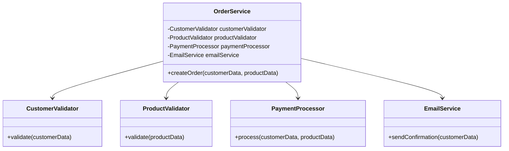

## 22.4 God Object and Large Classes

In the realm of software development, particularly in PHP, understanding and avoiding anti-patterns is crucial for creating maintainable and scalable applications. Among the most notorious anti-patterns are the "God Object" and "Large Classes." These concepts are often intertwined and can lead to significant challenges in software design if not addressed properly.

### Understanding the God Object

**God Object** refers to a class that knows too much or does too much. It is a single class that handles a multitude of responsibilities, often becoming a central point of control in an application. This anti-pattern violates the **Single Responsibility Principle (SRP)**, which states that a class should have only one reason to change.

#### Problems with God Objects

1. **Complexity and Maintenance**: A God Object becomes a tangled web of dependencies and logic, making it difficult to understand and maintain. Changes in one part of the class can have unforeseen ripple effects throughout the application.

2. **Testing Challenges**: Unit testing becomes cumbersome as the God Object's responsibilities are too broad, leading to complex test cases that are hard to manage.

3. **Scalability Issues**: As the application grows, the God Object can become a bottleneck, hindering performance and scalability.

4. **Reduced Reusability**: The tightly coupled nature of a God Object reduces the reusability of its components, as they are often specific to the context of the God Object.

### Identifying Large Classes

**Large Classes** are classes that have grown beyond a manageable size, often containing numerous methods and properties. While not all large classes are God Objects, they often exhibit similar issues, such as violating the SRP and becoming difficult to maintain.

#### Characteristics of Large Classes

- **Numerous Methods and Properties**: A large number of methods and properties can indicate that a class is handling too many responsibilities.
- **Long Method Bodies**: Methods that are excessively long can be a sign that a class is doing too much.
- **High Cyclomatic Complexity**: A measure of the number of linearly independent paths through a program's source code, high cyclomatic complexity indicates that a class is difficult to test and maintain.

### Mitigation Strategies

To address the issues posed by God Objects and Large Classes, consider the following strategies:

1. **Decomposition**: Break down the God Object or Large Class into smaller, more focused classes. Each class should adhere to the SRP, handling only one responsibility.

2. **Use of Design Patterns**: Implement design patterns such as the **Facade**, **Strategy**, or **Observer** to distribute responsibilities and decouple components.

3. **Refactoring**: Continuously refactor code to improve its structure and readability. Techniques such as **Extract Class**, **Extract Method**, and **Move Method** can be particularly useful.

4. **Interfaces and Traits**: Utilize interfaces to define contracts for classes and traits to share common functionality without inheritance.

5. **Dependency Injection**: Use dependency injection to manage dependencies and reduce coupling between classes.

### Code Example: Refactoring a God Object

Let's consider a simple example of a God Object in PHP and how we can refactor it into smaller, more manageable classes.

```php
<?php

// God Object Example
class OrderManager {
    public function createOrder($customerData, $productData) {
        // Validate customer data
        $this->validateCustomer($customerData);
        
        // Validate product data
        $this->validateProduct($productData);
        
        // Process payment
        $this->processPayment($customerData, $productData);
        
        // Send confirmation email
        $this->sendConfirmationEmail($customerData);
    }

    private function validateCustomer($customerData) {
        // Validation logic
    }

    private function validateProduct($productData) {
        // Validation logic
    }

    private function processPayment($customerData, $productData) {
        // Payment processing logic
    }

    private function sendConfirmationEmail($customerData) {
        // Email sending logic
    }
}
```

#### Refactored Code

```php
<?php

// Refactored Code

class OrderService {
    private $customerValidator;
    private $productValidator;
    private $paymentProcessor;
    private $emailService;

    public function __construct(
        CustomerValidator $customerValidator,
        ProductValidator $productValidator,
        PaymentProcessor $paymentProcessor,
        EmailService $emailService
    ) {
        $this->customerValidator = $customerValidator;
        $this->productValidator = $productValidator;
        $this->paymentProcessor = $paymentProcessor;
        $this->emailService = $emailService;
    }

    public function createOrder($customerData, $productData) {
        $this->customerValidator->validate($customerData);
        $this->productValidator->validate($productData);
        $this->paymentProcessor->process($customerData, $productData);
        $this->emailService->sendConfirmation($customerData);
    }
}

class CustomerValidator {
    public function validate($customerData) {
        // Validation logic
    }
}

class ProductValidator {
    public function validate($productData) {
        // Validation logic
    }
}

class PaymentProcessor {
    public function process($customerData, $productData) {
        // Payment processing logic
    }
}

class EmailService {
    public function sendConfirmation($customerData) {
        // Email sending logic
    }
}
```

### Visualizing the Refactoring Process



**Diagram Explanation**: The diagram illustrates the refactored structure where the `OrderService` class delegates specific responsibilities to smaller, focused classes like `CustomerValidator`, `ProductValidator`, `PaymentProcessor`, and `EmailService`.

### PHP Unique Features

PHP offers several unique features that can aid in mitigating God Objects and Large Classes:

- **Traits**: PHP traits allow for code reuse across classes without inheritance, helping to break down large classes.
- **Anonymous Classes**: Useful for creating lightweight, one-off objects that can encapsulate specific behaviors.
- **Namespaces**: Organize code into logical groups, reducing the risk of large, monolithic classes.

### Differences and Similarities

God Objects and Large Classes are often confused due to their overlapping characteristics. However, the key difference lies in their scope:

- **God Object**: Typically a single class that centralizes control and responsibilities.
- **Large Class**: May not centralize control but still suffers from handling too many responsibilities.

Both anti-patterns can be mitigated using similar strategies, such as decomposition and refactoring.

### Try It Yourself

To deepen your understanding, try refactoring a God Object or Large Class in your own codebase. Consider the following:

- Identify a class that seems to handle too many responsibilities.
- Break down the class into smaller, focused classes.
- Use interfaces and traits to manage shared behaviors.
- Test the refactored code to ensure functionality remains intact.

### Knowledge Check

- What is a God Object, and why is it considered an anti-pattern?
- How does the Single Responsibility Principle relate to God Objects and Large Classes?
- What are some strategies for refactoring a God Object?
- How can PHP traits help in breaking down large classes?

### Embrace the Journey

Refactoring God Objects and Large Classes is a continuous process that requires diligence and a keen eye for design principles. Remember, this is just the beginning. As you progress, you'll build more robust and maintainable applications. Keep experimenting, stay curious, and enjoy the journey!

## Quiz: God Object and Large Classes



### What is a God Object?

- [x] A class that handles too many responsibilities
- [ ] A class that follows the Single Responsibility Principle
- [ ] A class that is only used for utility functions
- [ ] A class that is always instantiated

> **Explanation:** A God Object is a class that handles too many responsibilities, violating the Single Responsibility Principle.

### Why are God Objects problematic?

- [x] They become difficult to maintain and test
- [ ] They are easy to refactor
- [ ] They improve code readability
- [ ] They enhance performance

> **Explanation:** God Objects become difficult to maintain and test due to their complexity and broad responsibilities.

### Which principle does a God Object violate?

- [x] Single Responsibility Principle
- [ ] Open/Closed Principle
- [ ] Liskov Substitution Principle
- [ ] Interface Segregation Principle

> **Explanation:** A God Object violates the Single Responsibility Principle by handling multiple responsibilities.

### What is a Large Class?

- [x] A class with numerous methods and properties
- [ ] A class that is always abstract
- [ ] A class that only contains static methods
- [ ] A class that is used for data storage

> **Explanation:** A Large Class is characterized by having numerous methods and properties, often handling too many responsibilities.

### How can you refactor a God Object?

- [x] Decompose it into smaller, focused classes
- [ ] Add more methods to it
- [x] Use design patterns to distribute responsibilities
- [ ] Increase its cyclomatic complexity

> **Explanation:** Refactoring a God Object involves decomposing it into smaller classes and using design patterns to distribute responsibilities.

### What is the purpose of using interfaces in refactoring?

- [x] To define contracts for classes
- [ ] To increase class size
- [ ] To make classes abstract
- [ ] To eliminate the need for classes

> **Explanation:** Interfaces are used to define contracts for classes, helping to manage responsibilities and reduce coupling.

### Which PHP feature allows for code reuse without inheritance?

- [x] Traits
- [ ] Interfaces
- [ ] Abstract classes
- [ ] Anonymous classes

> **Explanation:** PHP traits allow for code reuse across classes without inheritance, aiding in breaking down large classes.

### What is cyclomatic complexity?

- [x] A measure of the number of linearly independent paths through a program's source code
- [ ] A measure of the number of classes in a program
- [ ] A measure of the number of methods in a class
- [ ] A measure of the number of lines of code in a program

> **Explanation:** Cyclomatic complexity measures the number of linearly independent paths through a program's source code, indicating complexity.

### How can dependency injection help with God Objects?

- [x] By managing dependencies and reducing coupling
- [ ] By increasing the number of dependencies
- [ ] By making classes more complex
- [ ] By eliminating the need for classes

> **Explanation:** Dependency injection helps manage dependencies and reduce coupling, making it easier to refactor God Objects.

### True or False: Large Classes are always God Objects.

- [x] False
- [ ] True

> **Explanation:** While Large Classes and God Objects share similarities, not all Large Classes are God Objects. A Large Class may not centralize control but still handle too many responsibilities.


