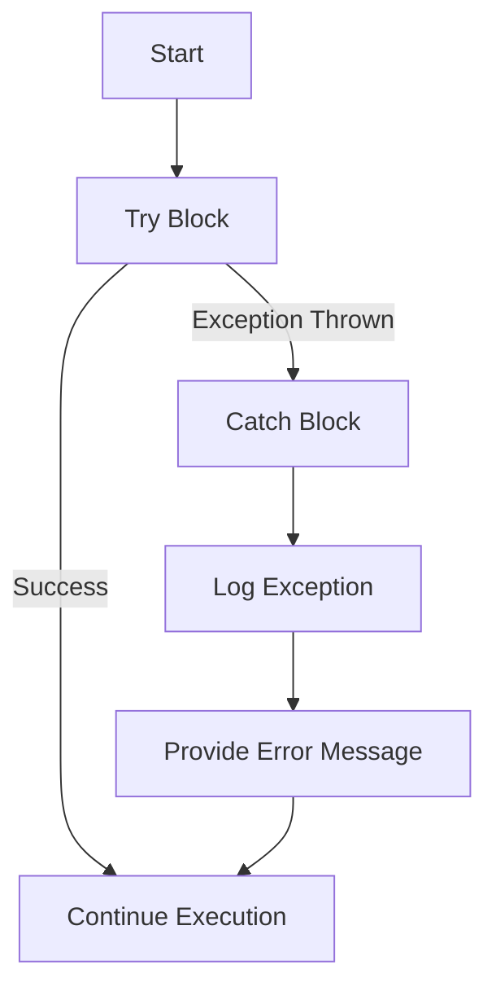

## 22.5 Empty Catch Blocks and Suppressed Errors

In the realm of PHP development, handling errors and exceptions effectively is crucial for building robust and maintainable applications. Two common anti-patterns that developers often encounter are empty catch blocks and the use of the error suppression operator (`@`). These practices can lead to hidden bugs, making applications difficult to debug and maintain. In this section, we will explore these anti-patterns in detail, understand their consequences, and discuss best practices for handling exceptions and errors in PHP.

### Understanding Empty Catch Blocks

**Empty catch blocks** occur when exceptions are caught but not handled or logged. This practice essentially ignores the exception, leaving the application in an unknown state. Let's examine a simple example:

```php
try {
    // Some code that may throw an exception
    $result = riskyOperation();
} catch (Exception $e) {
    // Empty catch block
}
```

In this example, if `riskyOperation()` throws an exception, it is caught but not handled. This can lead to several issues:

- **Loss of Information**: The exception's message and stack trace are lost, making it difficult to understand what went wrong.
- **Unstable Application State**: The application may continue executing with an inconsistent state, leading to further errors.
- **Missed Opportunities for Recovery**: Without handling the exception, the application cannot attempt to recover or provide a fallback mechanism.

### The Pitfalls of Suppressed Errors

The error suppression operator (`@`) in PHP is used to silence errors that would otherwise be reported. While it might seem convenient, it can mask underlying issues that need attention. Consider the following example:

```php
$result = @file_get_contents('non_existent_file.txt');
```

Here, if the file does not exist, the error is suppressed, and `$result` will be `false`. However, without checking for errors, the application may proceed with incorrect assumptions.

#### Consequences of Suppressed Errors

- **Hidden Bugs**: Errors that are suppressed are not logged or reported, making it difficult to identify and fix bugs.
- **Unpredictable Behavior**: The application may behave unpredictably if errors are not handled properly.
- **Security Risks**: Suppressing errors can hide security vulnerabilities, making the application susceptible to attacks.

### Best Practices for Handling Exceptions and Errors

To avoid the pitfalls of empty catch blocks and suppressed errors, consider the following best practices:

#### 1. Log Exceptions

Always log exceptions to a file or monitoring system. This provides valuable information for debugging and helps track down issues. Use a logging library like Monolog to manage logs effectively.

```php
try {
    $result = riskyOperation();
} catch (Exception $e) {
    // Log the exception
    error_log($e->getMessage());
    // Optionally, rethrow the exception
    throw $e;
}
```

#### 2. Provide Meaningful Error Messages

When appropriate, provide users with meaningful error messages. This can improve user experience and help them understand what went wrong.

```php
try {
    $result = riskyOperation();
} catch (Exception $e) {
    // Log the exception
    error_log($e->getMessage());
    // Provide a user-friendly message
    echo "An error occurred. Please try again later.";
}
```

#### 3. Use Custom Exception Classes

Define custom exception classes to handle specific error scenarios. This allows for more granular control over exception handling.

```php
class FileNotFoundException extends Exception {}

try {
    $result = riskyOperation();
} catch (FileNotFoundException $e) {
    // Handle file not found exception
    error_log($e->getMessage());
    echo "The requested file was not found.";
} catch (Exception $e) {
    // Handle other exceptions
    error_log($e->getMessage());
    echo "An error occurred. Please try again later.";
}
```

#### 4. Avoid Using the @ Operator

Instead of suppressing errors, handle them explicitly. Check for error conditions and respond accordingly.

```php
$result = file_get_contents('non_existent_file.txt');
if ($result === false) {
    // Handle the error
    error_log("Failed to read file: non_existent_file.txt");
    echo "Could not read the file.";
}
```

#### 5. Implement a Global Exception Handler

Consider implementing a global exception handler to catch unhandled exceptions and log them. This can be done using `set_exception_handler()`.

```php
function handleException($exception) {
    error_log($exception->getMessage());
    echo "An unexpected error occurred.";
}

set_exception_handler('handleException');
```

### Visualizing Error Handling Flow

To better understand the flow of error handling in PHP, let's visualize the process using a flowchart:



This flowchart illustrates the typical process of handling exceptions in PHP. The try block executes code that may throw an exception. If an exception is thrown, it is caught in the catch block, logged, and an error message is provided to the user.

### Knowledge Check

Before we conclude, let's reinforce our understanding with a few questions:

- What are the consequences of using empty catch blocks?
- How does the error suppression operator (`@`) affect error handling?
- Why is it important to log exceptions?
- How can custom exception classes improve error handling?
- What are the benefits of implementing a global exception handler?

### Embrace the Journey

Remember, effective error handling is a crucial aspect of building reliable PHP applications. By avoiding empty catch blocks and suppressed errors, we can create more robust and maintainable code. Keep experimenting, stay curious, and enjoy the journey of mastering PHP development!

### Quiz: Empty Catch Blocks and Suppressed Errors



### What is the primary issue with empty catch blocks?

- [x] They ignore exceptions without handling them.
- [ ] They always log exceptions.
- [ ] They provide detailed error messages.
- [ ] They enhance application performance.

> **Explanation:** Empty catch blocks ignore exceptions, which can lead to hidden bugs and unstable application states.

### What does the error suppression operator (`@`) do in PHP?

- [x] It silences errors that would otherwise be reported.
- [ ] It logs errors to a file.
- [ ] It enhances error messages.
- [ ] It prevents exceptions from being thrown.

> **Explanation:** The `@` operator suppresses errors, which can hide underlying issues that need attention.

### Why is logging exceptions important?

- [x] It provides valuable information for debugging.
- [ ] It suppresses errors.
- [ ] It enhances application performance.
- [ ] It prevents exceptions from being thrown.

> **Explanation:** Logging exceptions helps track down issues and provides valuable information for debugging.

### What is a benefit of using custom exception classes?

- [x] They allow for more granular control over exception handling.
- [ ] They suppress errors.
- [ ] They enhance application performance.
- [ ] They prevent exceptions from being thrown.

> **Explanation:** Custom exception classes allow developers to handle specific error scenarios more effectively.

### How can a global exception handler be implemented in PHP?

- [x] Using `set_exception_handler()`.
- [ ] Using the `@` operator.
- [ ] By suppressing errors.
- [ ] By ignoring exceptions.

> **Explanation:** A global exception handler can be implemented using `set_exception_handler()` to catch unhandled exceptions.

### What is a consequence of using the `@` operator?

- [x] It hides errors, making them harder to detect and fix.
- [ ] It logs errors to a file.
- [ ] It enhances error messages.
- [ ] It prevents exceptions from being thrown.

> **Explanation:** The `@` operator hides errors, which can make them harder to detect and fix.

### What should be done instead of using empty catch blocks?

- [x] Log exceptions and provide meaningful error messages.
- [ ] Suppress errors.
- [ ] Ignore exceptions.
- [ ] Enhance application performance.

> **Explanation:** Instead of using empty catch blocks, exceptions should be logged, and meaningful error messages should be provided.

### What is the purpose of providing meaningful error messages to users?

- [x] To improve user experience and help them understand what went wrong.
- [ ] To suppress errors.
- [ ] To enhance application performance.
- [ ] To prevent exceptions from being thrown.

> **Explanation:** Meaningful error messages improve user experience and help users understand what went wrong.

### How can error handling be visualized in PHP?

- [x] Using flowcharts to illustrate the process.
- [ ] By suppressing errors.
- [ ] By ignoring exceptions.
- [ ] By enhancing application performance.

> **Explanation:** Flowcharts can be used to visualize the process of error handling in PHP.

### True or False: Suppressing errors with the `@` operator is a best practice.

- [ ] True
- [x] False

> **Explanation:** Suppressing errors with the `@` operator is not a best practice, as it can hide underlying issues that need attention.



By following these best practices and avoiding common anti-patterns, you can ensure that your PHP applications are robust, maintainable, and easy to debug. Keep learning and refining your skills to become a proficient PHP developer!
