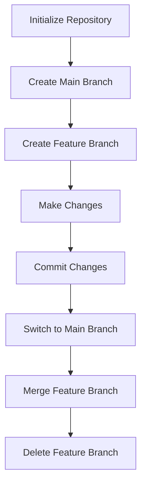

## 22.6 Not Using Version Control

In the realm of software development, version control is a fundamental practice that significantly enhances the quality and manageability of codebases. Despite its importance, some developers and teams still operate without a version control system (VCS), leading to numerous risks and inefficiencies. In this section, we will delve into the dangers of not using version control, explore the benefits of adopting it, and provide guidance on integrating version control into your PHP development workflow.

### Risks of Not Using Version Control

#### 1. Difficult to Track Changes and Collaborate

Without a VCS, tracking changes in your codebase becomes a daunting task. Developers often resort to manual methods, such as maintaining multiple copies of files with different names or dates, which is error-prone and inefficient. This approach makes it nearly impossible to:

- **Identify what changes were made:** Without a clear history, understanding the evolution of your code is challenging.
- **Determine who made changes:** In a team environment, knowing who made specific changes is crucial for accountability and collaboration.
- **Revert to previous versions:** If a bug is introduced, reverting to a stable version without a VCS is cumbersome and risky.

#### 2. Increases the Chance of Code Loss and Conflicts

Code loss is a significant risk when not using version control. Accidental deletions or overwrites can result in the loss of valuable work. Additionally, when multiple developers work on the same files without a VCS, conflicts are inevitable. These conflicts can lead to:

- **Overwritten changes:** Without proper merging capabilities, one developer's changes can overwrite another's, leading to lost work.
- **Inconsistent codebases:** Different versions of the same file may exist across team members' machines, causing inconsistencies and integration issues.

### Adopting Version Control

To mitigate these risks, adopting a version control system is essential. Git is the most widely used VCS, offering robust features for managing code history, collaboration, and more.

#### 1. Use Systems Like Git to Manage Code History

Git provides a comprehensive history of your codebase, allowing you to track every change made over time. This history is invaluable for:

- **Auditing changes:** Easily see what changes were made, when, and by whom.
- **Reverting changes:** Quickly revert to previous versions if needed.
- **Understanding project evolution:** Analyze how your project has evolved over time.

#### 2. Leverage Branching and Merging for Team Collaboration

Git's branching and merging capabilities are powerful tools for collaboration. They enable teams to work on multiple features or fixes simultaneously without interfering with each other's work. Key practices include:

- **Feature branches:** Create separate branches for new features or bug fixes, allowing for isolated development.
- **Merging:** Integrate changes from different branches seamlessly, resolving conflicts as needed.
- **Pull requests:** Use pull requests to review and discuss changes before merging them into the main codebase.

### Recommended Platforms

Several platforms provide hosting and additional tools for Git repositories, enhancing collaboration and project management:

- **GitHub:** [GitHub](https://github.com/) is a popular platform that offers a wide range of features, including issue tracking, project boards, and integrations with other tools.
- **GitLab:** [GitLab](https://gitlab.com/) provides a comprehensive suite of DevOps tools, including CI/CD pipelines, making it a great choice for end-to-end project management.
- **Bitbucket:** [Bitbucket](https://bitbucket.org/) offers integration with Atlassian tools like Jira, making it ideal for teams already using these products.

### Code Example: Basic Git Workflow

Let's explore a basic Git workflow to illustrate how version control can be integrated into your PHP development process.

```bash
# Initialize a new Git repository
git init

# Add a new file to the repository
echo "<?php echo 'Hello, World!'; ?>" > hello.php
git add hello.php

# Commit the file to the repository
git commit -m "Add hello.php"

# Create a new branch for a feature
git checkout -b feature/add-greeting

# Modify the file
echo "<?php echo 'Hello, PHP World!'; ?>" > hello.php
git add hello.php

# Commit the changes
git commit -m "Update greeting message"

# Switch back to the main branch
git checkout main

# Merge the feature branch into the main branch
git merge feature/add-greeting

# Delete the feature branch
git branch -d feature/add-greeting
```

### Visualizing Git Workflow

To better understand the Git workflow, let's visualize the process using a flowchart.



This flowchart illustrates the typical steps in a Git workflow, from initializing a repository to merging changes from a feature branch.

### Knowledge Check

Before we move on, let's reinforce what we've learned with a few questions:

- What are the risks of not using version control in a team environment?
- How does Git help in managing code history and collaboration?
- What are the benefits of using platforms like GitHub, GitLab, or Bitbucket?

### Try It Yourself

To gain hands-on experience, try the following exercises:

1. **Set up a Git repository:** Initialize a new Git repository on your local machine and create a simple PHP project.
2. **Experiment with branching:** Create a new branch, make changes, and merge it back into the main branch.
3. **Use a platform:** Create a repository on GitHub, GitLab, or Bitbucket and push your local repository to it.

### Embrace the Journey

Remember, adopting version control is a crucial step in becoming a proficient developer. It not only safeguards your code but also enhances collaboration and project management. As you continue to explore version control, you'll discover more advanced features and workflows that can further streamline your development process. Keep experimenting, stay curious, and enjoy the journey!

## Quiz: Not Using Version Control



### What is a major risk of not using version control?

- [x] Difficulty in tracking changes
- [ ] Improved collaboration
- [ ] Easier code management
- [ ] Enhanced security

> **Explanation:** Without version control, tracking changes becomes difficult, leading to potential issues in collaboration and code management.

### Which system is most widely used for version control?

- [x] Git
- [ ] SVN
- [ ] Mercurial
- [ ] CVS

> **Explanation:** Git is the most widely used version control system, known for its distributed nature and robust feature set.

### What is a feature branch used for in Git?

- [x] Isolated development of new features
- [ ] Storing backup copies of code
- [ ] Merging changes into the main branch
- [ ] Deleting old code

> **Explanation:** Feature branches allow developers to work on new features in isolation, preventing interference with the main codebase.

### Which platform offers a comprehensive suite of DevOps tools?

- [ ] GitHub
- [x] GitLab
- [ ] Bitbucket
- [ ] SourceForge

> **Explanation:** GitLab provides a comprehensive suite of DevOps tools, including CI/CD pipelines and project management features.

### What is the purpose of a pull request?

- [x] To review and discuss changes before merging
- [ ] To delete a branch
- [ ] To initialize a repository
- [ ] To track code history

> **Explanation:** Pull requests are used to review and discuss changes before they are merged into the main codebase, ensuring code quality and collaboration.

### What command initializes a new Git repository?

- [x] `git init`
- [ ] `git start`
- [ ] `git create`
- [ ] `git new`

> **Explanation:** The `git init` command initializes a new Git repository in the current directory.

### How can you revert to a previous version in Git?

- [x] By using the `git checkout` command
- [ ] By deleting the current branch
- [ ] By creating a new repository
- [ ] By using the `git merge` command

> **Explanation:** The `git checkout` command can be used to revert to a previous version of the code by checking out a specific commit.

### What is the benefit of using GitHub?

- [x] Wide range of features and integrations
- [ ] Limited collaboration tools
- [ ] No support for branching
- [ ] Lack of issue tracking

> **Explanation:** GitHub offers a wide range of features and integrations, making it a popular choice for hosting Git repositories and collaborating on projects.

### Which command is used to create a new branch in Git?

- [x] `git checkout -b`
- [ ] `git branch new`
- [ ] `git create branch`
- [ ] `git new branch`

> **Explanation:** The `git checkout -b` command is used to create a new branch and switch to it in Git.

### True or False: Version control is only necessary for large teams.

- [ ] True
- [x] False

> **Explanation:** Version control is beneficial for both individual developers and large teams, as it helps manage code history, track changes, and facilitate collaboration.


