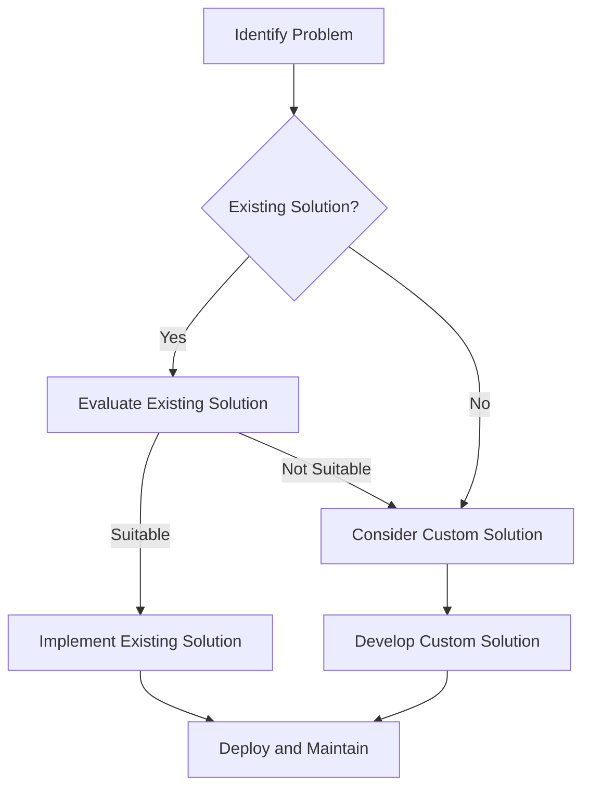

## 22.7 Reinventing the Wheel

In the realm of software development, the phrase "reinventing the wheel" refers to the unnecessary duplication of a basic method that has already been optimized and standardized. This anti-pattern is particularly prevalent in PHP development, where a plethora of libraries and frameworks exist to address common programming challenges. In this section, we will delve into the concept of reinventing the wheel, explore its drawbacks, and provide strategies to avoid this pitfall.

### Understanding the Concept

**Reinventing the Wheel** is a metaphorical expression that describes the act of creating a solution from scratch for a problem that has already been solved. This often occurs when developers are unaware of existing solutions or choose to ignore them due to a lack of research or a desire to create something unique.

#### Why Does It Happen?

1. **Lack of Awareness:** Developers may not be aware of existing libraries or frameworks that solve their problem.
2. **Desire for Control:** Some developers prefer to have complete control over their codebase, leading them to write custom solutions.
3. **Misplaced Confidence:** Overconfidence in one's ability to create a better solution than existing ones.
4. **Educational Exercise:** Sometimes, developers reinvent the wheel as a learning exercise, which can be beneficial if done intentionally and with awareness.

### Drawbacks of Reinventing the Wheel

Reinventing the wheel can lead to several negative consequences:

1. **Wasted Time and Resources:** Developing a custom solution from scratch can consume significant time and resources that could be better spent on other tasks.
2. **Lack of Reliability:** Established libraries and frameworks have been tested and refined over time, whereas custom solutions may lack the same level of reliability.
3. **Security Risks:** Custom code may not adhere to the same security standards as well-maintained libraries, potentially introducing vulnerabilities.
4. **Maintenance Burden:** Maintaining custom solutions can be challenging, especially as the project grows and evolves.

### Recommendations for Avoiding Reinventing the Wheel

To avoid falling into the trap of reinventing the wheel, consider the following strategies:

1. **Conduct Thorough Research:** Before starting a new project or feature, research existing libraries and frameworks that may already solve your problem.
2. **Leverage Community Expertise:** Use well-maintained libraries and frameworks to benefit from the collective expertise of the community.
3. **Evaluate Trade-offs:** Consider the trade-offs between using an existing solution and developing a custom one. In some cases, a custom solution may be justified, but this should be a deliberate decision.
4. **Stay Informed:** Keep up-to-date with the latest developments in the PHP ecosystem to be aware of new tools and libraries.

### Code Example: Using Existing Libraries

Let's consider a common task in PHP development: sending HTTP requests. Instead of writing a custom HTTP client, we can use the popular Guzzle library.

```php
<?php

require 'vendor/autoload.php';

use GuzzleHttp\Client;

// Create a new client instance
$client = new Client();

// Send a GET request to a URL
$response = $client->request('GET', 'https://api.example.com/data');

// Get the response body
$body = $response->getBody();

// Output the response
echo $body;
```

In this example, we use Guzzle to send an HTTP GET request. Guzzle is a well-maintained library that handles various aspects of HTTP communication, such as error handling and response parsing, allowing us to focus on the core functionality of our application.

### Visualizing the Impact of Reinventing the Wheel

To better understand the impact of reinventing the wheel, let's visualize the process of choosing between an existing solution and a custom one.



This flowchart illustrates the decision-making process when faced with a programming challenge. By evaluating existing solutions first, we can often save time and resources.

### PHP Unique Features and Considerations

PHP offers several unique features that can help avoid reinventing the wheel:

- **Composer:** PHP's dependency manager allows you to easily include and manage libraries in your project.
- **PSR Standards:** The PHP-FIG (Framework Interoperability Group) provides standards that promote interoperability between PHP libraries and frameworks.
- **PHP Extensions:** PHP has a rich ecosystem of extensions that provide additional functionality, reducing the need for custom solutions.

### Differences and Similarities with Other Anti-Patterns

Reinventing the wheel is often confused with other anti-patterns, such as:

- **Not Invented Here (NIH) Syndrome:** A tendency to avoid using external solutions due to a preference for internally developed ones.
- **Overengineering:** Adding unnecessary complexity to a solution, which can occur when reinventing the wheel.

While these anti-patterns share similarities, reinventing the wheel specifically involves duplicating existing solutions.

### Try It Yourself

To better understand the benefits of using existing libraries, try modifying the Guzzle example to send a POST request with JSON data. Explore the Guzzle documentation to learn about additional features, such as handling redirects and setting timeouts.

### Knowledge Check

- What are the potential drawbacks of reinventing the wheel in PHP development?
- How can using existing libraries and frameworks benefit your project?
- What tools does PHP provide to help avoid reinventing the wheel?

### Embrace the Journey

Remember, leveraging existing solutions is not a sign of weakness but a strategic decision that allows you to focus on what truly matters: delivering value to your users. Keep exploring the PHP ecosystem, stay curious, and enjoy the journey of continuous learning and improvement.

## Quiz: Reinventing the Wheel



### What does "reinventing the wheel" mean in software development?

- [x] Creating a solution for a problem that has already been solved by existing tools
- [ ] Developing a new programming language
- [ ] Building a new framework from scratch
- [ ] Writing documentation for existing code

> **Explanation:** "Reinventing the wheel" refers to the unnecessary duplication of a basic method that has already been optimized and standardized.

### What is a common drawback of reinventing the wheel?

- [x] Wastes time and resources
- [ ] Increases code readability
- [ ] Enhances security
- [ ] Improves performance

> **Explanation:** Reinventing the wheel can waste time and resources that could be better spent on other tasks.

### Which PHP tool helps manage dependencies and avoid reinventing the wheel?

- [x] Composer
- [ ] PHPUnit
- [ ] Xdebug
- [ ] PHPStan

> **Explanation:** Composer is PHP's dependency manager, allowing developers to easily include and manage libraries in their projects.

### What is a benefit of using well-maintained libraries?

- [x] They have been tested and refined over time
- [ ] They require more maintenance
- [ ] They are less secure
- [ ] They are harder to use

> **Explanation:** Well-maintained libraries have been tested and refined over time, providing reliability and security.

### How can developers stay informed about new tools and libraries in PHP?

- [x] Follow PHP community forums and blogs
- [ ] Ignore updates and announcements
- [ ] Only use outdated libraries
- [ ] Avoid learning new technologies

> **Explanation:** Staying informed through community forums and blogs helps developers learn about new tools and libraries.

### What is a potential security risk of custom solutions?

- [x] They may not adhere to the same security standards as established libraries
- [ ] They are always more secure than existing solutions
- [ ] They automatically update with security patches
- [ ] They are immune to vulnerabilities

> **Explanation:** Custom solutions may not adhere to the same security standards as established libraries, potentially introducing vulnerabilities.

### What is the PHP-FIG?

- [x] Framework Interoperability Group
- [ ] PHP Foundation
- [ ] PHP Security Group
- [ ] PHP Innovation Group

> **Explanation:** The PHP-FIG (Framework Interoperability Group) provides standards that promote interoperability between PHP libraries and frameworks.

### What is a common reason developers reinvent the wheel?

- [x] Lack of awareness of existing solutions
- [ ] Desire to use outdated technologies
- [ ] Preference for complex solutions
- [ ] Need for more documentation

> **Explanation:** Developers may not be aware of existing libraries or frameworks that solve their problem, leading them to reinvent the wheel.

### What is a trade-off to consider when choosing between an existing solution and a custom one?

- [x] Reliability vs. control
- [ ] Complexity vs. simplicity
- [ ] Security vs. performance
- [ ] Documentation vs. code comments

> **Explanation:** Developers should consider the trade-off between the reliability of existing solutions and the control offered by custom solutions.

### True or False: Reinventing the wheel is always a bad practice.

- [ ] True
- [x] False

> **Explanation:** While generally discouraged, reinventing the wheel can be beneficial as a learning exercise if done intentionally and with awareness.




