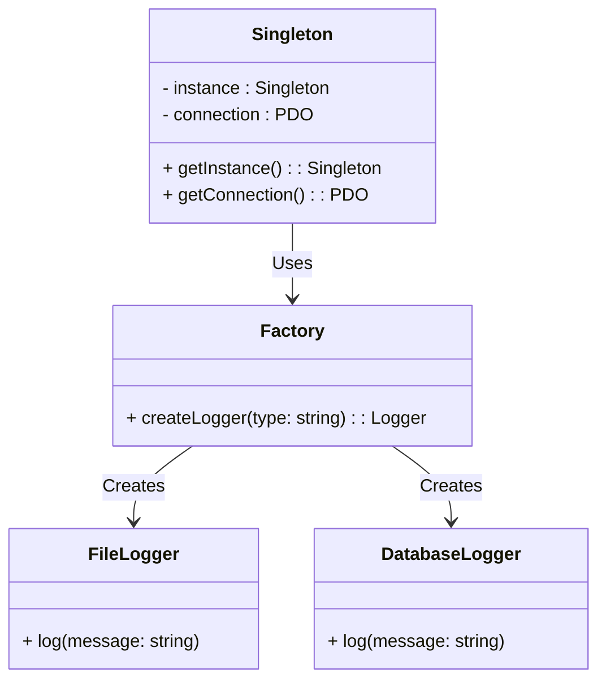

## 22.8 Misusing Design Patterns

Design patterns are powerful tools in software development, providing proven solutions to common problems. However, like any tool, they must be used correctly to be effective. Misusing design patterns can lead to overly complex, inefficient, and difficult-to-maintain code. In this section, we will explore common pitfalls associated with misusing design patterns in PHP and provide guidance on how to avoid them.

### Overusing Patterns

One of the most common mistakes developers make is overusing design patterns. This occurs when a pattern is applied to a problem that does not require it, leading to unnecessary complexity.

#### Example: Singleton Overuse

The Singleton pattern is often overused in PHP applications. While it ensures a class has only one instance and provides a global point of access to it, using it excessively can lead to tightly coupled code and difficulties in testing.

```php
<?php

class DatabaseConnection {
    private static $instance = null;
    private $connection;

    private function __construct() {
        $this->connection = new PDO('mysql:host=localhost;dbname=test', 'user', 'password');
    }

    public static function getInstance() {
        if (self::$instance === null) {
            self::$instance = new DatabaseConnection();
        }
        return self::$instance;
    }

    public function getConnection() {
        return $this->connection;
    }
}

// Usage
$dbConnection = DatabaseConnection::getInstance()->getConnection();
```

**Key Issues:**
- **Global State:** The Singleton pattern introduces a global state, which can lead to hidden dependencies and make the code harder to understand and maintain.
- **Testing Challenges:** Singletons can complicate unit testing, as they maintain state across tests.

**Guidelines:**
- Use Singletons sparingly and only when truly necessary.
- Consider dependency injection as an alternative to manage shared resources.

### Incorrect Implementation

Misapplying design patterns can introduce bugs and inefficiencies. This often happens when developers do not fully understand the pattern or its intended use.

#### Example: Misapplied Factory Pattern

The Factory Method pattern is designed to create objects without specifying the exact class of object that will be created. Misapplying this pattern can lead to unnecessary complexity.

```php
<?php

interface Logger {
    public function log(string $message);
}

class FileLogger implements Logger {
    public function log(string $message) {
        // Log to a file
    }
}

class DatabaseLogger implements Logger {
    public function log(string $message) {
        // Log to a database
    }
}

class LoggerFactory {
    public static function createLogger(string $type): Logger {
        if ($type === 'file') {
            return new FileLogger();
        } elseif ($type === 'database') {
            return new DatabaseLogger();
        } else {
            throw new Exception("Invalid logger type");
        }
    }
}

// Usage
$logger = LoggerFactory::createLogger('file');
$logger->log('This is a log message.');
```

**Key Issues:**
- **Hard-Coded Logic:** The factory method contains hard-coded logic for determining which class to instantiate, which can be inflexible and difficult to extend.
- **Violation of Open/Closed Principle:** Adding new logger types requires modifying the factory method, violating the open/closed principle.

**Guidelines:**
- Use configuration files or dependency injection to manage object creation dynamically.
- Ensure that the factory method is easily extendable without modifying existing code.

### Guidelines for Proper Use

To avoid misusing design patterns, follow these guidelines:

1. **Understand the Problem Thoroughly:**
   - Before selecting a pattern, ensure you fully understand the problem you are trying to solve. Patterns should address specific issues, not be applied indiscriminately.

2. **Choose the Right Pattern:**
   - Select a pattern that fits the context and requirements of your application. Consider the trade-offs and ensure the pattern aligns with your goals.

3. **Keep It Simple:**
   - Avoid adding unnecessary complexity to your code. If a simpler solution exists, use it instead of forcing a pattern.

4. **Refactor When Necessary:**
   - As your application evolves, refactor your code to ensure patterns are still relevant and beneficial. Patterns should enhance, not hinder, your codebase.

5. **Stay Informed:**
   - Continuously learn about design patterns and best practices. Understanding the nuances of each pattern will help you apply them effectively.

### Visualizing Misuse of Design Patterns

To better understand the misuse of design patterns, let's visualize the consequences using a class diagram.



**Diagram Explanation:**
- The diagram illustrates the relationship between the Singleton and Factory patterns.
- It highlights how the Singleton pattern can lead to a global state and how the Factory pattern can become inflexible with hard-coded logic.

### PHP Unique Features

PHP offers unique features that can influence how design patterns are implemented:

- **Traits:** PHP traits allow for code reuse in single inheritance languages. They can be used to implement shared behavior across classes without using inheritance.
- **Anonymous Classes:** Introduced in PHP 7, anonymous classes can be used to create simple, one-off objects without defining a full class.
- **Type Declarations:** PHP's type declarations can enforce type safety and improve code readability, especially when implementing patterns that involve multiple interfaces or abstract classes.

### Differences and Similarities

Some design patterns are commonly confused with one another. Understanding their differences and similarities can help avoid misuse:

- **Singleton vs. Static Class:** Both provide a single point of access, but Singletons allow for lazy initialization and can implement interfaces, while static classes cannot.
- **Factory Method vs. Abstract Factory:** The Factory Method pattern uses inheritance to decide which class to instantiate, while the Abstract Factory pattern uses composition to delegate the responsibility of object creation.

### Try It Yourself

To deepen your understanding, try modifying the code examples:

- **Singleton Pattern:** Refactor the Singleton example to use dependency injection instead of a global instance.
- **Factory Pattern:** Extend the Factory pattern to support additional logger types without modifying the existing factory method.

### Knowledge Check

- **Question:** What are the potential downsides of using the Singleton pattern excessively?
- **Challenge:** Refactor a piece of code that uses a misapplied design pattern to improve its flexibility and maintainability.

### Embrace the Journey

Remember, mastering design patterns is a journey. As you continue to learn and apply these patterns, you'll become more adept at identifying when and how to use them effectively. Keep experimenting, stay curious, and enjoy the process of refining your PHP development skills.

### Key Takeaways

- Misusing design patterns can lead to complex, inefficient, and hard-to-maintain code.
- Understand the problem and context before selecting a pattern.
- Use PHP's unique features to enhance pattern implementation.
- Continuously learn and refactor to ensure patterns remain beneficial.

## Quiz: Misusing Design Patterns



### What is a common consequence of overusing design patterns?

- [x] Increased complexity
- [ ] Improved performance
- [ ] Simplified code
- [ ] Enhanced readability

> **Explanation:** Overusing design patterns can lead to increased complexity, making the code harder to understand and maintain.

### Which pattern is often overused, leading to tightly coupled code?

- [x] Singleton
- [ ] Factory Method
- [ ] Observer
- [ ] Decorator

> **Explanation:** The Singleton pattern is often overused, leading to tightly coupled code and difficulties in testing.

### What is a key issue with misapplying the Factory Method pattern?

- [x] Hard-coded logic
- [ ] Lack of flexibility
- [ ] Excessive inheritance
- [ ] Poor performance

> **Explanation:** Misapplying the Factory Method pattern can lead to hard-coded logic, making the code inflexible and difficult to extend.

### What should you do before selecting a design pattern?

- [x] Understand the problem thoroughly
- [ ] Choose the most popular pattern
- [ ] Implement the pattern immediately
- [ ] Ignore the context

> **Explanation:** Before selecting a design pattern, it is crucial to understand the problem thoroughly to ensure the pattern addresses the specific issue.

### How can you avoid misusing design patterns?

- [x] Keep it simple
- [ ] Use as many patterns as possible
- [x] Refactor when necessary
- [ ] Avoid learning new patterns

> **Explanation:** Keeping the code simple and refactoring when necessary can help avoid misusing design patterns.

### What PHP feature allows for code reuse without inheritance?

- [x] Traits
- [ ] Interfaces
- [ ] Abstract classes
- [ ] Anonymous classes

> **Explanation:** PHP traits allow for code reuse in single inheritance languages without using inheritance.

### What is a benefit of using type declarations in PHP?

- [x] Enforcing type safety
- [ ] Reducing code length
- [x] Improving code readability
- [ ] Increasing execution speed

> **Explanation:** Type declarations in PHP enforce type safety and improve code readability, especially when implementing patterns.

### What is a similarity between Singleton and static classes?

- [x] Single point of access
- [ ] Lazy initialization
- [ ] Interface implementation
- [ ] Multiple instances

> **Explanation:** Both Singleton and static classes provide a single point of access, but Singletons allow for lazy initialization and can implement interfaces.

### How can you extend the Factory pattern without modifying existing code?

- [x] Use configuration files
- [ ] Add more if-else statements
- [ ] Hard-code new logic
- [ ] Avoid using interfaces

> **Explanation:** Using configuration files or dependency injection can extend the Factory pattern without modifying existing code.

### True or False: Misusing design patterns can lead to technical debt.

- [x] True
- [ ] False

> **Explanation:** Misusing design patterns can lead to technical debt by introducing complexity and inefficiencies that require future refactoring.


