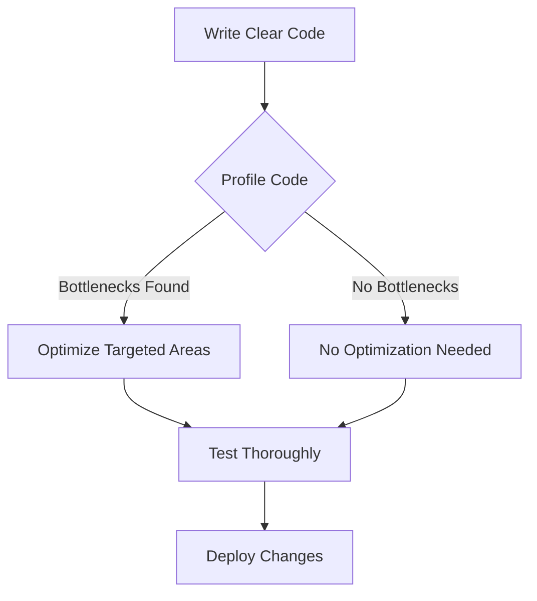

## 22.9 Premature Optimization

In the world of software development, the term "premature optimization" is often cited as a cautionary tale. Coined by Donald Knuth, the phrase "premature optimization is the root of all evil" serves as a reminder that optimizing code too early can lead to more harm than good. In this section, we will delve into the concept of premature optimization in PHP, explore its consequences, and provide guidance on how to approach optimization effectively.

### Understanding Premature Optimization

Premature optimization refers to the practice of attempting to improve the performance of a piece of code before it is necessary. This often occurs when developers make assumptions about where bottlenecks might be without empirical evidence. The result is often code that is more complex, harder to maintain, and sometimes even less efficient than the original.

#### Key Concepts

- **Optimization**: The process of making a system or codebase more efficient, typically in terms of speed or resource usage.
- **Premature**: Acting before the appropriate time, often based on assumptions rather than data.

### The Consequences of Premature Optimization

Premature optimization can have several negative consequences:

1. **Obscured Code Logic**: Optimized code can become difficult to read and understand, making it harder for other developers (or even the original author) to maintain and extend.

2. **Increased Complexity**: Introducing optimizations can add layers of complexity that are unnecessary for the current requirements, leading to potential bugs and increased development time.

3. **Wasted Effort**: Time spent on optimizing code that does not need it could be better spent on other aspects of development, such as implementing features or fixing bugs.

4. **Hindered Maintainability**: As code becomes more complex, it becomes more challenging to maintain, leading to technical debt.

### A Pragmatic Approach to Optimization

To avoid the pitfalls of premature optimization, consider the following approach:

#### 1. Write Clear and Correct Code First

Focus on writing code that is clear, correct, and easy to understand. Prioritize readability and maintainability over performance unless you have identified a specific need for optimization.

#### 2. Profile and Measure

Before optimizing, use profiling tools to gather data on where the actual performance bottlenecks are. PHP offers several tools for profiling, such as Xdebug and Blackfire.

#### 3. Optimize Based on Data

Once you have identified the bottlenecks, focus your optimization efforts on those areas. This targeted approach ensures that your efforts are effective and necessary.

#### 4. Test Thoroughly

After making optimizations, test your code thoroughly to ensure that it still behaves correctly and that the optimizations have had the desired effect.

### Code Example: Premature Optimization Pitfall

Let's consider a simple example where premature optimization might occur. Suppose we have a function that calculates the sum of an array of numbers.

```php
<?php

function sumArray(array $numbers): int {
    $sum = 0;
    foreach ($numbers as $number) {
        $sum += $number;
    }
    return $sum;
}

$numbers = range(1, 1000000);
echo sumArray($numbers);
```

A developer might prematurely optimize this by trying to use a more complex algorithm or data structure, assuming it will be faster. However, without profiling, this assumption could be incorrect, and the added complexity might not be justified.

### Profiling and Optimization

To effectively optimize PHP code, you should use profiling tools to identify bottlenecks. Here are some popular tools:

- **Xdebug**: A powerful debugger and profiler for PHP.
- **Blackfire**: A performance management solution that provides insights into your application's performance.
- **Tideways**: A PHP profiler that helps identify performance bottlenecks.

#### Example: Using Xdebug for Profiling

To profile the `sumArray` function using Xdebug, follow these steps:

1. **Install Xdebug**: Ensure Xdebug is installed and configured on your PHP environment.
2. **Enable Profiling**: Configure Xdebug to enable profiling by setting `xdebug.profiler_enable` to `1` in your `php.ini`.
3. **Run Your Script**: Execute your PHP script to generate a profiling file.
4. **Analyze the Profile**: Use a tool like `KCachegrind` to analyze the profiling data and identify bottlenecks.

### Visualizing the Optimization Process

To better understand the process of optimization, let's visualize it using a flowchart.



**Figure 1**: The optimization process involves writing clear code, profiling to find bottlenecks, optimizing targeted areas, testing thoroughly, and finally deploying changes.

### Best Practices for Optimization

- **Avoid Assumptions**: Do not assume where the performance issues are; always rely on data.
- **Keep It Simple**: Strive for simplicity in your code. Complex solutions are harder to maintain and debug.
- **Iterate**: Optimization is an iterative process. Continuously profile and refine your code as needed.
- **Document Changes**: Keep track of optimizations and their impact on performance for future reference.

### Knowledge Check

- **Question**: Why is premature optimization considered harmful?
  - **Answer**: It can lead to complex, hard-to-maintain code and wasted effort on unnecessary optimizations.

- **Exercise**: Use a profiling tool to analyze a piece of your PHP code. Identify any bottlenecks and consider if optimization is necessary.

### Embrace the Journey

Remember, optimization is an ongoing process. As you gain more experience, you'll develop a better intuition for when and where optimization is needed. Keep experimenting, stay curious, and enjoy the journey of writing efficient and maintainable PHP code.

### References and Further Reading

- [PHP: Xdebug](https://xdebug.org/)
- [Blackfire.io](https://blackfire.io/)
- [Tideways](https://tideways.com/)
- [MDN Web Docs: Performance](https://developer.mozilla.org/en-US/docs/Web/Performance)

## Quiz: Premature Optimization



### What is premature optimization?

- [x] Optimizing code before it's necessary
- [ ] Writing code without comments
- [ ] Using complex algorithms
- [ ] Ignoring code readability

> **Explanation:** Premature optimization refers to optimizing code before it's necessary, often leading to complex and hard-to-maintain code.

### What is the first step in avoiding premature optimization?

- [x] Write clear and correct code first
- [ ] Optimize every function
- [ ] Use complex algorithms
- [ ] Ignore profiling tools

> **Explanation:** The first step is to write clear and correct code, focusing on readability and maintainability.

### Which tool can be used for profiling PHP code?

- [x] Xdebug
- [ ] MySQL
- [ ] Apache
- [ ] JavaScript

> **Explanation:** Xdebug is a popular tool for profiling PHP code to identify performance bottlenecks.

### What should you do after identifying bottlenecks in your code?

- [x] Optimize targeted areas
- [ ] Rewrite the entire codebase
- [ ] Ignore the bottlenecks
- [ ] Add more comments

> **Explanation:** After identifying bottlenecks, you should focus on optimizing those specific areas.

### Why is it important to test thoroughly after optimization?

- [x] To ensure code correctness and performance improvements
- [ ] To add more features
- [ ] To remove comments
- [ ] To increase code complexity

> **Explanation:** Testing ensures that the code still behaves correctly and that the optimizations have had the desired effect.

### What is a common consequence of premature optimization?

- [x] Increased code complexity
- [ ] Improved code readability
- [ ] Reduced development time
- [ ] Simplified algorithms

> **Explanation:** Premature optimization often leads to increased code complexity, making it harder to maintain.

### What is the role of profiling in optimization?

- [x] Identifying performance bottlenecks
- [ ] Writing more code
- [ ] Removing comments
- [ ] Ignoring code readability

> **Explanation:** Profiling helps identify performance bottlenecks, allowing for targeted optimization efforts.

### What is the main goal of optimization?

- [x] Improve performance based on data
- [ ] Add more features
- [ ] Increase code complexity
- [ ] Remove all comments

> **Explanation:** The main goal of optimization is to improve performance based on empirical data, not assumptions.

### True or False: Premature optimization is always beneficial.

- [ ] True
- [x] False

> **Explanation:** Premature optimization is not always beneficial and can lead to complex, hard-to-maintain code.

### What should you rely on before optimizing your code?

- [x] Profiling and performance data
- [ ] Assumptions and guesses
- [ ] Complex algorithms
- [ ] Code comments

> **Explanation:** Always rely on profiling and performance data to guide your optimization efforts.


