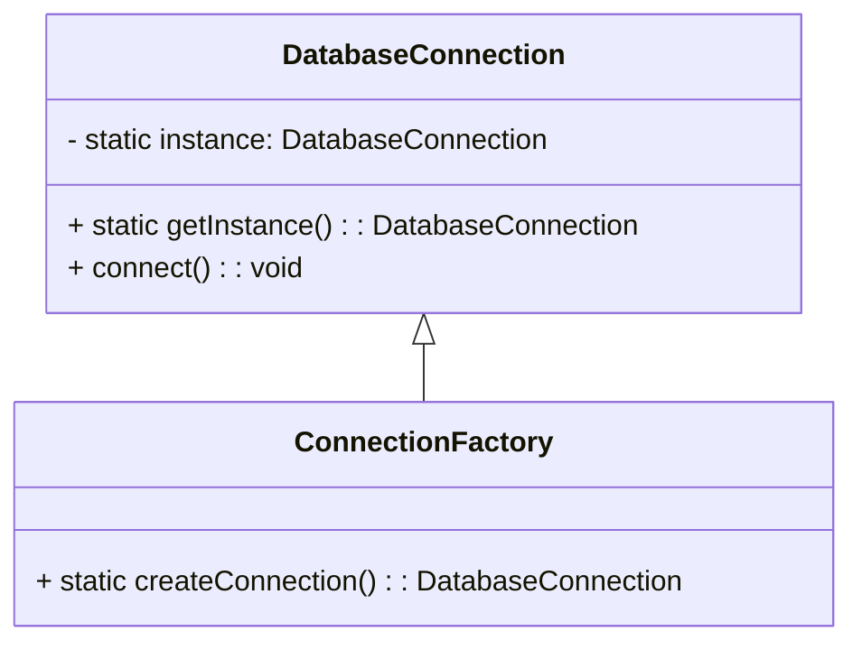

## 23.1 Combining Patterns for Robust Solutions

In the realm of software development, design patterns serve as proven solutions to common problems. However, real-world applications often present complex challenges that require more than a single pattern to address effectively. By combining multiple design patterns, developers can create robust, scalable, and maintainable solutions. In this section, we will explore the synergistic use of design patterns in PHP, providing insights into how to combine them effectively while avoiding unnecessary complexity.

### Synergistic Use of Patterns

Combining design patterns involves using two or more patterns together to solve a problem more effectively than any single pattern could. This approach leverages the strengths of each pattern, allowing them to complement each other and address different aspects of a problem. Here are some key considerations when combining patterns:

- **Complementarity:** Ensure that the patterns you choose complement each other. They should work together to solve different parts of the problem without overlapping responsibilities.
- **Simplicity:** Avoid overcomplicating your design by using too many patterns. Each pattern should have a clear purpose and contribute to the overall solution.
- **Maintainability:** Consider the long-term maintainability of your code. Combining patterns should make your code easier to understand and modify, not harder.

### Considerations for Combining Patterns

When combining patterns, it's essential to consider how they interact and whether they introduce unnecessary complexity. Here are some guidelines to help you make informed decisions:

- **Identify Core Responsibilities:** Clearly define the core responsibilities of each pattern. This will help you determine how they can work together without stepping on each other's toes.
- **Evaluate Dependencies:** Consider the dependencies between patterns. Some patterns may rely on others to function correctly, so it's important to understand these relationships.
- **Test for Complexity:** Regularly assess the complexity of your design. If adding a new pattern makes the solution harder to understand or maintain, it may be worth reconsidering its inclusion.
- **Iterate and Refine:** Design is an iterative process. Be prepared to refine your approach as you gain a deeper understanding of the problem and the patterns you're using.

### Examples of Combining Patterns

Let's explore some examples of how design patterns can be combined to create robust solutions in PHP.

#### Example 1: Singleton and Factory Patterns

The Singleton pattern ensures that a class has only one instance and provides a global point of access to it. The Factory pattern, on the other hand, provides an interface for creating objects, allowing subclasses to alter the type of objects that will be created. By combining these two patterns, we can manage instances more effectively.

```php
<?php

class DatabaseConnection {
    private static $instance = null;

    private function __construct() {
        // Private constructor to prevent direct instantiation
    }

    public static function getInstance() {
        if (self::$instance === null) {
            self::$instance = new self();
        }
        return self::$instance;
    }

    public function connect() {
        // Connect to the database
    }
}

class ConnectionFactory {
    public static function createConnection() {
        return DatabaseConnection::getInstance();
    }
}

// Usage
$connection = ConnectionFactory::createConnection();
$connection->connect();
```

In this example, the `DatabaseConnection` class uses the Singleton pattern to ensure only one instance exists. The `ConnectionFactory` class uses the Factory pattern to provide a clean interface for creating the connection.

#### Example 2: Decorator and Strategy Patterns

The Decorator pattern allows behavior to be added to individual objects, dynamically, without affecting the behavior of other objects from the same class. The Strategy pattern defines a family of algorithms, encapsulates each one, and makes them interchangeable. By combining these patterns, we can create flexible and dynamic solutions.

```php
<?php

interface PaymentStrategy {
    public function pay($amount);
}

class CreditCardPayment implements PaymentStrategy {
    public function pay($amount) {
        echo "Paying $amount using Credit Card.\n";
    }
}

class PayPalPayment implements PaymentStrategy {
    public function pay($amount) {
        echo "Paying $amount using PayPal.\n";
    }
}

abstract class PaymentDecorator implements PaymentStrategy {
    protected $payment;

    public function __construct(PaymentStrategy $payment) {
        $this->payment = $payment;
    }

    abstract public function pay($amount);
}

class DiscountDecorator extends PaymentDecorator {
    public function pay($amount) {
        $discountedAmount = $amount * 0.9; // Apply a 10% discount
        $this->payment->pay($discountedAmount);
    }
}

// Usage
$payment = new DiscountDecorator(new CreditCardPayment());
$payment->pay(100);
```

In this example, the `PaymentStrategy` interface defines a family of payment algorithms. The `DiscountDecorator` class uses the Decorator pattern to add a discount feature to any payment strategy.

### Visualizing Pattern Combinations

To better understand how patterns can be combined, let's visualize the interaction between the Singleton and Factory patterns using a class diagram.



This diagram illustrates how the `ConnectionFactory` class depends on the `DatabaseConnection` class to create a connection instance.

### PHP Unique Features

PHP offers several unique features that can enhance the implementation of design patterns:

- **Traits:** PHP traits allow you to reuse code across multiple classes, making it easier to implement shared behavior in patterns like Decorator or Strategy.
- **Anonymous Classes:** Introduced in PHP 7, anonymous classes can be used to create lightweight objects for patterns like Factory or Strategy without defining a full class.
- **Type Declarations:** PHP's type declarations help ensure that the objects passed between patterns are of the expected type, reducing runtime errors.

### Differences and Similarities

When combining patterns, it's important to understand the differences and similarities between them. For example, the Singleton and Factory patterns both deal with object creation, but they serve different purposes. The Singleton pattern controls the number of instances, while the Factory pattern abstracts the instantiation process.

### Try It Yourself

To deepen your understanding, try modifying the code examples provided. For instance, you could:

- Add a new payment strategy to the Strategy pattern example.
- Implement a logging feature using the Decorator pattern.
- Experiment with different ways to combine the Singleton and Factory patterns.

### Knowledge Check

Before moving on, take a moment to reflect on what you've learned:

- How do the Singleton and Factory patterns complement each other?
- What are the benefits of using the Decorator pattern with the Strategy pattern?
- How can PHP's unique features enhance the implementation of design patterns?

### Embrace the Journey

Remember, combining design patterns is both an art and a science. As you gain experience, you'll develop an intuition for when and how to combine patterns effectively. Keep experimenting, stay curious, and enjoy the journey!

## Quiz: Combining Patterns for Robust Solutions



### Which pattern ensures a class has only one instance?

- [x] Singleton
- [ ] Factory
- [ ] Decorator
- [ ] Strategy

> **Explanation:** The Singleton pattern ensures that a class has only one instance and provides a global point of access to it.

### What is the main purpose of the Factory pattern?

- [x] To provide an interface for creating objects
- [ ] To add behavior to individual objects dynamically
- [ ] To define a family of algorithms
- [ ] To ensure a class has only one instance

> **Explanation:** The Factory pattern provides an interface for creating objects, allowing subclasses to alter the type of objects that will be created.

### How does the Decorator pattern enhance objects?

- [x] By adding behavior to individual objects dynamically
- [ ] By ensuring a class has only one instance
- [ ] By providing an interface for creating objects
- [ ] By defining a family of algorithms

> **Explanation:** The Decorator pattern allows behavior to be added to individual objects dynamically, without affecting the behavior of other objects from the same class.

### What is a key benefit of combining the Strategy and Decorator patterns?

- [x] Flexibility and dynamic behavior
- [ ] Ensuring a class has only one instance
- [ ] Simplifying object creation
- [ ] Reducing the number of classes

> **Explanation:** Combining the Strategy and Decorator patterns provides flexibility and dynamic behavior, allowing algorithms to be interchangeable and enhanced with additional features.

### Which PHP feature allows code reuse across multiple classes?

- [x] Traits
- [ ] Anonymous Classes
- [ ] Type Declarations
- [ ] Namespaces

> **Explanation:** PHP traits allow you to reuse code across multiple classes, making it easier to implement shared behavior.

### What is the role of the `ConnectionFactory` class in the example?

- [x] To provide a clean interface for creating a connection
- [ ] To ensure only one instance of a class exists
- [ ] To add behavior to individual objects dynamically
- [ ] To define a family of algorithms

> **Explanation:** The `ConnectionFactory` class uses the Factory pattern to provide a clean interface for creating a connection.

### How can PHP's type declarations enhance design pattern implementation?

- [x] By ensuring objects are of the expected type
- [ ] By allowing code reuse across classes
- [ ] By creating lightweight objects
- [ ] By providing a global point of access

> **Explanation:** PHP's type declarations help ensure that the objects passed between patterns are of the expected type, reducing runtime errors.

### What is a potential pitfall of combining too many patterns?

- [x] Increased complexity
- [ ] Reduced flexibility
- [ ] Limited functionality
- [ ] Decreased performance

> **Explanation:** Combining too many patterns can lead to increased complexity, making the code harder to understand and maintain.

### Which pattern is used to create lightweight objects without defining a full class?

- [x] Anonymous Classes
- [ ] Traits
- [ ] Type Declarations
- [ ] Namespaces

> **Explanation:** Anonymous classes can be used to create lightweight objects for patterns like Factory or Strategy without defining a full class.

### True or False: The Singleton pattern can be combined with the Factory pattern to manage instances more effectively.

- [x] True
- [ ] False

> **Explanation:** The Singleton pattern can be combined with the Factory pattern to manage instances more effectively, ensuring only one instance exists while providing a clean interface for creation.



By understanding how to combine design patterns effectively, you can create solutions that are not only robust but also adaptable to changing requirements. Keep exploring and experimenting with different combinations to find the best fit for your projects.
