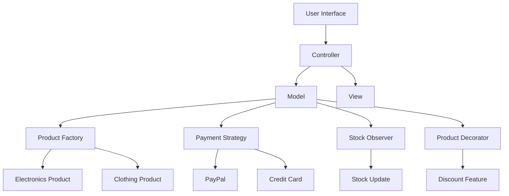

## 23.2 Case Study: Building an eCommerce Platform

In this case study, we will explore how to build a robust and scalable eCommerce platform using PHP design patterns. By leveraging patterns such as MVC, Factory Method, Strategy, Observer, and Decorator, we can create a modular system that efficiently handles product catalogs, user carts, orders, and payments. This approach not only enhances maintainability but also facilitates future growth and feature additions.

### Challenges in Building an eCommerce Platform

Building an eCommerce platform involves several challenges, including:

- **Handling Product Catalogs:** Efficiently managing a large number of products with varying attributes.
- **User Carts and Orders:** Ensuring seamless user experience from adding products to the cart to placing orders.
- **Payment Processing:** Supporting multiple payment gateways securely and reliably.
- **Stock Management:** Keeping track of inventory levels and updating them in real-time.
- **Promotional Features:** Implementing discounts, offers, and other promotional strategies.

### Patterns Implemented

To address these challenges, we will implement the following design patterns:

1. **MVC Pattern:** For structuring the application and separating concerns.
2. **Factory Method:** For creating product objects dynamically based on their type.
3. **Strategy Pattern:** For implementing multiple payment gateways.
4. **Observer Pattern:** For updating stock levels and notifying users.
5. **Decorator Pattern:** For adding promotional features to products.

Let's dive into each pattern and see how they contribute to building our eCommerce platform.

### MVC Pattern: Structuring the Application

The Model-View-Controller (MVC) pattern is fundamental in structuring our eCommerce application. It separates the application into three interconnected components:

- **Model:** Manages the data and business logic.
- **View:** Handles the presentation layer.
- **Controller:** Acts as an interface between Model and View, processing user input.

#### Implementing MVC in PHP

```php
// Model: Product.php
class Product {
    private $id;
    private $name;
    private $price;
    private $stock;

    public function __construct($id, $name, $price, $stock) {
        $this->id = $id;
        $this->name = $name;
        $this->price = $price;
        $this->stock = $stock;
    }

    // Getters and setters...
}

// View: productView.php
function displayProduct($product) {
    echo "<h1>{$product->getName()}</h1>";
    echo "<p>Price: {$product->getPrice()}</p>";
    echo "<p>Stock: {$product->getStock()}</p>";
}

// Controller: ProductController.php
class ProductController {
    private $model;
    private $view;

    public function __construct($model, $view) {
        $this->model = $model;
        $this->view = $view;
    }

    public function showProduct() {
        $this->view->displayProduct($this->model);
    }
}

// Usage
$product = new Product(1, "Laptop", 999.99, 10);
$view = new ProductView();
$controller = new ProductController($product, $view);
$controller->showProduct();
```

### Factory Method: Creating Product Objects Dynamically

The Factory Method pattern allows us to create product objects dynamically based on their type. This is particularly useful when dealing with a diverse product catalog.

#### Implementing Factory Method in PHP

```php
// ProductFactory.php
abstract class ProductFactory {
    abstract public function createProduct($type);
}

class ConcreteProductFactory extends ProductFactory {
    public function createProduct($type) {
        switch ($type) {
            case 'Electronics':
                return new ElectronicsProduct();
            case 'Clothing':
                return new ClothingProduct();
            default:
                throw new Exception("Invalid product type");
        }
    }
}

// Usage
$factory = new ConcreteProductFactory();
$product = $factory->createProduct('Electronics');
```

### Strategy Pattern: Implementing Multiple Payment Gateways

The Strategy pattern is ideal for implementing multiple payment gateways. It allows us to define a family of algorithms (payment methods) and make them interchangeable.

#### Implementing Strategy Pattern in PHP

```php
// PaymentStrategy.php
interface PaymentStrategy {
    public function pay($amount);
}

class PayPalStrategy implements PaymentStrategy {
    public function pay($amount) {
        echo "Paying $amount using PayPal.";
    }
}

class CreditCardStrategy implements PaymentStrategy {
    public function pay($amount) {
        echo "Paying $amount using Credit Card.";
    }
}

// Usage
$paymentMethod = new PayPalStrategy();
$paymentMethod->pay(100);
```

### Observer Pattern: Updating Stock Levels and Notifying Users

The Observer pattern helps in updating stock levels and notifying users about changes. It defines a one-to-many dependency between objects so that when one object changes state, all its dependents are notified.

#### Implementing Observer Pattern in PHP

```php
// Observer.php
interface Observer {
    public function update($product);
}

class StockObserver implements Observer {
    public function update($product) {
        echo "Stock updated for product: {$product->getName()}";
    }
}

// Subject.php
interface Subject {
    public function attach(Observer $observer);
    public function detach(Observer $observer);
    public function notify();
}

class Product implements Subject {
    private $observers = [];

    public function attach(Observer $observer) {
        $this->observers[] = $observer;
    }

    public function detach(Observer $observer) {
        $key = array_search($observer, $this->observers);
        if ($key !== false) {
            unset($this->observers[$key]);
        }
    }

    public function notify() {
        foreach ($this->observers as $observer) {
            $observer->update($this);
        }
    }

    // Other methods...
}

// Usage
$product = new Product();
$stockObserver = new StockObserver();
$product->attach($stockObserver);
$product->notify();
```

### Decorator Pattern: Adding Promotional Features to Products

The Decorator pattern allows us to add new functionality to existing objects without altering their structure. This is useful for adding promotional features to products.

#### Implementing Decorator Pattern in PHP

```php
// ProductDecorator.php
abstract class ProductDecorator extends Product {
    protected $product;

    public function __construct(Product $product) {
        $this->product = $product;
    }
}

class DiscountDecorator extends ProductDecorator {
    private $discount;

    public function __construct(Product $product, $discount) {
        parent::__construct($product);
        $this->discount = $discount;
    }

    public function getPrice() {
        return $this->product->getPrice() - $this->discount;
    }
}

// Usage
$product = new Product(1, "Laptop", 999.99, 10);
$discountedProduct = new DiscountDecorator($product, 100);
echo $discountedProduct->getPrice(); // Outputs: 899.99
```

### Outcome: A Modular, Scalable Platform

By integrating these design patterns, we have built a modular and scalable eCommerce platform. The use of MVC ensures a clean separation of concerns, while the Factory Method and Strategy patterns provide flexibility in product creation and payment processing. The Observer pattern keeps our stock levels updated, and the Decorator pattern allows for easy addition of promotional features.

### Visualizing the Architecture

Below is a diagram illustrating the architecture of our eCommerce platform using the implemented design patterns.



### Try It Yourself

To deepen your understanding, try modifying the code examples:

- **Add a new product type** in the Factory Method pattern.
- **Implement a new payment gateway** using the Strategy pattern.
- **Create a new observer** to notify users via email when stock levels change.
- **Add a new promotional feature** using the Decorator pattern.

### References and Links

- [PHP: The Right Way](https://phptherightway.com/)
- [Design Patterns in PHP](https://www.php.net/manual/en/language.oop5.patterns.php)
- [MDN Web Docs: Design Patterns](https://developer.mozilla.org/en-US/docs/Web/JavaScript/Guide/Design_Patterns)

### Knowledge Check

- What are the benefits of using the MVC pattern in an eCommerce platform?
- How does the Factory Method pattern enhance product management?
- Why is the Strategy pattern suitable for payment processing?
- How does the Observer pattern help in stock management?
- What advantages does the Decorator pattern offer for promotional features?

### Embrace the Journey

Remember, this is just the beginning. As you progress, you'll build more complex and interactive eCommerce platforms. Keep experimenting, stay curious, and enjoy the journey!

## Quiz: Case Study: Building an eCommerce Platform



### What is the primary benefit of using the MVC pattern in an eCommerce platform?

- [x] Separation of concerns
- [ ] Faster database queries
- [ ] Reduced code complexity
- [ ] Enhanced security

> **Explanation:** The MVC pattern separates the application into Model, View, and Controller, promoting a clean separation of concerns.

### Which pattern is used to dynamically create product objects?

- [x] Factory Method
- [ ] Strategy
- [ ] Observer
- [ ] Decorator

> **Explanation:** The Factory Method pattern is used to create product objects dynamically based on their type.

### How does the Strategy pattern benefit payment processing?

- [x] Allows interchangeable payment methods
- [ ] Increases transaction speed
- [ ] Reduces transaction fees
- [ ] Simplifies user interface

> **Explanation:** The Strategy pattern allows for interchangeable payment methods, making it easy to switch between different payment gateways.

### What role does the Observer pattern play in stock management?

- [x] Updates stock levels and notifies users
- [ ] Calculates discounts
- [ ] Processes payments
- [ ] Manages user sessions

> **Explanation:** The Observer pattern updates stock levels and notifies users about changes, ensuring real-time inventory management.

### Which pattern is used to add promotional features to products?

- [x] Decorator
- [ ] Factory Method
- [ ] Strategy
- [ ] Observer

> **Explanation:** The Decorator pattern is used to add new functionality, such as promotional features, to existing objects.

### True or False: The Factory Method pattern is used for payment processing.

- [ ] True
- [x] False

> **Explanation:** The Factory Method pattern is used for creating product objects, not for payment processing.

### Which pattern allows for adding new functionality to existing objects?

- [x] Decorator
- [ ] Observer
- [ ] Strategy
- [ ] Factory Method

> **Explanation:** The Decorator pattern allows for adding new functionality to existing objects without altering their structure.

### What is a key advantage of using design patterns in an eCommerce platform?

- [x] Modularity and scalability
- [ ] Faster development time
- [ ] Lower server costs
- [ ] Simplified user interface

> **Explanation:** Design patterns provide modularity and scalability, making it easier to manage and extend the platform.

### Which pattern is responsible for handling multiple payment gateways?

- [x] Strategy
- [ ] Factory Method
- [ ] Observer
- [ ] Decorator

> **Explanation:** The Strategy pattern is responsible for handling multiple payment gateways by allowing interchangeable payment methods.

### True or False: The Observer pattern is used to create product objects.

- [ ] True
- [x] False

> **Explanation:** The Observer pattern is used for updating stock levels and notifying users, not for creating product objects.


