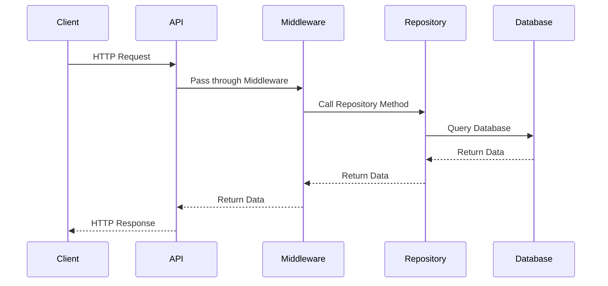

## 23.3 Case Study: Developing a RESTful API

In this case study, we will explore the development of a RESTful API in PHP, focusing on scalability and maintainability. We'll apply several design patterns, including the Repository Pattern, Adapter Pattern, Middleware (Chain of Responsibility), and Data Transfer Objects (DTOs). These patterns will help us achieve a clean separation of concerns, enhanced testability, and flexibility.

### Introduction to RESTful APIs

REST (Representational State Transfer) is an architectural style that defines a set of constraints for creating web services. RESTful APIs are designed to be stateless, cacheable, and provide a uniform interface. They use HTTP methods explicitly and are often used to expose services to clients over the web.

### Requirements

Our goal is to build a RESTful API that exposes services to clients with scalability and maintainability. The API should be able to handle various data sources and legacy systems, ensure consistent data formats, and provide a clean separation of concerns.

### Patterns Applied

#### Repository Pattern

The Repository Pattern abstracts the data persistence layer, providing a clean API for data access. It separates the business logic from data access logic, making the code more maintainable and testable.

#### Adapter Pattern

The Adapter Pattern allows us to integrate with various data sources or legacy systems by providing a consistent interface. This pattern is useful when dealing with different data formats or protocols.

#### Middleware (Chain of Responsibility)

Middleware is used to handle cross-cutting concerns such as authentication, logging, and error handling. By using the Chain of Responsibility pattern, we can create a flexible and extensible middleware pipeline.

#### Data Transfer Objects (DTOs)

DTOs are used to ensure consistent data formats when transferring data between layers. They help in decoupling the internal data structures from the external representation.

### Benefits

By applying these patterns, we achieve:

- **Clean Separation of Concerns:** Each layer of the application has a specific responsibility, making the code easier to understand and maintain.
- **Enhanced Testability:** With clear boundaries between components, we can easily write unit tests for each part of the application.
- **Flexibility:** The use of design patterns allows us to adapt to changing requirements and integrate with different systems.

### Designing the API

Let's start by designing the API. We'll define the endpoints, HTTP methods, and data formats.

#### API Endpoints

We'll create a simple API for managing a collection of books. The API will have the following endpoints:

- `GET /books`: Retrieve a list of books.
- `GET /books/{id}`: Retrieve a single book by ID.
- `POST /books`: Create a new book.
- `PUT /books/{id}`: Update an existing book.
- `DELETE /books/{id}`: Delete a book.

#### HTTP Methods

- **GET:** Retrieve data.
- **POST:** Create new resources.
- **PUT:** Update existing resources.
- **DELETE:** Remove resources.

#### Data Formats

We'll use JSON as the data format for requests and responses. This is a common choice for RESTful APIs due to its simplicity and wide support.

### Implementing the API

Now, let's implement the API using the design patterns we've discussed.

#### Setting Up the Project

First, we'll set up a new PHP project. We'll use Composer for dependency management and follow the PSR standards for coding style.

```bash
composer init
composer require slim/slim
composer require illuminate/database
composer require monolog/monolog
```

We'll use the Slim framework for routing and Illuminate Database (Eloquent) for ORM.

#### Creating the Repository

The Repository Pattern will help us abstract the data access layer. We'll create a `BookRepository` interface and an `EloquentBookRepository` implementation.

```php
<?php

namespace App\Repositories;

interface BookRepository
{
    public function all();
    public function find($id);
    public function create(array $data);
    public function update($id, array $data);
    public function delete($id);
}
```

```php
<?php

namespace App\Repositories;

use App\Models\Book;

class EloquentBookRepository implements BookRepository
{
    public function all()
    {
        return Book::all();
    }

    public function find($id)
    {
        return Book::find($id);
    }

    public function create(array $data)
    {
        return Book::create($data);
    }

    public function update($id, array $data)
    {
        $book = Book::find($id);
        if ($book) {
            $book->update($data);
            return $book;
        }
        return null;
    }

    public function delete($id)
    {
        $book = Book::find($id);
        if ($book) {
            $book->delete();
            return true;
        }
        return false;
    }
}
```

#### Integrating with the Adapter Pattern

Suppose we need to integrate with a legacy system that provides book data in XML format. We'll use the Adapter Pattern to convert XML data to our application's format.

```php
<?php

namespace App\Adapters;

use SimpleXMLElement;

class XmlBookAdapter
{
    public function convertXmlToArray($xmlString)
    {
        $xml = new SimpleXMLElement($xmlString);
        $json = json_encode($xml);
        return json_decode($json, true);
    }
}
```

#### Implementing Middleware

We'll use middleware to handle authentication and logging. Slim provides a simple way to add middleware to the application.

```php
<?php

namespace App\Middleware;

class AuthMiddleware
{
    public function __invoke($request, $response, $next)
    {
        // Perform authentication
        $authenticated = true; // Replace with actual authentication logic

        if (!$authenticated) {
            return $response->withStatus(401)->write('Unauthorized');
        }

        return $next($request, $response);
    }
}
```

```php
<?php

namespace App\Middleware;

use Monolog\Logger;
use Monolog\Handler\StreamHandler;

class LoggingMiddleware
{
    protected $logger;

    public function __construct()
    {
        $this->logger = new Logger('api');
        $this->logger->pushHandler(new StreamHandler(__DIR__ . '/../../logs/app.log', Logger::INFO));
    }

    public function __invoke($request, $response, $next)
    {
        $this->logger->info('Request', ['method' => $request->getMethod(), 'uri' => $request->getUri()]);
        return $next($request, $response);
    }
}
```

#### Using Data Transfer Objects (DTOs)

DTOs will help us ensure consistent data formats. We'll create a `BookDTO` class to represent book data.

```php
<?php

namespace App\DTOs;

class BookDTO
{
    public $id;
    public $title;
    public $author;
    public $publishedDate;

    public function __construct($id, $title, $author, $publishedDate)
    {
        $this->id = $id;
        $this->title = $title;
        $this->author = $author;
        $this->publishedDate = $publishedDate;
    }

    public static function fromArray(array $data)
    {
        return new self(
            $data['id'] ?? null,
            $data['title'] ?? '',
            $data['author'] ?? '',
            $data['published_date'] ?? ''
        );
    }

    public function toArray()
    {
        return [
            'id' => $this->id,
            'title' => $this->title,
            'author' => $this->author,
            'published_date' => $this->publishedDate,
        ];
    }
}
```

### Putting It All Together

Now, let's put everything together and create the API routes.

```php
<?php

use Slim\Factory\AppFactory;
use App\Repositories\EloquentBookRepository;
use App\Middleware\AuthMiddleware;
use App\Middleware\LoggingMiddleware;
use App\DTOs\BookDTO;

require __DIR__ . '/../vendor/autoload.php';

$app = AppFactory::create();

// Add middleware
$app->add(new AuthMiddleware());
$app->add(new LoggingMiddleware());

// Define routes
$app->get('/books', function ($request, $response, $args) {
    $repository = new EloquentBookRepository();
    $books = $repository->all();
    $bookDTOs = array_map(function ($book) {
        return BookDTO::fromArray($book->toArray());
    }, $books->all());

    $response->getBody()->write(json_encode($bookDTOs));
    return $response->withHeader('Content-Type', 'application/json');
});

$app->get('/books/{id}', function ($request, $response, $args) {
    $repository = new EloquentBookRepository();
    $book = $repository->find($args['id']);
    if ($book) {
        $bookDTO = BookDTO::fromArray($book->toArray());
        $response->getBody()->write(json_encode($bookDTO));
    } else {
        return $response->withStatus(404)->write('Book not found');
    }
    return $response->withHeader('Content-Type', 'application/json');
});

$app->post('/books', function ($request, $response, $args) {
    $repository = new EloquentBookRepository();
    $data = $request->getParsedBody();
    $book = $repository->create($data);
    $bookDTO = BookDTO::fromArray($book->toArray());

    $response->getBody()->write(json_encode($bookDTO));
    return $response->withHeader('Content-Type', 'application/json')->withStatus(201);
});

$app->put('/books/{id}', function ($request, $response, $args) {
    $repository = new EloquentBookRepository();
    $data = $request->getParsedBody();
    $book = $repository->update($args['id'], $data);
    if ($book) {
        $bookDTO = BookDTO::fromArray($book->toArray());
        $response->getBody()->write(json_encode($bookDTO));
    } else {
        return $response->withStatus(404)->write('Book not found');
    }
    return $response->withHeader('Content-Type', 'application/json');
});

$app->delete('/books/{id}', function ($request, $response, $args) {
    $repository = new EloquentBookRepository();
    $deleted = $repository->delete($args['id']);
    if ($deleted) {
        return $response->withStatus(204);
    } else {
        return $response->withStatus(404)->write('Book not found');
    }
});

$app->run();
```

### Visualizing the Architecture

To better understand the architecture of our API, let's visualize the flow of a request through the system using a sequence diagram.



### Try It Yourself

Now that we've built a RESTful API using PHP and various design patterns, it's time to experiment. Here are some suggestions:

- **Modify the Middleware:** Add additional middleware for caching or rate limiting.
- **Extend the Repository:** Implement a new repository for a different data source, such as a NoSQL database.
- **Enhance the DTOs:** Add validation logic to the DTOs to ensure data integrity.

### Knowledge Check

Before we conclude, let's reinforce what we've learned with a few questions:

- What are the benefits of using the Repository Pattern in a RESTful API?
- How does the Adapter Pattern help in integrating with legacy systems?
- Why is middleware important in a RESTful API?
- What role do DTOs play in ensuring consistent data formats?

### Conclusion

In this case study, we've explored the development of a RESTful API in PHP using design patterns like Repository, Adapter, Middleware, and DTOs. By applying these patterns, we've achieved a scalable and maintainable solution with a clean separation of concerns. Remember, this is just the beginning. As you progress, you'll build more complex and interactive APIs. Keep experimenting, stay curious, and enjoy the journey!

## Quiz: Case Study: Developing a RESTful API



### What is the primary benefit of using the Repository Pattern in a RESTful API?

- [x] It abstracts the data persistence layer, providing a clean API for data access.
- [ ] It handles authentication and logging.
- [ ] It ensures consistent data formats.
- [ ] It integrates with various data sources.

> **Explanation:** The Repository Pattern abstracts the data persistence layer, providing a clean API for data access, which enhances maintainability and testability.

### How does the Adapter Pattern assist in integrating with legacy systems?

- [x] By providing a consistent interface for different data formats or protocols.
- [ ] By handling authentication and logging.
- [ ] By ensuring consistent data formats.
- [ ] By abstracting the data persistence layer.

> **Explanation:** The Adapter Pattern provides a consistent interface for different data formats or protocols, making it easier to integrate with legacy systems.

### What is the role of middleware in a RESTful API?

- [x] To handle cross-cutting concerns such as authentication, logging, and error handling.
- [ ] To abstract the data persistence layer.
- [ ] To provide a consistent interface for different data formats.
- [ ] To ensure consistent data formats.

> **Explanation:** Middleware handles cross-cutting concerns such as authentication, logging, and error handling, providing a flexible and extensible pipeline.

### Why are DTOs important in a RESTful API?

- [x] They ensure consistent data formats when transferring data between layers.
- [ ] They handle authentication and logging.
- [ ] They abstract the data persistence layer.
- [ ] They provide a consistent interface for different data formats.

> **Explanation:** DTOs ensure consistent data formats when transferring data between layers, decoupling internal data structures from external representation.

### Which design pattern is used to abstract the data persistence layer?

- [x] Repository Pattern
- [ ] Adapter Pattern
- [ ] Middleware
- [ ] DTOs

> **Explanation:** The Repository Pattern is used to abstract the data persistence layer, providing a clean API for data access.

### What is the primary function of the Adapter Pattern?

- [x] To provide a consistent interface for different data formats or protocols.
- [ ] To handle cross-cutting concerns such as authentication and logging.
- [ ] To ensure consistent data formats.
- [ ] To abstract the data persistence layer.

> **Explanation:** The Adapter Pattern provides a consistent interface for different data formats or protocols, facilitating integration with various systems.

### How can middleware be extended in a RESTful API?

- [x] By adding additional middleware for caching or rate limiting.
- [ ] By implementing a new repository for a different data source.
- [ ] By adding validation logic to the DTOs.
- [ ] By providing a consistent interface for different data formats.

> **Explanation:** Middleware can be extended by adding additional middleware for caching or rate limiting, enhancing the API's functionality.

### What is the purpose of using DTOs in a RESTful API?

- [x] To ensure consistent data formats when transferring data between layers.
- [ ] To handle authentication and logging.
- [ ] To abstract the data persistence layer.
- [ ] To provide a consistent interface for different data formats.

> **Explanation:** DTOs ensure consistent data formats when transferring data between layers, decoupling internal data structures from external representation.

### Which pattern is responsible for handling cross-cutting concerns in a RESTful API?

- [x] Middleware (Chain of Responsibility)
- [ ] Repository Pattern
- [ ] Adapter Pattern
- [ ] DTOs

> **Explanation:** Middleware, often implemented using the Chain of Responsibility pattern, handles cross-cutting concerns such as authentication, logging, and error handling.

### True or False: The Repository Pattern is used to ensure consistent data formats in a RESTful API.

- [ ] True
- [x] False

> **Explanation:** The Repository Pattern is used to abstract the data persistence layer, not to ensure consistent data formats. DTOs are used for consistent data formats.


