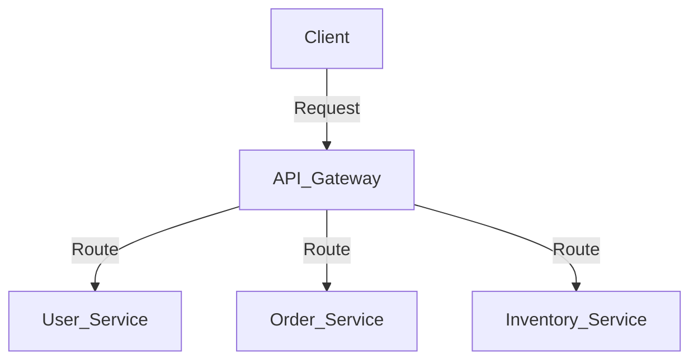
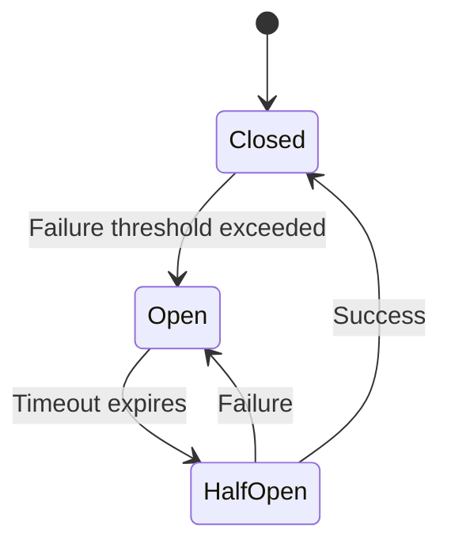
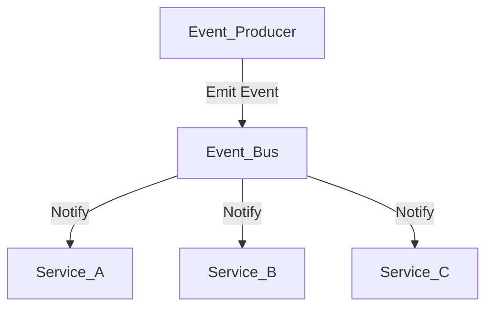
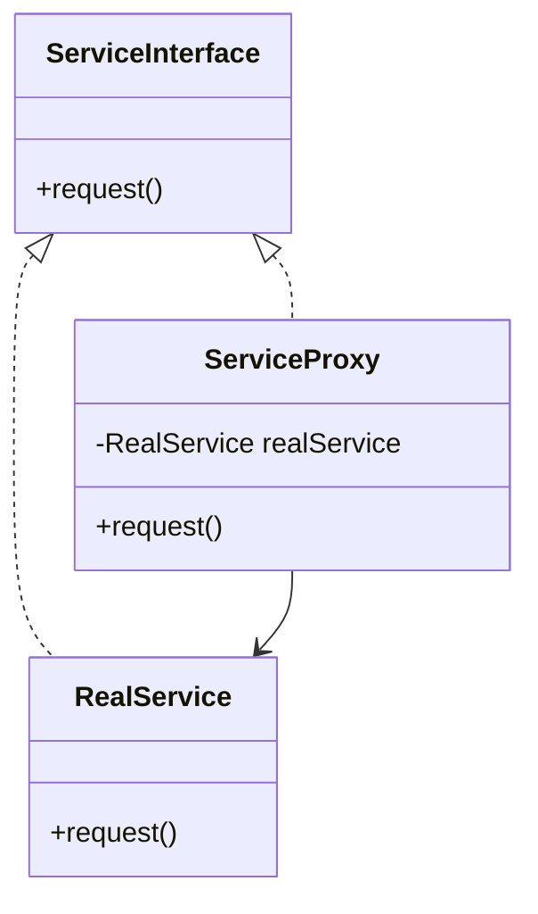

## 23.4 Implementing a Microservices Architecture

In this section, we will delve into the implementation of a microservices architecture using PHP. Microservices architecture is a design approach where an application is built as a suite of small, independent services, each running in its own process and communicating with lightweight mechanisms. This architecture style is particularly beneficial for large-scale applications that require high scalability, resilience, and flexibility.

### Objectives

- **Build an application as a suite of small services.**
- **Utilize design patterns to enhance scalability and fault tolerance.**

### Patterns Utilized

1. **API Gateway:** Acts as a unified entry point for clients, routing requests to the appropriate microservices.
2. **Circuit Breaker:** Manages service failures gracefully, preventing cascading failures.
3. **Event-Driven Architecture:** Facilitates communication between services through events, promoting loose coupling.
4. **Proxy Pattern:** Encapsulates service details from clients, providing an abstraction layer.

### Results

- **Improved scalability and fault tolerance.**
- **Independent deployment and development of services.**

---

### Understanding Microservices Architecture

Microservices architecture is a paradigm shift from the traditional monolithic architecture. In a monolithic architecture, all components of an application are tightly coupled and run as a single unit. This can lead to challenges in scaling, maintaining, and deploying applications. In contrast, microservices architecture breaks down an application into smaller, independent services that can be developed, deployed, and scaled independently.

#### Key Characteristics of Microservices

- **Decentralization:** Each service is autonomous and can be developed using different technologies.
- **Scalability:** Services can be scaled independently based on demand.
- **Resilience:** Failure in one service does not affect the entire system.
- **Flexibility:** Easier to adopt new technologies and frameworks.

### Implementing Microservices in PHP

PHP, traditionally known for building monolithic applications, can be effectively used to implement microservices architecture. With the advent of modern PHP features and frameworks, developers can leverage PHP to build scalable and resilient microservices.

#### Setting Up the Environment

Before diving into the implementation, ensure your environment is set up for developing microservices in PHP. This includes:

- **PHP 7 or 8:** Utilize modern PHP features for better performance and security.
- **Composer:** Manage dependencies and packages efficiently.
- **Docker:** Containerize services for consistent deployment across environments.
- **RESTful APIs:** Use frameworks like Laravel or Symfony to build RESTful services.

### Design Patterns for Microservices

Let's explore the design patterns that are crucial for implementing a microservices architecture in PHP.

#### 1. API Gateway Pattern

The API Gateway pattern provides a single entry point for clients to interact with the microservices. It handles requests by routing them to the appropriate service, aggregating responses, and managing cross-cutting concerns like authentication and logging.

**Benefits:**

- Simplifies client interactions by providing a unified interface.
- Reduces the number of requests/round trips between client and server.
- Centralizes cross-cutting concerns.

**Implementation Example:**

```php
<?php

class ApiGateway
{
    private $services = [];

    public function registerService($name, $url)
    {
        $this->services[$name] = $url;
    }

    public function handleRequest($serviceName, $endpoint, $params = [])
    {
        if (!isset($this->services[$serviceName])) {
            throw new Exception("Service not found.");
        }

        $url = $this->services[$serviceName] . $endpoint;
        $response = $this->sendRequest($url, $params);

        return $response;
    }

    private function sendRequest($url, $params)
    {
        // Implement HTTP request logic here (e.g., using cURL or Guzzle)
        return "Response from " . $url;
    }
}

// Usage
$gateway = new ApiGateway();
$gateway->registerService('user', 'http://user-service.local');
$response = $gateway->handleRequest('user', '/getUser', ['id' => 1]);
echo $response;
```

**Diagram: API Gateway Architecture**



#### 2. Circuit Breaker Pattern

The Circuit Breaker pattern is used to detect failures and prevent the application from trying to perform an action that is likely to fail. It helps in maintaining the stability of the system by stopping the flow of requests to a failing service.

**Benefits:**

- Prevents cascading failures.
- Provides fallback mechanisms.
- Improves system resilience.

**Implementation Example:**

```php
<?php

class CircuitBreaker
{
    private $failureCount = 0;
    private $failureThreshold = 3;
    private $timeout = 5; // seconds
    private $lastFailureTime;

    public function callService($service, $operation)
    {
        if ($this->isOpen()) {
            throw new Exception("Circuit is open. Service call blocked.");
        }

        try {
            $result = $service->$operation();
            $this->reset();
            return $result;
        } catch (Exception $e) {
            $this->recordFailure();
            throw $e;
        }
    }

    private function isOpen()
    {
        return $this->failureCount >= $this->failureThreshold &&
               (time() - $this->lastFailureTime) < $this->timeout;
    }

    private function recordFailure()
    {
        $this->failureCount++;
        $this->lastFailureTime = time();
    }

    private function reset()
    {
        $this->failureCount = 0;
    }
}

// Usage
$circuitBreaker = new CircuitBreaker();
try {
    $response = $circuitBreaker->callService($userService, 'getUser');
} catch (Exception $e) {
    echo $e->getMessage();
}
```

**Diagram: Circuit Breaker State Transition**



#### 3. Event-Driven Architecture

In an Event-Driven Architecture, services communicate through events. This pattern decouples services, allowing them to operate independently and react to changes asynchronously.

**Benefits:**

- Promotes loose coupling between services.
- Enables asynchronous communication.
- Improves scalability and responsiveness.

**Implementation Example:**

```php
<?php

class Event
{
    private $name;
    private $data;

    public function __construct($name, $data)
    {
        $this->name = $name;
        $this->data = $data;
    }

    public function getName()
    {
        return $this->name;
    }

    public function getData()
    {
        return $this->data;
    }
}

class EventBus
{
    private $listeners = [];

    public function registerListener($eventName, callable $listener)
    {
        $this->listeners[$eventName][] = $listener;
    }

    public function dispatch(Event $event)
    {
        if (isset($this->listeners[$event->getName()])) {
            foreach ($this->listeners[$event->getName()] as $listener) {
                $listener($event->getData());
            }
        }
    }
}

// Usage
$eventBus = new EventBus();
$eventBus->registerListener('user.created', function ($data) {
    echo "User created with ID: " . $data['id'];
});

$event = new Event('user.created', ['id' => 1]);
$eventBus->dispatch($event);
```

**Diagram: Event-Driven Architecture**



#### 4. Proxy Pattern

The Proxy Pattern provides a surrogate or placeholder for another object to control access to it. In microservices, it can be used to encapsulate the details of service interactions from clients.

**Benefits:**

- Provides a level of abstraction.
- Controls access to the service.
- Can add additional functionality like logging or caching.

**Implementation Example:**

```php
<?php

interface ServiceInterface
{
    public function request();
}

class RealService implements ServiceInterface
{
    public function request()
    {
        return "Response from Real Service";
    }
}

class ServiceProxy implements ServiceInterface
{
    private $realService;

    public function __construct(RealService $realService)
    {
        $this->realService = $realService;
    }

    public function request()
    {
        // Additional logic before calling the real service
        echo "Logging request...\n";
        return $this->realService->request();
    }
}

// Usage
$realService = new RealService();
$proxy = new ServiceProxy($realService);
echo $proxy->request();
```

**Diagram: Proxy Pattern**



### PHP Unique Features for Microservices

PHP offers several unique features that can be leveraged when implementing microservices:

- **Built-in Web Server:** PHP's built-in server can be used for lightweight development and testing of microservices.
- **Asynchronous Processing:** Libraries like ReactPHP enable asynchronous I/O operations, which are crucial for microservices.
- **Composer:** PHP's dependency manager simplifies package management across services.

### Differences and Similarities with Other Patterns

While implementing microservices, it's essential to differentiate between similar patterns:

- **API Gateway vs. Proxy Pattern:** Both provide an abstraction layer, but the API Gateway is a centralized entry point for multiple services, whereas the Proxy Pattern is used for individual service abstraction.
- **Circuit Breaker vs. Retry Pattern:** The Circuit Breaker stops requests to a failing service, while the Retry Pattern attempts to retry failed requests.

### Design Considerations

When implementing microservices architecture, consider the following:

- **Service Granularity:** Define the right level of granularity for services to avoid excessive inter-service communication.
- **Data Management:** Decide on a strategy for managing data consistency across services.
- **Security:** Implement robust security measures to protect inter-service communication.

### Try It Yourself

Experiment with the code examples provided by:

- Modifying the API Gateway to add authentication logic.
- Implementing a fallback mechanism in the Circuit Breaker.
- Creating new events and listeners in the Event-Driven Architecture.
- Adding caching logic to the Proxy Pattern.

### Knowledge Check

- What are the benefits of using an API Gateway in a microservices architecture?
- How does the Circuit Breaker pattern improve system resilience?
- Describe how Event-Driven Architecture promotes loose coupling between services.

### Embrace the Journey

Remember, implementing a microservices architecture is a journey. As you progress, you'll encounter challenges and opportunities to optimize your design. Keep experimenting, stay curious, and enjoy the journey!

## Quiz: Implementing a Microservices Architecture



### What is the primary role of an API Gateway in a microservices architecture?

- [x] To provide a unified entry point for client requests
- [ ] To store data for microservices
- [ ] To handle database transactions
- [ ] To manage user authentication

> **Explanation:** The API Gateway acts as a single entry point for clients, routing requests to the appropriate microservices.

### Which pattern helps in preventing cascading failures in a microservices architecture?

- [x] Circuit Breaker
- [ ] Proxy Pattern
- [ ] Singleton Pattern
- [ ] Factory Pattern

> **Explanation:** The Circuit Breaker pattern detects failures and prevents the application from performing actions that are likely to fail, thus preventing cascading failures.

### How does Event-Driven Architecture benefit microservices?

- [x] It promotes loose coupling between services
- [ ] It centralizes data storage
- [ ] It increases service dependency
- [ ] It reduces the need for APIs

> **Explanation:** Event-Driven Architecture allows services to communicate through events, promoting loose coupling and enabling asynchronous communication.

### What is the main advantage of using the Proxy Pattern in microservices?

- [x] It provides an abstraction layer for service interactions
- [ ] It increases the number of service calls
- [ ] It stores user data
- [ ] It handles user authentication

> **Explanation:** The Proxy Pattern provides an abstraction layer, encapsulating service details from clients and potentially adding additional functionality like logging or caching.

### Which PHP feature is particularly useful for asynchronous processing in microservices?

- [x] ReactPHP
- [ ] Laravel
- [ ] Symfony
- [ ] Composer

> **Explanation:** ReactPHP is a library that enables asynchronous I/O operations in PHP, which is crucial for microservices.

### What should be considered when defining service granularity in microservices?

- [x] The level of inter-service communication
- [ ] The number of users
- [ ] The size of the database
- [ ] The programming language used

> **Explanation:** Service granularity should be defined to balance the level of inter-service communication and avoid excessive dependencies.

### How can the API Gateway pattern be enhanced for better security?

- [x] By adding authentication and authorization logic
- [ ] By storing user passwords
- [ ] By increasing the number of services
- [ ] By reducing the number of APIs

> **Explanation:** The API Gateway can be enhanced by incorporating authentication and authorization logic to secure client interactions.

### What is a potential drawback of using microservices architecture?

- [x] Increased complexity in managing inter-service communication
- [ ] Reduced scalability
- [ ] Increased monolithic dependencies
- [ ] Decreased flexibility

> **Explanation:** Microservices architecture can lead to increased complexity in managing inter-service communication and data consistency.

### Which design pattern is used to encapsulate service details from clients?

- [x] Proxy Pattern
- [ ] Singleton Pattern
- [ ] Factory Pattern
- [ ] Observer Pattern

> **Explanation:** The Proxy Pattern encapsulates service details from clients, providing an abstraction layer.

### True or False: Microservices architecture allows for independent deployment of services.

- [x] True
- [ ] False

> **Explanation:** One of the key benefits of microservices architecture is the ability to deploy services independently, allowing for greater flexibility and scalability.


