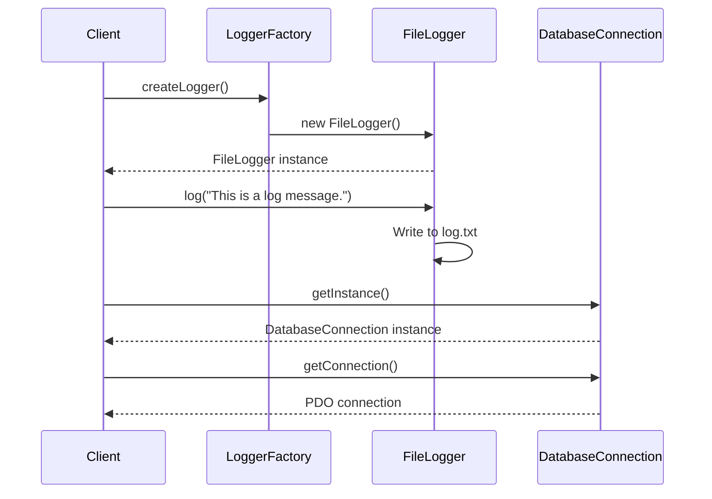

## 23.5 Trade-offs and Best Practices

In the world of software development, design patterns serve as proven solutions to common problems. However, the application of multiple design patterns in a single project can introduce both opportunities and challenges. In this section, we will explore the trade-offs and best practices when combining design patterns in PHP. Our focus will be on balancing complexity and benefit, maintaining simplicity, and ensuring team alignment.

### Complexity vs. Benefit

When integrating multiple design patterns, it's crucial to assess whether the benefits outweigh the added complexity. Let's delve into the key considerations:

#### 1. **Understanding Complexity**

Complexity in software design can manifest in various forms, such as increased codebase size, intricate dependencies, and challenging maintenance. While design patterns can enhance code reusability and flexibility, they can also introduce unnecessary complexity if not applied judiciously.

#### 2. **Evaluating Benefits**

The primary benefits of using design patterns include improved code organization, enhanced maintainability, and increased scalability. However, these benefits must be weighed against the potential downsides of added complexity. Consider the following questions:

- Does the pattern solve a specific problem effectively?
- Will the pattern improve code readability and maintainability?
- Is the pattern necessary for achieving the desired functionality?

#### 3. **Balancing Complexity and Benefit**

To strike the right balance, follow these guidelines:

- **Start Simple**: Begin with the simplest solution that meets the requirements. Introduce patterns only when they add clear value.
- **Iterate and Refine**: Continuously evaluate the design as the project evolves. Refactor and optimize patterns to reduce complexity.
- **Avoid Over-Engineering**: Resist the temptation to apply patterns preemptively. Focus on solving current problems rather than anticipating future ones.

### Principle of Simplicity

The principle of simplicity is a cornerstone of effective software design. It emphasizes using the simplest solution that adequately addresses the requirements. Let's explore how to apply this principle when working with design patterns:

#### 1. **Keep It Simple, Stupid (KISS)**

The KISS principle advocates for simplicity in design. Avoid unnecessary complexity by:

- **Minimizing Dependencies**: Limit the number of dependencies between components to reduce coupling.
- **Using Clear and Concise Code**: Write code that is easy to understand and maintain.
- **Avoiding Unnecessary Abstractions**: Use abstractions only when they provide clear benefits.

#### 2. **Single Responsibility Principle (SRP)**

The SRP states that a class should have only one reason to change. When applying design patterns, ensure that each component has a single responsibility. This reduces complexity and enhances maintainability.

#### 3. **YAGNI (You Aren't Gonna Need It)**

YAGNI is a principle that discourages adding functionality until it is necessary. Avoid implementing patterns or features that are not currently needed. This prevents over-engineering and keeps the codebase simple.

### Team Alignment

Effective collaboration is essential when applying design patterns in a team setting. Ensuring that all team members understand the patterns and their implementation is crucial for success. Here are some best practices for achieving team alignment:

#### 1. **Shared Understanding**

- **Documentation**: Provide clear documentation for each pattern used, including its purpose, implementation details, and benefits.
- **Code Reviews**: Conduct regular code reviews to ensure consistent application of patterns and adherence to best practices.
- **Knowledge Sharing**: Encourage team members to share insights and experiences related to design patterns.

#### 2. **Training and Education**

- **Workshops and Training Sessions**: Organize workshops and training sessions to educate team members about design patterns and their applications.
- **Mentorship**: Pair experienced developers with less experienced ones to facilitate knowledge transfer.

#### 3. **Consistent Coding Standards**

- **Coding Guidelines**: Establish coding guidelines that include best practices for using design patterns.
- **Automated Tools**: Use automated tools to enforce coding standards and detect deviations.

### Code Examples

To illustrate the concepts discussed, let's explore a practical example of combining the Factory Method and Singleton patterns in PHP.

```php
<?php

// Singleton Pattern: Database Connection
class DatabaseConnection {
    private static $instance = null;
    private $connection;

    // Private constructor to prevent direct instantiation
    private function __construct() {
        $this->connection = new PDO('mysql:host=localhost;dbname=test', 'user', 'password');
    }

    // Static method to get the singleton instance
    public static function getInstance() {
        if (self::$instance === null) {
            self::$instance = new DatabaseConnection();
        }
        return self::$instance;
    }

    // Method to get the database connection
    public function getConnection() {
        return $this->connection;
    }
}

// Factory Method Pattern: Logger
abstract class Logger {
    abstract public function log($message);
}

class FileLogger extends Logger {
    public function log($message) {
        file_put_contents('log.txt', $message . PHP_EOL, FILE_APPEND);
    }
}

class LoggerFactory {
    public static function createLogger() {
        return new FileLogger();
    }
}

// Usage
$logger = LoggerFactory::createLogger();
$logger->log('This is a log message.');

$dbConnection = DatabaseConnection::getInstance()->getConnection();
```

### Visualizing Design Patterns

To better understand the interaction between the Singleton and Factory Method patterns, let's visualize the process using a sequence diagram.



### Try It Yourself

Experiment with the code example by modifying the logger to use a different logging mechanism, such as logging to a database or sending logs via email. This exercise will help you understand the flexibility and adaptability of design patterns.

### References and Links

For further reading on design patterns and best practices, consider the following resources:

- [Design Patterns: Elements of Reusable Object-Oriented Software](https://en.wikipedia.org/wiki/Design_Patterns) by Erich Gamma, Richard Helm, Ralph Johnson, and John Vlissides.
- [PHP: The Right Way](https://phptherightway.com/) - A community-driven guide to PHP best practices.
- [Refactoring Guru: Design Patterns](https://refactoring.guru/design-patterns) - A comprehensive resource on design patterns with examples in multiple languages.

### Knowledge Check

To reinforce your understanding, consider the following questions:

1. What are the potential downsides of applying multiple design patterns in a project?
2. How can the principle of simplicity be applied when using design patterns?
3. Why is team alignment important when implementing design patterns?

### Embrace the Journey

Remember, mastering design patterns is a journey. As you gain experience, you'll develop an intuition for when and how to apply patterns effectively. Keep experimenting, stay curious, and enjoy the process of creating robust and maintainable software.

### Quiz: Trade-offs and Best Practices



### What is a key consideration when applying multiple design patterns in a project?

- [x] Balancing complexity and benefit
- [ ] Ensuring all patterns are used
- [ ] Maximizing the number of patterns
- [ ] Avoiding documentation

> **Explanation:** Balancing complexity and benefit is crucial to ensure that the added complexity of using multiple patterns is justified by the benefits they provide.

### Which principle emphasizes using the simplest solution that adequately addresses requirements?

- [x] Principle of Simplicity
- [ ] Principle of Complexity
- [ ] Principle of Abstraction
- [ ] Principle of Encapsulation

> **Explanation:** The Principle of Simplicity emphasizes using the simplest solution that adequately addresses requirements, avoiding unnecessary complexity.

### What is the purpose of the Singleton pattern in the provided code example?

- [x] To ensure a single instance of DatabaseConnection
- [ ] To create multiple instances of DatabaseConnection
- [ ] To log messages to a file
- [ ] To abstract the creation of loggers

> **Explanation:** The Singleton pattern ensures that only one instance of DatabaseConnection is created and used throughout the application.

### How can team alignment be achieved when implementing design patterns?

- [x] Through documentation, code reviews, and training
- [ ] By using as many patterns as possible
- [ ] By avoiding communication
- [ ] By focusing solely on individual work

> **Explanation:** Team alignment can be achieved through documentation, code reviews, and training to ensure all team members understand the patterns and their implementation.

### What is the KISS principle?

- [x] Keep It Simple, Stupid
- [ ] Keep It Secure, Stupid
- [ ] Keep It Structured, Stupid
- [ ] Keep It Scalable, Stupid

> **Explanation:** The KISS principle stands for "Keep It Simple, Stupid," advocating for simplicity in design and avoiding unnecessary complexity.

### Which pattern is used to create a logger in the code example?

- [x] Factory Method
- [ ] Singleton
- [ ] Observer
- [ ] Decorator

> **Explanation:** The Factory Method pattern is used to create a logger in the code example, providing a way to instantiate the FileLogger.

### What is the benefit of using the YAGNI principle?

- [x] Preventing over-engineering
- [ ] Encouraging early optimization
- [ ] Maximizing code complexity
- [ ] Ensuring all features are implemented

> **Explanation:** The YAGNI principle prevents over-engineering by discouraging the implementation of features or patterns that are not currently needed.

### How does the SRP contribute to simplicity?

- [x] By ensuring each class has a single responsibility
- [ ] By allowing multiple responsibilities per class
- [ ] By increasing code complexity
- [ ] By reducing code readability

> **Explanation:** The Single Responsibility Principle (SRP) contributes to simplicity by ensuring each class has a single responsibility, reducing complexity and enhancing maintainability.

### What is a potential downside of over-engineering with design patterns?

- [x] Increased complexity and maintenance challenges
- [ ] Improved code readability
- [ ] Enhanced performance
- [ ] Simplified codebase

> **Explanation:** Over-engineering with design patterns can lead to increased complexity and maintenance challenges, making the codebase harder to manage.

### True or False: Design patterns should always be applied preemptively to anticipate future needs.

- [ ] True
- [x] False

> **Explanation:** False. Design patterns should not be applied preemptively. They should be used to solve current problems rather than anticipating future needs, to avoid unnecessary complexity.



By understanding and applying these trade-offs and best practices, you can effectively leverage design patterns in PHP to create robust, maintainable, and scalable software solutions.
